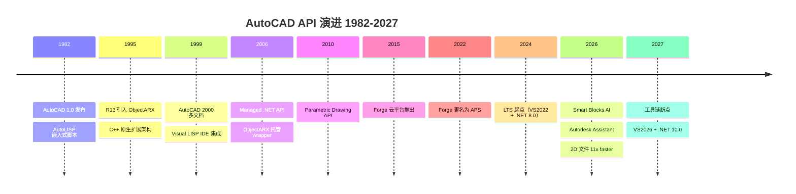
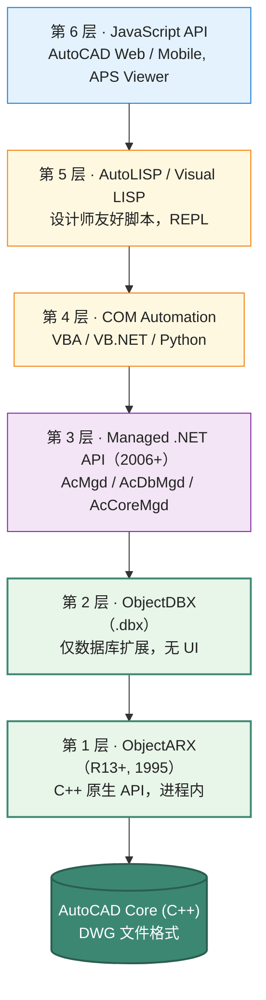

# AutoCAD ObjectARX API 设计深度剖析

> 文档 3.1｜厂商深度剖析系列｜通用 CAD 平台 API 设计哲学
>

---

## 阅读约定

- `<sup>[类别 N]</sup>`：段落或论断的来源标注，N 对应文末参考来源编号
- `> **[推论]**`：基于已知事实的合理推断，非来自厂商或权威资料的直接陈述
- `> **[评论]**`：本报告作者的主观归纳、判断或行业观察
- ⚠️ **勘误**：对常见社区资料中事实错误的修正

来源类别：`[官方]` `[新闻]` `[百科]` `[第三方]` `[书籍]`

---

## TL;DR

- **ObjectARX 是 AutoCAD 的 in-process 原生 C++ SDK**<sup>[百科 1]</sup>，扩展模块编译为 `.arx` / `.dbx`（实质是 Windows DLL，文件扩展名不同），加载到 AutoCAD 进程内，可直接访问 AutoCAD 内部 C++ 类<sup>[百科 1]</sup>。在 AutoCAD API 体系的层级中，ObjectARX 处于最底层位置，能力最深，学习与维护成本也较高。
- **API 体系是六层金字塔**：从底层向上依次为 ObjectARX (C++) → ObjectDBX (.dbx 仅数据库) → Managed .NET API (AcMgd / AcDbMgd / AcCoreMgd) → COM Automation → AutoLISP / Visual LISP → JavaScript API（Web）。每一层针对不同开发者群体，但下层 API 是上层的实现基础。
- **ObjectARX 与 AutoCAD 内核高度耦合**<sup>[百科 1]</sup>：库版本与编译器版本紧密绑定，开发者需要使用 Autodesk 编译 AutoCAD 所用的同版本 Visual Studio。这是"性能与扩展深度"换"工具链刚性"的典型设计。
- **二进制兼容（ABI）矩阵 2025–2027 的实际现状**：⚠️ AutoCAD 2025 + 2026 共享 VS2022 + .NET 8.0 LTS（**二进制兼容**，无需重编译）<sup>[官方 2][第三方 3]</sup>；AutoCAD 2027 是新的破坏性断点，需要 VS2026 (v18.0, toolset v145) + .NET 10.0<sup>[第三方 3]</sup>。这与社区流传的"每三年破坏一次"叙事不完全一致——实际是"两年共享 LTS + 一年破坏" 的节奏。
- **DWG 是 AutoCAD 的核心资产**：1982 年发布<sup>[百科 4]</sup>，至今仍是 CAD 文件格式中较广泛使用的格式之一。DWG 的封闭性曾受到激烈挑战（Open Design Alliance 即原 OpenDWG Alliance）<sup>[百科 5]</sup>，但 Autodesk 仍持续主导其演进。
- **2022 年 12 月 7 日 Forge 改名为 Autodesk Platform Services (APS)**<sup>[官方 6]</sup>：这是 Autodesk 云战略品牌升级的关键节点。
- **AutoCAD 2026 全面拥抱 Autodesk AI**<sup>[新闻 7][官方 8]</sup>：Smart Blocks（Search/Detect and Convert）+ Activity Insights "What's Changed" + Autodesk Assistant 应用内 AI 助手 + Connected Support Files + 文件打开速度声称 11x 提升。
- **Visual LISP 仍是设计师友好层**：从 AutoCAD R12 (1992) 以来一直是核心扩展通道，AutoCAD 2026 仍内置 Visual LISP IDE<sup>[官方 8]</sup>。

---

## Key Findings

1. **ObjectARX 命名来源**：AutoCAD Runtime eXtension<sup>[百科 1]</sup>。
2. **`.arx` 与 `.dbx` 区别**：`.arx` 是完整应用模块（可注册命令、UI），`.dbx` 是仅数据库扩展模块（注册自定义对象，但无 UI 与命令）<sup>[百科 1]</sup>。后者用于 Object Enabler 场景——让对象在 AutoCAD LT 或不安装垂直产品的环境中也能被读取显示。
3. **托管 .NET API 的三大程序集**：`AcMgd.dll`（应用层）、`AcDbMgd.dll`（数据库层）、`AcCoreMgd.dll`（核心层）<sup>[第三方 9]</sup>。
4. **AutoCAD 2026 ObjectARX SDK 的工具链要求**：Microsoft Visual Studio 2022 version 17.14.0 + .NET 8.0（含 C++ option）<sup>[官方 2]</sup>。
5. **AutoCAD 2027 的工具链断裂**：⚠️ 托管应用需要 target .NET 10.0；C++ 部分仍可用 VS2022 v17.14（MSVC toolset 14.44），但 .NET 需要使用 **VS2026 (v18.0, toolset v145)**<sup>[第三方 3]</sup>。这是"非全断裂、半断裂"的微妙节奏。
6. **AcDbDatabase = 内存中的 DWG**：每个打开的图纸对应一个 `AcDbDatabase`，所有持久化对象（Entity、Layer、Linetype、Block 等）都存于其中。
7. **ObjectId 的双重身份**：ObjectId 在内存中是 64 位指针的语义包装，但持久化到 DWG 时编码为 handle（一个 16 进制字符串）<sup>[官方 10]</sup>。这是 AutoCAD 数据库的关键抽象。
8. **Transaction 模式**（`AcTransactionManager`）：在 ObjectARX 早期是手动管理 `acdbOpenObject` / `close` 的，2000+ 引入 Transaction 模式使代码更安全<sup>[官方 10]</sup>。.NET API 中是 `Database.TransactionManager.StartTransaction()` 配合 `using` 块的标准模式。
9. **Custom Entity（自定义图元）**：通过派生 `AcDbEntity` + 实现 `subWorldDraw` / `subTransformBy` / `subGetGeomExtents` 等虚方法实现<sup>[官方 10]</sup>。Object Enabler 机制让 Custom Entity 可在不安装定义 DLL 的环境中显示（通过 proxy）。
10. **AutoCAD 2027 是 SDK 的下一个断点**：clean rebuild 必需<sup>[第三方 3]</sup>，Linker library suffix 从 25/26 改为 27。

---

## 一、历史演进：从 R12 到 2027 的 API 时间线



### 1.1 史前：AutoCAD 1.0–R11（1982–1990）

AutoCAD 1.0 发布于 1982 年 12 月<sup>[百科 4]</sup>，是早期 PC 上的 CAD 工具。早期版本通过 AutoLISP（基于 Lisp 的脚本）和 ADS（AutoCAD Development System，C 语言 SDK）扩展。

> **[评论]** AutoLISP 是 CAD 软件中较早的"嵌入式脚本"先例之一，对后续整个行业（包括 SketchUp 的 Ruby 选择）有深远影响。Lisp 的 REPL 友好性极大降低了设计师入门门槛——这是 AutoCAD 在 1980s–1990s 形成主流地位的重要技术选择之一。

### 1.2 ObjectARX 诞生：R13（1995）

AutoCAD R13（1995）首次引入 ObjectARX<sup>[百科 1]</sup>——基于 C++ 的运行时扩展架构，替代 ADS 成为底层 SDK。从此开始 AutoCAD 平台具备"in-process 原生 C++ 扩展"能力，奠定了 30 年来的 API 哲学基础。

### 1.3 R14、2000 系列（1997–2002）

- AutoCAD R14（1997）：进一步成熟，普及 ObjectARX 应用
- AutoCAD 2000（1999）：引入多文档支持、Transaction 模式、Visual LISP IDE 集成<sup>[百科 4]</sup>

### 1.4 Managed .NET API：AutoCAD 2006

AutoCAD 2006 引入 Managed .NET API<sup>[第三方 9]</sup>，作为 ObjectARX 的托管 wrapper。这一变化的战略意义：

- 降低 C++ 学习门槛（C# 比 C++ 更友好）
- 利用 .NET Framework 生态（WPF、Forms、网络库）
- 但 .NET API 仍只是 ObjectARX 的薄包装——大多数 .NET 类对应一个底层 C++ 类<sup>[第三方 9]</sup>

> **[推论]** Autodesk 在 2006 年引入 .NET API，可能反映了 Microsoft Visual Studio 2005/2008 时期 .NET 在企业开发中的快速普及。本报告未在 Autodesk 官方文档中找到对该决策动机的直接陈述。

### 1.5 AutoCAD 2010–2013：成熟期

- AutoCAD 2010：参数化绘图（Parametric Drawing）API
- AutoCAD 2011：DWG 格式升级到 2010 版本（`AC1024`）<sup>[百科 4]</sup>
- AutoCAD 2013：DWG 格式升级到 2013 版本（`AC1027`）<sup>[百科 4]</sup>
- AutoCAD 2018+：DWG 格式升级到 `AC1032`，**自此 AutoCAD 2018-2026 都使用此格式版本**

### 1.6 Forge / APS 时代（2015+）

- 2015：Autodesk 推出 Forge 平台<sup>[百科 11]</sup>，作为云端 API 集合（Model Derivative、Viewer、Design Automation 等）
- **2022 年 12 月 7 日**：Forge 正式更名为 **Autodesk Platform Services (APS)**<sup>[官方 6]</sup>

> **[评论]** Forge → APS 改名是 Autodesk 云战略品牌的关键升级。原 Forge 品牌相对小众（开发者圈内），APS 重新定位为"覆盖 Autodesk 全产品线的统一云平台基础设施"，将云能力从"开发者平台"提升到"产品战略基石"。

### 1.7 AutoCAD 2024–2026：LTS 节奏与 AI 整合

近年节奏：

| 版本 | VS 版本 | .NET 版本 | DWG 格式 | 关键特性 |
|---|---|---|---|---|
| AutoCAD 2024 | VS2022 v17.x | .NET 8.0 | AC1032 | LTS 起点 |
| AutoCAD 2025 | VS2022 v17.x | .NET 8.0 | AC1032 | 2D 文件打开 2x faster<sup>[官方 12]</sup> |
| AutoCAD 2026 | VS2022 v17.14 | .NET 8.0 | AC1032 | 2D 文件打开声称 11x faster<sup>[新闻 7]</sup>; Smart Blocks AI; Activity Insights What's Changed; Connected Support Files; Autodesk Assistant<sup>[官方 8]</sup> |
| AutoCAD 2027 | VS2026 v18.0 (.NET) / VS2022 v17.14 (C++) | .NET 10.0 | 待公开 | 工具链断点<sup>[第三方 3]</sup> |

⚠️ **重要事实澄清**："ObjectARX 每三年破坏一次二进制兼容"是社区常见的简化描述，**实际是 LTS 节奏**——AutoCAD 2024-2026 三年共享 VS2022 + .NET 8.0 LTS（无需重编译），而 AutoCAD 2027 是新断点。这种"三年共享 + 新断点"模式更接近 LTS 的实际行为。

### 1.8 AutoCAD 2026 AI 整合

根据 Autodesk 官方 AutoCAD 2026 features 页面与官方博客<sup>[官方 8][新闻 7]</sup>：

- **Smart Blocks: Search and Convert**：AI 搜索图纸中的对象、文本、变量文本，转换为新定义/已存在/建议的 block
- **Smart Blocks: Detect and Convert**（前称 Object Detection Tech Preview）：AI 自动检测重复几何
- **Activity Insights: What's Changed**：跟踪 35+ 活动类型，多用户事件日志、版本历史、文件比较
- **Connected Support Files**：项目感知的 CAD manager 配置
- **Autodesk Assistant**：应用内 AI 助手
- **性能**：声称 2D 文件打开 11x faster, 启动 4x faster vs AutoCAD 2025<sup>[新闻 7]</sup>

> **[评论]** "11x faster"是 Autodesk 内部基准测试结果，实际效果因系统配置和文件复杂度而异<sup>[新闻 13]</sup>。营销话术与真实体验之间通常有 gap，建议对此类数字保持谨慎乐观。

> **[评论]** AI 功能的快速整合反映了行业整体趋势——SketchUp 2026.1 引入 AI Render/Assistant，Siemens NX 引入 AI 协作，Bentley 在 iTwin 中扩展 AI Connector。AutoCAD 2026 的 Smart Blocks 是"AI 减少重复劳动"路线的代表，比生成式建模（如 Fusion 360 的 Generative Design）更务实——直接对接现有用户痛点（block 管理）。

---

## 二、API 整体架构：六层金字塔



> **[评论]** 六层金字塔的设计哲学是"每个开发者群体都有一个合适的入口"：设计师用 LISP，企业 IT 用 VBA，第三方 ISV 用 .NET，专业开发者用 ObjectARX，Web/移动用 JavaScript。这种分层设计使 AutoCAD 在 30+ 年中持续吸引各类开发者，是其生态规模的核心机制。

> **[推论]** 但分层也带来维护复杂度：每个新功能在 ObjectARX 中实现后，需要在 .NET、COM、LISP 各层暴露。这导致部分新 API 在低层级（如 LISP）的覆盖度往往滞后于 ObjectARX，开发者需根据需求选择层级。本报告未在 Autodesk 官方文档中找到对该维护负担的直接陈述，属基于多代 API 共存现实的推断。

---

## 三、对象模型：Database / Editor / Document

### 3.1 三大核心抽象

```
AcDbDatabase        ← 内存中的 DWG（图纸数据）
   ├── BlockTable           ← Block 定义表
   ├── LayerTable           ← Layer 表
   ├── LinetypeTable        ← 线型表
   ├── TextStyleTable       ← 文字样式表
   ├── DimStyleTable        ← 标注样式表
   └── NamedObjectsDictionary ← 命名对象字典（扩展数据根）

AcEditor           ← 编辑器（用户交互）
   ├── PromptForXxx 系列方法（命令行交互）
   └── 选择集、夹点、临时对象

AcApDocument       ← 文档（绑定 UI 与 Database）
   ├── Database
   ├── Editor
   └── Window
```

每个打开的 DWG 文件对应一个 `AcApDocument`（C++）或 `Document`（.NET），内含 `Database` 与 `Editor`。

### 3.2 ObjectId 的关键作用

ObjectId 是 AutoCAD 数据库的核心抽象<sup>[官方 10]</sup>：

```cpp
// C++ 中
AcDbObjectId entityId;
acdbOpenObject(pEntity, entityId, AcDb::kForRead);
// ... 使用 pEntity ...
pEntity->close();
```

```csharp
// .NET 中（Transaction 模式）
using (Transaction tr = db.TransactionManager.StartTransaction())
{
    Entity ent = (Entity)tr.GetObject(entityId, OpenMode.ForRead);
    // ... 使用 ent ...
    tr.Commit();
}
```

ObjectId 内存中是 64 位指针的语义包装，持久化到 DWG 时编码为 handle（一个 16 进制字符串）<sup>[官方 10]</sup>。

> **[评论]** 这种"内存指针 + 持久化 handle"的双重身份是 AutoCAD 数据库的精髓——既保证内存访问的高效（直接指针），又保证跨会话引用的稳定（handle 不变）。这与 OpenCascade（基于 Handle<>）、Bentley DGN（ElementRefP + element id）的思路相似但实现细节不同。

### 3.3 Database / Editor 分离

`AcDbDatabase` 是纯数据，`AcEditor` 是交互层。这种分离的实际价值：

- 通过 SDK 脱机读写 DWG 不需要 Editor（用 ObjectDBX / RealDWG）
- 后台批处理可关闭 Editor 提升性能
- Database 跨文档可独立操作（无需切换 active document）

---

## 四、ObjectARX 核心机制

### 4.1 模块加载与命令注册

`.arx` 模块的入口宏：

```cpp
extern "C" AcRx::AppRetCode acrxEntryPoint(AcRx::AppMsgCode msg, void* appId)
{
    switch (msg)
    {
    case AcRx::kInitAppMsg:
        acrxDynamicLinker->unlockApplication(appId);
        acedRegCmds->addCommand(L"MYAPP", L"MYCMD", L"MYCMD",
            ACRX_CMD_TRANSPARENT, MyCommandFunc);
        break;
    case AcRx::kUnloadAppMsg:
        acedRegCmds->removeGroup(L"MYAPP");
        break;
    }
    return AcRx::kRetOK;
}
```

`acedRegCmds->addCommand` 注册一个命令到 AutoCAD 命令行<sup>[官方 10]</sup>，用户输入 `MYCMD` 即调用 `MyCommandFunc`。

### 4.2 .NET API 的对应

```csharp
public class MyCommands
{
    [CommandMethod("MYCMD")]
    public void MyCommand()
    {
        Document doc = Application.DocumentManager.MdiActiveDocument;
        Database db = doc.Database;
        Editor ed = doc.Editor;
        
        using (Transaction tr = db.TransactionManager.StartTransaction())
        {
            BlockTable bt = (BlockTable)tr.GetObject(
                db.BlockTableId, OpenMode.ForRead);
            BlockTableRecord btr = (BlockTableRecord)tr.GetObject(
                bt[BlockTableRecord.ModelSpace], OpenMode.ForWrite);
            
            // 创建一条直线
            Line line = new Line(
                new Point3d(0, 0, 0),
                new Point3d(10, 10, 0));
            btr.AppendEntity(line);
            tr.AddNewlyCreatedDBObject(line, true);
            
            tr.Commit();
        }
    }
}
```

`[CommandMethod]` attribute 自动注册命令——这种声明式注册比 ObjectARX 的命令式更友好。

### 4.3 Custom Entity 与 Object Enabler

通过派生 `AcDbEntity` 实现自定义图元<sup>[官方 10]</sup>：

```cpp
class MyCustomEntity : public AcDbEntity
{
public:
    ACRX_DECLARE_MEMBERS(MyCustomEntity);

    // 几何相关
    virtual Acad::ErrorStatus subTransformBy(const AcGeMatrix3d& xform) override;
    virtual Acad::ErrorStatus subGetGeomExtents(AcDbExtents& extents) const override;
    virtual Acad::ErrorStatus subGetGripPoints(...) const override;

    // 显示相关
    virtual Adesk::Boolean subWorldDraw(AcGiWorldDraw* mode) override;
    virtual Adesk::Boolean subSubentPathPicked(...) const override;

    // 持久化
    virtual Acad::ErrorStatus dwgInFields(AcDbDwgFiler* filer) override;
    virtual Acad::ErrorStatus dwgOutFields(AcDbDwgFiler* filer) const override;
    virtual Acad::ErrorStatus dxfInFields(AcDbDxfFiler* filer) override;
    virtual Acad::ErrorStatus dxfOutFields(AcDbDxfFiler* filer) const override;
};
```

**Object Enabler** 机制：当不安装 Custom Entity 的定义 DLL 时，AutoCAD 用 proxy graphics 显示<sup>[官方 10]</sup>。这让垂直产品（AutoCAD Civil 3D、AutoCAD Plant 3D 等）的特殊对象在标准 AutoCAD 中也可被读取显示。

> **[评论]** Object Enabler 是 AutoCAD 生态扩展的关键设计——既保护了垂直产品厂商的"知识产权"（Custom Entity 算法不泄露），又让标准 AutoCAD 用户能查看含特殊对象的图纸（不至于"看不到"）。这种"商业模式 × 技术架构"的协同是 AutoCAD 平台经济学的代表案例。

### 4.4 Reactor / Event 机制

ObjectARX 的事件模型称为 **Reactor**<sup>[官方 10]</sup>：

```cpp
class MyDatabaseReactor : public AcDbDatabaseReactor
{
public:
    virtual void objectAppended(const AcDbDatabase* db, 
                                const AcDbObject* obj) override;
    virtual void objectErased(const AcDbDatabase* db, 
                              const AcDbObject* obj, 
                              Adesk::Boolean erased) override;
    virtual void objectModified(const AcDbDatabase* db, 
                                const AcDbObject* obj) override;
    // ... 等等
};

// 添加 reactor
AcDbDatabase* pDb = acdbHostApplicationServices()->workingDatabase();
MyDatabaseReactor* reactor = new MyDatabaseReactor();
pDb->addReactor(reactor);
```

Reactor 类型包括：

- `AcDbDatabaseReactor`：数据库事件
- `AcDbObjectReactor`：单个对象事件
- `AcEditorReactor`：编辑器事件（命令开始/结束、夹点等）
- `AcDocManagerReactor`：文档管理（打开/关闭/保存）
- `AcRxClassReactor`：类注册事件

> **[评论]** Reactor 模型早于 SketchUp Observer（早 5 年左右）。两者颗粒度都很高，但 SketchUp Observer 更易用（duck-typing），ObjectARX Reactor 更类型安全（C++ 虚函数）。设计哲学不同：AutoCAD 偏向"专业开发者写"，SketchUp 偏向"设计师也能上手"。

---

## 五、AutoLISP / Visual LISP：30+ 年的设计师友好层

### 5.1 历史与现状

AutoLISP 自 AutoCAD 1.0（1982）起即是核心扩展通道<sup>[百科 4]</sup>。Visual LISP 在 R12（1992）/ AutoCAD 2000 时代成熟为带 IDE 的 Lisp 方言。

> **[评论]** 即使在 2026 年，AutoCAD Vertical Toolsets 中仍内置 Visual LISP IDE<sup>[官方 8]</sup>——这是 Autodesk 对设计师友好性的长期承诺。在 ObjectARX、.NET、COM 之后增加 Visual LISP 而不是替换，反映了"加法而非替代"的兼容哲学。

### 5.2 经典 AutoLISP 代码

```lisp
;; 创建一个圆
(defun c:my-circle (/ pt rad)
  (setq pt (getpoint "\nCenter point: "))
  (setq rad (getdist pt "\nRadius: "))
  (command "._CIRCLE" pt rad)
  (princ)
)
```

`command` 函数直接调用 AutoCAD 命令——这是 AutoLISP 的核心强大之处：脚本可以"模拟键盘输入"调用任何 AutoCAD 命令。

### 5.3 Visual LISP 的扩展

Visual LISP 在 AutoLISP 基础上增加：

- ActiveX 集成（`vl-load-com`）
- DCL（Dialog Control Language）对话框
- 编译为 `.fas` / `.vlx`（保护源码）
- IDE（语法高亮、断点调试）

> **[推论]** 尽管 Visual LISP 至今仍可用，但 Autodesk 对其投资有限——长期未引入新语言特性，bug 修复优先级低。许多专业 ISV 早已迁移到 .NET 或 ObjectARX。本报告未找到 Autodesk 对 Visual LISP 长期路线的明确陈述，属基于版本演进的观察。

---

## 六、扩展数据机制：XData / XRecord / Dictionary

AutoCAD 提供三层扩展数据机制<sup>[官方 10]</sup>，从轻到重：

### 6.1 XData（Extended Data，轻量级）

```cpp
// 添加 XData
resbuf* pXData = acutBuildList(
    AcDb::kDxfRegAppName, L"MyAppName",
    AcDb::kDxfXdAsciiString, L"Hello",
    AcDb::kDxfXdInteger32, 42,
    RTNONE);
pEntity->setXData(pXData);
acutRelRb(pXData);
```

XData 用 DXF group code 表示，附在 entity 上。**16K 大小限制**，结构松散，需自行解析<sup>[官方 10]</sup>。

### 6.2 XRecord（结构化）

XRecord 是字典中的结构化记录，无 16K 限制：

```csharp
DBDictionary dict = ...;
ResultBuffer rb = new ResultBuffer(
    new TypedValue((int)DxfCode.Text, "MyValue"),
    new TypedValue((int)DxfCode.Real, 3.14)
);
Xrecord xrec = new Xrecord();
xrec.Data = rb;
dict.SetAt("MyKey", xrec);
```

### 6.3 Dictionary（字典层级）

每个 `AcDbDatabase` 有 `NamedObjectsDictionary`（根字典），开发者可创建嵌套字典：

```
NamedObjectsDictionary (root)
├── ACAD_LAYOUT (内置)
├── ACAD_PLOTSETTINGS (内置)
├── ACAD_TABLESTYLE (内置)
└── MyApp (自定义)
    ├── Settings (XRecord)
    └── Cache (XRecord)
```

> **[评论]** AutoCAD 的扩展数据三层（XData / XRecord / Dictionary）相比 MicroStation 四层（Linkage / XAttribute / Item Types / ECInstance）少一层强类型 schema 系统——AutoCAD 没有 ECObjects 等价物。这反映了两个平台的工程领域差异：AutoCAD 主要服务图纸文档，MicroStation 服务工程数据集成。

---

## 七、Forge → APS：云端生态

### 7.1 改名节点

**2022 年 12 月 7 日**，Autodesk 将 Forge 平台改名为 **Autodesk Platform Services (APS)**<sup>[官方 6]</sup>。

> **[推论]** 改名的可能动机：(1) Forge 在开发者圈相对小众，APS 命名更适合企业决策层；(2) Forge 一开始定位为"AEC + Manufacturing 开发者工具"，APS 重新定位为"Autodesk 全产品线统一云平台基础设施"——更广覆盖；(3) 区分"Autodesk Platform"作为产品战略基石，与具体的开发者 SDK 工具区分。本报告未找到 Autodesk 官方对该改名动机的详细陈述。

### 7.2 APS 核心服务

APS 包含的主要服务：

| 服务 | 功能 |
|---|---|
| **Authentication** | OAuth 2.0 认证 |
| **Data Management** | BIM 360 / Autodesk Construction Cloud / OSS（Object Storage Service）|
| **Model Derivative** | DWG / RVT / IPT / IAM 等转换为 SVF / SVF2（用于 viewer）|
| **Viewer** | 浏览器内 3D 模型查看（前称 Forge Viewer）|
| **Design Automation** | AutoCAD / Revit / Inventor 在云端无头执行（Activities + WorkItems）|
| **Webhooks** | 事件触发器 |
| **BIM 360 / ACC API** | 项目、文件、用户管理 |

### 7.3 Design Automation：云端无头 AutoCAD

Design Automation API for AutoCAD 是 Forge/APS 中的核心服务<sup>[官方 14]</sup>：

```
开发者准备：
  Activity = AutoCAD 命令 + AppBundle (打包的 .arx/.dll/.lsp) + 输入/输出参数定义

调用流程：
  POST WorkItem → 排队 → 云端启动 AutoCAD 实例 → 加载 AppBundle 
    → 执行 Activity → 上传输出 → 返回结果
```

每个 WorkItem 在云端隔离的 AutoCAD 实例中运行，无 GUI、无显示器。这让批量处理 DWG 文件（如自动转换、批量提取属性、自动出图）成为可能，无需本地安装 AutoCAD。

> **[评论]** Design Automation 是 Autodesk 对 AutoCAD 桌面 SDK 投资的最大延伸——同一份 ObjectARX/.NET 代码，本地可运行，云端也可运行。这是"投资保护"的极致：开发者过去 10 年的 AutoCAD 扩展经验直接迁移到云端，无需重写。

### 7.4 SVF / SVF2 文件格式

APS Viewer 使用 SVF（Simple Vector Format）/ SVF2 作为渲染格式：

- SVF：早期格式，基于 ZIP + JSON 元数据 + 二进制几何
- SVF2：2020+ 推出，基于二进制 streaming 格式，加载快、流量小

> **[推论]** SVF 是 Autodesk 云端的"中间格式"，类似 Bentley iModel 在 iTwin 中的角色——把异构源（DWG/RVT/IPT/STEP/IFC 等）统一到一个查看格式。但 SVF 是只读派生格式，不可往回编辑（差异于 iModel 是可编辑的）。本报告未找到 Autodesk 官方对 SVF 编辑性的明确陈述，属基于公开文档的推断。

---

## 八、垂直产品矩阵：AutoCAD Toolsets

AutoCAD Toolsets（前称 AutoCAD Vertical Products）是基于 AutoCAD 平台的专业版本：

| Toolset | 行业 | 内核 |
|---|---|---|
| AutoCAD Architecture | 建筑 | AutoCAD + 建筑 Custom Entity（墙、门、窗等）|
| AutoCAD MEP | 机电 | AutoCAD + MEP Custom Entity |
| AutoCAD Civil 3D | 土木工程 | AutoCAD + Civil Custom Entity（道路、地形、管网等）|
| AutoCAD Plant 3D | 工厂设计 | AutoCAD + Plant Custom Entity |
| AutoCAD Electrical | 电气 | AutoCAD + 电气符号库 |
| AutoCAD Mechanical | 机械 | AutoCAD + 机械符号库 |
| AutoCAD Map 3D | GIS / 测绘 | AutoCAD + GIS 数据库连接 |

每个 Toolset 都是 AutoCAD 之上的 ObjectARX 扩展集合，加上专门的 UI 和工作流。

> **[评论]** 这是 AutoCAD 平台经济学的核心：Autodesk 不仅是软件商，也是平台运营商——通过 ObjectARX 让自己的垂直产品和第三方 ISV 一起繁荣。Bentley OpenX 系列（OpenRoads/OpenBuildings 等）是同类商业模式。

---

## 九、独特设计哲学提炼

> **[评论]** 本章为本报告作者对 AutoCAD ObjectARX 设计哲学的归纳，不是 Autodesk 官方陈述。

### 9.1 "性能至上 + 工具链刚性"

ObjectARX 与 AutoCAD 内核同进程、同编译器、同内存布局——这种刚性绑定换来了原生性能。**代价是开发者需紧跟 Autodesk 的工具链节奏**。这种取舍在 1990s 是合理选择（性能极度稀缺），到 2020s 越来越被托管 / 解释型 API 替代。

### 9.2 "六层金字塔"分层服务

针对不同开发者群体提供不同入口（LISP / VBA / .NET / ObjectARX / Web JS）。每一层都是上层的实现基础，但用户感知的入口完全不同。

### 9.3 "Custom Entity + Object Enabler" 平台经济学

让垂直产品和 ISV 既可保护算法机密（不暴露 Custom Entity 实现），又可让标准 AutoCAD 用户查看图纸——商业模式与技术架构精妙协同。

### 9.4 "DWG 是堡垒"

DWG 文件格式封闭性是 Autodesk 的核心战略资产<sup>[百科 5]</sup>。即便 ODA（Open Design Alliance）提供了 Drawings SDK 反向工程读写 DWG，Autodesk 仍持续主导格式演进，让兼容厂商始终落后一个版本周期。

### 9.5 "保留旧 API + 加新 API"兼容哲学

即使引入了 .NET API（2006），ObjectARX 仍是核心；即使引入了 APS Viewer JavaScript API（2015+），AutoLISP（1982）仍可在 AutoCAD 2026 中工作。这是"加法兼容"哲学——破坏性变更只在工具链层（VS 版本、.NET 版本），不在 API 设计层。

### 9.6 "云端复用桌面 SDK"

Design Automation 让本地 ObjectARX/.NET 代码可迁移到云端运行——开发者投资保护较好。这与 Bentley iTwin 的"重新定义数据模型"路线方向不同：Autodesk 选择"桌面 → 云端镜像"，Bentley 选择"云端原生 + 桌面联邦"。

---

## 十、启示与争议

### 10.1 对架构师的启示

> **[评论]** 以下为本报告作者归纳的启示。

1. **平台 SDK 的版本节奏选择**：AutoCAD 的"3 年共享 LTS + 1 年破坏"节奏（如 2024-2026 共享 + 2027 断点）是新平台的可参考范式。每年一个破坏性版本会失去 ISV，每 5 年才一个又会让平台跟不上工具链演进。
2. **分层 SDK 的维护代价**：六层金字塔意味着每个新功能要在多个层级暴露，维护成本极高。新平台可考虑"一层主要 SDK + 自动生成的语言绑定"模式（如 OpenAI Python SDK + 多语言 codegen）。
3. **Custom Entity + Object Enabler 是平台经济学的精髓**：让 ISV 既能保护算法机密又能让标准用户查看，这种"商业 × 技术"协同设计在新平台是值得借鉴的。
4. **云端 SDK 的两条路线**：Autodesk 选择"桌面 SDK 镜像到云端"（Design Automation），Bentley 选择"云端原生 + 桌面联邦"（iTwin）。两条路线没有绝对对错，取决于平台的客户基础和工程数据特性。
5. **AI 整合的务实路线**：AutoCAD 2026 的 Smart Blocks 直接对接现有用户痛点（block 管理重复劳动），比生成式建模（Fusion 360 Generative Design 等）更易落地。**AI 整合可考虑分阶段：先"减少劳动"，再"改变工作流"**。

### 10.2 争议点

- **DWG 封闭性的长期影响**：Autodesk 通过 DWG 格式封闭获得平台杠杆，但也阻碍了 CAD 互操作。ODA 通过反向工程让 DWG 兼容厂商百花齐放，最终形成了"事实上的开放"。
- **ObjectARX 工具链刚性的开发者负担**：每次 Visual Studio / .NET 升级都迫使 ISV 重新编译。对小规模 ISV 是巨大负担。
- **AutoCAD 网络版与桌面版的分裂**：JavaScript API 与 ObjectARX 是两个不同的开发体系，开发者难以共用代码。这与 Bentley iTwin（同代码三形态）形成对比。
- **Visual LISP 的长期投资**：保留 Visual LISP 是兼容承诺还是技术债？社区对此存在分歧。

---

## 十一、行业观察：中国市场与国产化讨论

> ⚠️ **章节定位说明**：本章内容**主要基于公开行业报告与社区观察的归纳，不构成市场研究结论**。所有"主流""主导""渗透"等表述应理解为**作者基于公开信息的观察印象**，而非基于市场调研机构的硬数据。重要决策应核对当前的市场调研报告（Gartner、IDC、艾瑞、易观等）。

在中国市场语境下，AutoCAD 的相关观察集中在两点：

- **DWG 兼容路径成熟**：中望 ZWCAD、浩辰 GstarCAD、广联达 GTJ 等本土厂商多基于 ODA Drawings SDK 实现 DWG 兼容，并自研 GRX/IFox 等 ObjectARX/LISP 等价 API。"高度兼容 + 价格优势"路径在政府与国企采购、基建领域取得一定进展。
- **APS / Design Automation 在中国渗透较弱**：APS 部署在 AWS/Azure 全球区域，中国访问受限，Autodesk Docs 与本土云协作适配度低。云端服务推开较慢——某种程度上为本土厂商在云端 + 协作领域保留了窗口。

订阅制转型（AutoCAD 2017+ 淘汰永久授权）与中国设计师/小公司"一次买断"习惯之间的鸿沟，是国产 CAD 厂商抢占市场的窗口之一。

更广的中国市场讨论与国产化路径归纳，见文档 1 附录 A：行业观察附录。

---

## Caveats

- **AutoCAD 工具链节奏数据**已根据 Autodesk 官方 ObjectARX SDK 文档<sup>[官方 2]</sup>与第三方博客<sup>[第三方 3]</sup>核实更新；具体 VS 子版本号与 .NET 子版本以最新文档为准。
- **AutoCAD 2027 工具链信息**来自第三方博客<sup>[第三方 3]</sup>；官方 ObjectARX SDK 2027 文档发布后应以官方为准。
- **Forge → APS 改名时间**为 2022 年 12 月 7 日<sup>[官方 6]</sup>。
- **AutoCAD 2026 性能数据"11x faster"**来自 Autodesk 内部基准测试，实际效果因系统配置和文件复杂度而异<sup>[新闻 13]</sup>。
- **DWG 格式版本号 AC1032 (DWG 2018)**：自 AutoCAD 2018 起所有版本（含 2026）使用此格式版本，未来某次版本可能升级。
- **市场份额数据**（如 AutoCAD 在中国 2D 制图领域的占有率）来自社区观察，非严谨市场调研。
- **本报告未深入** 的相关主题：AutoCAD Map 3D 的 GIS 数据库连接（FDO API）；AutoCAD Plant 3D 的 P&ID 工作流；AutoCAD Civil 3D 的 Pipe Network API；APS Webhooks 的事件路由细节；Visual LISP IDE 的内部实现。
- **关于"中国市场地位"的讨论** 基于公开行业报告与社区观察，并非来自 Autodesk 官方披露。

---

## 参考来源

### [官方]
- [官方 2] Autodesk Platform Services, "ObjectARX for AutoCAD SDK", https://aps.autodesk.com/developer/overview/objectarx-autocad-sdk
- [官方 6] Autodesk, "Forge becomes Autodesk Platform Services" announcement, 2022-12-07
- [官方 8] Autodesk, "AutoCAD 2026 Features", https://www.autodesk.com/products/autocad/features
- [官方 10] Autodesk Help, "ObjectARX Reference Guide", https://help.autodesk.com/view/OARX/2026/ENU/
- [官方 12] Autodesk, "What's New in AutoCAD 2025"
- [官方 14] Autodesk Platform Services, "Design Automation API for AutoCAD"

### [新闻]
- [新闻 7] Autodesk Blog, "Introducing AutoCAD 2026: Accelerate with Faster Performance, Autodesk AI, and Connected Design", 2025-03-31, https://www.autodesk.com/blogs/autocad/autocad-2026/
- [新闻 13] Cadalyst, "AutoCAD 2026 Focuses on Productivity with Speed, AI, and Collaboration", 2025-04-14, https://blog.cadalyst.com/cadmanagement/autocad-2026-focuses-on-productivity-with-speed-ai-and-collaboration

### [百科]
- [百科 1] Wikipedia, "ObjectARX", https://en.wikipedia.org/wiki/ObjectARX
- [百科 4] Wikipedia, "AutoCAD", https://en.wikipedia.org/wiki/AutoCAD
- [百科 5] Wikipedia, "Open Design Alliance", https://en.wikipedia.org/wiki/Open_Design_Alliance
- [百科 11] Wikipedia, "Autodesk Platform Services / Forge"

### [第三方]
- [第三方 3] Autodesk.io Blog, "AutoCAD 2027 SDK: What Every Plugin Developer Needs to Know"（2025 年内）
- [第三方 9] CAD Training Online, "Introduction to AutoCAD .NET API Basics", https://www.cadtrainingonline.com/introduction-to-autocad-net-api-basics/
