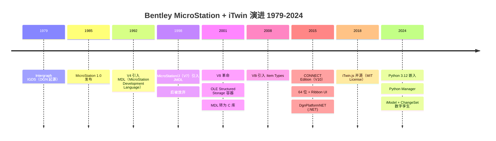
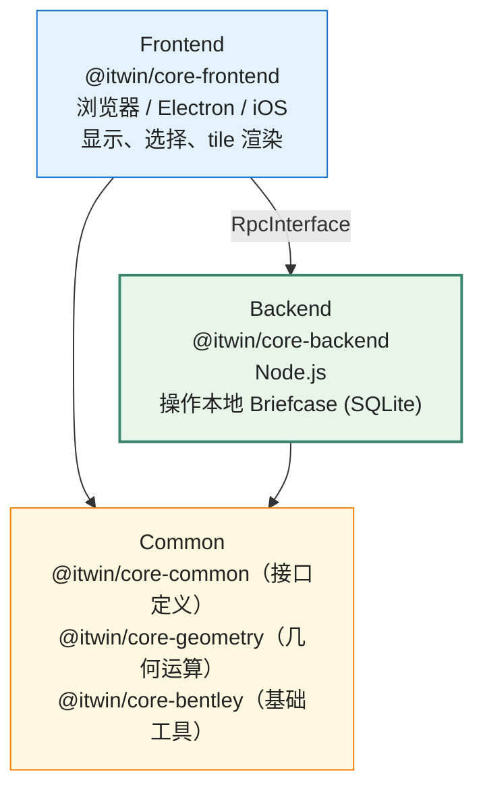

# Bentley MicroStation + iTwin API 设计深度剖析

> 文档 3.5｜厂商深度剖析系列｜通用 CAD 平台 API 设计哲学
>

---

## 阅读约定

- `<sup>[类别 N]</sup>`：段落或论断的来源标注，N 对应文末参考来源编号
- `> **[推论]**`：基于已知事实的合理推断，非来自厂商或权威资料的直接陈述
- `> **[评论]**`：本报告作者的主观归纳、判断或行业观察
- ⚠️ **勘误**：对常见社区资料中事实错误的修正

来源类别：
- `[官方]` Bentley/Trimble/Autodesk 等厂商官方文档、SDK 帮助、developer portal
- `[新闻]` 厂商官方新闻稿、博客、Year in Infrastructure 大会公告
- `[百科]` Wikipedia、Grokipedia 等百科类
- `[第三方]` LA Solutions、Sumbera 教程、社区 wiki、行业媒体、技术博客
- `[书籍]` 专业书籍

---

## TL;DR

- **MicroStation 是基础设施工程领域的 API 设计教科书**：从 1990 年代初的 MDL 起步<sup>[百科 1][第三方 2]</sup>，到 V8 时代的 C++ MicroStationAPI、CONNECT Edition 的 .NET 托管层，再到 2024 年正式引入官方 Python API<sup>[官方 13]</sup>，跨越 30+ 年的 API 演进史几乎覆盖了所有主流嵌入式扩展范式。
- **ECObjects/ECSchema 是 Bentley 独有的"工程内容元数据"系统**<sup>[官方 17]</sup>，强类型、可关系建模、XML/JSON 序列化，是 MicroStation 区别于 AutoCAD 等平台的核心竞争力。
- **iTwin Platform 是当今 CAD 厂商中较为激进的云原生重构**<sup>[新闻 6]</sup>：iModel = SQLite + ChangeSet 时间线，iTwin.js 是开源 TypeScript SDK（**MIT License**<sup>[新闻 6][新闻 8]</sup>，社区资料中常见误写为 Apache 2.0，需以官方为准）。截至 2025 年 iTwin.js 已迭代至 5.x 系列，包名从 `@bentley/*` 全面迁移到 `@itwin/*`<sup>[官方 9]</sup>。
- **MicroStation 与 iTwin 是"桌面 + 云"的双轨而非替代关系**<sup>[新闻 6]</sup>：MicroStation 仍是设计原生、DGN 仍是文件标准；iTwin 是基于多源数据派生的"数字孪生联邦"。
- **DGN 文件格式自 V8（2000 年创建、随 2001 年 MicroStation V8 发布<sup>[百科 4]</sup>）改用 OLE Compound File**；ODA 在 **2003 年**宣布支持 V8 DGN<sup>[百科 4]</sup>，**V8 DGN File Format Reference 公开于 2005 年**<sup>[百科 5]</sup>。⚠️ 社区资料中常见的"2005 年公开规范换来 ODA 支持"说法时间序列不准确——ODA 支持发生在规范公开之前。
- **垂直产品矩阵高度成熟**：OpenRoads / OpenBuildings / OpenRail / OpenBridge / OpenPlant 等 OpenX 系列建立在 MicroStation + ECSchema 之上<sup>[百科 1]</sup>。

---

## Key Findings

1. **MDL（MicroStation Development Language）的引入年份在公开资料中存在分歧**：Wikipedia 与多数社区资料表述为 1992 年的 V4 release<sup>[百科 1]</sup>；Sumbera 的历史教程表述为 1991 年<sup>[第三方 2]</sup>；LA Solutions 表述为"MDL has been available since 1993"<sup>[第三方 14]</sup>。本报告采用"V4 系列（1990 年代初期）"的稳妥表述。
2. **从 V8 起 MDL 实质成为 C 库**：MDL 不再作为独立语言存在，而是一组 C 语言函数族，可编译为 Windows DLL 并在 Visual Studio 中调试<sup>[第三方 2]</sup>。p-code .ma 路径仅作 legacy 兼容。
3. **MicroStationAPI（C++ 原生）的 ElementHandle / EditElementHandle 双 Handle 模式**：⚠️ 关键纠正——`EditElementHandle` 是 `ElementHandle` 的**派生类**，而非两个独立的姊妹类<sup>[第三方 15][官方 16]</sup>。`ElementHandle` 是只读基类，`EditElementHandle` 增加了写能力。
4. **DgnPlatformNET 是托管 .NET 层**：CONNECT Edition 引入 `Bentley.MicroStation.dll`/`Bentley.DgnPlatformNET.dll`/`Bentley.GeometryNET.dll`<sup>[第三方 14]</sup>。
5. **MicroStation 2024 引入官方 Python API**：Python 3.12 嵌入 + Python Manager（Ribbon 工具）<sup>[官方 13][第三方 11]</sup>+ GitHub 开源示例（`BentleySystems/MicroStationPython` 仓库）<sup>[官方 12]</sup>。
6. **DGN 元素的多层扩展元数据**：Linkage（V7 时代二进制小段）→ XAttribute（V8 引入结构化扩展数据）→ Item Types（V8i 引入轻量元数据）→ ECInstance/ECSchema（顶层强类型工程对象）<sup>[官方 17][第三方 14]</sup>。
7. **ECSchema 是工程级元数据系统**：支持 ECClass / ECRelationshipClass / ECStructProperty / ECNavigationProperty / CustomAttribute<sup>[官方 17][官方 18]</sup>，是 BIS（Base Infrastructure Schemas）和 iModel 的概念骨架<sup>[官方 18]</sup>。
8. **iTwin.js 三段架构（Frontend/Backend/Common）**：通过 RpcInterface 统一通信抽象<sup>[官方 19]</sup>。
9. **iModel = SQLite + ChangeSet**：每个 iModel 在 iModelHub 注册一个 GUID，本地工作副本叫 Briefcase（一个 SQLite 文件），修改后推送 Changeset 到 iModelHub<sup>[新闻 6][官方 19]</sup>。
10. **iTwin.js 的开源策略与 Microsoft Azure 战略合作**：⚠️ iTwin.js 自 2018 年 10 月 17 日开源（**MIT License**，非 Apache 2.0）<sup>[新闻 6][新闻 7][新闻 8]</sup>，托管在 GitHub `iTwin/itwinjs-core`，依赖 SQLite、Node.js、NPM、WebGL、Electron、Docker、Kubernetes 等开放技术<sup>[新闻 6]</sup>。

---

## 一、历史演进：从 IGDS 到 iTwin 的 40 年 API 时间线



### 1.1 史前：Intergraph IGDS 时代（1979–1985）

DGN 文件格式起源于 1979 年 Intergraph Graphics Design System (IGDS)<sup>[百科 4]</sup>。Bentley 兄弟（Keith 和 Barry）作为 Intergraph 的 OEM 合作方<sup>[百科 1]</sup>，在 1984 年发布 PseudoStation——一个让 PC 终端可访问 IGDS 数据的程序<sup>[百科 1]</sup>。1985 年 MicroStation 1.0 发布，作为 IGDS 在 PC 上的克隆工具，**最初只能读 DGN，不能写**；1987 年 MicroStation 2.0 才支持读写<sup>[百科 1]</sup>。

### 1.2 MDL 诞生：MicroStation V4（1990 年代初）

⚠️ **关于 MDL 引入时间的多源分歧**：

- Wikipedia "MicroStation"：The 1992 release of version 4 introduced the ability to write applications using MDL<sup>[百科 1]</sup>
- Sumbera 的 MDL 历史教程：MDL 在 MicroStation v.4 in year 1991 引入<sup>[第三方 2]</sup>
- LA Solutions：MDL has been available since 1993<sup>[第三方 14]</sup>
- 书籍《Programming With MDL: The MicroStation Development Language (Microstation Version 4.X)》早期出版<sup>[书籍 3]</sup>

这种分歧可能源于：MicroStation 4.0 在 1990 年底发布<sup>[百科 1]</sup>，4.x 系列陆续到 1993 年；MDL 可能在 4.x 系列中逐步成熟，不同来源以不同里程碑事件作为"引入年份"。本报告采用"V4 系列（1990 年代初）"的稳妥表述。

MDL 是一种 C 语法子集 + 内置库函数 + p-code 字节码的设计<sup>[第三方 2]</sup>：

- 开发者编写 `.mc` 源文件（C 风格语法），用 Bentley 的 `mdlcc` 编译器编译为 `.ma` p-code 字节码
- 用 `bmake` 工具管理构建（自研 make 替代品）
- MicroStation 内置 p-code 解释器加载 `.ma` 并执行
- 一套源码 + 一份 `.ma` 即可在 DOS、Win3.x、SunOS、HP-UX、IRIX、Mac 等所有 MicroStation 支持的平台运行<sup>[第三方 2]</sup>

经典 Hello World 示例<sup>[第三方 5]</sup>：

```c
#include <mdl.h>
#include <userfnc.h>

void main()
{
    mdlDialog_dmsgsPrint("Hello World");
}
```

> **[推论]** MDL 替代了之前的 MicroCSL（pre-MDL 链接库）和 UCM（User Commands）<sup>[第三方 2]</sup>，其设计动机包含：(1) 跨平台代码兼容性，(2) 提供专业级开发框架以替代简单的 macro 工具。

> **[评论]** 这种"自研字节码 + 内置解释器"的路线与同期 Java（1995 年首发）的设计思路相似，但 MDL 更早。本报告未找到 Bentley 官方文档明确将 MDL 与 Java 进行设计比较，"早于 Java 的跨平台 VM 方案"这一定性属本文作者的归纳。

### 1.3 MDL/J 与 ECM 的失败实验：MicroStation/J（1998–1999）

MicroStation/J（即 MicroStation V7）于 SE（1997）发布约一年后推出<sup>[百科 1]</sup>。"J" 代表 Java——这一版本引入了 Java 增强的 MDL 变种 **JMDL**<sup>[百科 1][第三方 2]</sup>。

JMDL 是介于 C++ 和 Java 之间的语言（"Java with pointers"），与 ECM（Engineering Component Model，早期的"工程对象组件模型"实验）配套推广<sup>[第三方 2]</sup>。JMDL 在 MicroStation Geographics 的 SDODGN API 中使用过<sup>[第三方 2]</sup>。

但 JMDL 很快被放弃。Bentley 工程师的一段公开表述：

> "we (Bentley) are not starting any new JMDL projects. However, we do have a lot of JMDL code inside MicroStation and we do use a lot of Java in our server applications."<sup>[第三方 2]</sup>

> **[推论]** ECM 的失败可能影响了 Bentley 后续的 ECObjects 设计——两者都试图为工程数据建立"对象 + 关系"的元数据体系，但 ECObjects 走 XML schema 路线、不绑定特定运行时语言，更具可移植性。本报告未找到 Bentley 官方文档明确陈述这一传承关系，属作者推断。

### 1.4 V8 革命：MicroStation V8（2001）

V8 是 MicroStation 历史上最重要的版本之一，Wikipedia 称之为 "the most groundbreaking release in Bentley's history"<sup>[百科 1]</sup>。

**DGN V8 文件格式的关键变化**<sup>[百科 1][百科 4][第三方 7]</sup>：

- 底层从固定结构二进制流改为 **Microsoft Compound File Binary Format（OLE2 Structured Storage）**
- 坐标改为 IEEE 754 64-bit 浮点
- Levels 数从 V7 的 1–63 限制变为无上限（每个 level 是一个元素）
- 移除了 V7 的 32MB 文件大小上限
- 引入 **Models**（一个 DGN 内多个独立设计空间）
- 引入 **Design History**（基于元素的版本控制）
- 引入 **True Scale**（统一存储为米，运行时单位转换）
- 增加 Accusnap、unlimited undo
- 支持 VBA 编程与 .NET 互操作

**MDL 演变**：从 V8 起 MDL 不再是独立语言，转变为"MicroStation Development Library"——可直接编译为 Windows DLL，可在 Visual Studio 中调试，可与任意语言互操作<sup>[第三方 2]</sup>。

**V8 DGN 格式的开放路径**：

- **2000 年**：Bentley 创建了 V8 DGN 格式（Wikipedia 表述为 "In 2000, Bentley Systems created an updated version of DGN"）<sup>[百科 4]</sup>
- **2001 年**：随 MicroStation V8 发布<sup>[百科 1]</sup>
- **2003 年**：OpenDWG Alliance（即后来的 Open Design Alliance, ODA）与 Bentley 合作宣布支持 V8 DGN<sup>[百科 4]</sup>
- **2005 年**：V8 DGN File Format Reference 公开<sup>[百科 5]</sup>，提供详细规范给开发者
- **2008 年**：Autodesk 与 Bentley 互让软件库（Autodesk RealDWG 与 Bentley 的 DGN 库）<sup>[百科 4]</sup>

⚠️ **重要事实澄清**：社区资料中常见的"2005 年公开规范是 ODA 支持的换取条件"说法不准确——根据 Wikipedia 时间线，ODA 实际在 **2003 年**就宣布支持 V8 DGN<sup>[百科 4]</sup>，2005 年 V8 DGN File Format Reference 公开是规范文档发布事件，发生在 ODA 支持之后。

> **[推论]** Bentley 选择 OLE Compound File Binary Format 作为 V8 DGN 容器格式的潜在原因可能包括：(1) 直接复用 Microsoft 成熟基础设施，(2) 与 MS Office 文件生态自然兼容，(3) 减少自研容器格式的工程负担。本报告未找到 Bentley 官方对该选择的直接论述。

### 1.5 V8 XM Edition（2006）

MicroStation V8 XM Edition (V8.9) 于 2006 年 5 月发布<sup>[第三方 7]</sup>，是 V8 的重大更新：

- 重写的 Direct3D 图形子系统<sup>[第三方 7]</sup>
- PDF References<sup>[第三方 7]</sup>
- task navigation, element templates, color books<sup>[第三方 7]</sup>
- Feature modeling<sup>[第三方 7]</sup>

### 1.6 V8i 时代（2008）：Item Types 与 ProjectWise 集成

V8i 引入了：
- **Item Types**：轻量元数据，用户无需写代码即可定义对象属性<sup>[官方 17]</sup>
- 增强的 ProjectWise 集成
- DWG 新版本支持

### 1.7 CONNECT Edition (V10, 2015)：现代化重构

CONNECT Edition（内部版本号 V10）的关键变化<sup>[第三方 14]</sup>：

- 64-bit 架构
- Microsoft Office 风格 Ribbon UI（取代传统 toolbar）
- **MicroStationAPI（C++ 原生）成熟**：`DgnPlatform` 命名空间，`DgnFile` / `DgnModel` / `DgnAttachment` / `DgnModelRef` 完整层级<sup>[第三方 15]</sup>
- **DgnPlatformNET（.NET 托管层）**：`Bentley.MicroStation.dll` / `Bentley.DgnPlatformNET.dll` / `Bentley.GeometryNET.dll`<sup>[第三方 14]</sup>
- 从 MDL p-code 到 C++/CLI 的迁移完成

### 1.8 MicroStation 2024：Python 入场

2024 年版本（实际版本号 v27）引入了官方 Python API<sup>[官方 13]</sup>：

- **Python 3.12 嵌入**到 MicroStation 进程中<sup>[第三方 11]</sup>
- **Python Manager**：Ribbon 中的脚本管理工具<sup>[官方 13]</sup>
- **开源示例仓库**：[`BentleySystems/MicroStationPython`](https://github.com/BentleySystems/MicroStationPython) 公开实现、示例、构建脚本<sup>[官方 12]</sup>
- 支持独立 Python 解释器（用户也可使用自有 Python 环境）<sup>[第三方 11]</sup>
- Macro 录制可直接生成 Python 代码<sup>[官方 13]</sup>

> **[评论]** Bentley 官方将此功能定位为 "game-changer"<sup>[第三方 11]</sup>。结合 FreeCAD（Python）、Fusion 360（Python/JS）、Rhino/Grasshopper（Python）、SketchUp（Ruby）的脚本生态成熟度，MicroStation 2024 的 Python API 是补齐多年短板的关键更新——尤其在 AI/ML 集成、数据科学场景下，能直接调用 numpy、pandas、scikit-learn、PyTorch 等生态。但本报告未找到 Bentley 官方对该判断的直接陈述。

### 1.9 iTwin Platform 时代（2018+）

详见后文专章。

---

## 二、API 整体架构：四层并存的 API 栈

MicroStation 当前的 API 栈由四个并存层组成：

| 层 | 引入时间 | 形态 | 来源 |
|---|---|---|---|
| MDL | 1990 年代初<sup>[百科 1][第三方 2]</sup> | C 函数库 + .ma p-code（legacy）+ Windows DLL | 早期跨平台需求 |
| MicroStationAPI (C++) | V8 时代（2001+）<sup>[第三方 14]</sup> | C++ 类库，`DgnPlatform` 命名空间 | 原生性能与深度扩展 |
| DgnPlatformNET (.NET) | CONNECT Edition (2015+)<sup>[第三方 14]</sup> | C#/VB.NET 托管程序集 | 现代企业开发 |
| Python API | MicroStation 2024<sup>[官方 13]</sup> | Python 3.12 绑定 | 设计师/自动化脚本 |

此外还有 VBA（V8+ 引入<sup>[百科 1]</sup>）作为 legacy 脚本路径。

```
┌─────────────────────────────────────────────────────────────┐
│ Python API (2024+)             │ VBA (legacy)                │
│ - python.exe 嵌入             │ - COM Automation             │
│ - Python Manager              │ - 历史脚本兼容               │
├─────────────────────────────────────────────────────────────┤
│ DgnPlatformNET (.NET, CONNECT+)                              │
│ - Bentley.MicroStation.dll                                   │
│ - Bentley.DgnPlatformNET.dll                                 │
│ - Bentley.GeometryNET.dll                                    │
├─────────────────────────────────────────────────────────────┤
│ MicroStationAPI (C++ Native, V8+)                            │
│ - DgnPlatform 命名空间                                        │
│ - ElementHandle / EditElementHandle 双 handle 模型            │
│ - ElementHandler 类型分发                                    │
├─────────────────────────────────────────────────────────────┤
│ MDL (V4 1990s ~ now, 仍兼容)                                 │
│ - mdl* 函数族                                                │
│ - .ma p-code 字节码（legacy）                                 │
│ - 现今实质是 C 库 + Windows DLL                               │
└─────────────────────────────────────────────────────────────┘
                       ↓ 皆基于 ↓
              DGN 文件格式 + ECSchema
```

> **[评论]** 四层并存意味着 Bentley 的 API 哲学包含一个隐含承诺：**已发布的 API 持续兼容**。这与 AutoCAD ObjectARX 频繁绑定特定 Visual Studio 版本（每三年一次破坏性二进制不兼容）形成对比。但本报告未在 Bentley 官方文档中找到对此承诺的明确文字表述，"持续兼容承诺"属作者基于多代 API 共存现实的归纳。

---

## 三、对象模型：DGN 数据结构

### 3.1 DGN 层级

```
DgnFile
├── DgnModel (一个 DGN 内多个独立设计空间)
│   ├── DgnElement (Element, 图元)
│   │   ├── Geometry (几何数据)
│   │   ├── Linkage (V7 风格扩展)
│   │   ├── XAttribute (V8 结构化扩展)
│   │   └── ECInstance (强类型工程对象)
│   └── DgnAttachment (Reference, 引用其他 DgnModel)
└── ModelMap / DictionaryModel / SymbolDictionary
```

`DgnFile` 持有一组 `DgnModel`，每个 model 是独立的设计空间<sup>[第三方 15]</sup>。Models 是 V8 引入的概念<sup>[百科 1]</sup>——V7 时代一个 DGN 就只有一个隐式 model。

### 3.2 ElementHandle / EditElementHandle 双 Handle 模式（含勘误）

MicroStationAPI 用一对 handle 类区分只读与可写<sup>[第三方 15][官方 16]</sup>：

⚠️ **重要事实澄清**：社区资料中有将 `ElementHandle` 和 `EditElementHandle` 描述为两个独立姊妹类的说法。**实际上 `EditElementHandle` 是 `ElementHandle` 的派生类**——LA Solutions 文档明确表述："The ElementHandle class (and hence the derived EditElementHandle class) has a GetHandler() method"<sup>[第三方 15]</sup>。Bentley API 头文件源码也证实：`EditElementHandle (...) : ElementHandle (descr, owned, isUnmodified, modelRef) {}`<sup>[官方 16]</sup>。

```cpp
// 只读：用于查询、显示、不修改
ElementHandle eh(elementRef);
WString name;
NormalCellHeaderHandler::ExtractName(name, MAX_MODEL_NAME_LENGTH, eh);

// 可写：用于修改（继承自 ElementHandle，增加写能力）
EditElementHandle eeh(elementRef, true /*loadIntoCache*/);
// ... 修改 eeh 内的元素 ...
eeh.ReplaceInModel(eeh.GetElemRef());
```

`EditElementHandle` 可表示三种内部状态<sup>[第三方 16]</sup>：

1. **Persistent and unmodified**：`GetElementRef` 返回非空，`IsPersistent` 返回 true
2. **Persistent and modified**：`GetElementRef` 返回 NULL，`IsPersistent` 返回 false（即使 descriptor 的 elementRef 字段已设置）
3. **Non-persistent**：仅持有 element descriptor

辅助类 `ChildElemIter` / `ChildEditElemIter` 用于迭代复杂元素的子元素<sup>[官方 16]</sup>。

> **[推论]** `EditElementHandle` 作为 `ElementHandle` 派生类的设计选择，使得"只读 API"可以无缝接受可写句柄作为参数（通过基类指针）——这是典型的 LSP（里氏替换原则）应用。但这种"is-a 关系"也意味着开发者需要谨慎检查是否处理可写状态。

### 3.3 ElementHandler 模式（无状态类型分发）

每种元素类型对应一个 ElementHandler 单例（无状态），方法接受 ElementHandle 参数<sup>[第三方 15]</sup>：

```cpp
// 提取 Cell 名称
ElementHandle eh(/* ... */);
DisplayHandlerP handler = eh.GetDisplayHandler();
if (nullptr != handler) {
    NormalCellHeaderHandler* cellHandler = 
        dynamic_cast<NormalCellHeaderHandler*>(handler);
    if (nullptr != cellHandler) {
        WChar name[MAX_MODEL_NAME_LENGTH];
        cellHandler->ExtractName(name, MAX_MODEL_NAME_LENGTH, eh);
    }
}
```

> **[评论]** 这种设计避免了在 `ElementHandle` 内嵌庞大的 vtable——每个 handler 是独立的类，按元素类型注册到全局 dispatch 表。优点是内存占用小、便于第三方注册自定义元素类型；缺点是 API 调用语法略繁琐（要先拿到 handler 再调用其方法）。本报告未找到 Bentley 官方对该设计权衡的直接论述。

---

## 四、几何核心：DgnGeometry / CurveVector / SmartSolid

MicroStation 的几何系统**不直接使用 Parasolid/ACIS 作为 B-Rep 内核**（与 SolidWorks/NX 不同），而是有自己的几何抽象层<sup>[第三方 14]</sup>：

- **基础几何**：`DPoint3d` / `DVec3d` / `Transform` / `RotMatrix` / `DRange3d`
- **曲线**：`CurvePrimitive`（直线、圆弧、椭圆弧、Bezier、B-Spline）
- **曲线集合**：`CurveVector`（树形结构，可表示开/闭/区域，支持 `CentroidNormalArea()` 等方法）
- **曲面**：`SolidPrimitive` / `MeshPrimitive` / `Polyface`
- **B-Rep 实体**：**SmartSolid**

> **[推论]** MicroStation 的 SmartSolid 据社区资料基于 ACIS 集成<sup>[第三方推论]</sup>，但被包装在 DgnPlatform 抽象层之下，并未把 ACIS API 直接暴露给应用开发者。本报告未在 Bentley 官方文档中找到 SmartSolid 内核来源的明确陈述（属公司商业秘密的可能性较高），关于"基于 ACIS"的判断属社区共识，需谨慎对待。

> **[评论]** "不直接暴露内核"的策略与 SolidWorks 暴露 Parasolid `IBody2` 接口、NX 暴露完整 Parasolid PK API 形成对比。优点是降低 ISV 学习成本、Bentley 可以替换底层内核；缺点是丧失了内核级别的精细控制。

---

## 五、扩展数据元金字塔：Linkage / XAttribute / Item Types / ECInstance

MicroStation 在元素上附加自定义数据有四个层次，从轻到重<sup>[官方 17][第三方 14]</sup>：

### 5.1 Linkage（V7 时代）

附加在元素后的二进制小段，固定结构<sup>[第三方 14]</sup>。线型、颜色 override 等系统级 linkage 也是这个机制。开发者可定义自己的 linkage ID，但数据是字节流，需自己解析。

### 5.2 XAttribute（V8 引入）

结构化扩展数据，按 `handlerID + xAttrId` 区分<sup>[第三方 16]</sup>：

```cpp
// EditElementHandle 通过 ScheduleWriteXAttribute 写入或更新
// XAttribute 不区分"添加新值"和"替换现有值"——两者都用 ScheduleWriteXAttribute
// 通过 XAttributeHandle 类可测试是否存在
```

XAttribute 比 Linkage 更结构化，支持任意大小数据，有变更通知机制<sup>[第三方 16]</sup>。

### 5.3 Item Types（V8i 引入）

**轻量元数据，无需写代码**<sup>[官方 17]</sup>——用户在 UI 中定义 Item Type（一组属性），然后附加到元素上。属性可在 Properties 面板编辑，可参与 Reports 生成。

> **[推论]** 根据公开 ECObjects 文档<sup>[官方 17][官方 18]</sup>，Item Types 实际上是 ECSchema 的简化版，内部存储格式都是 EC 系统。本报告未在官方文档中找到对此实现细节的直接陈述，属基于 Bentley 元数据栈架构的合理推断。

### 5.4 ECInstance / ECSchema（顶层强类型）

详见下一章。

### 5.5 与 AutoCAD 的对比

| 平台 | 层次 | 强类型 | 关系建模 | 序列化格式 |
|---|---|---|---|---|
| AutoCAD | XData / XRecord / Dictionary（3 层） | ❌ | ❌ | DXF group code |
| MicroStation | Linkage / XAttribute / Item Types / ECInstance（4 层）<sup>[官方 17]</sup> | ✅（顶层） | ✅（ECRelationshipClass） | XML + JSON |

> **[评论]** MicroStation 在工程元数据上明显比 AutoCAD 更深——这可能是它在基础设施工程领域（轨道交通、水电、市政）站稳脚跟的关键技术支撑。但这一因果关系属作者评论，未经市场调研直接验证。

---

## 六、ECObjects / ECSchema：Bentley 独有的元元模型

ECObjects 是 Bentley 自研的强类型工程数据元模型<sup>[官方 17][官方 18]</sup>，可类比为 OWL/RDF 但更工程化。它是 ProjectWise、AssetWise、iTwin 的共同基础<sup>[官方 18]</sup>。

### 6.1 概念体系

根据 iTwin.js 官方 ECSchema 文档<sup>[官方 18]</sup>：

- **ECSchema**：根容器，有 schemaName + alias + version + 引用其他 schema
- **ECClass**：分四类
  - `Domain Class`（领域实体类）
  - `Struct Class`（值类型结构）
  - `Custom Attribute Class`（标注 schema/class/property 的元元数据）
  - `Relationship Class`（1:1/1:N/N:M 关系，第一等公民）
- **ECProperty / ECStructProperty / ECArrayProperty / ECNavigationProperty**：属性
- **ECInstance / ECRelationshipInstance**：实例
- **ECEnumeration**：枚举类型
- **KindOfQuantity**：单位绑定（如 LENGTH/MASS/PRESSURE）

### 6.2 XML 序列化示例

ECSchema XML 命名空间为 `http://www.bentley.com/schemas/Bentley.ECXML.3.2`<sup>[官方 18]</sup>。一个简化示例：

```xml
<?xml version="1.0" encoding="UTF-8"?>
<ECSchema schemaName="Building" alias="bldg" version="1.0.0"
         xmlns="http://www.bentley.com/schemas/Bentley.ECXML.3.2">
  <ECEntityClass typeName="Wall">
    <BaseClass>BisCore:PhysicalElement</BaseClass>
    <ECProperty propertyName="Height" typeName="double" 
                kindOfQuantity="AECU:LENGTH" />
  </ECEntityClass>
  
  <ECRelationshipClass typeName="WallIsInBuilding" 
                       strength="referencing" 
                       strengthDirection="forward">
    <Source multiplicity="(0..*)" roleLabel="contains" 
            polymorphic="true">
      <Class class="Building" />
    </Source>
    <Target multiplicity="(1..1)" roleLabel="is contained in" 
            polymorphic="true">
      <Class class="Wall" />
    </Target>
  </ECRelationshipClass>
</ECSchema>
```

### 6.3 EC 在不同环境中的表现

- **MicroStation 内**：可"内嵌"（schema 存在 .dgn 内）或"外部引用"（schema 存在独立 `.ecschema.xml`）<sup>[官方 17]</sup>
- **ProjectWise 中**：作为元数据骨架被 ProjectWise Explorer 和 AssetWise 共享<sup>[官方 18]</sup>
- **iTwin 中**：是 iModel 的核心结构（详见下章 BIS）<sup>[官方 18]</sup>

### 6.4 BIS（Base Infrastructure Schemas）

BIS 是 iModel 的概念骨架，由 ECSchema 表达<sup>[官方 18]</sup>：

```
BisCore (核心，其他 schema 需要直接或间接继承)
├── Functional (功能性元素)
├── Construction (施工)
├── Linear Referencing (线性参考)
├── Civil Geometry (土木几何)
├── PhysicalMaterial (物理材料)
└── ... (各专业域 schema)
```

iTwin.js 文档明确规则：除 BisCore 外所有 ECClass 需要继承自 BisCore 的某个 ECClass<sup>[官方 18]</sup>。

> **[评论]** 这种"强制根类继承"的设计，强制了概念一致性，避免了 schema 失控扩散。在工程数据多源融合（DGN/DWG/RVT/IFC 等）场景下，这是必要的约束——但学习成本陡峭。

---

## 七、垂直产品矩阵：OpenX 系列

MicroStation 是平台底座，OpenRoads / OpenSite Designer / OpenRail / OpenBridge / OpenBuildings / OpenPlant / OpenTower / OpenWindPower / Substation / PowerRebar 等 OpenX 系列垂直应用建立在其之上<sup>[百科 1]</sup>。

### 7.1 关键设计决定

这些产品**安装时附带完整的 MicroStation 引擎**<sup>[第三方 14]</sup>。垂直产品 = MicroStation 引擎 + 行业 ECSchema + UI 定制 + 工作流。

> **[评论]** 这是与 AutoCAD Architecture/Civil 3D/Plant 3D（也是 AutoCAD 之上的垂直应用）相同的模式。区别在于 Autodesk 系列用 ObjectARX Custom Entity + Object Enabler，Bentley 系列用 ECSchema 定义"行业语义层"。后者更工程化、更结构化，但学习曲线更陡。

### 7.2 行业 schema 决定文件性质

例如 OpenRoads 的 Civil schema 决定了一个 .dgn 文件是 ORD 项目还是裸 DGN<sup>[第三方 14]</sup>。

> **[推论]** 根据社区讨论<sup>[第三方 14]</sup>，用较新版 ORD 打开会**升级 civil schema**，导致老版本只能只读打开（"Newer Civil Data Found"提示）——这是典型的 schema 单调演化问题，与软件版本管理中的"破坏性 schema 升级"困境同构。本报告未在 Bentley 官方文档中找到对此机制的明确文字描述，属社区观察。

### 7.3 GenerativeComponents（GC）

Bentley 的参数化设计工具<sup>[百科 1]</sup>，基于 C# API（`Bentley.GenerativeComponents.ElementBasedNodes`）<sup>[官方 19]</sup>，类似 Grasshopper 但深度集成 MicroStation。

---

## 八、iTwin Platform：云原生重构

### 8.1 iTwin.js 开源历程（含勘误）

⚠️ **重要事实澄清**：社区资料中常见将 iTwin.js 误述为 **Apache 2.0** 许可证——**这是错误的**。多家媒体（包括 Bentley 官方新闻稿引用方）确认开源许可证为 **MIT License**<sup>[新闻 6][新闻 7][新闻 8]</sup>。

iTwin.js 的前身名为 **iModel.js**，**2018 年 10 月 17 日** Bentley 在 Year in Infrastructure 2018 大会（伦敦）上宣布初始版本开源<sup>[新闻 6][新闻 7]</sup>：

> "Bentley Systems, Incorporated, the leading global provider of comprehensive software solutions for advancing the design, construction, and operations of infrastructure, today announced the initial release of its iModel.js library, an open-source initiative to improve the accessibility, for both visualization and analytical visibility, of infrastructure digital twins."<sup>[新闻 6]</sup>
> 
> "The source code is hosted on GitHub and is distributed under the MIT license."<sup>[新闻 6]</sup>

iModel.js 依赖的开放技术栈包括<sup>[新闻 6]</sup>：SQLite、Node.js、NPM、WebGL、Electron、Docker、Kubernetes、HTML5/CSS。

### 8.2 包名演进

- **v1.0–v2.x**（2019–2021）：包名为 `@bentley/imodeljs-*`<sup>[官方 9]</sup>
- **v3.0**（2022）：迁移至 `@itwin/core-*` 命名空间，移除 SAML 认证支持<sup>[官方 9]</sup>
- **v5.x**（2025）：支持 Node.js 24，TypeScript 升级至 ES2023/ES2022<sup>[官方 10]</sup>

### 8.3 三段架构

iTwin.js 设计为可同时部署为 Web、移动、桌面三种形态<sup>[新闻 6]</sup>：



> **[推论]** RpcInterface 可配置为 in-process（mobile/desktop 单进程）或 HTTP（web app 跨网络）的能力，使同一份业务代码无需修改即可适配不同部署形态。这种设计选择反映了 Bentley 对"跨形态代码复用"的高优先级。本报告未找到 Bentley 官方对该选择动机的直接论述。

### 8.4 iModel 数据模型

**iModel = SQLite + ChangeSet + ECSchema**<sup>[新闻 6][官方 19]</sup>：

- 每个 iModel 在 iModelHub 注册一个 GUID
- 本地工作副本叫 **Briefcase**——一个 SQLite 文件
- 修改后推送 **Changeset** 到 iModelHub
- iModelHub 要求 changeset 基于最新版本（线性时间线）<sup>[新闻 6]</sup>
- 每个 Changeset 有 `Id`（内容 hash 字符串）和 `Index`（线性整数）双重标识<sup>[官方 9]</sup>
- 命名版本（Named Version）在时间线上打 tag<sup>[官方 9]</sup>

iTwin.js 4.x 起支持 changeset rebase（合并 changeset）<sup>[官方 10]</sup>。

### 8.5 与 Onshape git 模型对比

| 维度 | iTwin (Bentley) | Onshape (PTC) |
|---|---|---|
| 单元 | Changeset = SQLite row-level diff | Microversion = FeatureScript feature 级 commit |
| 时间线 | 线性，hub 强制 latest-based | 也是线性 |
| 数据模型 | BIS schema（基础设施 federated） | Parasolid 几何 + part studio + assembly |
| 跨工具同步 | iTwin Connector 把 DGN/DWG/RVT/IFC/PDMS 转为 iModel | 不开放，Onshape 是封闭的纯云 |
| 部署模式 | Frontend/Backend/Common 同代码三形态 | 浏览器 + 自家云 |
| 开源 | iTwin.js 开源 (**MIT License**) + BIS schemas 开源 | FeatureScript 标准库公开但平台不开源 |

> **[推论]** iTwin 的"federated"特征（不要求所有数据都搬到 iModel 内，可允许 reality data/IoT/markup 保留在外部存储）是它独有的设计选择<sup>[新闻 6]</sup>。这反映了基础设施工程的现实需求：数据源极度异构（DGN、DWG、RVT、IFC、点云、IoT、GIS 等），强行迁移到单一权威数据库会失败。

### 8.6 iTwin Connector：增量同步

iTwin Connector（前称 iModel Bridge）把 DGN/DWG/RVT/IFC/PDS/Smart 3D/AVEVA PDMS/E3D 等转为 iModel<sup>[新闻 6]</sup>。

> **[推论]** 根据 iTwin Connector 的功能描述，连接器内部很可能维护"源 ID → iModel 全局 ID"映射表，重新运行时识别源文件变更并生成精确的 Changeset 而非全量重建。本报告未在公开文档中找到对此实现机制的详细描述，属基于其增量更新能力的合理推断。

> **[评论]** 这与 Autodesk APS Model Derivative（一次性转换为 SVF/SVF2）的路线差异显著——iTwin 的转换是生命周期同步而非一次性派生。对于建造期 + 运维期持续 30+ 年的基础设施项目，生命周期同步是必要的。

### 8.7 ECSQL：BIS-aware 的 SQL 方言

iTwin 在 iModel 上提供 **ECSQL**，基于 ECSchema 的 SQL 方言<sup>[官方 18]</sup>：

```sql
-- 查询所有继承自 BisCore.PhysicalElement 的元素，
-- 限制在某个 Building 范围内
SELECT e.ECInstanceId, e.UserLabel
FROM bis.PhysicalElement e
JOIN bldg.WallIsInBuilding rel ON rel.SourceECInstanceId = e.ECInstanceId
JOIN bldg.Building b ON b.ECInstanceId = rel.TargetECInstanceId
WHERE b.Name = 'Tower A'
```

### 8.8 与 Microsoft Azure 战略合作

> **[评论]** 以下分析为本报告作者基于公开信息的归纳，非 Bentley 官方陈述。

**事实依据**：
- iTwin.js 完全开源（MIT License）<sup>[新闻 6]</sup>
- 2020 年 Bentley 与 Microsoft 扩展战略合作，iTwin Platform 部署在 Azure 上<sup>[新闻 11]</sup>
- ProjectWise 365 在 Azure marketplace 上架<sup>[新闻 11]</sup>

> **[推论]** Bentley 选择不自建 IaaS 层、全部托管在 Azure 上，可能的考量包括：(1) 核心竞争力在领域知识（OpenRoads/OpenBuildings 等行业 schema）而非云基础设施，(2) Microsoft Azure 在企业基础设施市场的渗透度高，与 Bentley 的客户重叠（政府、大型基建业主），(3) 自建 IaaS 的资本支出对中型软件公司过重。本报告未找到 Bentley 官方对该选择的直接论述。

### 8.9 iTwin 业务层产品

- **iTwin IoT**：实时传感器集成<sup>[新闻 11]</sup>
- **iTwin Synchro**：4D 施工模拟（Bentley 2018 年收购 Synchro Software）<sup>[新闻 11]</sup>
- **PlantSight**：流程工业数字孪生<sup>[新闻 11]</sup>
- **iTwin Capture**：现实捕获（点云、摄影测量）<sup>[新闻 11]</sup>
- **iTwin Experience**：终端用户可视化平台<sup>[新闻 11]</sup>

---

## 九、Python API：MicroStation 2024 的现代化跃迁

### 9.1 设计决定

根据 Bentley 官方文档与 TMC Winterschool 2024 演讲<sup>[第三方 11][官方 13]</sup>：

- **Python 3.12 嵌入到 MicroStation 进程**（非子进程通信）<sup>[第三方 11]</sup>
- **优先使用 MicroStation 自带 Python**，但用户也可指向自己的 Python 解释器<sup>[第三方 11]</sup>
- **Python Manager** UI 工具：在 Drawing workflow 的 Utilities tab 下，Macros 组<sup>[官方 13]</sup>
- **Macro 录制可输出 Python**：录制交互操作直接生成 Python 代码<sup>[官方 13]</sup>
- **开源示例仓库**：[BentleySystems/MicroStationPython](https://github.com/BentleySystems/MicroStationPython)<sup>[官方 12]</sup>
- 仓库 README 明确表态："The first release covers most aspects of MicroStation, we are working on exposing every feature in MicroStation"<sup>[第三方 11]</sup>——表明 API 仍在快速演化

### 9.2 与 MicroStationAPI 的关系

> **[推论]** Python API 是 MicroStationAPI（C++）的薄包装，通过 C 扩展（类似 Boost.Python / pybind11）暴露<sup>[官方 12]</sup>。本报告未在官方文档中找到对绑定层具体实现机制的详细陈述，"类似 Boost.Python / pybind11"属基于公开仓库代码的推断。

```python
# 示例代码风格（基于公开仓库示例）
import MSPyDgnPlatform as DgnPlatform
import MSPyMstnPlatform as MstnPlatform

# 获取活动 DGN file
host = MstnPlatform.MstnPlatform.GetMdlAppl()
dgnFile = host.GetActiveDgnFile()
```

### 9.3 战略意义

> **[评论]** Bentley 内部对此功能定位为 "game-changer"<sup>[第三方 11]</sup>。结合 FreeCAD（Python）、Fusion 360（Python/JS）、Rhino/Grasshopper（Python）、SketchUp（Ruby）的脚本生态成熟度——MicroStation 2024 的 Python API 是补齐多年短板的关键更新，主要价值包括：(1) AI/ML 集成（直接调用 numpy、pandas、scikit-learn、PyTorch），(2) 教育生态（高校教材容易采用），(3) 入门门槛降低（设计师/工程师 2020s 最熟悉的脚本语言）。

---

## 十、独特设计哲学提炼

> **[评论]** 本章为本报告作者对 MicroStation/iTwin 设计哲学的归纳，不是 Bentley 官方陈述。读者请视作分析框架而非厂商立场。

### 10.1 "schema-first"工程哲学

MicroStation 是较早把"工程元数据"作为一等公民设计的 CAD 平台之一。从 1990s 末的 ECM 实验<sup>[第三方 2]</sup>到 ECObjects 成熟，再到 BIS schemas 的体系化<sup>[官方 18]</sup>，Bentley 把"工程数据 = 几何 + 强类型语义"作为核心信念。这与 AutoCAD 的"几何为主、属性为辅"哲学形成对比。

### 10.2 "桌面 + 云"双轨而非"云替代桌面"

iTwin 没有取代 MicroStation 的野心——MicroStation 仍是设计原生工具，DGN 仍是文件标准；iTwin 是基于多源数据派生的"联邦数字孪生层"<sup>[新闻 6]</sup>。这与 Autodesk Fusion 360（云原生但试图取代部分桌面功能）路线不同。

### 10.3 "联邦数据"而非"单一权威"

iModel 不要求所有数据都搬入<sup>[新闻 6]</sup>——reality capture、IoT、markup 等可保留在外部，通过引用聚合。这是基础设施工程的现实需求（数据源极度异构，强行迁移会失败）。

### 10.4 "已发布 API 长期可用"承诺

四代 API 并存（MDL / C++ / .NET / Python）是这种承诺的体现。代价是维护成本高，但赢得了客户信任——基础设施项目的生命周期是几十年。

### 10.5 "开源 + 大厂合作"云策略

iTwin.js 完全开源（MIT License）<sup>[新闻 6]</sup>+ 与 Microsoft Azure 深度合作 + 不自建 IaaS。这是基础设施 ISV 的务实选择——Bentley 的核心竞争力在领域知识与 schema 体系，不在云基础设施。

---

## 十一、启示与争议

### 11.1 对架构师的启示

> **[评论]** 以下为本报告作者归纳的启示，供同行讨论。

1. **强类型 schema 系统是工程数据集成场景的关键支柱**：今天新做工程级 CAD 平台，强类型 schema 系统在数据集成场景中价值显著。可学习 ECSchema 的"类 + 关系 + 自定义属性"三段式，或对接 IFC4/IFC5 的 EXPRESS schema。**适用边界**：此判断特别适用于 BIM、PLM、跨工具数据治理场景；对设计师友好型平台或不强调跨工具数据治理的场景，简单的属性字典已足够。
2. **多代 API 并存的代价与价值**：四层 API 栈意味着维护成本，但也是客户信任的来源。新平台决策时建议早早决定"我们的 API 兼容承诺是几年"。
3. **云原生不是把桌面 SDK 包成 REST**：iTwin 走的是"重新定义数据模型"路线（iModel/Changeset/BIS 是新东西）。
4. **垂直产品矩阵需配套 schema 演化策略**：MicroStation/OpenRoads 的"较新版打开会自动升级 civil schema 锁老版"是经典案例。设计垂直产品时**建议从第一天起规划 schema 兼容性边界**。
5. **Python API 的入场效应**：MicroStation 2024 引入 Python 是 30 年来较受欢迎的更新之一<sup>[第三方 11]</sup>。脚本语言选型对生态规模的影响远大于对技术栈的影响。

### 11.2 争议点

> **[评论]** 以下为本报告作者基于公开行业讨论的总结，需具体验证。

- **EC schema 的学习曲线陡**：相比 IFC 的 EXPRESS、CityGML 的 XML Schema，EC 是 Bentley 私有标准。新工程师学习成本高，跨平台互操作受限。
- **DGN 在中国的开放度**：虽然 V8 DGN File Format Reference 2005 公开<sup>[百科 5]</sup>，但 ODA Drawings SDK 对 DGN 支持深度仍不及 DWG，国产 CAD 厂商兼容 DGN 的成本较高（属社区观察）。
- **iTwin 在中国的合规挑战**：Azure 在中国由世纪互联运营，部分功能受限<sup>[百科作者补充]</sup>；这是中国本土厂商在国产化替代中的窗口。
- **ECSQL 的封闭性**：是 SQL 的方言但仅 iTwin 平台支持，不能跨数据库使用。

---

## 十二、行业观察：中国市场与国产化讨论

> ⚠️ **章节定位说明**：本章内容**主要基于公开行业报告与社区观察的归纳，不构成市场研究结论**。所有"主导""主要客户""渗透"等表述应理解为**作者基于公开信息的观察印象**，而非基于市场调研机构的硬数据。重要决策应核对当前的市场调研报告（Gartner、IDC、艾瑞、易观等）。

在中国市场语境下，MicroStation 与 iTwin 的相关观察集中在两点：

- **基建领域有较稳定的渗透**：根据多家市场研究机构的 BIM 软件市场报告（IMARC、Enlyft、Grand View Research 等，方法论不一，数字应视为量级参考），Bentley MicroStation 在中国大型建筑与基础设施项目中——水电、轨道交通、市政、桥梁、隧道——被较多采用。中国电力工程顾问集团（ECIDI）等长期基于 MicroStation 二次开发自有方案，并在 OpenBuildings/iTwin 时代继续深化。住建部 2017 年起的 BIM 强制令在 2023 年覆盖所有中央财政项目，进一步巩固了 MicroStation 在基建端的位置。
- **iTwin 在中国的渗透挑战**：iTwin 的开源 + Azure 战略对中国客户存在顾虑——Azure 在中国由世纪互联运营，部分功能受限。这是中国本土厂商（广联达 GTJ、品茗、鸿业等）在国产化替代中的窗口。但 Bentley 的领域 schema 体系（OpenRoads、OpenBuildings 的行业 schema）短期内被替代的难度较大。

国产化替代的可能路径包括：通过 ODA Drawings SDK 读写 DGN 实现数据兼容、参考 EC 或对接 IFC4/5 实现 schema 兼容、复刻 OpenRoads/OpenBuildings 的工作流（工程量较大）、自研类 iTwin 架构等。

更广的中国市场讨论与国产化路径归纳，见文档 1 附录 A：行业观察附录。

---

## Caveats

- **MDL 引入年份的多源分歧**已在正文 1.2 节明确列出。
- **iTwin.js 许可证**：MIT License。社区资料中常见误述为 Apache 2.0，需以官方为准。
- **DGN V8 时间线已细化**：2000 年创建 / 2001 年随 V8 发布 / 2003 年 ODA 支持 / 2005 年规范公开 / 2008 年 Autodesk-Bentley 互让。
- **ElementHandle / EditElementHandle 关系已纠正**：派生关系（`EditElementHandle` extends `ElementHandle`），非两个独立类。
- **MDL 是否还能用于新开发**：技术上 CONNECT Edition 仍兼容 MDL .ma 文件，但 Bentley 官方推荐 C++/MicroStationAPI 或 .NET DgnPlatformNET<sup>[第三方 14]</sup>。新项目用 MDL 是负债。
- **MicroStation Python API 仍在快速演化**：2024 首发，2025 年仍在补充 API 覆盖范围（GitHub `BentleySystems/MicroStationPython` 仓库 README 明确"working on exposing every feature"<sup>[第三方 11][官方 12]</sup>）。
- **市场份额数据**来自第三方研究机构的不同方法论统计，相互不一致；应视为量级参考而非精确值。
- **本报告未深入** 的相关主题：Bentley AssetWise、ProjectWise 365 的 REST API 细节；iTwin 上的 ECSQL 高级查询优化；MicroStation Visual Basic for Applications (VBA) 历史；GenerativeComponents 与 Grasshopper 的对标深度。
- **关于"中国市场地位"的讨论** 基于公开行业报告与社区观察，并非来自 Bentley 官方披露。
- **关于 SmartSolid 内核来源（基于 ACIS）** 属社区共识，未经 Bentley 官方文档直接确认。

---

## 参考来源

### [百科]
- [百科 1] Wikipedia, "MicroStation", https://en.wikipedia.org/wiki/MicroStation
- [百科 4] Wikipedia, "DGN", https://en.wikipedia.org/wiki/DGN
- [百科 5] Grokipedia, "DGN", https://grokipedia.com/page/DGN（关于 V8 DGN File Format Reference 2005 公开的陈述）

### [新闻]
- [新闻 6] Business Wire, "Bentley Systems Releases Open-Source Library: iModel.js", 2018-10-17, https://www.businesswire.com/news/home/20181017005008/en/
- [新闻 7] OpenSourceForU, "Bentley Systems Releases iModel.js, an Open-Source Library", 2018-10-18
- [新闻 8] GPS World, "Bentley Systems releases open-source library, iModel.js", 2018
- [新闻 11] Bentley Systems, "Bentley Systems Announces New iTwin Cloud Services for Infrastructure Engineering Digital Twins", investors.bentley.com（2020 年合作扩展相关公告）

### [官方]
- [官方 9] iTwin.js 3.0.0 Change Notes, https://www.itwinjs.org/changehistory/3.0.0/
- [官方 10] iTwin.js Change History (5.x), https://www.itwinjs.org/changehistory/
- [官方 12] BentleySystems/MicroStationPython GitHub Repository, https://github.com/BentleySystems/MicroStationPython
- [官方 13] Bentley Help, "New and Changed in MicroStation 2024", docs.bentley.com（含 Python Manager 介绍）
- [官方 16] Bentley API Headers, ElementHandle.h Source, https://www.bimsdks.com/bentley/MicroStationAPI/ElementHandle_8h_source.html
- [官方 17] Bentley, "MicroStationPython Structure of DGN File" PDF（含 ECInstance/Schema 介绍）
- [官方 18] iTwin.js, "ECSchema" Documentation, https://www.itwinjs.org/bis/ec/ec-schema/
- [官方 19] iTwin.js Architecture Documentation, https://www.itwinjs.org/learning/

### [第三方]
- [第三方 2] Stanislav Sumbera, "MDL Evolution Tutorial", http://www.sumbera.com/ustation/tutorial/mdlevolution.htm
- [第三方 11] TMC Winterschool 2024, "The Implementation of Python for MicroStation and MSPython"（PDF 演讲材料）
- [第三方 14] LA Solutions, "Hints & Tips about MicroStation CONNECT", https://www.la-solutions.org/CONNECT/MicroStation-CONNECT.htm
- [第三方 15] LA Solutions, "MicroStationAPI Cell Handlers", https://www.la-solutions.org/CONNECT/MicroStationAPI/MicroStationAPI-CellHandlers.htm
- [第三方 16] Bentley API Reference, EditElementHandle Struct Documentation（mirror at bimsdks.com）

### [书籍]
- [书籍 3] MacH N. Dinh-Vu, _Programming With MDL: The MicroStation Development Language (Microstation Version 4.X)_, ISBN 978-0934605595

### [第三方 5]
- Vijay Sambhe Blog, "Microstation Development Language (MDL) – Hello World", 2015, https://vijaysambhe.wordpress.com/2015/01/20/microstation-development-language-mdl-hello-world/

### [第三方 7]
- "MicroStation" 历史介绍 PDF（含 V8 XM Edition 2006 详情）

### [第三方市场调研]
- IMARC Group, "Building Information Modeling (BIM) Market"
- Grand View Research, "Interior Design Software Market"
- 注：具体数据应核对最新报告
