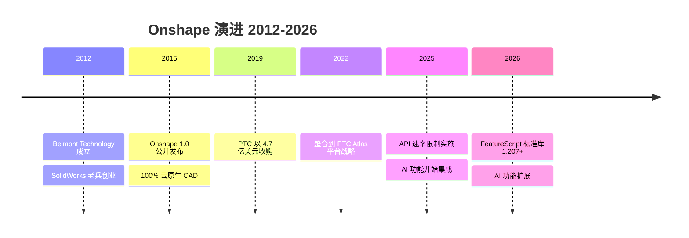
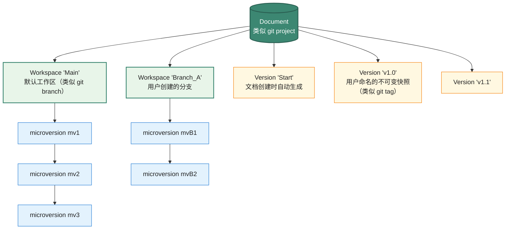

# Onshape (REST + FeatureScript) API 设计深度剖析

> 文档 3.4｜厂商深度剖析系列｜通用 CAD 平台 API 设计哲学
>

---

## 阅读约定

- `<sup>[类别 N]</sup>`：段落或论断的来源标注，N 对应文末参考来源编号
- `> **[推论]**`：基于已知事实的合理推断，非来自厂商或权威资料的直接陈述
- `> **[评论]**`：本报告作者的主观归纳、判断或行业观察
- ⚠️ **勘误**：对常见社区资料中事实错误的修正

来源类别：`[官方]` `[新闻]` `[百科]` `[第三方]` `[书籍]`

---

## TL;DR

- **Onshape 在样本平台中显示出明显不同的设计取向**：把"文件 + 桌面 SDK"重写为"云数据库 + REST API + 浏览器前端"。Document/Workspace/Version/Microversion 的 git 式数据模型直接受 git 启发<sup><a href="https://onshape-public.github.io/docs/api-intro/architecture/" target="_blank" rel="noreferrer">[官方 1]</a></sup>，与 SolidWorks/Inventor/Catia 等"桌面文件 + check-in/check-out PDM"形成对照。
- **FeatureScript 是 Onshape 自研的领域特定语言**<sup><a href="https://cad.onshape.com/FsDoc/" target="_blank" rel="noreferrer">[官方 2]</a></sup>：确定性、<Term def="变量、参数、返回值的类型在编译期就要确定，让“传错对象”等一类错误在运行前就被发现。是 FeatureScript 安全可读的关键。">强类型</Term>、<Term def="数值不只是数字，还带物理单位（米 / 度 / 牛顿），编译器自动校验单位换算与维度匹配，避免“角度当弧度”的事故。">单位安全</Term>、嵌入在 Onshape <Term def="代码不下发到客户端浏览器，而在 Onshape 后端服务器执行。优点：客户端轻量、版本统一；缺点：每次编辑都要往返一次网络。">服务端运行</Term>。**Onshape 自家的所有标准 feature（Extrude/Fillet/Helix 等）就是用 FeatureScript 写的**——这是"内部即外部"的极致体现。标准库以一个名为 `std` 的开源 Onshape document 的形式公开<sup><a href="https://cad.onshape.com/FsDoc/" target="_blank" rel="noreferrer">[官方 2]</a></sup>。
- **REST API 显式语义化版本嵌入 URL**：`/api/v6/parts/d/{did}/w/{wid}/e/{eid}` 形式，URL 里每个 ID 都明确（`d`=document, `w`=workspace, `v`=version, `m`=microversion, `e`=element）<sup>[官方 3]</sup>。这种<Term def="REST 风格中“路径本身表达数据语义”的设计：URL 段映射到资源层级，无需查文档就能猜对接口。">"路径即语义"</Term>设计让任何 HTTP 客户端都能轻松访问。
- **Onshape 是 PTC 旗下产品**<sup>[新闻 4]</sup>：2019 年 11 月 PTC 以 4.7 亿美元收购。在 PTC 体系内 Onshape 是"云原生 CAD/PDM 平台"，与 Creo（桌面参数化）形成互补。
- **三周一次发布节奏**<sup><a href="https://www.onshape.com/en/changelog/" target="_blank" rel="noreferrer">[官方 5]</a></sup>：Onshape 每三周向所有用户发布新功能，自动验证、即时可用——这是典型的<Term def="代码合并到主干后，自动构建 + 测试 + 部署到生产环境，无人工审批节点。SaaS 时代的主流发布模式，传统桌面软件少见。">持续部署</Term>实践。与 Autodesk/Siemens/Dassault 的年度发布节奏形成对比，**所有用户始终用同一版本**——在云原生模式下绕过了传统的"客户分散在多个版本"问题（但代价是 ISV 需持续跟进，无法停留在某稳定版本）。
- **2025-2026 重要演进**：FeatureScript 标准库版本从 1.193（2025 初）演进到 1.207+（2026 初）<sup><a href="https://www.cadsharp.com/blog/2025-onshape-featurescript-onshape-api-enhancements/" target="_blank" rel="noreferrer">[第三方 6]</a></sup>，新增 Sheet Metal Forms、Routing Curves、Constrained Surfaces from meshes/point clouds、Cosmetic Threads、Parametric Create Selection 等关键能力。
- **2025 年 API 速率限制实施**<sup><a href="https://github.com/kyle-tennison/onpy" target="_blank" rel="noreferrer">[第三方 7]</a></sup>：Onshape 引入 API <Term def="单位时间内允许的 API 调用次数上限。超过阈值后服务端返回 429 Too Many Requests，客户端需退避重试。">速率限制</Term>（个人/企业账号年度配额），结束了 API 调用免费时代。这对依赖大量 API 调用的第三方工具（如 OnPy）产生显著影响。
- **AI 集成方向（2025+）**<sup><a href="https://www.onshape.com/en/blog/ai-artificial-intelligence-cloud-native-cad-pdm-platform" target="_blank" rel="noreferrer">[新闻 8]</a></sup>：LLM-powered FeatureScript autocomplete、AI Advisor、AI 搜索、AI quick rendering、AI agents——把 AI 嵌入 CAD 工作流而非作为外挂工具。

---

## Key Findings

1. **Onshape 数据模型直接对应 git 概念**<sup><a href="https://onshape-public.github.io/docs/api-intro/architecture/" target="_blank" rel="noreferrer">[官方 1]</a></sup>：document=project, workspace=<Term def="git 中并行的开发线：从某个时间点分叉，独立提交、独立合并。Onshape 把这个概念搬到了 CAD：一个 Document 可有多个 workspace 同步存在。">branch</Term>, version=<Term def="git 中给 commit 打的不可变名字（如 v1.0），便于事后引用。Onshape 中 Version 是用户主动命名的快照，永不变。">tagged commit</Term>, microversion=<Term def="git 中一次提交：父引用 + diff + 元数据。Onshape 的 microversion 不存文件级 diff，存“定义级”变更（如“加了一个圆孔”）。">commit</Term>。Onshape 团队在公开博客中明确陈述："This mechanism is similar to (and was inspired by) what the popular software version control system git does"<sup><a href="https://www.onshape.com/en/blog/under-the-hood-how-collaboration-works" target="_blank" rel="noreferrer">[官方 9]</a></sup>。
2. **Microversion 是不可变记录**：每次编辑产生一个新 microversion，存储父微版本引用 + definition change。**旧 microversion 永不修改**——这是 Onshape 数据完整性的根基<sup><a href="https://www.onshape.com/en/blog/under-the-hood-how-collaboration-works" target="_blank" rel="noreferrer">[官方 9]</a></sup>。
3. **24 字符 ID 体系**：Document/Workspace/Element/Part 等核心 ID 都是 24 字符字符串<sup><a href="https://onshape-public.github.io/docs/api-intro/architecture/" target="_blank" rel="noreferrer">[官方 1]</a></sup>。Geometry ID（Part/Face/Edge）是变长字符串，又称 <Term def="不依赖外部状态、给定相同输入就给出相同输出的标识。Onshape 的几何 ID 是基于“特征生成历史”哈希出来的——同一份特征序列重算多少次，face/edge ID 都不变。是 Topology ID 跨 microversion 翻译的基础。">Deterministic ID</Term>。
4. **Topology ID 跨 microversion 转换**：Topology ID 在某 microversion 中定义后，可被 Onshape 翻译为当前 microversion 中的对应 ID 集合<sup><a href="https://onshape-public.github.io/docs/api-intro/architecture/" target="_blank" rel="noreferrer">[官方 1]</a></sup>。这解决了"参数化建模中拓扑命名问题"——Onshape 团队称为 <Term def="Associativity（关联性）：CAD 中下游特征自动随上游特征更新的能力。Onshape 用 Topology ID 跨 microversion 翻译机制实现。">Associativity</Term> 机制。
5. **FeatureScript 是 Part Studio 建模的基础**<sup><a href="https://cad.onshape.com/FsDoc/" target="_blank" rel="noreferrer">[官方 2]</a></sup>：标准 feature（Extrude、Fillet、Helix）就是 FeatureScript 函数，custom feature 用同一机制扩展。FeatureScript 也用于自定义 Custom Tables。
6. **FeatureScript 标准库以开源 Onshape document 形式公开**<sup><a href="https://cad.onshape.com/FsDoc/" target="_blank" rel="noreferrer">[官方 2]</a></sup>：document 名为 `std`，可在 Onshape 中直接打开查看源代码。这是"开源"在 Onshape 平台上的特殊形式。
7. **REST API 端点路径包含完整上下文**：例如 `/api/v6/partstudios/d/{did}/w/{wid}/e/{eid}/features` 表示"在文档 did 的工作区 wid 的元素 eid 上获取 feature 列表"<sup>[官方 3]</sup>。
8. **Glassworks API Explorer 是浏览器内 API 测试工具**<sup><a href="https://cad.onshape.com/glassworks/explorer" target="_blank" rel="noreferrer">[官方 10]</a></sup>：URL 形式为 `https://cad.onshape.com/glassworks/explorer`，企业账号有专用 URL `https://companyName.onshape.com/glassworks/explorer`<sup><a href="https://cad.onshape.com/glassworks/explorer" target="_blank" rel="noreferrer">[官方 10]</a></sup>。
9. **App Store 是云原生扩展生态**<sup><a href="https://onshape-public.github.io/docs/" target="_blank" rel="noreferrer">[官方 11]</a></sup>：扩展作为云应用集成（不是下载插件），通过 <Term def="OAuth 2.0：业界标准的“用户授权第三方访问自己账号”协议（不暴露密码）。Google Sign-In / GitHub OAuth 都是它。">OAuth 2.0</Term> 与 Onshape 用户账号关联。
10. **官方 Python 客户端**：`onshape-client` 是社区维护的官方 Python 客户端<sup>[第三方 12]</sup>。第三方还有 OnPy 等高层 Python 包装<sup><a href="https://github.com/kyle-tennison/onpy" target="_blank" rel="noreferrer">[第三方 13]</a></sup>。

---

## 一、历史背景与所有权变迁



### 1.1 创始团队与 SolidWorks 渊源

Onshape 的核心创始团队来自 SolidWorks——CEO Jon Hirschtick 是 SolidWorks 的联合创始人之一<sup><a href="https://en.wikipedia.org/wiki/Onshape" target="_blank" rel="noreferrer">[百科 14]</a></sup>。这种"老兵重做新平台"的背景在 CAD 行业具有特殊意义。

> **[评论]** Hirschtick 团队在 SolidWorks 时代深刻理解"桌面 CAD + 文件锁定 + PDM 痛苦"的全部问题。Onshape 不是"把 SolidWorks 搬到云上"，而是基于这些痛苦的反思**重写数据模型**——从根本上消除文件锁定、版本冲突、本地工作不同步等问题。本报告未在 Onshape 官方文档中找到对该设计动机的明确陈述，但创始团队公开演讲与博客中多次提及这一思路。

### 1.2 时间线

| 年份 | 事件 |
|---|---|
| 2012 | Onshape 公司成立（最初名 "Belmont Technology"） |
| 2015 | Onshape 1.0 公开发布<sup><a href="https://en.wikipedia.org/wiki/Onshape" target="_blank" rel="noreferrer">[百科 14]</a></sup> |
| 2019 年 11 月 | **PTC 以 4.7 亿美元收购 Onshape**<sup>[新闻 4]</sup> |
| 2022+ | Onshape 整合到 PTC Atlas / Atlas Platform 战略 |
| 2025 | API 速率限制实施<sup><a href="https://github.com/kyle-tennison/onpy" target="_blank" rel="noreferrer">[第三方 7]</a></sup>；AI 功能开始集成 |
| 2026 | FeatureScript 标准库 1.207+；AI 功能扩展 |

### 1.3 PTC 收购后的战略定位

PTC 在收购公告中明确<sup>[新闻 4]</sup>：Onshape 是 PTC 的 SaaS 战略基石，与 Creo（传统桌面参数化）形成互补。

> **[评论]** 这种"两条产品线"策略在 CAD 厂商中并不罕见——Siemens 同时拥有 NX（高端桌面）、Solid Edge（中端桌面）、NX X（云）；Dassault 拥有 SolidWorks、CATIA、3DEXPERIENCE。但 PTC 的 Creo + Onshape 组合特别在于 Onshape 不是 Creo 的"云版本"，而是独立架构的产品——这种独立性可能是 Hirschtick 团队保留 Onshape 工程文化的条件。

---

## 二、API 整体架构：双轨设计（REST + FeatureScript）

Onshape 的 API 分两个清晰的轨道<sup><a href="https://onshape-public.github.io/docs/api-intro/architecture/" target="_blank" rel="noreferrer">[官方 1]</a><a href="https://cad.onshape.com/FsDoc/" target="_blank" rel="noreferrer">[官方 2]</a></sup>：

```
┌────────────────────────────────────────────────────────┐
│ REST API (HTTP/JSON, 外部集成)                          │
│ /api/v6/...                                             │
│ - 文档管理、数据导出、批量自动化                          │
│ - OAuth 2.0 认证                                        │
│ - 50+ endpoints                                         │
└────────────────────────────────────────────────────────┘

┌────────────────────────────────────────────────────────┐
│ FeatureScript (DSL, 几何内部扩展)                        │
│ - 在 Onshape 服务端运行                                  │
│ - 定义 Part Studio 自定义 feature                        │
│ - 与几何引擎深度集成                                      │
│ - 标准库 std document 公开可读                            │
└────────────────────────────────────────────────────────┘
```

> **[评论]** 这种"REST 处理数据 + FeatureScript 处理几何"的双轨清晰区分了两类扩展场景——外部应用（ERP/PLM 集成、批量处理、BOM 导出）走 REST，内部建模（custom feature、参数化形状库）走 FeatureScript。这种关注点分离比 SolidWorks 那种"COM API 既做数据又做几何"的混合方式更清晰。

### 2.1 与传统 CAD API 哲学的根本差异

| 维度 | 传统桌面 CAD（SolidWorks/Inventor/Catia） | Onshape |
|---|---|---|
| API 形态 | COM/DLL，本地进程内调用 | REST，跨网络调用 |
| 数据 | 本地文件 + PDM 服务器 | 云数据库（无文件） |
| 版本 | 文件 check-in/check-out + 命名规则 | git 式 microversion + branch + version |
| 认证 | 本地用户登录 + PDM 权限 | OAuth 2.0 + API Keys |
| 部署 | 桌面安装 + 网络共享 | 浏览器即用 |
| 多用户 | 文件锁定 + 串行编辑 | 实时多人协同（实时同步 microversion） |

---

## 三、核心数据模型：git 式四层

### 3.1 Document → Workspace → Version → Microversion

Onshape 数据模型的四层结构<sup><a href="https://onshape-public.github.io/docs/api-intro/architecture/" target="_blank" rel="noreferrer">[官方 1]</a><a href="https://www.onshape.com/en/blog/under-the-hood-how-collaboration-works" target="_blank" rel="noreferrer">[官方 9]</a></sup>：



### 3.2 git 类比的官方陈述

Onshape 工程团队在博客中明确陈述<sup><a href="https://www.onshape.com/en/blog/under-the-hood-how-collaboration-works" target="_blank" rel="noreferrer">[官方 9]</a></sup>：

> "This mechanism is similar to (and was inspired by) what the popular software version control system git does, with microversions corresponding to git 'commits' and workspaces corresponding to branches."

Onshape 文档中的概念映射表<sup><a href="https://onshape-public.github.io/docs/api-intro/architecture/" target="_blank" rel="noreferrer">[官方 1]</a></sup>：

| Onshape 概念 | Git 概念 |
|---|---|
| Document | Project |
| Workspace | Branch |
| Version | Tagged commit |
| Microversion | Commit |
| Branch and merge | Branch and merge |

⚠️ Onshape 文档明确警告："this is not a direct mapping, and the implementation of the concepts is very different"<sup><a href="https://onshape-public.github.io/docs/api-intro/architecture/" target="_blank" rel="noreferrer">[官方 1]</a></sup>。例如 Onshape 的 microversion 不是文件级 diff 而是定义级 diff。

### 3.3 Microversion 的不可变性

每个 microversion<sup><a href="https://www.onshape.com/en/blog/under-the-hood-how-collaboration-works" target="_blank" rel="noreferrer">[官方 9]</a></sup>：
- 存储**父 microversion 引用** + **definition change**（增量定义变化）
- 一旦创建**永远不修改**
- 工作空间记录"当前 microversion 指针"
- 工作空间编辑 = 创建新 microversion + 推进指针

> **[推论]** 这种"不可变 + 父引用"结构与 git 的 commit 对象高度相似。优势：(1) 数据完整性较强，(2) 时间旅行（restore to any microversion）天然支持，(3) collaborative undo 可只撤销自己的更改而保留协作者的工作。本报告基于 Onshape 公开博客的描述归纳，具体存储实现细节未公开。

### 3.4 多用户协同的根本机制

> **[评论]** 这是 Onshape 数据模型在协同冲突处理维度上较精巧的设计：当 User 1 加洞、User 2 加圆角时，Onshape 工程博客明确说明<sup><a href="https://www.onshape.com/en/blog/under-the-hood-how-collaboration-works" target="_blank" rel="noreferrer">[官方 9]</a></sup>：
> 
> "1. User 1 adds a hole 2. User 2 adds a fillet 3. User 1 can undo the hole without affecting the other user's fillet"
> 
> 实现机制：User 1 的 undo 不是"回退到包含圆角但没有洞的早期 microversion"——这种 microversion 不存在——而是**在最新 microversion 之上应用"删除洞"的反向变更**，产生一个新 microversion。这种细粒度的协作 undo 在传统文件式 CAD 中几乎不可能实现。

### 3.5 Topology ID（Deterministic ID）

参数化建模的著名问题：当上游几何变化时，下游 feature 引用的 face/edge/vertex 可能消失或重新编号——这就是"拓扑命名问题"。

Onshape 通过 **Topology ID**（也叫 Deterministic ID）解决<sup><a href="https://onshape-public.github.io/docs/api-intro/architecture/" target="_blank" rel="noreferrer">[官方 1]</a></sup>：
- 每个 face/edge/vertex 有变长字符串 ID
- ID 在某 microversion 中定义后，可被翻译到任何后续 microversion
- 这种翻译机制称为 **Associativity**

> **[评论]** 拓扑命名是 CAD 历史 30 年的难题，SolidWorks/Inventor/Catia 都通过各自机制部分解决（如 face 名称重映射启发式）。Onshape 把这个问题从一开始就作为"一等公民"设计——Topology ID 直接暴露在 API 中，FeatureScript 中所有几何引用都通过它工作。这是云原生重写的优势：可以重新审视每一个老问题的根源。

---

## 四、REST API 设计：URL 即语义

### 4.1 显式 ID 嵌入

Onshape REST API 的 URL 形式<sup>[官方 3]</sup>：

```
GET /api/v6/parts/d/{did}/w/{wid}
GET /api/v6/parts/d/{did}/v/{vid}
GET /api/v6/parts/d/{did}/m/{mvid}
```

每个路径段含义：
- `d/{did}`：document ID
- `w/{wid}`：workspace ID
- `v/{vid}`：version ID
- `m/{mvid}`：microversion ID
- `e/{eid}`：element ID（在 document 内的具体 element 如 Part Studio、Assembly、Drawing）

> **[评论]** 这种"路径即语义"设计让人一眼就能看出"我在请求哪个 document 的哪个 workspace 的哪个 element"。比 RESTful 风格中常见的 query parameter 设计（如 `?did=...&wid=...`）更清晰、更便于 cache 与日志分析。

### 4.2 GET 与 POST 的语义差异

> "while in general the GET methods of the API can read from a version, microversion, or workspace, the POST methods generally require a workspace, and create a new microversion when data is written to the document."<sup><a href="https://onshape-public.github.io/docs/api-intro/architecture/" target="_blank" rel="noreferrer">[官方 1]</a></sup>

- **GET**：可读 workspace/version/microversion 任一上下文
- **POST**（写入）：必须指定 workspace，自动创建新 microversion

这种设计使得"读历史快照"与"写当前工作"的语义清晰分离。

### 4.3 API 版本号

REST API 当前使用 v6 版本（截至 2025-2026）。

> **[推论]** Onshape 团队对 API URL 中嵌入语义化版本号（v1/v6 等）的承诺，使得 ISV 可以在新版本上线后继续使用旧版本（如果旧版本未弃用），降低升级风险。这种"长期向后兼容"的承诺隐含在 URL 设计中。本报告未在 Onshape 官方文档中找到对该承诺的明确文字陈述。

### 4.4 主要 API 分组

根据 Onshape 开发者文档<sup><a href="https://onshape-public.github.io/docs/" target="_blank" rel="noreferrer">[官方 11]</a></sup>，主要 API 包括：

- **Documents**：文档创建/复制/移动
- **Workspaces / Versions / Microversions**：版本管理
- **Part Studio**：feature 列表、tessellation、几何查询
- **Assembly**：装配关系、mate 操作
- **Drawing**：工程图、视图操作
- **Translations**：导出 STEP/IGES/STL/DXF/PDF/glTF 等
- **App Elements**：自定义云应用数据存储
- **Metadata**：属性、BOM
- **Releases / Workflow**：发布管理（Professional/Enterprise）

---

## 五、FeatureScript：内嵌 DSL

### 5.1 设计哲学

FeatureScript 是 Onshape 自研的领域特定语言<sup><a href="https://cad.onshape.com/FsDoc/" target="_blank" rel="noreferrer">[官方 2]</a></sup>，关键设计选择：

- **从零设计而非借用现有语言**：不是 JavaScript/Python/Lua 的方言
- **类型系统针对 3D 数学**：内建 Vector、Plane、Length、Angle 等类型
- **单位安全**：`1 * meter + 1 * inch` 自动单位转换；不能加 `1 * meter + 1 * second`（编译错误）
- **确定性求值**：相同输入永远产生相同输出（重要：这使得 microversion 重放可靠）
- **服务端执行**：在 Onshape 几何引擎进程内运行，不通过网络往返

### 5.2 FeatureScript 标准库即开源

⭐ **关键设计**：Onshape 自家的所有标准 feature（Extrude、Fillet、Helix 等）就是用 FeatureScript 写的<sup><a href="https://cad.onshape.com/FsDoc/" target="_blank" rel="noreferrer">[官方 2]</a></sup>：

> "The standard feature types in Onshape (like Extrude, Fillet, and Helix) are already written as FeatureScript functions by our developers."<sup><a href="https://cad.onshape.com/FsDoc/" target="_blank" rel="noreferrer">[官方 2]</a></sup>

> "The Onshape Standard Library is open-source and freely viewable in a public Onshape document named 'std'. Viewing the library's source is often useful for finding examples of functions and types in action."<sup><a href="https://cad.onshape.com/FsDoc/" target="_blank" rel="noreferrer">[官方 2]</a></sup>

> **[评论]** 这是"内部即外部"哲学的极致体现——Onshape 的工程师与第三方 ISV 用同一套工具、同一个语言、同一份标准库。这种对称性在 CAD 业界极其罕见：传统 CAD 厂商通常有"内部 API"（自家用）和"外部 API"（公开）两套，外部 API 是内部能力的子集。Onshape 通过 FeatureScript 取消了这种割裂。

### 5.3 自定义 feature 示例

```
FeatureScript 1234;  // 标准库版本声明
import(path : "onshape/std/geometry.fs", version : "1234.0");

annotation { "Feature Type Name" : "My Hexagonal Hole" }
export const myHexHole = defineFeature(function(context is Context, id is Id, definition is map)
    precondition
    {
        // 定义参数 UI
        annotation { "Name" : "Hole diameter" }
        isLength(definition.holeDiameter, LENGTH_BOUNDS);
        
        annotation { "Name" : "Faces to drill" }
        definition.targetFaces is Query;
    }
    {
        // 实现几何操作
        var faceQuery = definition.targetFaces;
        var sketchPlane = qFaceClosestToPoint(faceQuery, vector(0, 0, 0) * meter);
        
        // ... 创建草图、挤出切除等几何操作 ...
    });
```

关键语法元素：
- `FeatureScript 1234;`：标准库版本声明（每次发布递增）
- `precondition`：UI 参数声明，自动生成对话框
- `isLength(..., LENGTH_BOUNDS)`：类型 + 边界约束
- `Query`：几何查询的类型（Topology ID 的高层抽象）
- `vector(...) * meter`：单位安全的向量

### 5.4 标准库版本演进（2025–2026）

根据社区跟踪<sup><a href="https://www.cadsharp.com/blog/2025-onshape-featurescript-onshape-api-enhancements/" target="_blank" rel="noreferrer">[第三方 6]</a></sup>，2025 年 FeatureScript 标准库的关键演进：

| 版本 | 新增能力 |
|---|---|
| 1.193 | Sheet Metal Forms（钣金成型） |
| 1.194 | Wrap 增强（支持锥形面） |
| 1.195 | Routing Curves（3D 线缆/管路）；Constrained Surfaces from meshes/point clouds；Cosmetic Threads |
| 1.198 | Replace Face 多面选择 |
| 1.200 | Drawing Surface Finish Symbols API |
| 1.203 | **Parametric Create Selection 查询变量类型**（让 feature 智能选择执行中创建的几何）；Drawing Views API；Centermarks API |
| 1.207 | reportFeatureWarning 自定义消息支持 |

> **[评论]** 1.203 的 "Parametric Create Selection" 是 2025 年最重要的改进——之前 custom feature 只能选择已有几何，现在可以"先创建再选择"，大幅扩展了参数化建模的可能性。

### 5.5 FeatureScript 与 REST API 的关系

FeatureScript 在服务端运行，但可通过 REST API 触发<sup><a href="https://onshape-public.github.io/docs/" target="_blank" rel="noreferrer">[官方 11]</a></sup>：

```
POST /api/v6/partstudios/d/{did}/w/{wid}/e/{eid}/features
Content-Type: application/json

{
  "feature": {
    "type": 134,
    "typeName": "BTMFeature",
    "message": {
      "featureType": "myHexHole",
      "name": "My Custom Feature 1",
      "parameters": [...]
    }
  }
}
```

这种"FeatureScript 定义 + REST 调用"的模式让外部应用可以远程驱动 Onshape 的参数化建模。

---

## 六、Glassworks API Explorer 与开发者体验

### 6.1 Glassworks：浏览器内 API 测试工具

Glassworks 是 Onshape 提供的浏览器内交互式 API 文档<sup><a href="https://cad.onshape.com/glassworks/explorer" target="_blank" rel="noreferrer">[官方 10]</a></sup>：

- URL：`https://cad.onshape.com/glassworks/explorer`
- 企业账号：`https://companyName.onshape.com/glassworks/explorer`
- 登录后可直接在浏览器中调用任何 API endpoint
- 自动填充用户的 OAuth token

> **[评论]** Glassworks 是 API 开发者体验的重要组成部分——比传统的"读 PDF 文档 + Postman 手动构造请求"流程友好得多。这与 SketchUp 的 Ruby Console 类似（即时反馈循环），但定位于 REST API 而非脚本语言。

### 6.2 客户端库

- **Python**：`onshape-client`（官方推荐<sup>[第三方 12]</sup>，社区维护）
- **JavaScript**：`onshape-typescript-fetch`（官方）
- **第三方 Python**：OnPy（高层 Python 包装<sup><a href="https://github.com/kyle-tennison/onpy" target="_blank" rel="noreferrer">[第三方 13]</a></sup>）

OnPy 项目 README 中提到的典型用法<sup><a href="https://github.com/kyle-tennison/onpy" target="_blank" rel="noreferrer">[第三方 13]</a></sup>：

> "OnPy bridges this gap by interfacing with Onshape's APIs to create designs equivalent to those made in the web UI."

> **[评论]** OnPy 把 Onshape 当成"远程几何引擎"，从 Python 脚本远程驱动建模——这种用法适合参数化设计、批量生成等场景。但需要注意 2025 年起的 API 速率限制可能影响大规模使用<sup><a href="https://github.com/kyle-tennison/onpy" target="_blank" rel="noreferrer">[第三方 7]</a></sup>。

### 6.3 开发者文档

主要文档资源<sup><a href="https://onshape-public.github.io/docs/" target="_blank" rel="noreferrer">[官方 11]</a></sup>：
- 官方文档站：`https://onshape-public.github.io/docs/`
- FeatureScript 文档：`https://cad.onshape.com/FsDoc/`
- Onshape Architecture 指南
- App Store 文档

---

## 七、App Store：云原生扩展生态

### 7.1 与传统 CAD 插件的区别

Onshape App Store<sup><a href="https://onshape-public.github.io/docs/" target="_blank" rel="noreferrer">[官方 11]</a></sup>的关键差异：

| 维度 | 传统 CAD（AutoCAD App Store / SolidWorks Solution Partner） | Onshape App Store |
|---|---|---|
| 部署 | 用户下载 .arx/.dll/.swp 安装到本地 | 云端订阅，OAuth 关联账号 |
| 更新 | 用户主动升级 | 服务商更新即生效 |
| 数据流 | 插件读写本地文件 | 应用通过 REST API 读写云数据 |
| 隔离 | 在 CAD 进程内运行（崩溃可能导致 CAD 崩溃） | 独立云服务（无侵入性） |
| 跨平台 | 受限于 CAD 平台 | 任何 Web 应用形态 |

### 7.2 OAuth 2.0 集成

Onshape 应用通过 OAuth 2.0 与用户账号关联<sup><a href="https://onshape-public.github.io/docs/" target="_blank" rel="noreferrer">[官方 11]</a></sup>。开发者：
1. 在 Onshape Developer Portal 注册应用
2. 获得 client_id / client_secret
3. 实现 OAuth 2.0 authorization code flow
4. 用户授权后获得 access token，可代表用户调用 API

### 7.3 典型应用类型

集成应用（来自 Onshape 官网<sup><a href="https://www.onshape.com/en/features/integrations" target="_blank" rel="noreferrer">[官方 15]</a></sup>）：

- **渲染**：KeyShot、Cycles、Render Studio
- **仿真**：SimScale、Onshape Simulation
- **CAM**：CAMWorks、Manufacturing Studio
- **PLM**：Aras Innovator、Propel
- **ERP**：NetSuite、SAP integrations
- **协作可视化**：OnDisplay

---

## 八、2025 API 速率限制：免费时代结束

### 8.1 速率限制实施

⭐ **2025 年的重要变化**：Onshape 引入 API 速率限制<sup><a href="https://github.com/kyle-tennison/onpy" target="_blank" rel="noreferrer">[第三方 7]</a></sup>。

OnPy 项目 README 中的提醒：

> "In 2025, Onshape introduced rate limits to encourage users to limit their API traffic. This project, along with many others, was built before these rate limits were put in place. As a consequence, it makes few efforts to cache/limit API invocations, meaning that using this package will likely cause the user to reach their daily or annual quota of API calls very quickly."<sup><a href="https://github.com/kyle-tennison/onpy" target="_blank" rel="noreferrer">[第三方 7]</a></sup>

### 8.2 影响

- **个人账号**有日/年配额
- **企业账号**有更高配额
- **批量自动化场景**（如每晚跑 1000 次 BOM 导出）需重新规划
- **依赖大量 API 调用的工具**（如 OnPy）需要实现 caching/throttling

> **[评论]** 这是云 SaaS 自然演化阶段——免费 API 不可持续，需要通过配额引导合理使用。Autodesk APS 早就有 cloud-credit 计费，Onshape 跟上了行业惯例。但对早期建立的免费工具生态会产生显著重组——一些围绕"无限 API 调用"假设的工具需要重写。

---

## 九、AI 集成（2025+）

### 9.1 AI 战略方向

Onshape（PTC）在 2025-2026 年公开宣布的 AI 集成方向<sup><a href="https://www.onshape.com/en/blog/ai-artificial-intelligence-cloud-native-cad-pdm-platform" target="_blank" rel="noreferrer">[新闻 8]</a></sup>：

| AI 功能 | 描述 |
|---|---|
| **AI Advisor** | 应用内 AI 助手，回答用户问题 |
| **LLM-powered FeatureScript autocomplete** | 在 Feature Studio 编辑器中提供 AI 自动补全 |
| **AI-powered search** | 基于 AI 生成的模型描述进行搜索（不依赖文件名/元数据） |
| **AI quick rendering** | 快速 AI 渲染 |
| **Replicate annotations** | AI 辅助批注复制 |
| **AI agents** | 可定制 AI 代理，如团队成员般协作 |

PTC 公开博客中的陈述<sup><a href="https://www.onshape.com/en/blog/ai-artificial-intelligence-cloud-native-cad-pdm-platform" target="_blank" rel="noreferrer">[新闻 8]</a></sup>：

> "By bringing AI assistance directly into the Feature Studio environment, Onshape aims to make custom feature creation faster and more approachable. Engineers won't need to be FeatureScript experts to get started."

> **[评论]** Onshape 的 AI 战略与 Bentley iTwin、Autodesk APS 类似——把 AI 嵌入工作流而非作为外挂。但 Onshape 的独特优势是其"云原生 + 数据完整性 + git 式版本"提供了 AI 训练与执行的天然基础设施：(1) 所有用户的设计在云端，AI 可基于使用模式持续学习（前提是合规授权），(2) microversion 时间线天然适合训练"设计意图理解"模型，(3) FeatureScript 的强类型 + 单位安全使 LLM 生成的代码可被静态验证。

### 9.2 与传统 CAD AI 的差异

> **[推论]** AI 集成对 Onshape 的优势：(1) 任何 AI 改进对所有用户即时可用（三周一次发布），(2) FeatureScript 的形式化语义使 LLM 生成的代码更可靠，(3) 云端执行让 AI 不需要 round-trip 到客户端。这些是云原生 CAD 相对桌面 CAD 在 AI 时代的天然优势。本报告对此优势的判断属推论，未经定量验证。

---

## 十、独特设计哲学提炼

> **[评论]** 本章为本报告作者对 Onshape API 设计哲学的归纳，不是 Onshape/PTC 官方陈述。

### 10.1 "云原生重写"而非"上云迁移"

Onshape 不是"把 SolidWorks 搬到浏览器"——它从数据模型到 API 全部重写。这种激进重构的代价是 30+ 年生态包袱无法继承，但回报是消除了所有"文件 + PDM"的根本痛苦。

### 10.2 git 式数据模型在样本中较罕见

把 git 的 commit/branch/merge 映射到 CAD 数据，是 Onshape 在样本平台中较少见的概念取向。这种映射不是表面的"加个版本号"，而是从存储层重写——microversion 不可变、definition change 增量存储、collaborative undo 等都从此设计中天然导出。**[证据等级 B]** 是否在更广 CAD 业界中也较罕见，需结合本系列未覆盖的平台进一步验证。

### 10.3 "FeatureScript 内部即外部"的对称性

Onshape 工程师与第三方 ISV 用同一语言、同一标准库——这种对称性减弱了"内部 API 比外部 API 强大"的常见割裂。代价是 FeatureScript 需要专门设计（不是借用 Python/JS），学习成本不低；但收益是生态质量的提升。

### 10.4 "URL 即语义"的 REST 设计

`/api/v6/parts/d/{did}/w/{wid}/e/{eid}` 形式让 API 路径自带完整上下文。这种显式语义化设计让 API 学习曲线大幅降低——读路径就懂含义。

### 10.5 "三周一次发布 + 单一版本"

所有用户始终用同一版本，三周一次发布所有功能——在云原生模式下绕过了"客户用旧版本，新功能不能用"的传统 CAD 痛苦。但代价是 ISV 需持续跟进（不能停留在某个稳定版本）。

---

## 十一、启示与争议

### 11.1 对架构师的启示

> **[评论]** 以下为本报告作者归纳的启示。

1. **"重写"路径与"迁移"路径的取舍**：Onshape 选择重写数据模型而非迁移老 SDK 上云。今天若新做云原生 CAD 平台，重写虽然成本高，但获得的设计自由度可能值得。但"必须重写"不是普遍规律——是否选重写需结合客户基础与商业战略。
2. **git 模型在工程数据中的应用**：不只是 CAD——任何"协作 + 版本 + 历史 + 分支"的工程数据都可借鉴 microversion 思路。Bentley iTwin 的 ChangeSet 也是同源思想。
3. **DSL 在特定领域值得投资**：FeatureScript 的强类型 + 单位安全 + 确定性是 Python/JS 通用语言难以达到的。如果领域有强语义需求（几何、电路、流体），可考虑设计 DSL 而非借用通用语言。但 DSL 投资门槛高，需评估学习成本对生态接受度的影响。
4. **REST URL 携带语义的设计选择**：路径中嵌入 `/d/{did}/w/{wid}` 比 query parameter 清晰得多——这是 Onshape 在样本中表现出的设计取向。
5. **API Explorer 是开发者体验的支柱之一**：Glassworks 的浏览器内交互式文档大幅降低 API 学习门槛。新 API 平台可考虑把"可立即试"作为基础设施。
6. **速率限制是 SaaS 长期化的常见过程**：2025 年实施速率限制不是错误而是成熟——免费 API 长期不可持续，建议早做配额规划。
7. **AI 集成与云原生架构的契合**：FeatureScript 的形式化 + 云端执行 + 所有数据在云 = AI 时代的较好适配。这可能是 Onshape 长期相对桌面 CAD 的潜在优势之一——但具体演变取决于多方因素。

### 11.2 争议点

- **生态规模与桌面 CAD 的差距**：尽管设计先进，Onshape 用户规模仍远小于 SolidWorks/Inventor/AutoCAD 等。30+ 年的设计师培训基础难以快速颠覆。
- **学习 FeatureScript 的成本**：自创 DSL 意味着开发者学习成本——不能复用 Python/JS 生态库，调试工具有限。
- **完全云依赖的脆弱性**：Onshape 不能离线工作，对网络中断敏感。这在某些场景（保密车间、偏远地区、政府项目）是硬限制。
- **数据主权问题**：所有设计数据存在 Onshape 云上（部署在 AWS）。对中国大型企业、欧盟敏感行业存在合规问题。
- **PTC 整合的不确定性**：被 PTC 收购后，Onshape 是否会被拉向 Creo 体系（失去独立架构优势），还是保持独立？目前看仍独立但长期不确定。

---

## 十二、行业观察：中国市场与国产化讨论

> ⚠️ **章节定位说明**：本章内容**主要基于公开行业观察、经验判断与案例归纳，不构成市场研究结论**。所有"渗透""主流""限制"等表述应理解为**作者基于公开信息的观察印象**，而非基于市场调研机构的硬数据。重要决策应核对当前的市场调研报告（Gartner、IDC、艾瑞、易观等）。

在中国市场语境下，Onshape 的主要约束集中在两点：

- **跨境数据与合规敏感度**：所有数据存在 AWS 美国/欧洲数据中心，对中国大型企业（央国企、军工、敏感行业）的合规要求构成实际限制；跨境网络延迟也影响实时协同体验。
- **本土工作流迁移门槛**：中国机械 CAD 用户长期积累在 SolidWorks、NX、CATIA 等桌面体系中，Onshape 需要额外跨越品牌认知与工作流迁移门槛。同时中望、华天、新迪、CrownCAD 等国产厂商也在尝试云原生 CAD，Onshape 在国内云原生赛道并非唯一选项。

仍有部分中国用户采用 Onshape，主要场景是跨国团队协作、教育领域（Onshape 提供教育免费版）、创业公司（无 PDM 历史包袱）。

> **[推论]** 国产云原生 CAD 若想借鉴 Onshape 路线，常见的考虑点包括：(1) 自研几何内核或基于 Open CASCADE，(2) 解决 git 式数据模型的存储与协同实现，(3) 设计类 FeatureScript 的 DSL（或选择 Python 嵌入），(4) 解决多用户实时协同的 OT/CRDT 问题。这是较重的工程量——估计可能需要数年级别的持续投入。具体国产 CAD 项目的实际进展需以最新公开信息为准。

更广的中国市场讨论与国产化路径归纳，见文档 1 附录 A：行业观察附录。

---

## Caveats

- **Onshape 创始时间**：本报告采用 2012 年公司成立 + 2015 年公开发布的常见说法<sup><a href="https://en.wikipedia.org/wiki/Onshape" target="_blank" rel="noreferrer">[百科 14]</a></sup>。具体细节以 Onshape/PTC 官方信息为准。
- **PTC 收购金额**：4.7 亿美元来自 2019 年新闻报道<sup>[新闻 4]</sup>，最终交易价值可能因股权结构略有差异。
- **24 字符 ID 长度**：来自 Onshape 官方 Architecture 文档<sup><a href="https://onshape-public.github.io/docs/api-intro/architecture/" target="_blank" rel="noreferrer">[官方 1]</a></sup>，未来格式可能变化。
- **Microversion 实现细节**：本报告基于 Onshape 公开博客<sup><a href="https://www.onshape.com/en/blog/under-the-hood-how-collaboration-works" target="_blank" rel="noreferrer">[官方 9]</a></sup>的描述，具体存储格式与索引结构未公开。
- **FeatureScript 标准库版本号**：2025 年版本数据来自 cadsharp.com 社区跟踪<sup><a href="https://www.cadsharp.com/blog/2025-onshape-featurescript-onshape-api-enhancements/" target="_blank" rel="noreferrer">[第三方 6]</a></sup>。Onshape 官方 changelog 未列出每个版本号的对应日期。
- **API 速率限制具体配额**：本报告未列出具体数字，因 Onshape 未公开详细配额表。OnPy README<sup><a href="https://github.com/kyle-tennison/onpy" target="_blank" rel="noreferrer">[第三方 7]</a></sup>提到"daily or annual quota"。
- **AI 功能的可用范围**：2025-2026 年 PTC 博客<sup><a href="https://www.onshape.com/en/blog/ai-artificial-intelligence-cloud-native-cad-pdm-platform" target="_blank" rel="noreferrer">[新闻 8]</a></sup>提及多项 AI 功能，但部分仍在 roadmap 中，实际发布时间需以 Onshape changelog 为准。
- **本报告未深入** 的相关主题：Onshape Enterprise 部署细节；Onshape Education / Onshape for Students 的限制；FeatureScript 调试器与开发工作流；Onshape Drawings API 的能力边界；Onshape Simulation 集成细节；Onshape CAM Studio API。这些可作后续单独研究。
- **关于"中国市场地位"的讨论** 基于公开行业观察，并非来自 Onshape/PTC 官方披露。

---

## 参考来源

### [官方]
- [官方 1] Onshape Developer Documentation, "Architecture", https://onshape-public.github.io/docs/api-intro/architecture/
- [官方 2] Onshape FeatureScript Documentation, "FeatureScript introduction", https://cad.onshape.com/FsDoc/
- [官方 3] Onshape REST API Reference (Glassworks Explorer)
- [官方 5] Onshape Changelog（三周一次发布节奏）, https://www.onshape.com/en/changelog/
- [官方 9] Onshape Engineering Blog, "Under The Hood: How Collaboration Works", https://www.onshape.com/en/blog/under-the-hood-how-collaboration-works
- [官方 10] Onshape Glassworks API Explorer, https://cad.onshape.com/glassworks/explorer
- [官方 11] Onshape Developer Documentation 主页, https://onshape-public.github.io/docs/
- [官方 15] Onshape Integrations 主页, https://www.onshape.com/en/features/integrations

### [新闻]
- [新闻 4] PTC, "PTC to Acquire Onshape" 收购公告（2019 年 11 月，4.7 亿美元）
- [新闻 8] Onshape Blog, "AI in Onshape: From First Features to AI Agents", 2025+, https://www.onshape.com/en/blog/ai-artificial-intelligence-cloud-native-cad-pdm-platform

### [百科]
- [百科 14] Wikipedia, "Onshape", https://en.wikipedia.org/wiki/Onshape

### [第三方]
- [第三方 6] cadsharp.com, "Top 2025 Onshape FeatureScript and API Enhancements", 2026-01, https://www.cadsharp.com/blog/2025-onshape-featurescript-onshape-api-enhancements/
- [第三方 7] OnPy GitHub README（关于 2025 API 速率限制）, https://github.com/kyle-tennison/onpy
- [第三方 12] onshape-client（社区 Python 客户端）
- [第三方 13] OnPy（第三方 Python 高层包装）, https://github.com/kyle-tennison/onpy

