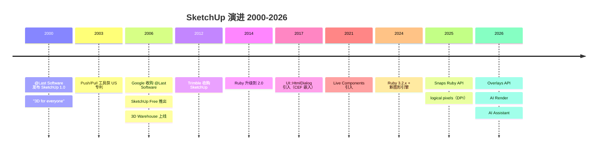
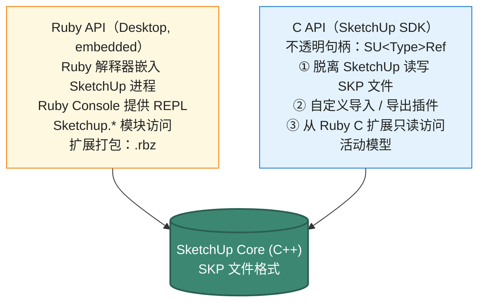

# SketchUp Ruby API 设计深度剖析

> 文档 3.7｜厂商深度剖析系列｜通用 CAD 平台 API 设计哲学
>

---

## 阅读约定

- `<sup>[类别 N]</sup>`：段落或论断的来源标注，N 对应文末参考来源编号
- `> **[推论]**`：基于已知事实的合理推断，非来自厂商或权威资料的直接陈述
- `> **[评论]**`：本报告作者的主观归纳、判断或行业观察
- ⚠️ **勘误**：对常见社区资料中事实错误的修正

来源类别：`[官方]` `[新闻]` `[百科]` `[第三方]` `[书籍]`

---

## TL;DR

- **SketchUp 是"嵌入式脚本极简哲学"的代表**：Ruby 解释器嵌入到 SketchUp 进程，Ruby Console 提供即时 REPL 体验，扩展打包格式简单（`.rbz` 即 zip + manifest）<sup><a href="https://ruby.sketchup.com/" target="_blank" rel="noreferrer">[官方 1]</a></sup>。这种"低门槛 + 高扩展性"的组合让设计师友好的脚本生态成为可能。
- **几何模型刻意停留在 face-based + 简单拓扑**：核心类是 `Sketchup::Edge` / `Sketchup::Face` / `Sketchup::Loop` / `Sketchup::Group` / `Sketchup::ComponentInstance`<sup><a href="https://ruby.sketchup.com/" target="_blank" rel="noreferrer">[官方 1]</a></sup>。**没有 NURBS、没有 B-Rep、所有 Face 是平面多边形**——这极大降低了实现复杂度，也是 SketchUp 性能传奇的来源。Solid Tools（Union/Subtract/Trim/Intersect）只对"无泄漏的封闭体积"有效。
- **17+ 类 Observer 提供高粒度事件**：`Sketchup::AppObserver / ModelObserver / EntitiesObserver / EntityObserver / SelectionObserver / ToolsObserver / ViewObserver` 等<sup><a href="https://ruby.sketchup.com/" target="_blank" rel="noreferrer">[官方 1]</a><a href="https://www.thomthom.net/software/sketchup/observers/" target="_blank" rel="noreferrer">[第三方 2]</a></sup>，比 AutoCAD Reactor / Inventor TransactionEvents 的颗粒度都更细。
- **UI::HtmlDialog 是 Web 集成的现代化路径**：SketchUp 2017 引入<sup><a href="https://ruby.sketchup.com/UI/HtmlDialog.html" target="_blank" rel="noreferrer">[官方 3]</a>[官方 6]</sup>，嵌入 Chromium Embedded Framework (CEF)，跨 Windows/Mac 行为一致。CEF 版本演进：SU2017 → 52、SU2018 → 56、SU2019 → 64、SU2021.1 → 88、SU2024 → 112<sup><a href="https://ruby.sketchup.com/UI/HtmlDialog.html" target="_blank" rel="noreferrer">[官方 3]</a></sup>。⚠️ 老版本 `UI::WebDialog`（依赖 IE/WebKit）已弃用<sup><a href="https://ruby.sketchup.com/UI/WebDialog.html" target="_blank" rel="noreferrer">[官方 4]</a></sup>。
- **C SDK 与 Ruby API 是两个独立 ABI**：C SDK 主要用于脱离 SketchUp 应用读写 SKP 文件（独立工具、第三方应用），自 SketchUp 2019.2 起也允许从 Ruby C 扩展中访问当前活动模型<sup>[官方 5]</sup>。
- **SketchUp 2025–2026 是新一代演进期**：SU 2025 引入 logical pixels（DPI scaling）和 Snaps Ruby API<sup><a href="https://help.sketchup.com/en/release-notes/sketchup-desktop-20250" target="_blank" rel="noreferrer">[官方 7]</a></sup>；SU 2026 引入 **Overlays API**（扩展可在原生工具运行时持续渲染）和 **AI Render / AI Assistant**（2026.1）<sup><a href="https://help.sketchup.com/en/release-notes/sketchup-desktop-20260" target="_blank" rel="noreferrer">[官方 8]</a><a href="https://digitalproduction.com/2025/10/10/sketchup-2026-0/" target="_blank" rel="noreferrer">[新闻 9]</a></sup>；SU 2026 要求 scene edits 用 `start_operation/commit_operation` 包装，否则会被 Extension Warehouse 拒绝<sup><a href="https://help.sketchup.com/en/release-notes/sketchup-desktop-20260" target="_blank" rel="noreferrer">[官方 8]</a></sup>。
- **Trimble 时代的战略走向**：SketchUp 自 2012 年从 Google 转让给 Trimble<sup><a href="https://en.wikipedia.org/wiki/SketchUp" target="_blank" rel="noreferrer">[百科 10]</a></sup>，逐步整合 Trimble Connect（云协作）、3D Warehouse（资产）、Modus（设计系统）。但 **SketchUp for Web 至今不支持 Ruby 扩展**<sup>[第三方 11]</sup>——这是 Trimble "保守上云" 的鲜明立场。

---

## Key Findings

1. **嵌入式 Ruby 是 SketchUp API 的核心**：标准 MRI Ruby（不是 mruby）嵌入在 SketchUp 进程中，Ruby Console 面板提供即时 REPL<sup><a href="https://ruby.sketchup.com/" target="_blank" rel="noreferrer">[官方 1]</a></sup>。Ruby 版本演进：SU2014 → 2.0 / SU2017 → 2.2.4 / SU2019 → 2.5.5 / SU2021 → 2.7.x / SU2024 → 3.2.x<sup><a href="https://ruby.sketchup.com/file.ReleaseNotes.html" target="_blank" rel="noreferrer">[官方 12]</a>[第三方 13]</sup>。
2. **核心对象层级以 `Sketchup` 模块为根**：`Sketchup.active_model` 返回 `Sketchup::Model`，从此处分叉到 `entities` / `layers`（SU2020+ 改名 tags 但 API 保留 layers）/ `materials` / `definitions` / `selection` / `styles` / `shadow_info`<sup><a href="https://ruby.sketchup.com/" target="_blank" rel="noreferrer">[官方 1]</a></sup>。
3. **Entity 类型层次清晰**：`Sketchup::Entity` → `Sketchup::Drawingelement` → `{Edge, Face, Group, ComponentInstance, Image, SectionPlane, Text, Dimension, ...}`<sup><a href="https://ruby.sketchup.com/" target="_blank" rel="noreferrer">[官方 1]</a></sup>。
4. **Tool 类用 duck-typing 实现**：自定义工具不需继承基类，只需实现回调方法（`activate / deactivate / draw / onMouseMove / onLButtonDown / onUserText` 等）<sup><a href="https://ruby.sketchup.com/Sketchup/Tool.html" target="_blank" rel="noreferrer">[官方 14]</a></sup>。`Sketchup::InputPoint` 处理推理捕捉，`view.draw / view.draw2d` 在 OpenGL 上下文中绘制临时图形。
5. **17+ 类 Observer 的颗粒度**：包括 AppObserver / ModelObserver / EntitiesObserver / EntityObserver / SelectionObserver / ToolsObserver / ViewObserver / LayersObserver / MaterialsObserver / DefinitionObserver / DefinitionsObserver / InstanceObserver / FrameChangeObserver / OptionsProviderObserver / PagesObserver / RenderingOptionsObserver / ShadowInfoObserver<sup><a href="https://www.thomthom.net/software/sketchup/observers/" target="_blank" rel="noreferrer">[第三方 2]</a></sup>。
6. **`.rbz` 扩展打包格式**：实质是 zip 包 + 单个根 `.rb` 文件 + 同名子目录<sup><a href="https://help.sketchup.com/en/extension-warehouse/extension-encryption-and-signing" target="_blank" rel="noreferrer">[官方 15]</a></sup>。Extension Warehouse 上传时执行**数字签名 + 可选加密**（`.rb` → `.rbe`，需 `Sketchup.require` 加载）<sup><a href="https://help.sketchup.com/en/extension-warehouse/extension-encryption-and-signing" target="_blank" rel="noreferrer">[官方 15]</a></sup>。
7. **C SDK（SketchUp Desktop SDK）使用不透明句柄**：`SUModelRef / SUEntitiesRef / SUFaceRef / SUEdgeRef / SUComponentDefinitionRef` 等，所有 API 都是 `SUResult SU<Type>Method(SU<Type>Ref ref, ...)` 形式<sup>[官方 5]</sup>。
8. **SU 2025 引入 Snaps Ruby API**<sup><a href="https://help.sketchup.com/en/release-notes/sketchup-desktop-20250" target="_blank" rel="noreferrer">[官方 7]</a></sup>，SU 2025.0 全面切换到 logical pixels（应对多 DPI 监视器）。
9. **SU 2026 引入 Overlays API**：扩展可在原生工具运行时持续渲染<sup><a href="https://help.sketchup.com/en/release-notes/sketchup-desktop-20260" target="_blank" rel="noreferrer">[官方 8]</a></sup>——这是对"扩展只能在自己 Tool 激活时画图"传统约束的重大突破。
10. **SU 2026.1 引入 AI Render 与 AI Assistant**<sup><a href="https://help.sketchup.com/en/sketchup-desktop-20261" target="_blank" rel="noreferrer">[官方 17]</a></sup>：标志 SketchUp 进入生成式 AI 整合阶段。

---

## 一、历史演进：从 @Last Software 到 Trimble AI 时代



### 1.1 @Last Software 时代（2000–2006）

SketchUp 由 @Last Software 创立，初衷是"3D for everyone"——面向设计师而非工程师的草图工具<sup><a href="https://en.wikipedia.org/wiki/SketchUp" target="_blank" rel="noreferrer">[百科 10]</a></sup>。

- 2000 年：SketchUp 1.0 发布<sup><a href="https://en.wikipedia.org/wiki/SketchUp" target="_blank" rel="noreferrer">[百科 10]</a></sup>
- 早期：v4.0 引入 Ruby API + 首批 Observer + Tool 类<sup><a href="https://ruby.sketchup.com/" target="_blank" rel="noreferrer">[官方 1]</a></sup>
- 2003 年：Push/Pull 工具获得美国专利 US 6,628,279<sup><a href="https://en.wikipedia.org/wiki/SketchUp" target="_blank" rel="noreferrer">[百科 10]</a></sup>

> **[评论]** Ruby 在 2000 年代初是相对小众的脚本语言（Rails 还没出来）。@Last Software 选择 Ruby 而不是 Python/JavaScript/Lua 的原因公开资料较少，但可以推测：(1) Ruby Block 语法极简对设计师友好，(2) Ruby 1.8 的内嵌门槛低于当时的 Python（GIL + 包管理混乱），(3) Visual LISP 在 AutoCAD 已证明"REPL 友好"对设计师有强吸引力。本报告未找到 @Last Software 创始团队对该选择的直接陈述。

### 1.2 Google 时代（2006–2012）

2006 年 Google 收购 @Last Software<sup><a href="https://en.wikipedia.org/wiki/SketchUp" target="_blank" rel="noreferrer">[百科 10]</a></sup>。Google 时代的关键变化：

- 2006 年：SketchUp Free 版发布（免费版本，吸引大量设计师与教育用户）
- SU6 / 7 / 8 系列：Ruby API 持续演进，但 Ruby 解释器版本停留在 1.8.6 较久<sup><a href="https://ruby.sketchup.com/file.ReleaseNotes.html" target="_blank" rel="noreferrer">[官方 12]</a></sup>
- 3D Warehouse 推出（资产分享平台）

> **[评论]** Google 时代的"免费战略"+ 3D Warehouse 让 SketchUp 在建筑/室内/景观设计教育领域形成较广泛的使用——这种用户基础至今仍是 SketchUp 的核心壁垒之一。

### 1.3 Trimble 时代（2012 至今）

2012 年 Google 将 SketchUp 转让给 Trimble<sup><a href="https://en.wikipedia.org/wiki/SketchUp" target="_blank" rel="noreferrer">[百科 10]</a></sup>。Trimble 时代的主要 API 变化：

| 年份 | 版本 | 关键 API/Runtime 变化 |
|---|---|---|
| 2013 | SU 2013 | 启用年版本号命名<sup><a href="https://ruby.sketchup.com/file.ReleaseNotes.html" target="_blank" rel="noreferrer">[官方 12]</a></sup> |
| 2014 | SU 2014 | Ruby 升级到 2.0<sup><a href="https://ruby.sketchup.com/file.ReleaseNotes.html" target="_blank" rel="noreferrer">[官方 12]</a></sup> |
| 2017 | SU 2017 | Ruby 2.2.4；**UI::HtmlDialog 引入**（嵌入 CEF 52）<sup><a href="https://ruby.sketchup.com/UI/HtmlDialog.html" target="_blank" rel="noreferrer">[官方 3]</a>[官方 6]</sup> |
| 2018 | SU 2018 | CEF 升级到 56<sup><a href="https://ruby.sketchup.com/UI/HtmlDialog.html" target="_blank" rel="noreferrer">[官方 3]</a></sup> |
| 2019 | SU 2019 | CEF 64；Ruby 2.5.5<sup><a href="https://ruby.sketchup.com/UI/HtmlDialog.html" target="_blank" rel="noreferrer">[官方 3]</a><a href="https://ruby.sketchup.com/file.ReleaseNotes.html" target="_blank" rel="noreferrer">[官方 12]</a></sup> |
| 2019.2 | SU 2019.2 | C SDK 可在 Ruby C 扩展中只读访问活动模型<sup>[官方 5]</sup> |
| 2021 | SU 2021 | Ruby 2.7.x；Live Components 引入<sup><a href="https://ruby.sketchup.com/file.ReleaseNotes.html" target="_blank" rel="noreferrer">[官方 12]</a></sup> |
| 2021.1 | SU 2021.1 | CEF 88；Ruby 2.7.2<sup><a href="https://ruby.sketchup.com/file.ReleaseNotes.html" target="_blank" rel="noreferrer">[官方 12]</a></sup> |
| 2023 | SU 2023 | persistent_id 引入；Snap entity 引入<sup><a href="https://help.sketchup.com/en/release-notes/sketchup-desktop-20250" target="_blank" rel="noreferrer">[官方 7]</a></sup> |
| 2024 | SU 2024 | Ruby 3.2.x；CEF 112；新图形引擎<sup><a href="https://ruby.sketchup.com/UI/HtmlDialog.html" target="_blank" rel="noreferrer">[官方 3]</a><a href="https://ruby.sketchup.com/file.ReleaseNotes.html" target="_blank" rel="noreferrer">[官方 12]</a></sup> |
| 2025 | SU 2025 | **Snaps Ruby API**；logical pixels（DPI scaling）；OpenSSL 3.4.1<sup><a href="https://help.sketchup.com/en/release-notes/sketchup-desktop-20250" target="_blank" rel="noreferrer">[官方 7]</a></sup> |
| 2026 | SU 2026 | **Overlays API**；非可逆变换严格校验；scene edits 需要 wrap operation<sup><a href="https://help.sketchup.com/en/release-notes/sketchup-desktop-20260" target="_blank" rel="noreferrer">[官方 8]</a></sup> |
| 2026.1 | SU 2026.1 | **AI Render**；**AI Assistant**（含 Help Assistant + Generate Object）<sup><a href="https://help.sketchup.com/en/sketchup-desktop-20261" target="_blank" rel="noreferrer">[官方 17]</a></sup> |

> **[推论]** Trimble 时代的 Ruby 版本升级节奏明显加快（v1.8.6 停留多年 vs v2.x → 3.2.x 6 年内迭代多次），可能反映了 Trimble 对开发者生态的投资策略。Ruby 升级会破坏二进制 C 扩展兼容性<sup>[第三方 13]</sup>，每次升级都需要扩展开发者重新编译。本报告未找到 Trimble 官方对该节奏的直接论述。

### 1.4 SketchUp for Web 的独立路线

SketchUp for Web 是基于 emscripten 编译的 C++ 内核 + JavaScript UI，**Ruby 扩展从未在 Web 版运行过**<sup>[第三方 11]</sup>。

> **[评论]** 这是 Trimble 的明确战略选择：Web 端不试图等同桌面端。这与 Onshape 一开始就 web-only / FeatureScript-only 的纯净相比，是一种妥协（保留桌面 Ruby 老用户生态），也可能是认识到"嵌入式 Ruby 解释器在浏览器环境中的迁移成本远高于其商业价值"。

---

## 二、API 整体架构：双轨设计

SketchUp 的 API 分为两个主要轨道<sup><a href="https://ruby.sketchup.com/" target="_blank" rel="noreferrer">[官方 1]</a>[官方 5]</sup>：



> **[评论]** "嵌入式脚本 + 独立 SDK 双轨"是相对常见的 CAD 平台架构（Autodesk Maya 也类似）。SketchUp 的特殊之处在于两轨的入门门槛不对称：Ruby 一条命令即可跑，C SDK 需要 Visual Studio + 链接 SDK lib，差距很大。这种不对称使 SketchUp 形成了"业余设计师写 Ruby 扩展、专业开发者写 C 扩展"的双层生态。

---

## 三、Ruby API：核心对象层级

### 3.1 上帝对象 + 集合代理模式

`Sketchup` 模块作为根<sup><a href="https://ruby.sketchup.com/" target="_blank" rel="noreferrer">[官方 1]</a></sup>，`Sketchup.active_model` 返回 `Sketchup::Model` 实例：

```ruby
model = Sketchup.active_model
entities = model.entities      # Sketchup::Entities (集合)
layers = model.layers          # Sketchup::Layers (SU2020+ 实质是 tags)
materials = model.materials    # Sketchup::Materials
definitions = model.definitions # Sketchup::DefinitionList
selection = model.selection    # Sketchup::Selection
styles = model.styles          # Sketchup::Styles
shadow_info = model.shadow_info # Sketchup::ShadowInfo
pages = model.pages            # Sketchup::Pages (Scenes)
```

> **[评论]** 这是典型的"上帝对象 + 集合代理"设计——不需 Database/Transaction 包装层，直接暴露给脚本。优点是入门简单（5 行代码可遍历所有 Edge），缺点是缺乏强事务边界（多步操作的 Undo/原子性需开发者手动用 `model.start_operation` / `model.commit_operation` 包装）。本报告未在 SketchUp 官方文档中找到对该设计选择的明确论述，属作者基于 API 形态的归纳。

### 3.2 Entity 类层次

```
Sketchup::Entity  (所有实体的基类)
└── Sketchup::Drawingelement  (可绘制实体)
    ├── Sketchup::Edge       (直线段)
    ├── Sketchup::Face       (平面多边形)
    ├── Sketchup::Group      (退化的匿名 ComponentDefinition)
    ├── Sketchup::ComponentInstance  (Component 实例)
    ├── Sketchup::Image      (图像)
    ├── Sketchup::SectionPlane (剖切面)
    ├── Sketchup::Text       (文本)
    ├── Sketchup::Dimension  (尺寸)
    └── Sketchup::ConstructionLine / ConstructionPoint
```

参考：官方 `Sketchup::Entity` 类文档<sup><a href="https://ruby.sketchup.com/" target="_blank" rel="noreferrer">[官方 1]</a></sup>。

### 3.3 Component / Group / Instance：核心 instancing 机制

`ComponentDefinition` 持有 `entities`，`ComponentInstance` 通过 `Geom::Transformation` 实例化<sup><a href="https://ruby.sketchup.com/" target="_blank" rel="noreferrer">[官方 1]</a></sup>。Group 是退化的匿名 ComponentDefinition（`group?` 返回 true）。

```ruby
# 创建 ComponentDefinition
defn = model.definitions.add("Chair")
defn.entities.add_face(...)  # 添加几何

# 实例化
trans = Geom::Transformation.new([10, 0, 0])
inst = model.entities.add_instance(defn, trans)
```

> **[评论]** 这是 SketchUp 的核心 instancing 机制——Profile Builder、Skimp（高模减面）、3D Warehouse 模型库的高效全靠这个。`active_path` 暴露用户钻入嵌套组件的栈，`Sketchup::InstancePath` 提供持久化路径标识。

### 3.4 Tool 类：自定义工具的 duck-typing 模式

SketchUp 的 Tool 类通过 duck-typing 实现（不需继承基类）<sup><a href="https://ruby.sketchup.com/Sketchup/Tool.html" target="_blank" rel="noreferrer">[官方 14]</a></sup>。需实现的回调包括：

```ruby
class MyTool
  def activate
    @ip = Sketchup::InputPoint.new
  end
  
  def deactivate(view); end
  
  def draw(view)
    # OpenGL 上下文中绘制临时图形
    view.draw(GL_LINES, points)
  end
  
  def onMouseMove(flags, x, y, view)
    @ip.pick(view, x, y)
    view.invalidate
  end
  
  def onLButtonDown(flags, x, y, view); end
  def onLButtonUp(flags, x, y, view); end
  def onMouseWheel(flags, delta, x, y, view); end
  def onKeyDown(key, repeat, flags, view); end
  def onSetCursor; end
  def onUserText(text, view); end
  def resume(view); end
  def suspend(view); end
  def onCancel(reason, view); end
end

# 激活工具
model.select_tool(MyTool.new)
```

事务边界：

```ruby
model.start_operation("My Operation", true)
# ... 多步几何修改 ...
model.commit_operation  # 或 abort_operation
```

> **[推论]** SketchUp 2026 起要求 scene 修改 wrap 在 `start_operation/commit_operation` 之间，否则扩展将被 Extension Warehouse 拒绝<sup><a href="https://help.sketchup.com/en/release-notes/sketchup-desktop-20260" target="_blank" rel="noreferrer">[官方 8]</a></sup>。这反映了 SketchUp 对 Undo 栈卫生的逐步严格化——可能是社区长期反馈"扩展污染 Undo 栈"问题的回应。

---

## 四、几何模型：Face-based 而非 B-Rep

### 4.1 关键设计决定

⚠️ **澄清**：SketchUp 的几何模型常被简称为 "face-based"，更精确的描述是<sup><a href="https://ruby.sketchup.com/" target="_blank" rel="noreferrer">[官方 1]</a></sup>：

- **平面多边形 Face**：所有 `Sketchup::Face` 都是平面的，由 `Sketchup::Loop`（外环 + 内环）定义
- **直线段 Edge**：所有 `Sketchup::Edge` 是两点之间的直线段
- **没有 NURBS、没有 B-Spline 曲面、没有真正的 B-Rep 拓扑**
- 曲面通过密集小三角面片近似

```ruby
# 创建 Face 的典型模式
pts = [Geom::Point3d.new(0, 0, 0),
       Geom::Point3d.new(10, 0, 0),
       Geom::Point3d.new(10, 10, 0),
       Geom::Point3d.new(0, 10, 0)]
face = model.entities.add_face(pts)

# Face 的拓扑信息
face.edges       # 边
face.outer_loop  # 外环
face.loops       # 所有环（外 + 内）
face.normal      # 法向
face.area        # 面积
```

> **[评论]** 这种"平面 B-Rep"或"polygonal mesh with topology"的退化形式极大降低了实现成本，也是 SketchUp 性能传奇（在 2000 年代初的 PC 上流畅交互）的来源。代价是高级几何能力（NURBS 曲面、参数化建模、变量化约束）需要通过扩展弥补——SubD（细分曲面）、Curviloft、Artisan 等扩展正是为此而生。

### 4.2 Solid Tools 的限制

SketchUp 的 Solid Tools（Union/Subtract/Trim/Intersect/Outer Shell/Split）只对**无泄漏的封闭体积**有效<sup><a href="https://ruby.sketchup.com/" target="_blank" rel="noreferrer">[官方 1]</a></sup>。调用 `ComponentInstance#manifold?` 检查、调用 `Sketchup::Group#split` 之类方法时若拓扑无效直接返回 `nil`。

> **[推论]** SketchUp Solid Tools 内部很可能使用 Carve 等开源 CSG 库做布尔运算，而不是真正的 ACIS/Parasolid 等价物。本报告未在 SketchUp 官方文档中找到对其布尔实现的直接陈述，属基于公开技术讨论的推断。

### 4.3 EntitiesBuilder（SU2023 引入）

SketchUp 2023 引入了批量几何 API `Sketchup::EntitiesBuilder`<sup><a href="https://ruby.sketchup.com/file.ReleaseNotes.html" target="_blank" rel="noreferrer">[官方 12]</a></sup>，用于高速注入大量边/面：

```ruby
model.entities.build do |builder|
  builder.add_face([
    Geom::Point3d.new(0, 0, 0),
    Geom::Point3d.new(10, 0, 0),
    Geom::Point3d.new(10, 10, 0)
  ])
  # ... 大量 add_edge / add_face ...
end
```

> **[评论]** 这是 SketchUp Ruby API 性能改进的关键一步——传统的 `entities.add_face` 逐个调用在百万级图元场景下极慢，EntitiesBuilder 通过批量提交大幅减少 Ruby↔C++ 边界的转换成本。

---

## 五、Observer 模式：17+ 类高粒度事件

### 5.1 Observer 类清单

根据社区资料整理<sup><a href="https://www.thomthom.net/software/sketchup/observers/" target="_blank" rel="noreferrer">[第三方 2]</a><a href="https://ruby.sketchup.com/" target="_blank" rel="noreferrer">[官方 1]</a></sup>，SketchUp 提供约 17 类 Observer：

| Observer 类 | 触发场景 |
|---|---|
| `Sketchup::AppObserver` | 应用启动/退出、新建/打开模型 |
| `Sketchup::ModelObserver` | 模型保存、变换更新 |
| `Sketchup::EntitiesObserver` | 实体集合的添加/移除 |
| `Sketchup::EntityObserver` | 单个实体的修改/删除 |
| `Sketchup::SelectionObserver` | 选择集变更 |
| `Sketchup::ToolsObserver` | 工具切换 |
| `Sketchup::ViewObserver` | 视图变更 |
| `Sketchup::LayersObserver` | 图层（标签）变更 |
| `Sketchup::MaterialsObserver` | 材质变更 |
| `Sketchup::DefinitionObserver` | Component Definition 变更 |
| `Sketchup::DefinitionsObserver` | DefinitionList 集合变更 |
| `Sketchup::InstanceObserver` | ComponentInstance 变更 |
| `Sketchup::FrameChangeObserver` | 动画帧变更 |
| `Sketchup::OptionsProviderObserver` | 选项提供者变更 |
| `Sketchup::PagesObserver` | Scene Page 集合变更 |
| `Sketchup::RenderingOptionsObserver` | 渲染选项变更 |
| `Sketchup::ShadowInfoObserver` | 阴影信息变更 |

注：实际数量在不同 SketchUp 版本中略有变化，社区维护的 thomthom.net 列表是较权威参考<sup><a href="https://www.thomthom.net/software/sketchup/observers/" target="_blank" rel="noreferrer">[第三方 2]</a></sup>。

### 5.2 著名陷阱：观察者只附着在当前 Selection/Model

```ruby
# 错误做法：附着在当前 model 上
Sketchup.active_model.entities.add_observer(MyObserver.new)
# 用户新建/打开模型后，observer 不再生效

# 正确做法：用 AppObserver 监听 model 变更，重新挂载
class MyAppObserver < Sketchup::AppObserver
  def onNewModel(model)
    model.entities.add_observer(MyEntitiesObserver.new)
  end
  
  def onOpenModel(model)
    model.entities.add_observer(MyEntitiesObserver.new)
  end
end

Sketchup.add_observer(MyAppObserver.new)
```

> **[评论]** 这是 SketchUp Observer 系统的著名陷阱<sup><a href="https://www.thomthom.net/software/sketchup/observers/" target="_blank" rel="noreferrer">[第三方 2]</a></sup>，新手扩展开发者经常遇到。设计上的根本问题是 SketchUp 的 model lifecycle（新建/关闭）与 observer 绑定 lifecycle 没有自动统一——需要开发者显式管理。这种"显式生命周期"在嵌入式脚本设计中是合理选择（避免隐式 magic），但学习成本不低。

---

## 六、UI::HtmlDialog：Web 集成的现代化路径

### 6.1 引入背景与设计目标

SketchUp 2017 引入了 `UI::HtmlDialog`<sup><a href="https://ruby.sketchup.com/UI/HtmlDialog.html" target="_blank" rel="noreferrer">[官方 3]</a>[官方 6]</sup>，替代已废弃的 `UI::WebDialog`<sup><a href="https://ruby.sketchup.com/UI/WebDialog.html" target="_blank" rel="noreferrer">[官方 4]</a></sup>。

⚠️ **关键差异**：

- `UI::WebDialog`（老）：依赖系统浏览器引擎（Windows IE / Mac WebKit），跨平台行为不一致<sup><a href="https://ruby.sketchup.com/UI/WebDialog.html" target="_blank" rel="noreferrer">[官方 4]</a></sup>
- `UI::HtmlDialog`（新）：嵌入 **Chromium Embedded Framework (CEF)**，跨 Windows/Mac 行为一致<sup>[官方 6]</sup>

SketchUp 官方在 SU 2017 release notes 中如此表述：

> "One of the developer features we are most excited about for SketchUp 2017 is a new Web Dialog framework. For SketchUp 2017 we are bundling the Chromium Web Browser with the SketchUp installer. ... No more trauma from banging your head against the wall while trying to make your web pages compatible with Internet Explorer 8-11 and Safari."<sup>[官方 6]</sup>

### 6.2 CEF 版本演进

根据官方 `UI::HtmlDialog` 文档<sup><a href="https://ruby.sketchup.com/UI/HtmlDialog.html" target="_blank" rel="noreferrer">[官方 3]</a></sup>：

| SketchUp 版本 | CEF 版本 |
|---|---|
| SketchUp 2017.0 | CEF 52 |
| SketchUp 2018.0 | CEF 56 |
| SketchUp 2019.0 | CEF 64 |
| SketchUp 2021.1 | CEF 88 |
| SketchUp 2024.0 | CEF 112 |

⚠️ **对早期资料的勘误**：网络上一些早期文章可能引用了过旧的 CEF 版本。最新版本以官方 `UI::HtmlDialog` 类文档为准。

### 6.3 双向通信 API

```ruby
# Ruby 端
dialog = UI::HtmlDialog.new(
  dialog_title: "My Dialog",
  preferences_key: "my_extension.dialog",  # 需要有命名空间
  width: 600, height: 400,
  style: UI::HtmlDialog::STYLE_DIALOG
)

dialog.set_file("path/to/dialog.html")

# 注册 Ruby 回调，JS 可调用
dialog.add_action_callback("on_button_click") do |action_context, *args|
  # 处理 JS 传来的参数
  puts "Button clicked: #{args.inspect}"
end

# Ruby 调用 JS
dialog.execute_script("update_view(#{data.to_json})")

dialog.show
```

```html
<!-- JS 端 -->
<button onclick="sketchup.on_button_click('hello', 42)">Click</button>
<script>
  function update_view(data) {
    // 接收 Ruby 传来的数据
    console.log(data);
  }
</script>
```

> **[评论]** 这种"action_callback + execute_script"双向通信范式与 Electron 的 ipcRenderer/ipcMain 模式高度相似——都是把"Web 前端 + 桌面后端"的边界明确化。优点是 Ruby 端保持业务逻辑、JS 端专注 UI 渲染；缺点是异步通信增加了状态同步的复杂度（API issue tracker 中长期有 drag-and-drop 等场景的 bug 报告<sup><a href="https://github.com/SketchUp/api-issue-tracker" target="_blank" rel="noreferrer">[第三方 16]</a></sup>）。

### 6.4 Trimble Modus：UI 风格统一

Trimble 提供 **Modus** 设计系统（CSS/JS 库）<sup><a href="https://ruby.sketchup.com/UI/HtmlDialog.html" target="_blank" rel="noreferrer">[官方 3]</a></sup>，让扩展 UI 与 SketchUp 主界面观感一致。这是 Trimble 时代的"设计系统"投资——类似 Microsoft Fluent UI 或 Google Material Design 在自家产品中的角色。

---

## 七、扩展打包与分发：.rbz + Extension Warehouse

### 7.1 .rbz 格式

`.rbz` 实质是 zip 包<sup><a href="https://help.sketchup.com/en/extension-warehouse/extension-encryption-and-signing" target="_blank" rel="noreferrer">[官方 15]</a></sup>，结构：

```
my_extension.rbz (= zip)
├── my_extension.rb        # 根加载器
└── my_extension/          # 同名子目录
    ├── main.rb
    ├── tool.rb
    ├── resources/
    │   └── icons/
    └── ui/
        └── dialog.html
```

根 `.rb` 文件由 `SketchupExtension` 注册：

```ruby
# my_extension.rb
require 'sketchup.rb'
require 'extensions.rb'

module MyCompany
  module MyExtension
    extension = SketchupExtension.new(
      "My Extension",
      File.join(__dir__, "my_extension/main")
    )
    extension.version = "1.0.0"
    extension.creator = "My Company"
    extension.description = "..."
    Sketchup.register_extension(extension, true)
  end
end
```

### 7.2 数字签名与加密

Extension Warehouse 上传时执行<sup><a href="https://help.sketchup.com/en/extension-warehouse/extension-encryption-and-signing" target="_blank" rel="noreferrer">[官方 15]</a></sup>：
- **数字签名**：验证扩展完整性
- **可选加密**：`.rb` 文件可加密为 `.rbe`，需通过 `Sketchup.require` 加载（不是标准 Ruby `require`）

签名验证失败按用户的 Loading Policy 决定是否加载——这是设计师友好的"不需要写 EULA 也能商用分发"模式。

> **[评论]** 这与 ObjectARX 的"Autodesk RDS 编号注册"范式是质的差异——SketchUp 的扩展开发者不需要向 Trimble 申请任何 ID 即可商用分发，仅在上架 Extension Warehouse 时才走签名流程。这种低门槛是 SketchUp 扩展生态规模的关键。

### 7.3 SU 2026 的 Extension Warehouse 严格化

SketchUp 2026 起，Extension Warehouse 对扩展提出新的严格要求<sup><a href="https://help.sketchup.com/en/release-notes/sketchup-desktop-20260" target="_blank" rel="noreferrer">[官方 8]</a></sup>：

> "Scene changes are expected to be called between Sketchup::Model#start_operation and Sketchup::Model#commit_operation to not flood the undo stack. Extensions that don't follow this requirement will be rejected for updates or publication to the Extension Warehouse."

> **[评论]** 这是 Trimble 对扩展质量的重要管控信号——Undo 栈污染是长期影响用户体验的痛点，Trimble 选择在分发渠道层面强制执行规范，比纯文档建议有效得多。

---

## 八、C SDK：脱离 SketchUp 应用的 SKP 读写

### 8.1 设计模式

C SDK 使用不透明句柄设计<sup>[官方 5]</sup>：

```c
// 句柄类型
SUModelRef
SUEntitiesRef
SUFaceRef
SUEdgeRef
SUComponentDefinitionRef
SUMaterialRef
SUTextureRef
SUTransformationRef

// API 形式：SUResult SU<Type>Method(SU<Type>Ref ref, ...)
SUResult result = SUModelCreateFromFile(&model, "input.skp");
if (result != SU_ERROR_NONE) { /* ... */ }
```

### 8.2 三种用法

C SDK 有三种主要用途<sup>[官方 5]</sup>：

1. **脱离 SketchUp 应用读写 SKP 文件**：导入器/导出器、独立分析工具、第三方应用（如 SketchUpNET 的 C++/CLI 包装）
2. **写自定义 SketchUp 导入/导出插件**
3. **自 SketchUp 2019.2 起**：可从 Ruby C 扩展中**只读**访问当前活动模型（链接 `sketchup.lib`，不是 `SketchUpAPI.lib`）

> **[评论]** "C SDK 与 Ruby API 是两个独立的 ABI 边界"是 SketchUp 架构的关键事实——社区资料中对此常有混淆。两者各自的版本演进、API 覆盖、调用形式都不同，开发者需明确选择适合自己场景的轨道。

### 8.3 版本兼容

```c
// 保存为指定版本
SUModelSaveToFileWithVersion(model, "output.skp", SUModelVersion_SU2021);
```

SKP 文件版本枚举包含 `SUModelVersion_SU2014` 到当前版本的所有节点。

> **[推论]** Trimble 不公开 SKP 文件格式规范——本报告未找到任何公开的 SKP 二进制规范文档。这与 Bentley 公开 V8 DGN 规范、Autodesk DWG 通过 ODA 实质化开放的策略形成对比。SKP 的封闭性意味着第三方读写工具链远不如 DGN/DWG 丰富，但保护了 Trimble 的杠杆。

---

## 九、SketchUp 2025–2026：新一代演进

### 9.1 SU 2025 重点变化

根据官方 release notes<sup><a href="https://help.sketchup.com/en/release-notes/sketchup-desktop-20250" target="_blank" rel="noreferrer">[官方 7]</a></sup>：

- **Snaps Ruby API 引入**：Snap entity 在 SU2023.1 引入，SU2025 在 Ruby API 中可访问
- **Logical Pixels（DPI scaling）**：所有屏幕坐标改为 logical pixels，应对多 DPI 监视器
  ```ruby
  # 新 API
  view.device_width    # 物理像素
  UI.scale_factor(view) # 缩放因子（旧 API 现在返回 1.0 作为兼容 shim）
  ```
- **OpenSSL 升级到 3.4.1**
- **PBR 材质 API**：物理基础渲染材质属性

### 9.2 SU 2026 重点变化：Overlays API

⭐ **Overlays API 是 SU 2026 最重要的扩展能力突破**<sup><a href="https://help.sketchup.com/en/release-notes/sketchup-desktop-20260" target="_blank" rel="noreferrer">[官方 8]</a></sup>。在此之前，扩展只能在自己的 Tool 激活时绘制信息到 modeling 窗口。Overlays 允许扩展**在其他工具运行时持续渲染**——即"在用户用 Push/Pull 工具时，我的扩展仍在画分析叠加层"。

> **[评论]** 这是对 SketchUp 扩展架构的根本性扩展。原生命令运行时 ISV 扩展可"持续呈现信息、可视化分析结果"——是分析类、协作类扩展的关键基础设施。Overlays 与 AutoCAD 的 transient graphics + reactor 组合相比更声明式、更易用。

### 9.3 SU 2026 的严格化变更

- **非可逆变换严格校验**<sup><a href="https://help.sketchup.com/en/release-notes/sketchup-desktop-20260" target="_blank" rel="noreferrer">[官方 8]</a></sup>：`Geom::Transformation#inverse` 等方法在零 scale 等情况下抛 `ArgumentError`（之前是 silent failure）
- **Scene 修改强制 wrap operation**：参见 7.3 节
- **统一 IFC exporter**：合并 IFC 2x3 和 IFC 4 为单一 exporter，提供版本与层级选项

### 9.4 SU 2026.1 引入 AI

SU 2026.1 引入 SketchUp AI<sup><a href="https://help.sketchup.com/en/sketchup-desktop-20261" target="_blank" rel="noreferrer">[官方 17]</a></sup>：

- **AI Render**：从模型视口生成 photorealistic 图像（自定义 prompt 或预设）
- **AI Assistant**：含 Help Assistant（应用内引导）+ Generate Object（从文本/图像生成 3D 对象 + PBR 纹理）
- **AI Credits**：付费订阅含一定额度，超出需购买 AI 加包

> **[评论]** 这是 SketchUp 进入生成式 AI 整合阶段的标志，与 Autodesk Fusion 360 的 Generative Design、Siemens NX X 的 AI 协作类似——CAD 厂商普遍把 AI 作为 2025+ 的核心增量。但 AI 集成对 Ruby API 的影响（如何让扩展调用 AI 服务、AI 生成的几何如何与 Ruby API 交互）目前公开资料较少，本报告无法深入。

---

## 十、典型扩展案例的 API 用法

> **[评论]** 以下案例分析基于公开扩展信息与开发者社区讨论，非来自 Trimble 官方陈述。

### 10.1 Profile Builder（参数化路径建模）

- 用 `Sketchup::Tool` 自定义工具捕获路径
- 用 `Geom::PolygonMesh` 构建几何
- 用 `Sketchup::Entities#fill_from_mesh` 高速注入

### 10.2 SubD / Artisan（细分曲面）

- Ruby 调用 C 扩展（编译 .so/.bundle）
- 通过 SketchUp Live C API（SU2019.2+）只读访问当前模型
- C 扩展实现 Catmull-Clark 等细分算法

### 10.3 V-Ray for SketchUp（渲染）

- UI 层用 `UI::HtmlDialog` + 自有 React 应用
- 后端 C++ 渲染器
- 与 Ruby 通过 action_callback + C 扩展两路通信

### 10.4 Fredo6 系列（Curviloft, FredoTools 等）

- 纯 Ruby 实现
- 早期用 WebDialog，后迁移到 HtmlDialog
- 著名地用 LibFredo6 库做了一套通用 UI 抽象（社区共享）

### 10.5 Dynamic Components（SketchUp 自带）

- 参数通过 `attribute_dictionary "dynamic_attributes"` 存储
- 公式由 SketchUp 内部解释器（**不是 Ruby**）求值
- 这是无代码扩展，但灵活性远低于真 Ruby 扩展

---

## 十一、独特设计哲学提炼

> **[评论]** 本章为本报告作者对 SketchUp API 设计哲学的归纳，不是 Trimble 官方陈述。

### 11.1 "设计师友好"作为长期定位

SketchUp 的 Ruby + Face-based 选择是**长期定位**——一旦选择"设计师友好"，就放弃了 B-Rep 精度、参数化建模、变量化约束等工程级能力。这个选择决定了 SketchUp 不会在工程级机械 CAD 领域与 NX/CATIA/SolidWorks 直接竞争，但也是它在景观/室内/概念设计领域的稳固之处。

### 11.2 "嵌入式脚本极简"哲学

Ruby Console 一行代码即可跑、`.rbz` 不需厂商批准即可分发、Tool 类不需继承基类——每一处都体现"降低门槛优先于强类型保护"。这与 CATIA CAA 的"Authorized API + mkmk 校验"或 Onshape FeatureScript 的"强类型 + 单位安全"形成对比。

### 11.3 "桌面优先 + 云保守"

SketchUp for Web 的存在但不支持 Ruby 扩展<sup>[第三方 11]</sup>，反映了 Trimble 不把"上云"作为破坏性变革——保留桌面 Ruby 老用户生态优先于云原生纯净。这与 Onshape（一开始就 web-only）形成路线对比。

### 11.4 "保守上云 + 选择性 AI 整合"

SU 2026.1 的 AI 整合是 Trimble 的明确战略，但 AI 功能仍在桌面进程内运行（通过 AI Credits 调用云服务），不是把整个 SketchUp 搬到云端。这种"AI 作为辅助、非取代"的态度与 Adobe Photoshop 的 AI 整合策略相似。

---

## 十二、启示与争议

### 12.1 对架构师的启示

> **[评论]** 以下为本报告作者归纳的启示。

1. **嵌入式脚本语言选型重要**：SketchUp 选 Ruby 在 2000 年是合理的，2026 年看略尴尬（Ruby 已非主流，Python 在数据科学/教育中地位更广）。Ruby 解释器升级（2.x → 3.x）打破二进制扩展兼容性，每次升级都让 C 扩展开发者重新编译。**新平台 2026+ 选 Python 是较常见的考虑**，但具体选择仍需结合目标用户群。
2. **Observer 颗粒度决定可扩展性上限**：SketchUp 的 17+ 类 Observer 是相对较细的颗粒度，但回调泄漏与时序问题（`onTransactionStart/Commit` 与 `model.start/commit_operation` 不一致等）也提醒：**事件机制建议设计得"幂等可重入"**，否则插件之间互相伤害。
3. **几何模型的简化是一种合法选择**：SketchUp 显示了"polygonal mesh + 简单拓扑"在设计师场景下足够，且性能上有较大优势。新平台不一定要从第一天就支持 NURBS——可以先做"够用的几何 + 强扩展性"，后续按需升级。
4. **数字签名 + 友好分发是生态规模的关键**：`.rbz` 不需厂商批准即可商用 + Extension Warehouse 数字签名验证，是 SketchUp 扩展生态规模的核心设计。新平台建议不过度抬高扩展分发门槛。
5. **保守上云有时比激进上云更稳**：SketchUp for Web 不支持 Ruby 扩展是务实选择，避免了"为了上云破坏现有生态"的常见错误。

### 12.2 争议点

- **SKP 文件格式封闭**：与 DGN/DWG 形成对比，第三方读写工具链稀缺。Trimble 通过 C SDK 商业谈判分发——保护了杠杆但限制了生态半径。
- **Ruby 选择的长期价值**：随 Python 在数据科学/AI/教育的全面胜出，SketchUp 的 Ruby 选择越来越像负债。Trimble 是否会在未来引入 Python？目前无公开计划<sup>[第三方 13]</sup>。
- **HtmlDialog 跨平台 bug 长期未解**：API issue tracker 中 drag-and-drop、focus 等问题报告多年<sup><a href="https://github.com/SketchUp/api-issue-tracker" target="_blank" rel="noreferrer">[第三方 16]</a></sup>，开发者社区对 HtmlDialog 质量评价分化。
- **AI 集成的 Ruby API 透明度**：SU 2026.1 的 AI 功能对 Ruby API 开发者的可调用性目前公开资料较少。

---

## 十三、行业观察：中国市场与国产化讨论

> ⚠️ **章节定位说明**：本章内容**主要基于公开行业报告与社区观察的归纳，不构成市场研究结论**。所有"事实标准""近乎""主流"等表述应理解为**作者基于公开信息的观察印象**，而非基于市场调研机构的硬数据。重要决策应核对当前的市场调研报告（Gartner、IDC、艾瑞、易观等）。

在中国市场语境下，SketchUp 的相关观察集中在两点：

- **景观/室内/概念设计领域使用面较广**：建筑院校教学较普遍采用，本土扩展生态成熟（SUAPP、坯子库等中国本土扩展中心提供较多插件），3D Warehouse 模型海量。
- **本土在线设计软件的分流**：酷家乐、三维家等本土厂商在快速出图、电商导购场景中分流较多用户，但 SketchUp 在专业建筑院校和概念设计阶段仍占较大使用份额。SketchUp 2020 年从永久授权转型订阅制<sup><a href="https://en.wikipedia.org/wiki/SketchUp" target="_blank" rel="noreferrer">[百科 10]</a></sup>与中国设计师习惯的永久授权之间形成鸿沟，是本土在线设计软件抢占市场的窗口。

Trimble Connect（云协作）在中国市场的渗透弱于 Bentley iTwin。SketchUp 用户在中国大多仍以本地工作 + 邮件/QQ 协作为主。

更广的中国市场讨论与国产化路径归纳，见文档 1 附录 A：行业观察附录。

---

## Caveats

- **CEF 版本演进数据**已根据官方 `UI::HtmlDialog` 文档<sup><a href="https://ruby.sketchup.com/UI/HtmlDialog.html" target="_blank" rel="noreferrer">[官方 3]</a></sup>核实更新；早期资料可能引用过旧的 CEF 版本。
- **Ruby 版本演进数据**来自 SketchUp 官方 release notes<sup><a href="https://ruby.sketchup.com/file.ReleaseNotes.html" target="_blank" rel="noreferrer">[官方 12]</a></sup>；具体次版本号请参考最新文档。
- **Solid Tools 内部基于 Carve（CSG 库）的判断**属社区共识，未经 SketchUp 官方文档直接确认。
- **@Last Software 选择 Ruby 的动机**未有公开权威资料，本报告中相关推论属作者归纳。
- **SKP 文件格式规范**Trimble 未公开发布。本报告对 SKP 内部结构的描述基于 C SDK 文档与第三方逆向工程工作。
- **市场份额数据**（如 SketchUp 在景观/室内行业的占有率）来自社区观察，非严谨市场调研。
- **本报告未深入** 的相关主题：SketchUp Sefaira/Modelur 等子产品 API；LayOut（独立 2D 排版应用）的独立 API；Trimble Connect REST API 与 SketchUp 的深度集成；SketchUp Pro Studio 版本独有的 Surface Mesh / Texture Projection / Scan Essentials API 细节。
- **AI Render / AI Assistant 的 Ruby API 接口**SU 2026.1 刚发布（2025 年 10 月+），公开开发者文档仍在演化中，本报告无法深入。
- **关于"中国市场地位"的讨论** 基于公开行业报告与社区观察，并非来自 Trimble 官方披露。

---

## 参考来源

### [官方]
- [官方 1] SketchUp Ruby API Documentation, https://ruby.sketchup.com/
- [官方 3] SketchUp Ruby API, "Class: UI::HtmlDialog", https://ruby.sketchup.com/UI/HtmlDialog.html （含 CEF 版本表）
- [官方 4] SketchUp Ruby API, "Class: UI::WebDialog"（已 deprecated）, https://ruby.sketchup.com/UI/WebDialog.html
- [官方 5] SketchUp C API Documentation (Desktop SDK)
- [官方 6] SketchUp Release Notes – SU 2017（HtmlDialog 引入）, ruby.sketchup.com/file.ReleaseNotes.html
- [官方 7] SketchUp Desktop 2025.0 Release Notes, https://help.sketchup.com/en/release-notes/sketchup-desktop-20250
- [官方 8] SketchUp Desktop 2026.0 Release Notes, https://help.sketchup.com/en/release-notes/sketchup-desktop-20260
- [官方 12] SketchUp Ruby API Release Notes, https://ruby.sketchup.com/file.ReleaseNotes.html
- [官方 14] SketchUp Ruby API, "Class: Sketchup::Tool", https://ruby.sketchup.com/Sketchup/Tool.html
- [官方 15] SketchUp Help, "Extension Signing and Encryption", https://help.sketchup.com/en/extension-warehouse/extension-encryption-and-signing
- [官方 17] SketchUp Desktop 2026.1 Release Notes, https://help.sketchup.com/en/sketchup-desktop-20261

### [新闻]
- [新闻 9] DIGITAL PRODUCTION, "SketchUp 2026.0", 2025-10-10, https://digitalproduction.com/2025/10/10/sketchup-2026-0/

### [百科]
- [百科 10] Wikipedia, "SketchUp", https://en.wikipedia.org/wiki/SketchUp

### [第三方]
- [第三方 2] thomthom.net, "Google SketchUp Observer Overview", https://www.thomthom.net/software/sketchup/observers/
- [第三方 11] SketchUp Community Forum 与公开开发者讨论（关于 Web 版不支持 Ruby）
- [第三方 13] SketchUp Community Forum, "SU 2024, Windows, Ruby 3.2.5"
- [第三方 16] SketchUp api-issue-tracker GitHub Issues, https://github.com/SketchUp/api-issue-tracker

