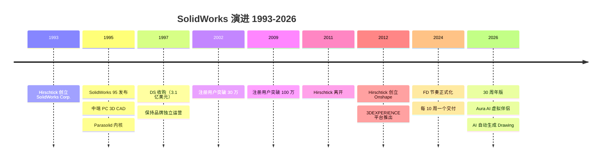
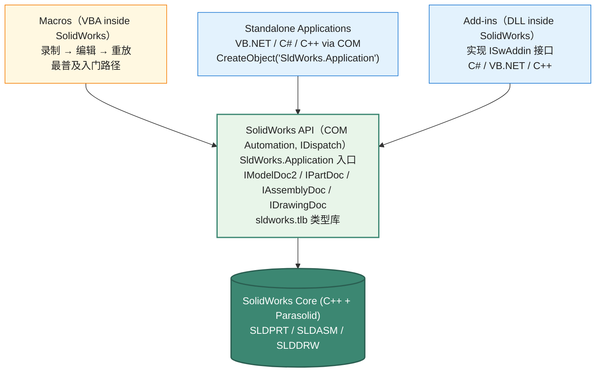

# SolidWorks API 设计深度剖析

> 文档 3.6｜厂商深度剖析系列｜通用 CAD 平台 API 设计哲学
>

---

## 阅读约定

- `<sup>[类别 N]</sup>`：段落或论断的来源标注，N 对应文末参考来源编号
- `> **[推论]**`：基于已知事实的合理推断，非来自厂商或权威资料的直接陈述
- `> **[评论]**`：本报告作者的主观归纳、判断或行业观察
- ⚠️ **勘误**：对常见社区资料中事实错误的修正

来源类别：`[官方]` `[新闻]` `[百科]` `[第三方]` `[书籍]`

---

## TL;DR

- **SolidWorks 在中端机械 CAD 中有较广泛使用**：1995 年由 MIT 出身的 Jon Hirschtick 创立，1997 年被 Dassault Systèmes 以 3.1 亿美元收购<sup><a href="https://en.wikipedia.org/wiki/SolidWorks" target="_blank" rel="noreferrer">[百科 1]</a></sup>，至今 2025 年正好 30 周年<sup><a href="https://www.goengineer.com/solidworks-2026" target="_blank" rel="noreferrer">[新闻 2]</a></sup>。它把"航空航天级 CATIA 的能力下放到中小企业能负担"作为核心战略。
- **SolidWorks API 是 COM-based 出身、向多语言开放**：核心是 `SldWorks.Application` COM 对象，外加扩展 IDispatch 双重接口。VBA 是最普及的入门路径，但 C#/VB.NET/C++ 通过 Type Library 都可访问。⚠️ 与 ObjectARX 不同的是，SolidWorks API 没有 in-process 原生 C++ SDK 这一层——所有扩展都通过 COM/Add-in 层走<sup><a href="https://help.solidworks.com/" target="_blank" rel="noreferrer">[官方 3]</a></sup>。**对照样本中的另一种"COM 不够用"路径**：BricsCAD 选择直接镜像 ObjectARX 设计 [3.9 §二 API 整体架构](/platforms/bricscad#二、api-整体架构-brx-体系)，提供 BRX in-process C++ SDK + ARX 源码兼容，给重度 ISV 一条比 COM 深的扩展路径。
- **核心几何内核是 Parasolid**：Siemens PLM 提供的工业级 B-Rep 内核<sup><a href="https://en.wikipedia.org/wiki/Parasolid" target="_blank" rel="noreferrer">[百科 4]</a></sup>。⚠️ 这是一个有趣的产业事实——SolidWorks（DS 旗下）和 NX/Solid Edge（Siemens 旗下）使用同一个底层内核。这种"竞争对手共享内核"在样本平台中较罕见。
- **每年 5 个 <Term def="DS / SolidWorks 自定义术语：每 10 周一个的功能交付窗口（不是补丁日，而是带新功能的次版本）。一年 5 个 FD，让传统年度发布的桌面 CAD 接近 SaaS 节奏。">Functional Delivery (FD)</Term>**：⚠️ **2025+ 重大节奏变化**——SolidWorks 2026 起明确 "**每 10 周一个 FD release**"<sup><a href="https://www.solidworks.com/product/whats-new" target="_blank" rel="noreferrer">[官方 5]</a><a href="https://solidprofessor.com/blog/whats-new-solidworks-2026/" target="_blank" rel="noreferrer">[新闻 6]</a></sup>，年度版本号只是 5 个 FD 中的"第一个 + 第五个"标志，全年持续交付新功能。
- **2026 引入 Aura AI 虚拟伴侣**<sup><a href="https://files.solidworks.com/Supportfiles/Whats_new/2026/English/whatsnew.pdf" target="_blank" rel="noreferrer">[官方 7]</a></sup>：3DEXPERIENCE 平台的 AI 助手集成到 SolidWorks Design 中；同时 AI 自动生成 Drawing 功能上线（从零件/装配自动产出工程图）<sup><a href="https://www.goengineer.com/blog/solidworks-2026-drawings-whats-new" target="_blank" rel="noreferrer">[新闻 8]</a></sup>。
- **<Term def="演进式 API 设计模式：原接口（IModelDoc2）保持不变，新功能放在配套 Extension 接口上。客户代码不必跟着改，新功能想用再调 .Extension。比“在原接口加方法 → 名字撞车”安全。">IModelDocExtension</Term> 扩展接口模式**：SolidWorks 在原始接口（`IModelDoc2`）上叠加 `IModelDocExtension`，提供新方法而不破坏老接口<sup><a href="https://help.solidworks.com/" target="_blank" rel="noreferrer">[官方 3]</a></sup>。这是"接口版本化"的优雅范式。
- **SelectByID2 的 mark 参数**：选择对象时可指定 mark 整数，让 feature 在多个被选对象间区分角色（如 base/path）<sup><a href="https://help.solidworks.com/" target="_blank" rel="noreferrer">[官方 3]</a>[第三方 9]</sup>。这是 SolidWorks API 独有的"角色化选择"设计。
- **<Term def="SolidWorks 单独提供的离线 SDK：不启动 SolidWorks 主程序、不占授权，就能读 SLDPRT/SLDASM/SLDDRW 文件结构和元数据。适合做批量索引、PLM 集成、文件清单。">Document Manager API</Term> 是离线读 SLDPRT/SLDASM/SLDDRW 的独立 API**<sup>[官方 10]</sup>：不需打开 SolidWorks 即可读取文件元数据。
- **PDM API 是文档管理的独立 API**<sup>[官方 10]</sup>：SolidWorks PDM Standard/Professional 各自的 API，独立于 SolidWorks 主 API。
- **Hirschtick 创始人故事**：创立 SolidWorks 后回归再创业 Onshape（2012）和 Frustum（2018 被 PTC 收购）<sup><a href="https://en.wikipedia.org/wiki/SolidWorks" target="_blank" rel="noreferrer">[百科 1]</a></sup>——他在 CAD 行业的 30 年弧线本身就是一部"产品哲学演进史"。

---

## Key Findings

1. **Hirschtick 创立 SolidWorks**：MIT 校友、原 Computervision 工程师、Premise（前 SolidWorks 雏形）创始人 Jon Hirschtick 用赌博团队（21 点）赢得的资金创立 SolidWorks Corp.<sup><a href="https://en.wikipedia.org/wiki/SolidWorks" target="_blank" rel="noreferrer">[百科 1]</a></sup>。1993 年成立，1995 年 11 月发布 SolidWorks 95<sup><a href="https://en.wikipedia.org/wiki/SolidWorks" target="_blank" rel="noreferrer">[百科 1]</a></sup>。
2. **DS 收购**：1997 年 6 月 Dassault Systèmes 以 3.1 亿美元收购 SolidWorks Corp.<sup><a href="https://en.wikipedia.org/wiki/SolidWorks" target="_blank" rel="noreferrer">[百科 1]</a></sup>。
3. **SolidWorks 内核**：Parasolid（Siemens 提供）<sup><a href="https://en.wikipedia.org/wiki/Parasolid" target="_blank" rel="noreferrer">[百科 4]</a></sup>，**不是** DS 自家的 CGM。这是 DS 在并购时保留的关键技术决策——切换到 CGM 风险过大。
4. **核心入口对象**：`SldWorks.Application`（COM 自动化对象）<sup><a href="https://help.solidworks.com/" target="_blank" rel="noreferrer">[官方 3]</a></sup>。从 `SldWorks` 对象获取 `IModelDoc2`、`IPartDoc`、`IAssemblyDoc`、`IDrawingDoc` 等。
5. **API Type Library 文件**：`sldworks.tlb`（位于 SolidWorks 安装目录）。可在 VBA、C#、VB.NET、C++ 中导入引用。
6. **IModelDocExtension 模式**<sup><a href="https://help.solidworks.com/" target="_blank" rel="noreferrer">[官方 3]</a></sup>：每个 Document 类型有 `Extension` 属性，返回 `IModelDocExtension` 对象，提供"新版"方法。这是 API 演进时不破坏老代码的优雅做法。
7. **SelectByID2 的 7 个参数**<sup><a href="https://help.solidworks.com/" target="_blank" rel="noreferrer">[官方 3]</a>[第三方 9]</sup>：name, type, X, Y, Z, append, mark——其中 mark 是整数，用于在 feature 创建时区分被选对象的角色。
8. **2026 API 新接口**<sup><a href="https://www.cadsharp.com/blog/whats-new-in-the-2026-solidworks-api/" target="_blank" rel="noreferrer">[新闻 11]</a></sup>：`IDSPBRMaterial`（DSPBR 材质）、`IFamilyTableAnnotation`（族表注释）、`IFamilyTableFeature`（族表特征）。
9. **SolidWorks 2026 是 30 周年版**<sup><a href="https://www.goengineer.com/solidworks-2026" target="_blank" rel="noreferrer">[新闻 2]</a><a href="https://files.solidworks.com/Supportfiles/Whats_new/2026/English/whatsnew.pdf" target="_blank" rel="noreferrer">[官方 7]</a></sup>：1995–2025/2026 整 30 年。Aura AI 与自动生成 Drawing 是其 30 周年标志性功能。
10. **每年 5 FD**<sup><a href="https://www.solidworks.com/product/whats-new" target="_blank" rel="noreferrer">[官方 5]</a><a href="https://solidprofessor.com/blog/whats-new-solidworks-2026/" target="_blank" rel="noreferrer">[新闻 6]</a></sup>：⚠️ 2025+ 起明确"每 10 周一个 Functional Delivery"，年度版本号不再是主要的发布节奏。
11. **3 大 API 套件**<sup>[官方 10]<a href="https://www.cadsharp.com/blog/whats-new-in-the-2026-solidworks-api/" target="_blank" rel="noreferrer">[新闻 11]</a></sup>：SolidWorks API（CAD 主体）、Document Manager API（离线文件读取）、SolidWorks PDM API（文档管理）。三者独立。
12. **Onshape 由 Hirschtick 回归创立**：2012 年 Hirschtick 与多位 SolidWorks 老兵共同创立 Onshape<sup><a href="https://en.wikipedia.org/wiki/SolidWorks" target="_blank" rel="noreferrer">[百科 1]</a></sup>，这是同一位 CAD 产品哲学家的"重做"——文档 3.4 已专门讨论。

---

## 一、历史演进：30 年弧线



### 1.1 创立背景：Hirschtick 与 Premise（1990s 早期）

Jon Hirschtick 是 MIT 出身、Computervision 工程师，1980s 末加入 Premise（一家早期 PC CAD 创业公司）<sup><a href="https://en.wikipedia.org/wiki/SolidWorks" target="_blank" rel="noreferrer">[百科 1]</a></sup>。

> **[评论]** Hirschtick 的故事在 CAD 业界几乎是传奇：MIT 21 点赌博队员（曾是著名书《Bringing Down the House》的原型团队成员之一），用赌博收入启动 SolidWorks。这给 SolidWorks 文化烙印了"反建制 + 务实"的基因——刻意不模仿 CATIA 的高深，而是把好用的 PC CAD 做出来。

### 1.2 SolidWorks 95：1995 年 11 月发布

1995 年 11 月 SolidWorks 95（v1.0）发布<sup><a href="https://en.wikipedia.org/wiki/SolidWorks" target="_blank" rel="noreferrer">[百科 1]</a></sup>，这是首批基于 Windows 95 / NT 的中端 3D CAD 之一。核心定位：

- **运行在 Windows PC 上**：不需要 UNIX 工作站
- **价格亲民**：远低于 CATIA V4、Pro/ENGINEER
- **特征建模 + 装配 + 工程图三件套**：完整覆盖中端机械设计
- **基于 Parasolid 内核**：Siemens（当时 EDS / Unigraphics）授权

> **[推论]** 选择 Parasolid 而不是自研内核，是 SolidWorks 创业期最重要的技术决策之一。代价是长期付授权费，但收益是节省了 5–10 年的内核研发时间。1995–1997 那个窗口期，自研内核基本不可能跟上 Pro/E、CATIA 的节奏。本报告未在公开资料中找到 Hirschtick 对该决策的直接论述，但行业普遍认为这是 SolidWorks 快速成功的关键因素之一。

### 1.3 DS 收购：1997 年

1997 年 6 月 Dassault Systèmes 以 3.1 亿美元收购 SolidWorks Corp.<sup><a href="https://en.wikipedia.org/wiki/SolidWorks" target="_blank" rel="noreferrer">[百科 1]</a></sup>。但 DS 选择**保持 SolidWorks 品牌独立运营**——SolidWorks 仍在马萨诸塞州 Concord 总部，独立的 R&D 团队，独立的产品路线。

> **[评论]** 这种"收购但保持品牌与团队独立"的策略在 CAD 业界少见——通常被收购的产品很快被并入收购方主线（如 PTC 收 CoCreate、Autodesk 收 Fusion 雏形 Inventure 后整合到 Fusion 360）。DS 选择不并入 CATIA，是因为定位差异：SolidWorks 服务中端市场（中小企业），CATIA 服务高端市场（航空航天巨头），两者面向不同客户基础。

### 1.4 2000s 成长：在中端市场广泛使用

2000s 期间 SolidWorks 在中端机械 CAD 市场迅速扩张：
- 2002 年：注册用户突破 30 万
- 2006 年：发布 SolidWorks 2007，引入 Cosmetic Threads、SolidWorks Routing 等
- 2009 年：注册用户突破 100 万
- 2010s 早期：在中端 CAD 市场有较广泛的使用——"CAD/CAM 教育普遍以 SolidWorks 为入门工具"<sup><a href="https://en.wikipedia.org/wiki/SolidWorks" target="_blank" rel="noreferrer">[百科 1]</a></sup>

### 1.5 Hirschtick 离开与 Onshape 创立（2011–2012）

2011 年 Hirschtick 从 SolidWorks 离开，2012 年与多位 SolidWorks 老兵（包括前 SolidWorks CTO 等）共同创立 **Onshape**<sup><a href="https://en.wikipedia.org/wiki/SolidWorks" target="_blank" rel="noreferrer">[百科 1]</a></sup>。

> **[评论]** 这是 CAD 业界产品哲学演进最戏剧化的事件之一。Hirschtick 从"用 PC 替代 UNIX 工作站"（SolidWorks 1995）到"用浏览器替代 PC"（Onshape 2012）——他用 30 年时间走完了"从下到上、再从下到上"的两次范式转移。文档 3.4 已专门讨论 Onshape。

### 1.6 3DEXPERIENCE 整合压力（2012+）

2012 年 DS 推出 3DEXPERIENCE 平台后，SolidWorks 面临从"独立桌面 CAD"逐步整合到 3DEXPERIENCE 的战略压力<sup>[第三方 12]</sup>：
- **3DEXPERIENCE Works** 系列：包括 SolidWorks Cloud Offer、3DEXPERIENCE PDM 等
- **桌面 SolidWorks 被重新定位为 "SolidWorks Design"**（在 3DEXPERIENCE Works 套件中）
- **保留独立桌面销售**：传统永久授权 + 订阅并行<sup>[第三方 12]</sup>

> **[评论]** SolidWorks 用户社区对"被强制上云"有较大抗拒——许多客户购买 SolidWorks 的核心理由就是"不需要联网、不需要订阅"。DS 在 SolidWorks 上的策略相对克制，没有像 CATIA V6 "no files" 那样激进。

### 1.7 SolidWorks 2024–2026：FD 节奏与 AI 整合

⚠️ **重大节奏变化**<sup><a href="https://www.solidworks.com/product/whats-new" target="_blank" rel="noreferrer">[官方 5]</a><a href="https://solidprofessor.com/blog/whats-new-solidworks-2026/" target="_blank" rel="noreferrer">[新闻 6]</a></sup>：从 2024+ 起 DS 明确"**SolidWorks 每 10 周一个 Functional Delivery (FD) release**"，全年 5 个 FD：
- FD0（年度大版本）：每年秋季
- FD1, FD2, FD3, FD4：每 10 周一个

这种节奏与传统的 "annual release + service pack" 模式不同——更接近 SaaS 持续交付。

| 版本 | 关键 API 与产品变化 |
|---|---|
| SolidWorks 2024 | 性能优化为主，3DEXPERIENCE Works 整合深化 |
| SolidWorks 2025 | FD 节奏正式化；CircuitWorks 整合到 Electrical |
| SolidWorks 2026 | **30 周年**；**Aura AI** 虚拟伴侣<sup><a href="https://files.solidworks.com/Supportfiles/Whats_new/2026/English/whatsnew.pdf" target="_blank" rel="noreferrer">[官方 7]</a></sup>；AI 自动生成 Drawing<sup><a href="https://www.goengineer.com/blog/solidworks-2026-drawings-whats-new" target="_blank" rel="noreferrer">[新闻 8]</a></sup>；DSPBR（Dassault Systèmes Physically Based Rendering）材质<sup><a href="https://trimech.com/top-10-features-in-solidworks-2026/" target="_blank" rel="noreferrer">[新闻 13]</a></sup>；**API 新增 IDSPBRMaterial / IFamilyTableAnnotation / IFamilyTableFeature**<sup><a href="https://www.cadsharp.com/blog/whats-new-in-the-2026-solidworks-api/" target="_blank" rel="noreferrer">[新闻 11]</a></sup>；背景导入大型非原生文件<sup><a href="https://trimech.com/top-10-features-in-solidworks-2026/" target="_blank" rel="noreferrer">[新闻 13]</a></sup> |

### 1.8 与 CATIA 的差异化定位

SolidWorks 始终是 DS 矩阵中"中端入口"的明确定位：

| 产品 | 定位 | 内核 | 数据后端 | API 路线 |
|---|---|---|---|---|
| **SolidWorks** | 中端机械 CAD | Parasolid | 文件 / 可选 3DEXPERIENCE | COM Automation |
| **CATIA** | 高端机械 CAD | CGM（DS 自研）| ENOVIA / 3DEXPERIENCE | CAA RADE C++ |
| **DraftSight** | 2D CAD（替代 AutoCAD）| 2D | 文件 | 简化 API |

> **[评论]** DS 在产品矩阵的差异化非常清晰——三个产品共存而非互相蚕食。SolidWorks 是"中小企业入门 CATIA"的默认通道。

---

## 二、API 整体架构：COM Automation 单层

### 2.1 关键架构差异：没有原生 C++ SDK

⚠️ **重要事实**：SolidWorks **没有 in-process 原生 C++ SDK 的单独入口**<sup><a href="https://help.solidworks.com/" target="_blank" rel="noreferrer">[官方 3]</a></sup>。所有扩展都通过 COM Automation 层走——这与 ObjectARX 的"C++ 原生为主、.NET 是 wrapper"路线不同。



> **[推论]** SolidWorks 不暴露 in-process 原生 C++ SDK 的可能动机：(1) 客户基础是中端工程师而非 ISV，COM 已经够用；(2) 隐藏内核细节，避免客户依赖太深；(3) 与 Parasolid 内核的法律边界——直接暴露 C++ 接口可能涉及向 Siemens 转授 Parasolid 接口的复杂问题。本报告未找到 SolidWorks 官方对该选择的直接陈述。

> **[评论]** 这种架构选择的实际影响：SolidWorks 二次开发"上手快、深度有限"——而 ObjectARX/CAA 是"上手难、深度无限"。两者匹配各自的客户基础。

### 2.2 API 三大套件

SolidWorks 有 3 个独立的 API 套件<sup>[官方 10]</sup>：

| API 套件 | 用途 | 是否需要打开 SolidWorks |
|---|---|---|
| **SolidWorks API** | 操作零件/装配/图纸（建模、修改、查询）| 是 |
| **Document Manager API** | 离线读取 SLDPRT/SLDASM/SLDDRW 元数据 | 否 |
| **SolidWorks PDM API** | 操作 SolidWorks PDM Standard / Professional | 是（需 PDM 客户端）|

> **[评论]** Document Manager API 是 SolidWorks 的独门设计——可以"不启动 SolidWorks 就读取文件元数据"。这对企业级集成（PLM 系统、ERP 系统）极其重要——在服务端批量提取属性、装配结构、关联关系，不需要 SolidWorks 授权。

---

## 三、对象模型：SldWorks.Application 入口

### 3.1 核心入口对象

```vba
' VBA 内置：SwApp 已是 SldWorks.Application 实例
Dim swApp As SldWorks.SldWorks
Set swApp = Application.SldWorks  ' 内置入口

' 从应用获取活动文档
Dim swModel As SldWorks.ModelDoc2
Set swModel = swApp.ActiveDoc

' 文档类型分支
If swModel.GetType = swDocPART Then
    Dim swPart As SldWorks.PartDoc
    Set swPart = swModel
ElseIf swModel.GetType = swDocASSEMBLY Then
    Dim swAssy As SldWorks.AssemblyDoc
    Set swAssy = swModel
End If
```

```csharp
// C# 通过 COM Interop（独立应用模式）
using SolidWorks.Interop.sldworks;
using SolidWorks.Interop.swconst;

ISldWorks swApp = (ISldWorks)Activator.CreateInstance(
    Type.GetTypeFromProgID("SldWorks.Application"));
swApp.Visible = true;

IModelDoc2 swModel = (IModelDoc2)swApp.OpenDoc6(
    @"C:\path\to\Part1.SLDPRT",
    (int)swDocumentTypes_e.swDocPART,
    (int)swOpenDocOptions_e.swOpenDocOptions_Silent,
    "",
    out int errors,
    out int warnings);
```

### 3.2 文档类型层级

```
ModelDoc2 (基类，对应任意文档)
├── PartDoc            ← .SLDPRT 零件
├── AssemblyDoc        ← .SLDASM 装配
└── DrawingDoc         ← .SLDDRW 图纸
```

每个 ModelDoc2 还有：
- `FeatureManager` ← 特征管理器
- `SelectionManager` ← 选择集管理器
- `ConfigurationManager` ← 配置管理器
- `Equation Manager` ← 方程管理器
- `Extension` ← `IModelDocExtension`，新版方法的入口

### 3.3 IModelDocExtension：接口版本化的优雅方案

SolidWorks 在 API 演进中保持向后兼容的关键设计：当 `IModelDoc2` 需要增加新方法时，**不直接修改 `IModelDoc2`**（会破坏 COM 兼容），而是在 `IModelDocExtension` 中增加新方法<sup><a href="https://help.solidworks.com/" target="_blank" rel="noreferrer">[官方 3]</a></sup>。

```vba
' 老 API（保留）
swModel.SaveAs "C:\\path\\to\\file.SLDPRT"

' 新 API（更多选项）
Dim swExt As SldWorks.ModelDocExtension
Set swExt = swModel.Extension
swExt.SaveAs2 "C:\\path\\to\\file.SLDPRT", _
              swSaveAsCurrentVersion, _
              swSaveAsOptions_Copy, _
              Nothing, _
              "", _
              False, _
              errors, _
              warnings
```

> **[评论]** 这种"在 Extension 接口里加新方法"是 COM 时代版本兼容的优雅范式。.NET 时代有更优雅的"接口默认实现"等机制，但 SolidWorks 保留 COM 风格设计是实用主义——不破坏 30 年来积累的 VBA 宏代码。

---

## 四、SelectByID2：mark 机制

### 4.1 选择对象的核心 API

```vba
' SelectByID2 签名：
' name, type, X, Y, Z, append, mark, callout, selectOption
swModel.Extension.SelectByID2 "Plane1", "PLANE", _
                              0, 0, 0, _
                              False, _      ' append: 是否累加
                              0, _          ' mark: 角色编号 ★
                              Nothing, _
                              swSelectOptionDefault
```

mark 参数是关键设计。它是一个整数，让 feature 在创建时区分被选对象的角色<sup><a href="https://help.solidworks.com/" target="_blank" rel="noreferrer">[官方 3]</a>[第三方 9]</sup>：

```vba
' 创建拉伸切除：需要 profile（mark=0）+ end face（mark=4）
swModel.Extension.SelectByID2 "Sketch1", "SKETCH", 0, 0, 0, _
                              False, 0, Nothing, 0  ' profile: mark 0
swModel.Extension.SelectByID2 "Face1@Boss-Extrude1", "FACE", 0, 0, 0, _
                              True, 4, Nothing, 0   ' up to face: mark 4

' 现在 Selection 里有两个对象，profile 和 end face 各自有 mark
Dim swFeat As SldWorks.Feature
Set swFeat = swModel.FeatureManager.FeatureCut3(...)
```

### 4.2 与其他平台对比

| 平台 | 选择对象的角色区分 |
|---|---|
| **SolidWorks** | mark 整数，feature API 通过 mark 识别角色<sup><a href="https://help.solidworks.com/" target="_blank" rel="noreferrer">[官方 3]</a></sup> |
| **AutoCAD** | 通过参数顺序传入 ObjectId 数组 |
| **CATIA CAA** | 显式 Spec 对象，每个角色是独立 Spec 输入 |
| **NX Open** | 通过 Builder 对象的具名属性传入（如 `Builder.SectionToTrim`）|
| **Onshape FeatureScript** | 显式 Query 对象作为 feature 参数 |

> **[评论]** SolidWorks 的 mark 机制是 COM 时代的设计妥协——COM 接口很难表达"复杂参数对象"，所以用整数 mark 编码角色。这种设计简单但不直观——开发者需要查文档才知道每个 feature 的 mark 编号约定。新一代 CAD（Onshape FeatureScript、NX Builder）已转向更显式的设计。

### 4.3 mark 编号约定的来源

> **[推论]** SolidWorks 各 feature 的 mark 编号约定散落在 API 文档中，每个 feature 的具体 mark 含义需要查 `IFeatureManager` 的方法文档。本报告未在 SolidWorks 官方文档中找到统一的"mark 编号约定大全"页面——这是 API 学习曲线中的"散落式知识点"。社区资源（CADSharp 等）做了部分整理工作。

---

## 五、Add-in 架构：ISwAddin 接口

### 5.1 Add-in 的生命周期

SolidWorks Add-in 是 in-process DLL，需实现 `ISwAddin` 接口<sup><a href="https://help.solidworks.com/" target="_blank" rel="noreferrer">[官方 3]</a></sup>：

```csharp
[Guid("YOUR-GUID-HERE")]
[ComVisible(true)]
public class MyAddin : ISwAddin
{
    private ISldWorks swApp;
    private int addinID;

    public bool ConnectToSW(object ThisSW, int Cookie)
    {
        swApp = (ISldWorks)ThisSW;
        addinID = Cookie;
        
        // 注册 COM 回调（事件 cookies、命令组等）
        SetupEventHandlers();
        SetupCommandManager();
        return true;
    }

    public bool DisconnectFromSW()
    {
        // 清理资源
        Marshal.ReleaseComObject(swApp);
        swApp = null;
        return true;
    }
}
```

### 5.2 注册流程

Add-in 通过 Windows 注册表注册到 SolidWorks<sup><a href="https://help.solidworks.com/" target="_blank" rel="noreferrer">[官方 3]</a></sup>：

```
HKEY_LOCAL_MACHINE\SOFTWARE\SolidWorks\Addins\{GUID}
   - "Title": MyAddin Display Name
   - "Description": ...

HKEY_CURRENT_USER\Software\SolidWorks\AddInsStartup\{GUID}
   - DWORD: 1 = 启动时加载, 0 = 手动加载
```

通过注册的 Add-in 可在 SolidWorks 的 Tools → Add-ins 对话框中看到并启用。

### 5.3 与 ObjectARX `.arx`、CATIA CAA `.dll` 对比

| 平台 | 扩展模块格式 | 注册机制 | 入口 |
|---|---|---|---|
| **SolidWorks Add-in** | Windows DLL | 注册表 + ISwAddin | `ConnectToSW(swApp, cookie)` |
| **AutoCAD ObjectARX** | `.arx`（实质是 DLL）| `acrxLoad` 命令 | `acrxEntryPoint(msg, appId)` |
| **CATIA CAA** | Windows DLL | RuntimeView + 资源文件 | mkmk 配置 |
| **Inventor** | DLL | 注册表 + IServerImpl | `Activate(server, ...)` |

---

## 六、事件系统：基于 COM connection points

### 6.1 事件订阅模式

SolidWorks 事件通过 COM connection points 实现<sup><a href="https://help.solidworks.com/" target="_blank" rel="noreferrer">[官方 3]</a></sup>。在 .NET 中通过 events 暴露：

```csharp
// 订阅文档事件
swModel.OpenNotify += OnDocumentOpened;
swModel.SaveNotify += OnDocumentSaved;
swModel.RegenNotify += OnDocumentRegenerated;

// 订阅装配事件
ISwDMConfiguration2 ... // 各种装配级事件

// 解除订阅（需要做，否则文档不能关闭）
swModel.OpenNotify -= OnDocumentOpened;
```

### 6.2 事件颗粒度

SolidWorks 事件按文档类型分类<sup><a href="https://help.solidworks.com/" target="_blank" rel="noreferrer">[官方 3]</a></sup>：
- `DocumentEvents`（通用）
- `PartDocEvents`、`AssemblyDocEvents`、`DrawingDocEvents`
- `FeatureManager` 事件
- `SelectionManager` 事件

> **[评论]** SolidWorks 事件颗粒度比 SketchUp Observer 更粗、比 ObjectARX Reactor 略细。这反映了 SolidWorks 面向"应用集成"而非"深度定制"的定位——Add-in 主要响应"用户保存了文档"等高层事件，不需要监听单个 entity 的变化。

---

## 七、属性管理：自定义属性与 Equation Manager

### 7.1 自定义属性

SolidWorks 文件支持"自定义属性"（Custom Properties）<sup><a href="https://help.solidworks.com/" target="_blank" rel="noreferrer">[官方 3]</a></sup>，分两类：
- **Document-level**：整个文件的属性（材质、设计师等）
- **Configuration-level**：配置专属的属性

```vba
' 设置/读取自定义属性
Dim swCustProp As CustomPropertyManager
Set swCustProp = swModel.Extension.CustomPropertyManager("")  ' "" = document-level

' 设置
swCustProp.Add3 "Material", swCustomInfoText, "Steel", swCustomPropertyOnlyIfNew

' 读取
Dim val As String, evalVal As String
Dim resolved As Boolean
swCustProp.Get5 "Material", False, val, evalVal, resolved
```

### 7.2 Equation Manager：参数化建模

SolidWorks Equation Manager 提供基于全局变量与方程的参数化建模<sup><a href="https://help.solidworks.com/" target="_blank" rel="noreferrer">[官方 3]</a></sup>：

```vba
Dim swEqnMgr As EquationMgr
Set swEqnMgr = swModel.GetEquationMgr

' 添加全局变量：长度 = 100
swEqnMgr.Add3 -1, """长度"" = 100", True, swEquationDimensionUnitType_LENGTH

' 添加方程：D1@Sketch1 = "长度"
swEqnMgr.Add3 -1, """D1@Sketch1"" = ""长度""", True, swEquationDimensionUnitType_LENGTH
```

### 7.3 与其他平台扩展数据对比

| 平台 | 扩展数据机制 | 强类型 |
|---|---|---|
| **SolidWorks** | Custom Properties + Equation Manager + Configuration Properties | 部分（Equation 类型化）|
| **AutoCAD** | XData / XRecord / Dictionary（三层）| 否 |
| **MicroStation** | Linkage / XAttribute / Item Types / ECInstance（四层）| 是（顶层）|
| **CATIA CAA** | Late Type / Knowledge Parameters | 是 |
| **NX Open** | Attribute Manager + Knowledge Fusion | 是 |

> **[评论]** SolidWorks 的扩展数据机制较简单，符合"中端 CAD 易用"定位。但代价是不支持复杂的工程语义建模——这种场景下用户需要选择 CATIA 或 NX。

---

## 八、Document Manager API：离线读取

### 8.1 设计目的

Document Manager API 让 ISV 在不启动 SolidWorks 的情况下读取 SLDPRT/SLDASM/SLDDRW 文件<sup>[官方 10]</sup>：
- 服务端批量处理
- PLM/ERP 系统集成
- 文件元数据索引

```csharp
SwDMClassFactory factory = new SwDMClassFactory();
ISwDMApplication dmApp = (ISwDMApplication)factory.GetApplication(licenseKey);

ISwDMDocument document = (ISwDMDocument)dmApp.GetDocument(
    @"C:\path\to\Part1.SLDPRT", 
    SwDmDocumentType.swDmDocumentPart, 
    true,  // ReadOnly
    out SwDmDocumentOpenError openError);

// 读取自定义属性
ISwDMCustomPropertyContainer cpContainer = document.GetCustomPropertyContainer();
object propNames = cpContainer.GetCustomPropertyNames();
// ...

document.CloseDoc();
```

### 8.2 限制与代价

- **只读**：无法修改文件
- **需要单独 license key**：商业授权与 SolidWorks 主 API 不同
- **不能执行特征重生成**：只读取已序列化的元数据

> **[推论]** Document Manager API 的内部实现很可能基于一个独立的"SolidWorks 文件解析器"——不依赖 Parasolid 内核与 SolidWorks 应用代码<sup>[第三方 14]</sup>。这是为了独立于 SolidWorks 主进程运行，便于服务端部署。本报告未在公开资料中找到对其内部实现的详细描述。

---

## 九、SolidWorks 2026：Aura AI 与 30 周年

### 9.1 Aura AI 虚拟伴侣

SolidWorks 2026 引入 **Aura AI**——3DEXPERIENCE 平台的 AI 虚拟伴侣集成到 SolidWorks Design 中<sup><a href="https://files.solidworks.com/Supportfiles/Whats_new/2026/English/whatsnew.pdf" target="_blank" rel="noreferrer">[官方 7]</a></sup>：
- 应用内 AI 助手
- 自然语言查询设计意图
- 操作建议与命令搜索

### 9.2 AI 自动生成 Drawing

2026 的标志性 AI 功能：从零件/装配自动生成 Drawing<sup><a href="https://www.goengineer.com/blog/solidworks-2026-drawings-whats-new" target="_blank" rel="noreferrer">[新闻 8]</a></sup>：

> "SOLIDWORKS 2026 can now automatically generate Drawings for your Parts and Assemblies with the use of AI. Choose the Parts and Assemblies to detail, and SOLIDWORKS will intelligently determine what Model Views and Detailing are needed to convey the design"<sup><a href="https://www.goengineer.com/blog/solidworks-2026-drawings-whats-new" target="_blank" rel="noreferrer">[新闻 8]</a></sup>

> **[评论]** 这是 2026 SolidWorks 最受关注的新功能之一。从零件自动产出"合理的 Drawing 方案"——AI 决定哪些视图（前/上/侧/等轴）+ 哪些注释（BOM、Auto Balloon、Revision Table）。AI 的第一波应用大都是"自动化重复劳动"，这与 AutoCAD 2026 Smart Blocks 同方向。

### 9.3 2026 API 新接口

根据 CADSharp 2026 API 总结<sup><a href="https://www.cadsharp.com/blog/whats-new-in-the-2026-solidworks-api/" target="_blank" rel="noreferrer">[新闻 11]</a></sup>：

```
新增接口：
- IDSPBRMaterial          ← DSPBR 材质对象访问
- IFamilyTableAnnotation  ← 族表注释
- IFamilyTableFeature     ← 族表特征
```

> **[评论]** CADSharp 评价 SolidWorks 2026 API 增量为"Not the most exciting year of enhancements, but that's not a bad thing. It just goes to show how mature these APIs are."<sup><a href="https://www.cadsharp.com/blog/whats-new-in-the-2026-solidworks-api/" target="_blank" rel="noreferrer">[新闻 11]</a></sup>——这反映了 SolidWorks API 已进入"成熟期 + 微调"阶段。新功能更多在 UX 与 AI 层，而不是 API 革命。

### 9.4 5 FD/年节奏

⚠️ **2024+ 起 SolidWorks 转向"5 FD/年"持续交付节奏**<sup><a href="https://www.solidworks.com/product/whats-new" target="_blank" rel="noreferrer">[官方 5]</a><a href="https://solidprofessor.com/blog/whats-new-solidworks-2026/" target="_blank" rel="noreferrer">[新闻 6]</a></sup>：

> "SOLIDWORKS delivers new features and performance upgrades every ten weeks throughout the year. ... SOLIDWORKS releases are thoroughly tested and maintained with regular service packs."<sup><a href="https://www.solidworks.com/product/whats-new" target="_blank" rel="noreferrer">[官方 5]</a></sup>

> "the annual SOLIDWORKS release is just one of five major functional delivery (FD) releases issued each year"<sup><a href="https://www.solidworks.com/product/whats-new" target="_blank" rel="noreferrer">[官方 5]</a></sup>

> **[推论]** 这种"每 10 周一个 FD"的节奏是 DS 整体战略——3DEXPERIENCE Works 整合产品的统一节奏。FD0 是年度大版本（每年秋），FD1-FD4 是间隔交付。这接近 SaaS 节奏（虽然 SolidWorks 桌面版仍是版本化部署）。本报告未找到 DS 官方对该节奏战略的更详细论述。

> **[评论]** "FD 节奏"对开发者生态影响重大——传统 add-in 开发者一年面对一次 API 变化，现在变成 5 次。需要更频繁的兼容性测试。但好处是新功能交付速度提升。

---

## 十、独特设计哲学提炼

> **[评论]** 本章为本报告作者对 SolidWorks 设计哲学的归纳，不是 DS 官方陈述。

### 10.1 "中端 CAD 入口"作为长期定位

SolidWorks 自 1995 年起就明确定位"PC 上的 3D CAD"——服务中小企业、教育市场、新工程师。即使 30 年后被 DS 收购，这个定位长期保持。这种"自我克制"是 SolidWorks 长期生存的因素之一。

### 10.2 "外购内核 + 自研产品"模式

SolidWorks 用 Parasolid 而不是自研内核——这是早期创业期的务实决策。30 年后这仍是 SolidWorks 与 NX/Solid Edge 共享内核的有趣事实，但 DS 接受了这个状态而不是强行替换为 CGM。

### 10.3 "COM 单层架构"刻意简化

SolidWorks 不暴露 in-process 原生 C++ SDK——所有扩展走 COM 一层。这种"刻意简化"降低了 ISV 学习门槛，但牺牲了深度定制能力。

### 10.4 "IModelDocExtension"接口版本化

新方法叠加在 Extension 接口上，老方法保留——这是 COM 时代版本兼容的优雅方案。30 年的 VBA 宏代码至今仍可在 SolidWorks 2026 中工作。

### 10.5 "SelectByID2 + mark"的角色化选择

mark 整数让 selection 携带角色信息——是 COM 时代设计的实用主义产物。新一代 CAD 已不用这种风格，但 SolidWorks 保留以维持代码兼容性。

### 10.6 "5 FD/年"持续交付

2024+ 起 SolidWorks 转向 5 FD/年节奏——这是从 SaaS 时代借鉴的范式。开发者生态需要适应新节奏。

### 10.7 "AI 整合务实路线"

SolidWorks 2026 的 AI（Aura、自动 Drawing）瞄准"减少重复劳动"——与 AutoCAD 2026 Smart Blocks、SketchUp 2026.1 AI Render 同方向。务实优于颠覆。

---

## 十一、启示与争议

### 11.1 对架构师的启示

> **[评论]** 以下为本报告作者归纳的启示。

1. **外购内核 vs 自研内核的决策**：SolidWorks 用 Parasolid 30 年成功，显示"外购内核 + 自研产品"是可行路线之一。新平台决策时不必执着于"全栈自研"。
2. **COM 架构的长寿与短板**：SolidWorks 30 年的 COM API 仍可工作，是 COM 长寿的体现。但其限制（mark 整数、版本化用 Extension）也提醒：**新平台可考虑 .NET / gRPC / OpenAPI 等现代接口**而非 COM。
3. **接口版本化的范式选择**：IModelDocExtension 是 COM 时代的实用方案。新平台可考虑接口默认实现（Java 8+/C# 8+）、可选参数、命名参数等更现代的版本化方案。
4. **离线 API（Document Manager）的价值**：在企业集成场景下，"不启动主程序就能读文件"的离线 API 价值显著。新平台建议早早设计独立的离线读取 API。
5. **持续交付节奏的开发者影响**：从年度大版本转向 5 FD/年，对 ISV 生态影响重大——更频繁的兼容性测试。新平台决策时建议权衡发布节奏与生态稳定性。
6. **AI 务实落地策略**：AutoCAD Smart Blocks、SketchUp AI Render、SolidWorks Auto Drawing 都是"自动化重复劳动"路线。新平台 AI 整合可考虑从这里入手而不是从"生成式建模"等更激进路线。

### 11.2 争议点

- **3DEXPERIENCE 整合压力**：DS 推动 SolidWorks 上 3DEXPERIENCE Works 的进度比预期慢。许多客户至今坚守桌面 SolidWorks。
- **API 边界深度有限**：SolidWorks COM API 不能"创建自定义 Feature"——这与 ObjectARX/CAA 的 Custom Entity 形成对比。是 SolidWorks 在高端制造业被 NX/CATIA 替代的技术原因之一。
- **mark 编号约定散落**：API 学习曲线中的"散落式知识点"问题。
- **AI 功能的实际可用性**：AI 自动 Drawing 在 2026 刚发布，实际效果需要客户验证。早期反馈分化。

---

## 十二、行业观察：中国市场与国产化讨论

> ⚠️ **章节定位说明**：本章内容**主要基于公开行业报告与社区观察的归纳，不构成市场研究结论**。所有"近乎垄断""主导""主流"等表述应理解为**作者基于公开信息的观察印象**，而非基于市场调研机构的硬数据。重要决策应核对当前的市场调研报告（Gartner、IDC、艾瑞、易观等）。

在中国市场语境下，SolidWorks 的相关观察集中在三点：

- **教育与中端机械市场使用面较广**：985/211 高校机械工程本科较普遍以 SolidWorks 为入门 CAD 工具；模具、专机、装备制造、工业机器人等中小企业较广泛采用。相比 NX/CATIA，SolidWorks 价格更亲民。
- **二次开发生态相对成熟**：模板化插件多（齿轮库、紧固件库、模具标准件库）；论坛与教程资源较丰富；VBA 宏入门门槛低，工程师自学成本低。
- **国产中端 CAD 的竞争窗口**：中望 ZW3D、华天 SINOVATION、CAXA 实体设计等本土厂商正在争夺 SolidWorks 中端市场——价格优势、API 兼容性（部分提供"SolidWorks API 类似"接口）、国产化政策驱动。SolidWorks 短期内仍占主要使用份额（教育生态深 + 用户惯性强），但中长期面临国产 CAD 的逐步分流。

3DEXPERIENCE Works（含 SolidWorks Cloud Offer 等）在中国市场渗透弱于本地桌面 SolidWorks，原因与 CATIA 类似——云模式与中国数据本地化要求冲突，国产替代云协作工具成熟度高。

更广的中国市场讨论与国产化路径归纳，见文档 1 附录 A：行业观察附录。

---

## Caveats

- **Hirschtick 创立 SolidWorks 的资金来源**："MIT 21 点队"故事来自 Wikipedia 与公开访谈，但具体金额、时间线在不同资料中略有差异。
- **DS 收购金额"3.1 亿美元"**：来自 Wikipedia，应视为量级参考。
- **Document Manager API 内部实现**："不依赖 Parasolid 内核"属推论，未经官方确认。
- **SelectByID2 mark 编号约定**：散落在各 feature 文档中，没有统一权威页面。
- **5 FD/年节奏**：DS 官方表述为 "every ten weeks"，实际 FD 数量在不同年份可能为 4-5 个。
- **市场份额数据**（教育市场近乎垄断、中端市场首选）：来自社区观察，非严谨市场调研。
- **本报告未深入** 的相关主题：SolidWorks Composer / Inspection / Visualize / CAM / Electrical 等子产品 API；3DEXPERIENCE Works 的 REST API（处于早期阶段）；SolidWorks 与 Onshape 共存策略（DS 并购 Onshape 由 PTC 在 2019 年完成，所以二者目前在不同公司旗下）；SolidWorks 与 PTC Creo / Autodesk Inventor 在中端市场的竞争细节。
- **关于"中国市场地位"的讨论** 基于公开行业报告与社区观察，并非来自 DS 官方披露。

---

## 参考来源

### [官方]
- [官方 3] SolidWorks API Help, "API Object Model" / "IModelDocExtension" / "SelectByID2" 等核心 API 文档, https://help.solidworks.com/
- [官方 5] SolidWorks 官方 What's New 页面, https://www.solidworks.com/product/whats-new （**注**：站方常间歇性返回 timeout / 重定向，遇失败可改访问 https://www.solidworks.com/ 主导航 → "What's New" 入口；或 web archive 镜像）
- [官方 7] DS SOLIDWORKS, "What's New in SOLIDWORKS 2026"（官方 PDF）, https://files.solidworks.com/Supportfiles/Whats_new/2026/English/whatsnew.pdf （**注**：files.solidworks.com 路径随版本年度切换，2026 PDF 在新版本发布后可能撤下；通过 SolidWorks Customer Portal 内"What's New" 区域可获取当前最新版）
- [官方 10] SolidWorks API SDK 文档（含 SolidWorks API、Document Manager API、PDM API）

### [新闻]
- [新闻 2] GoEngineer, "SOLIDWORKS 2026 - New Products and Features", 2025, https://www.goengineer.com/solidworks-2026
- [新闻 6] SolidProfessor, "Series Announcement - What's New in SOLIDWORKS 2026", 2025-11, https://solidprofessor.com/blog/whats-new-solidworks-2026/
- [新闻 8] GoEngineer, "SOLIDWORKS 2026 Drawings - What's New", 2025-11, https://www.goengineer.com/blog/solidworks-2026-drawings-whats-new
- [新闻 11] CADSharp, "What's New In the 2026 SOLIDWORKS API", 2026-01, https://www.cadsharp.com/blog/whats-new-in-the-2026-solidworks-api/
- [新闻 13] TriMech, "Top 10 Features in SOLIDWORKS 2026", 2026-01, https://trimech.com/top-10-features-in-solidworks-2026/ （**注**：站方对脚本 UA 返回 403；浏览器手开正常。如失效可在 https://web.archive.org/ 输入该 URL 取镜像）

### [百科]
- [百科 1] Wikipedia, "SolidWorks", https://en.wikipedia.org/wiki/SolidWorks
- [百科 4] Wikipedia, "Parasolid", https://en.wikipedia.org/wiki/Parasolid

### [第三方]
- [第三方 9] CADSharp 课程与教程（关于 SelectByID2 mark 机制）
- [第三方 12] Michael Finocchiaro / Medium, 关于 3DEXPERIENCE Works 整合的讨论
- [第三方 14] CodeStack / SolidWorks 开发者社区资料
