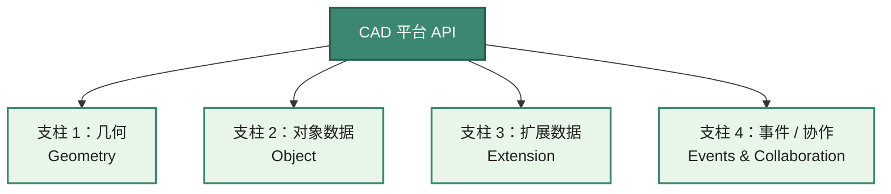
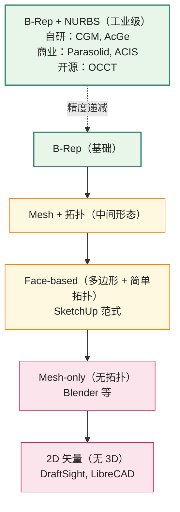
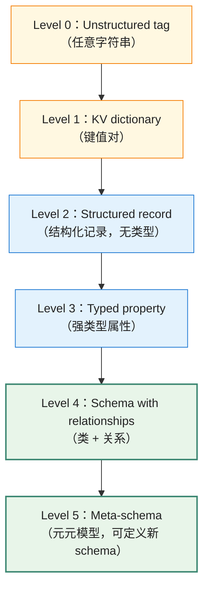
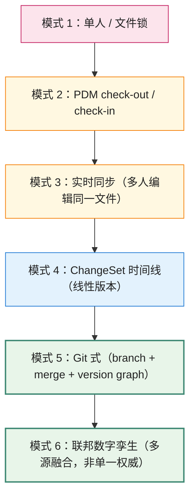

# 通用 CAD 平台 API 设计哲学

> 文档 1｜通用 CAD 平台 API 设计哲学系列

---

## 阅读约定

本文档的论断使用三类标签：

- `> **[判断]**`：作者的论断（与事实陈述区分）
- `> **[陷阱]**`：架构师的常见设计陷阱
- ⭐：作者认为最具学习价值的设计模式

部分论断附**证据等级**标签（A/B/C），这是写作辅助标签，用于提示读者哪些论断有更扎实的样本支撑、哪些是作者归纳——不是客观评审结论：

- **A**：在多数样本中有一致表现，且有官方资料佐证
- **B**：在主要样本中有趋势，部分依赖作者归纳
- **C**：基于公开行业观察的归纳，未在样本中系统验证

证据等级标签只在容易被误读为"通用规律"的论断上使用，不做密集标注。

跨文档引用：行内出现的 [3.4 §三 核心数据模型] 这类方括号引用即指向文档 3.4（Onshape）第三章，可点击跳转。3.x 报告的章节粒度为中文一级编号（§一/§二/§三）；章节内具体段落需读者在目标页继续查阅。

---

## 重要前置说明：本文档的样本与方法局限

本文档的论断基于 8 个平台的深度剖析（文档 3.1-3.8），覆盖：

- **机械 CAD**：CATIA、NX、SolidWorks、Onshape、FreeCAD（5 个）
- **AEC + 设计师**：AutoCAD、MicroStation+iTwin、SketchUp（3 个）

样本偏向参数化 CAD（5/8）。本文档**未覆盖**的重要平台包括 PTC Creo、Autodesk Inventor、Solid Edge、Rhino + Grasshopper、BricsCAD、Revit、ArchiCAD 等。

由于样本特性，本文档的归纳应被理解为**对参数化 CAD 与样本平台的观察归纳**，而非对所有 CAD 平台的普遍规律。下文凡用"样本中""本文样本覆盖的平台"等表述，即指 8 个平台的范围。

---

## 引言：为什么 CAD API 设计需要一套独立讨论框架？

CAD 平台的 API 设计与一般企业软件 API 设计存在显著差异：

1. **使用周期长**：CAD 软件的客户投资周期常达 20-30 年——一个航空企业的 CATIA 二次开发代码可追溯到 1990s 末。SaaS 应用 5 年迭代是常态，CAD 平台 5 年破坏性变更代价巨大 [3.2 §一 历史演进](/platforms/catia#一、历史演进-从-cati-1977-到-3dexperience-2014)；[3.1 §一 历史演进](/platforms/autocad#一、历史演进-从-r12-到-2027-的-api-时间线)。
2. **数据是核心资产**：CAD 文件不是"应用产生的副产品"，而是企业的核心知识产权。文件格式选择是长期战略决策。
3. **几何复杂度高**：参数化建模、特征关联性、拓扑命名等问题难以彻底解决——商业 CAD 经过 40 年仍在持续改进，开源 CAD 直到 2024 年 FreeCAD 1.0 才有较成熟的 <Term def="拓扑命名问题：参数化 CAD 中上游特征变化导致下游 face/edge ID 失效、模型断裂的根本性挑战。" href="/glossary#tnp-topological-naming-problem-拓扑命名问题">TNP</Term> 修复方案 [3.8 §五 TopoShape 与 ElementMap](/platforms/freecad#五、toposhape-与-elementmap-拓扑命名修复)。
4. **生态价值常大于产品价值**：在样本平台中，AutoCAD/CATIA/NX 的护城河在很大程度上来自 ISV 生态、垂直产品矩阵、客户嵌入的工作流。
5. **变化的传播代价高**：在企业级软件中改 API 影响一个项目；在 CAD 平台中改 API 可能让 ISV 的众多 plugin 失效，进而影响客户的工作流 [3.1 §一 AutoCAD VS 版本绑定历史](/platforms/autocad#一、历史演进-从-r12-到-2027-的-api-时间线)。

这些特性意味着 CAD API 的设计与维护需要专门的讨论框架。

> **[判断]** CAD API 设计的核心张力之一是"演进 vs 兼容"。许多具体设计决策（编译期 API 边界、多代 API 共存、声明式建模、Custom Entity 等）可以视为这一张力的不同折中。**[证据等级 B]** 此论断在样本的传统商业 CAD（AutoCAD/CATIA/NX/SolidWorks）中适用性较强；对开源平台 FreeCAD 0.x 时代和云原生平台 Onshape 适用性较弱——前者长期不强求兼容，后者通过持续部署绕过传统兼容问题。

---

## 第一部分：CAD 平台的本体论

### 1.1 CAD 平台的三种典型定义

不同的"CAD 是什么"定义会影响 API 设计取向。在样本平台中观察到三种典型视角：

**视角 A：CAD 是"几何编辑器"**——用户绘制/编辑几何，软件提供绘图、布尔、约束、关联性等工具。样本中代表：AutoCAD（早期）、SketchUp。

**视角 B：CAD 是"工程数据系统"**——几何只是工程数据的一种载体，工程数据还包括属性、关系、规则、版本、协作。样本中代表：CATIA、NX、MicroStation+iTwin。

**视角 C：CAD 是"协作平台"**——多人协作的工程设计平台，git 式版本控制、实时协作、跨工具数据流是核心。样本中代表：Onshape、iTwin。

> **[判断]** 当代成熟 CAD 平台通常同时包含三个视角，但三种视角的优先级排序可能影响平台的设计取向 [3.4 §十 独特设计哲学](/platforms/onshape#十、独特设计哲学提炼)；[3.2 §九 独特设计哲学](/platforms/catia#九、独特设计哲学提炼)；[3.7 §十一 独特设计哲学](/platforms/sketchup#十一、独特设计哲学提炼)。Onshape 把视角 C 放第一，CATIA 把视角 B 放第一，SketchUp 把视角 A 放第一。这种"基因排序"是对成熟平台的事后归纳，不应被理解为不可改变的命运——SketchUp 也在加 Trimble Connect 协作能力，AutoCAD 也在引入 Connected Support Files。

### 1.2 CAD 平台的四大支柱

> **[本节适用边界（前置）]** 本节的"四大支柱"框架是对 8 个样本平台的归纳。在样本范围内，每个平台的 API 都可映射到这四类支柱；样本之外的平台是否同样可映射，需要个别验证。本节后续讨论以此框架为分析工具，不主张其为通用规律。

在本文样本覆盖的平台中，API 均可映射到四类支柱：



**支柱 1：几何**——<Term def="边界表示：用顶点 / 边 / 面的拓扑连接 + 解析曲面（NURBS / 平面 / 圆柱面等）描述实体边界。CAD 工业级建模主流方案。" href="/glossary#b-rep-boundary-representation-边界表示">B-Rep</Term> / <Term def="非均匀有理 B 样条曲线 / 曲面：CAD 自由曲面的标准数学表示，能精确表达圆、椭圆、抛物面等所有圆锥曲线。" href="/glossary#nurbs-non-uniform-rational-b-splines">NURBS</Term> / Mesh / <Term def="多边形 + 简单拓扑，几何精度低、实现简单的简化方案。SketchUp 的几何范式。">Face-based</Term> 等几何表示与运算。

**支柱 2：对象数据**——文档、特征、装配、图纸的层级与持久化。

**支柱 3：扩展数据**——属性、关系、规则的 schema 系统。

**支柱 4：事件 / 协作**——观察者机制、事务、版本、协作。

⭐ **观察**：四大支柱并非完全独立——某一柱的选择会**约束**（不一定决定）其他三柱的可行选项 [3.7 §四 Face-based 几何模型](/platforms/sketchup#四、几何模型-face-based-而非-b-rep)；[3.5 §五 扩展数据元金字塔](/platforms/microstation#五、扩展数据元金字塔-linkage-xattribute-item-types-ecinstance)。这种约束关系不是绝对的：理论上可以做"Face-based 几何 + 复杂 schema"组合，只是在样本中没观察到。

---

## 第二部分：四大支柱的深层结构

### 2.1 支柱 1：几何

#### 2.1.1 几何表示的谱系

CAD 几何表示从精度高到精度低的谱系：



#### 2.1.2 几何内核的四种来源

新平台架构师面临的几何内核选择 [3.6 §一 历史演进](/platforms/solidworks#一、历史演进-30-年弧线)；[3.2 §七 几何内核](/platforms/catia#七、几何内核-v5-v6-3dx-共享)；[3.8 §八 与 OCCT 的关系](/platforms/freecad#八、与-occt-的关系-开源-cad-的几何基石)；[3.7 §四 几何模型](/platforms/sketchup#四、几何模型-face-based-而非-b-rep)：

| 来源 | 优势 | 劣势 | 样本中的代表 |
|---|---|---|---|
| **自研** | 完全控制、深度集成 | 长期研发投入大 | CATIA <Term def="CATIA Geometric Modeler，DS 自研 B-Rep 内核，1998 年随 V5 上线，V5/V6/3DX 共享。" href="/glossary#cgm-catia-geometric-modeler">CGM</Term>、AutoCAD <Term def="AutoCAD Geometry library——AcGe + AcDb + AcRx 构成 ObjectARX C++ SDK 的基础。" href="/glossary#acdb-acge-acrx">AcGe</Term> |
| **商业授权** | 工业级稳定、授权方维护 | 持续付费、依赖授权方 | NX/Solid Edge/SolidWorks (<Term def="Siemens 出品的商业 B-Rep 内核，1988 年发布，业界使用最广。" href="/glossary#parasolid">Parasolid</Term>) |
| **开源** | 免费、透明、可修改 | 跟随版本演进、社区支持有限 | FreeCAD ([OCCT](/glossary#occt-open-cascade-technology)) |
| **简化退化** | 实现简单、性能优 | 能力上限低 | SketchUp (<Term def="多边形 + 简单拓扑，几何精度低、实现简单的简化方案。SketchUp 的几何范式。">Face-based</Term>) |

> **[判断]** 几何内核选择是 CAD 平台**最早、最重要、较难撤回**的决策之一。SolidWorks 选择 [Parasolid](/glossary#parasolid)（1995）至今没切换；CATIA 选择自研 [CGM](/glossary#cgm-catia-geometric-modeler)（1998）至今坚守；FreeCAD 选择 [OCCT](/glossary#occt-open-cascade-technology)（2002）至今依赖。一旦选定，切换的工程代价相当大。**[证据等级 A]**
>
> 此判断主要适用于以"工业级 [B-Rep](/glossary#b-rep-boundary-representation-边界表示) 建模"为核心场景的平台。对于纯 2D 制图、概念草图、Mesh 建模等场景，几何引擎切换的代价可能小得多。

> **[陷阱]** 新平台架构师常见错误：低估几何内核的工程复杂度。"我们自研一个简单的 [B-Rep](/glossary#b-rep-boundary-representation-边界表示) 内核"是部分项目失败的原因之一。本文档的默认建议：
> - 资金充足、长期主义 → 商业授权（[Parasolid](/glossary#parasolid) 或 [ACIS](/glossary#acis)）
> - 开源项目 → [OCCT](/glossary#occt-open-cascade-technology)
> - 战略级国家投资 → 自研（且建议至少投入 10 年）
> - 概念设计/快速原型 → <Term def="多边形 + 简单拓扑，几何精度低、实现简单的简化方案。SketchUp 的几何范式。">Face-based</Term> 简化

#### 2.1.3 拓扑命名问题（Topological Naming Problem, TNP）

参数化 CAD 中常见的挑战 [3.8 §五 TopoShape 与 ElementMap](/platforms/freecad#五、toposhape-与-elementmap-拓扑命名修复)：

```
特征 1（Box）→ 6 个面，自动分配 ID：F1, F2, ..., F6
特征 2（Sketch）→ 在 F2 上创建草图
特征 3（Pad）→ 基于草图拉伸

【用户回到特征 1，修改 Box 长度】
↓ Box 重新计算
↓ 几何内核重新生成 6 个面，可能重新编号
↓ "F2" 现在指向不同的物理面
↓ 特征 2/3 引用错误，模型断裂
```

样本中观察到的解决方案演进：

```
1. 启发式 + 用户重选（SolidWorks "red dashed line"）
   - 减轻不消除，需用户介入

2. 拓扑历史描述（FreeCAD ElementMap，源自 RealThunder）
   - 用诞生历史哈希替代数字 ID
   - 2024 年 FreeCAD 1.0 集成

3. 显式引用 + ID 持久化（CATIA / NX 商业方案）
   - 内部黑盒，效果取决于具体场景

4. Query 语言（Onshape FeatureScript Query）
   - 显式表达"选择满足条件的所有 X"
   - 用户主动声明意图，规避 TNP
```

TNP 是参数化 CAD 中常见且持续受关注的设计挑战，不同平台采用了不同的缓解策略，效果各有差异。是否能完全消除取决于如何定义"完美"——若指"用户从不需要重新指定参考"，截至本文档样本，未观察到完全达到该状态的平台。

> **[判断]** ⭐ 在样本范围内，Onshape 的 Query 语言路线是较优雅的解决方案 [3.4 §五 FeatureScript](/platforms/onshape#五、featurescript-内嵌-dsl)——把"用户选了哪个面"问题转化为"用户表达了什么选择意图"。但 Query 语言路线适合从头设计的新平台，对于已有 30 年代码积累的平台引入难度较大；Query 语言本身有学习曲线，对设计师友好型平台未必合适。**[证据等级 B]**

> **[陷阱]** 不要假设自己会想到一个能彻底解决 TNP 的方案。商业 CAD 经过多年仍在持续改进缓解策略，开源 CAD 用了 22 年才有 1.0 解决方案。务实做法是：从第一天起规划拓扑命名机制，并接受"边角情况会破坏模型"是参数化 CAD 的固有特性。

### 2.2 支柱 2：对象数据

#### 2.2.1 对象层级的常见模式

样本平台中观察到的对象层级遵循类似模式：

```
Application（单例进程入口）
  │
  ├── Document（文件 / 内存模型）
  │   ├── Metadata
  │   ├── Tables / Dictionaries
  │   ├── Entities / Features
  │   └── Views / Layouts
  │
  ├── DocumentManager（多文档管理）
  └── Selection / Editor / UI Context
```

不同平台的具体命名各异（详见各 3.x 报告 §三 对象模型章节），概念结构相似。

#### 2.2.2 文档的两种存储范式

```
范式 A：File-based（传统）
  - 一个 Document = 一个磁盘文件
  - 复制即版本控制
  - PDM 提供 check-out/check-in 包装

范式 B：Database-based（现代）
  - 一个 Document = 数据库中的实体
  - ChangeSet / Microversion 时间线
  - 实时协作可能
```

**样本中范式选择对平台特性的影响** [3.4 §三 git 式四层数据模型](/platforms/onshape#三、核心数据模型-git-式四层)；[3.2 §一 历史演进（V6 "no files"）](/platforms/catia#一、历史演进-从-cati-1977-到-3dexperience-2014)；[3.5 §八 iTwin Platform](/platforms/microstation#八、itwin-platform-云原生重构)：
- File-based + [PDM](/glossary#pdm-product-data-management-plm-product-lifecycle-management)：样本中 7/8 平台采用（AutoCAD/CATIA V5/NX/SolidWorks/SketchUp/MicroStation/FreeCAD）
- <Term def="数据库驱动的文档存储范式：Document = 数据库实体而非磁盘文件，配套 ChangeSet/Microversion 时间线。让实时多人协作成为可能（每编辑一笔即生成不可变版本，分支/合并按 git 模型工作）。代价：必须强制上云或本地部署数据库，传统复制 .dwg 给同事工作流被打破">Database-based</Term> "no files"：CATIA V6（强制 ENOVIA）、Onshape（cloud-native）、iTwin（联邦数据）

> **[判断]** Database-based 范式在云协作场景中显示明显优势，但强制迁移可能遇阻——CATIA V6 "no files"导致部分客户坚守 V5 是相关案例 [3.2 §一 历史演进](/platforms/catia#一、历史演进-从-cati-1977-到-3dexperience-2014)。务实路径：新平台从第一天采用 Database-based，老平台用"双轨支持"渐进过渡。**[证据等级 B]**

#### 2.2.3 特征关联性的传播机制

参数化 CAD 的核心能力是当上游特征参数变化时，下游特征自动更新。在样本中观察到的实现机制：

```
机制 A：线性 history tree（早期 SolidWorks/Inventor）
  - 特征按创建顺序串联
  - 修改后从该特征开始重算所有下游
  - 简单但僵硬

机制 B：DAG 依赖图（多数现代 CAD）
  - 显式 PropertyLink 形成有向无环图
  - 拓扑排序确定重算顺序
  - 灵活但需依赖图维护

机制 C：声明式 + 自动求解（CATIA Spec/Result/Update）
  - 用户声明 spec，引擎决定如何更新 result
  - 显式 Update 触发计算
  - 函数式风格，关联性强大但学习曲线陡

机制 D：Synchronous Technology（NX/Solid Edge）
  - 直接编辑 + 实时几何关系识别
  - 局部依赖求解，绕过 history 顺序限制
  - 实现复杂但用户体验流畅
```

> **[判断]** 机制 D（<Term def="Siemens NX 5（2007）首创的混合建模技术：直接编辑几何同时自动维护几何关系（同心 / 共面 / 对称等）。" href="/glossary#synchronous-technology">Synchronous Technology</Term>）在用户体验上具有明显优势 [3.3 §四 Synchronous Technology](/platforms/nx#四、synchronous-technology-直接编辑-关联性)，但工程难度较高。务实路径：从机制 B（<Term def="有向无环图：参数化 CAD 描述特征依赖的常见数据结构。重算时按拓扑序执行。" href="/glossary#dag-directed-acyclic-graph-有向无环图">DAG</Term> 依赖图）起步，在成熟后增加 Synchronous Technology 等价能力。此判断针对追求"导入第三方文件直接编辑 + 关联性维持"场景；不强调多 CAD 互操作的封闭工作流，机制 B 已足够。

### 2.3 支柱 3：扩展数据

> **[本节适用边界（前置）]** 本节讨论的"schema 强度"对**工程数据集成场景**（如 BIM、PLM、跨工具数据治理）特别重要。对于设计师友好型平台、不强调跨工具数据治理的封闭工作流，简单的属性字典已足够。"schema 强度应匹配数据集成需求"——而不是越高越好。

#### 2.3.1 扩展数据的层级化光谱

从轻到重的扩展数据机制（详见各 3.x 报告中扩展数据相关章节）：



样本平台的实际位置：

| 平台 | 最高 Level | 实现 | 参考 |
|---|---|---|---|
| AutoCAD | Level 2-3 | XData / XRecord / Dictionary | 3.1 §六 扩展数据机制 |
| SketchUp | Level 1-2 | Attribute Dictionary | 3.7 §三 Ruby API 核心对象 |
| SolidWorks | Level 3 | Custom Property + Equation | 3.6 §七 属性管理 |
| FreeCAD | Level 3-4 | Property System（强类型） | 3.8 §三 Python 嵌入式哲学 |
| CATIA | Level 4-5 | Knowledge Adv. / Late Type | 3.2 §四 CAA Object Modeler |
| NX | Level 4-5 | Attribute Manager + Knowledge Fusion | 3.3 §五 Knowledge Fusion |
| **MicroStation** | ⭐ Level 5 | ECObjects / ECSchema / BIS | 3.5 §六 ECObjects / ECSchema |
| Onshape | Level 4 | FeatureScript Map types | 3.4 §五 FeatureScript |
| iTwin | Level 5 | BIS schemas（基于 EC） | 3.5 §八 iTwin Platform |

⭐ **观察**：在工程数据集成场景中，Level 5（元元模型）显示明显价值 [3.5 §六 ECObjects / ECSchema](/platforms/microstation#六、ecobjects-ecschema-bentley-独有的元元模型)；[3.5 §十 独特设计哲学](/platforms/microstation#十、独特设计哲学提炼)——MicroStation/iTwin 在基础设施工程的核心竞争力之一来自 <Term def="Bentley 工程元数据系统：ECSchema 用 XML 定义类 / 关系 / 属性 / 自定义特性；ECObjects 是运行时表达。是 iTwin BIS 的概念骨架。" href="/glossary#ecobjects-ecschema">ECSchema</Term>/BIS。

> **[陷阱]** "我们先做几何，扩展数据等需要时再加" 是一种风险路径——MicroStation 的 ECObjects 经过 20+ 年才成熟，FreeCAD 的 Property System 是从一开始就设计的。事后补 schema 系统在工程上较困难。

#### 2.3.2 schema 系统的工程价值

强类型 schema 系统提供：

1. **跨工具互操作**：[DGN](/glossary#dgn)/[DWG](/glossary#dwg)/[IFC](/glossary#ifc-industry-foundation-classes)/RVT 数据通过共同 schema 互相理解
2. **生命周期治理**：从设计到施工到运维的统一数据语言
3. **AI/ML 友好**：结构化数据是机器学习的重要前提
4. **报告/查询能力**：基于 schema 的 SQL-like 查询（如 iTwin 的 ECSQL）
5. **法规合规**：医疗器械、航空航天等行业的工程数据合规

### 2.4 支柱 4：事件与协作

#### 2.4.1 事件机制的颗粒度光谱

```
最粗：仅文档级事件（onSave, onClose）
   ↓
中等：文档 + 特征级事件
   ↓
细：文档 + 特征 + 实体级事件
   ↓
最细：实体级 + 属性级 + 选择级 + UI 级
```

⭐ **观察**：SketchUp 的 17+ 类 Observer 是样本中颗粒度较细的实现 [3.7 §五 Observer 模式](/platforms/sketchup#五、observer-模式-17-类高粒度事件)。但极细颗粒度也带来"观察者生命周期管理"难题——回调泄漏、事件风暴、循环触发等问题。

> **[判断]** 事件机制颗粒度的选择应**匹配扩展场景**：
> - 数据集成（PDM 同步）→ 文档级即可
> - 设计辅助（智能提示）→ 特征级
> - 实时协作 → 实体级
> - 深度定制（智能体）→ 极细颗粒度
>
> 默认选择：文档 + 特征级双层；极细颗粒度仅在明确需要时增加。

#### 2.4.2 协作模式的演进光谱



⭐ **观察**：在本系列覆盖的 8 个样本中，Onshape 是较少见的实现完整 Git 式 CAD 协作的平台 [3.4 §三 git 式四层数据模型](/platforms/onshape#三、核心数据模型-git-式四层)。

> **[判断]** 新平台决策协作模式时的关键问题：**"修改是合并还是冲突？"**
> - 合并优先（Git 式）→ 数据模型需要可哈希、可 diff
> - 冲突优先（PDM）→ 锁机制 + 串行化编辑
>
> 一旦选定，迁移成本较高。Onshape 的 Git 式模型适合云原生平台，对于桌面 CAD 改造为 Git 式难度较大。

---

## 第三部分：API 设计的元元模型

### 3.1 12 个核心决策维度

> **[本节适用边界（前置）]** 本节归纳的"12 维"是**对样本平台的归纳清单**，不是对所有未来 CAD 平台的预设。不在此框架内的设计选择并不必然失败——例如 Onshape 选择"REST + FeatureScript"在 2010 年代是非主流路径，但被证明可行。架构师应将 12 维视为**思考清单**而非**正确答案**。

基于样本平台的横向比较，本文档归纳出 12 个核心决策维度。每个维度的选项不是简单的优劣，而是匹配客户基础的选择：

| # | 维度 | 选项 | 主要权衡 |
|---|---|---|---|
| 1 | API 风格 | in-process C++ / COM / 托管 .NET / REST / 嵌入式脚本 | 性能 vs 易用 |
| 2 | 几何内核 | 自研 / 商业 / 开源 / 简化 | 资源 vs 控制 |
| 3 | 多语言策略 | 单语言 / 自动生成 / 手工 wrapper | 生态 vs 维护 |
| 4 | 建模范式 | 命令式 / 声明式 / 声明式 + Commit | 易用 vs 关联性 |
| 5 | 扩展数据 | KV / 强类型 / Schema / Meta-schema | 简单 vs 工程级 |
| 6 | 事件颗粒度 | 文档级 / 特征级 / 实体级 / 极细 | 简单 vs 灵活 |
| 7 | UI 扩展路线 | 原生 dialog / 嵌入 Web (CEF) | 一致 vs 灵活 |
| 8 | 协作模式 | 文件锁 / PDM / ChangeSet / Git 式 | 兼容 vs 现代 |
| 9 | 云原生策略 | 无云 / 桌面镜像 / 联邦 / 100% 云 | 客户基础匹配 |
| 10 | API 兼容承诺 | 编译期强制 / 加法兼容 / 接口版本化 / 不兼容 | 信任 vs 演进 |
| 11 | 商业模式 | 永久 / 订阅 / 开源 / 双轨 | 现金流 vs 用户基础 |
| 12 | AI 整合方向 | 自动化 / 辅助编辑 / 生成式 | 务实 vs 颠覆 |

⭐ **观察**：在样本中，12 个维度的"最优组合"不存在通用解——每种组合对应一种客户基础与商业战略。

### 3.2 决策维度之间的耦合关系

12 个维度存在耦合，这种耦合在样本中表现为相关性（不是因果）：

```
观察到的相关性：

API 风格 ↔ 多语言策略
  - in-process C++ → 通常单语言或手工 wrapper
  - REST → 天然多语言

几何内核 ↔ 扩展数据
  - Face-based 几何（SketchUp）↔ Level 1-2 schema
  - B-Rep 工业级 ↔ Level 3-5 schema

建模范式 ↔ 协作模式
  - 命令式建模 → 较难做 Git 式协作
  - 声明式建模 → 自然支持版本化与合并

云原生策略 ↔ 协作模式
  - 100% 云原生 → 自然 Git 式
  - 无云 → 文件锁或 PDM

API 兼容承诺 ↔ 商业模式
  - 编译期强制 + 永久授权 → 高信任，CATIA 模式
  - 不兼容 + 订阅 → 现代敏捷，Onshape 模式
```

这些相关性是对样本的观察，不是物理定律。理论上可以打破——只是在样本中没观察到。架构师可以选择打破常见相关性，但应清楚自己在做非常规选择。

### 3.3 历史演进的内在趋势

> **[本节适用边界（前置）]** 本节归纳的 5 条趋势是**对样本平台 30+ 年演进的观察**，不是对所有 CAD 平台必然遵循的物理规律。不遵循趋势的平台不必然失败，具体路线选择应匹配客户基础。

观察样本平台的演进，可识别 5 条趋势：

#### 趋势 1：分层化（Layering）

```
1980s：单层 API（C 函数库 + 命令行宏）
1990s：双层（C++ SDK + 嵌入式脚本）
2000s：三层（C++ + .NET/COM + Web）
2010s：四层（+ REST API + 移动 SDK）
2020s：五层（+ AI/LLM 集成层）
```

每代新增的 API 层服务新的开发者群体，旧层通常不被替换——这是样本中观察到的"加法演进"模式。

#### 趋势 2：声明化（Declarativization）

```
命令式（add_line, add_face）
   ↓
带 history 的命令式（feature tree）
   ↓
声明式 + 显式 Commit（Builder, Spec/Result/Update）
   ↓
声明式 + 自动 Solver（Synchronous Technology）
   ↓
查询式选择（Query DSL，FeatureScript）
```

每代演进减少"开发者必须显式表达的细节"。**此趋势在参数化 CAD 中显示明显，对命令式 API（AutoCAD <Term def="AutoCAD Runtime eXtension：1995 年随 R13 发布的 C++ 原生扩展架构。.arx 模块本质是 Windows DLL，进程内合作，是 AutoCAD 30+ 年 API 哲学的基石。" href="/glossary#objectarx">ObjectARX</Term>、SketchUp Ruby）适用性有限**——这些平台的命令式仍是主流且未必会被取代。

#### 趋势 3：协作化（Collaborativization）

```
单人编辑 → 文件交换 → PDM check-out → 实时同步 → ChangeSet → Git 式
```

#### 趋势 4：上云化（Cloudification）

```
本地桌面 → 网络共享 → 私有云部署 → 公有云 SaaS → 云原生（无桌面）
```

上云化是趋势但不是终点。在以下场景，本地部署仍长期需要：航空航天、国防、关键基础设施、某些数据本地化合规要求严格的国家市场。更准确的描述是"云原生 + 本地部署的双轨长期共存"。

#### 趋势 5：智能化（Intelligencification）

```
脚本自动化 → 规则建模（KBE）→ 机器学习辅助 → 生成式 AI
```

2024-2026 各 CAD 厂商集中拥抱 AI 是趋势 5 的近期表现 [3.1 §一 历史演进（AutoCAD 2026 AI）](/platforms/autocad#一、历史演进-从-r12-到-2027-的-api-时间线)；[3.6 §九 SolidWorks 2026 Aura AI](/platforms/solidworks#九、solidworks-2026-aura-ai-与-30-周年)；[3.7 §九 SketchUp 2025-2026 AI Render](/platforms/sketchup#九、sketchup-2025–2026-新一代演进)。

---

## 第四部分：兼容性的工程经济学

### 4.1 兼容承诺的定价

兼容承诺有可分析的工程成本与商业价值 [3.1 §一 历史演进（AutoCAD VS 版本绑定）](/platforms/autocad#一、历史演进-从-r12-到-2027-的-api-时间线)；[3.2 §五 Authorized API vs Internal API](/platforms/catia#五、authorized-api-vs-internal-api-mkmk-的编译期校验)：

```
兼容承诺的成本：
- 旧 API 维护成本（年度工时）
- 旧 API 测试成本
- 旧 API 文档维护
- 新功能在旧 API 中暴露的复杂度
- 内部代码无法清理的技术债
- 工具链刚性（VS 版本绑定等）

兼容承诺的收益：
- 客户信任 → 长期合同价值
- ISV 生态规模 → 平台经济学
- 客户切换成本 → 锁定效应
- 品牌权威 → 营销溢价
```

### 4.2 五种兼容承诺水平

```
水平 5（最强）：编译期强制 + 内核稳定
  代表：CATIA CAA mkmk 校验 + V5/V6/3DX 几何内核共享
  成本：极高（工具链刚性 + 内部架构受限）
  收益：超大型客户的高度信任（航空航天）

水平 4（强）：多代 API 共存 + 文档承诺
  代表：AutoCAD（LISP/VBA/.NET/ObjectARX/Web 五层）、NX（GRIP/Open C/Common API）
  成本：高（多代维护成本）
  收益：长期客户基础保留

水平 3（中）：单层 API + 接口版本化
  代表：SolidWorks IModelDocExtension 模式
  成本：中
  收益：30 年 VBA 宏代码仍可运行

水平 2（弱）：版本化 + 不强制兼容
  代表：Onshape REST API（v1/v2/v3...）
  成本：低
  收益：演进灵活，但 ISV 需要持续适配

水平 1（无）：不兼容承诺
  代表：早期开源项目 / 实验性平台
  成本：零
  收益：开发自由，但难以形成稳定生态
```

> **[判断]** 兼容承诺水平**应作为商业战略决策**，而非纯技术决策。CFO 与 CTO 共同决定。可能的错误情景：
> - 创业公司选水平 5 → 演进受限，可能被竞争对手颠覆
> - 大企业选水平 1 → 客户流失风险
>
> 这两种情景属作者归纳，不是必然结果——具体决策需结合企业实际。

### 4.3 兼容承诺的"温水煮青蛙"风险

> **[陷阱]** 一种常见的兼容性风险：**短期决策累积成长期负担**。

```
Year 1: "这个 API 设计有点问题但客户已经在用，先保留"
Year 3: "现在改要影响 100 个 ISV，再放放"
Year 5: "改了会破坏 1000 家客户的工作流，做不了"
Year 10: "这个 API 是技术债的核心，但已经无法清理"
```

每个单点决策都看起来合理，但累积效应是平台僵化。

逆向工程的可能做法：从一开始建立"API 退休机制"：
- 标记 API 为 "deprecated" 的标准流程
- 给 ISV 的迁移窗口期（如 3 年）
- 编译期警告 + 文档警告 + 运行时警告三阶段
- 强制弃用日期与替代 API 的明确公告

⭐ AutoCAD 通过版本绑定（每代 VS 版本切换）间接清理技术债 [3.1 §一 历史演进](/platforms/autocad#一、历史演进-从-r12-到-2027-的-api-时间线)。这是已观察到的做法，但新平台可能采用更主动的退休机制。

---

## 第五部分：声明式建模的设计模式

> **[本节适用边界（前置）]** 本节讨论的"声明式建模"主要适用于**参数化 CAD** 范式。对于命令式范式（AutoCAD ObjectARX、SketchUp Ruby），命令式 API 仍是合理选择，且这些平台的成功表明命令式有其不可替代的价值（设计师友好、即时反馈、低学习曲线）。

### 5.1 声明式建模的本质

声明式建模在样本的参数化 CAD 平台中显示明显应用 [3.2 §六 Spec/Result/Update](/platforms/catia#六、spec-result-update-三段式-catia-特征建模哲学)；[3.3 §三 Common Object Model](/platforms/nx#三、common-object-model-session-part-feature-builder)；[3.4 §五 FeatureScript](/platforms/onshape#五、featurescript-内嵌-dsl)。其本质是：

```
开发者声明 "what"（想要什么）
↓
引擎决定 "how"（如何计算）
↓
关联性自动传播
```

与命令式建模的对比：

| 维度 | 命令式 | 声明式 |
|---|---|---|
| 开发者表达 | 一系列操作 | 参数化对象 |
| 关联性 | 开发者维护 | 引擎自动维护 |
| 编辑现有对象 | 较难（需手工 undo + redo） | 较易（修改参数即可）|
| 调试 | 直接（步进操作） | 间接（通过 spec → result）|
| 学习曲线 | 较低 | 较高 |

### 5.2 声明式建模的实现模式

观察样本，识别 4 种实现模式 [3.2 §六 Spec/Result/Update](/platforms/catia#六、spec-result-update-三段式-catia-特征建模哲学)；[3.3 §三 Common Object Model](/platforms/nx#三、common-object-model-session-part-feature-builder)；[3.4 §五 FeatureScript](/platforms/onshape#五、featurescript-内嵌-dsl)；[3.8 §三 Python 嵌入式哲学](/platforms/freecad#三、python-嵌入式哲学-双向集成到极致)：

#### 模式 1：CATIA Spec/Result/Update 三段式

```cpp
PadSpec spec(profile, length, direction);
PadResult result;
spec.Update(result);
```

特点：参数与结果明确分离；学习直观。每个 feature 类型需要 Spec + Result 两个类。

#### 模式 2：NX Builder + Commit

```python
builder = work_part.Features.CreateCylinderBuilder(None)
builder.Diameter.SetFormula("50")
builder.Height.SetFormula("100")
nx_object = builder.Commit()
builder.Destroy()
```

特点：单一 Builder 对象；支持编辑现有 feature；Undo 友好。Builder 是临时对象，需显式 Destroy。

#### 模式 3：Onshape FeatureScript Function

```js
annotation { "Feature Type Name" : "Cylinder" }
export const cylinder = defineFeature(function(context, id, definition)
{
    var diameter = definition.diameter;
    var height = definition.height;
    opExtrude(context, id + "extrude", { ... });
});
```

特点：纯函数式；强类型 + 单位安全；Query 表达选择。FeatureScript 是新语言，有学习曲线。

#### 模式 4：FreeCAD execute() 回调

```python
class Box:
    def __init__(self, obj):
        obj.addProperty("App::PropertyLength", "Length")
        obj.Proxy = self
    
    def execute(self, obj):
        shape = Part.makeBox(obj.Length, obj.Width, obj.Height)
        obj.Shape = shape
```

特点：纯 Python 实现；FreeCAD 引擎自动调度 execute()。execute() 性能比 C++ 慢。

### 5.3 选择哪种模式？

> **[判断]** 新平台架构师的选择参考：
>
> - 重视开发者门槛低 → 参考模式 4（FreeCAD execute 风格），允许纯脚本扩展
> - 重视类型安全 + 单位安全 → 参考模式 3（FeatureScript 风格），考虑新语言投资
> - 有 C++ 客户基础 → 参考模式 2（NX Builder 风格），自然过渡
> - 服务超大型工程组织 → 参考模式 1（CATIA Spec/Result）的严格分离
>
> 模式之间不互斥——可以多模式并存（如 FreeCAD 同时支持 execute() + Python Builder）。

---

## 第六部分：云原生时代的新挑战

### 6.1 云原生 CAD 的新设计约束

桌面 CAD 时代的设计假设在云原生时代部分失效 [3.4 §三 git 式四层数据模型](/platforms/onshape#三、核心数据模型-git-式四层)；[3.5 §八 iTwin Platform](/platforms/microstation#八、itwin-platform-云原生重构)：

```
桌面假设              ↔  云原生现实
─────────────────────────────────
单进程               ↔  多进程 + 多机
本地文件 I/O          ↔  网络 API + 持久化
长连接 GUI           ↔  请求-响应 + WebSocket
内存中模型           ↔  分布式状态
单用户              ↔  并发用户
```

每个失效的假设都需要新的 API 设计模式。

### 6.2 云原生 CAD 的核心设计模式

#### 模式 A：无状态 API + 显式 Workspace

```
传统：
  Application.OpenDocument(path) → Document 对象（有状态）
  Document.AddFeature(feature)
  Document.Save()

云原生：
  POST /api/workspaces/:id/features → 200 OK + 新 microversion
  POST /api/workspaces/:id/parts → ...
  每次调用都携带 workspace_id，无服务端会话状态
```

#### 模式 B：增量同步而非全量重传

```
传统文件保存：
  整个文档序列化 → 上传文件

云原生：
  只发送 ChangeSet（diff）
  服务端合并到时间线
  其他客户端订阅 changes
```

#### 模式 C：UI 与 Engine 分离

```
桌面：
  UI 与 Engine 同进程（直接函数调用）

云原生：
  UI 在浏览器（JavaScript / WebGL）
  Engine 在服务端（容器化）
  通过 WebSocket / REST 通信
  支持 UI 多形态（Web、Mobile、Desktop）
```

iTwin.js 的"Frontend / Backend / Common"三段架构是这种模式的样本 [3.5 §八 iTwin Platform](/platforms/microstation#八、itwin-platform-云原生重构)。

#### 模式 D：批处理与异步操作

```
传统：
  result = doc.recompute()  // 同步等待

云原生：
  job_id = doc.recompute_async()  // 提交任务
  status = get_job(job_id)
```

⭐ AutoCAD APS Design Automation 是这种模式的样本 [3.1 §七 Forge → APS](/platforms/autocad#七、forge-→-aps-云端生态)——把桌面 ObjectARX 命令包装为云端 WorkItem。

### 6.3 云原生时代的兼容性新挑战

```
桌面时代的兼容性：
  - 二进制 ABI 兼容
  - 文件格式向后兼容
  - API 命名兼容

云原生时代的兼容性：
  - REST API 版本化（v1/v2/v3）
  - JSON schema 演化
  - 客户端 SDK 多语言版本同步
  - 文档格式演化与并发用户的版本一致性
```

⭐ Onshape 的 "持续部署"模式有特殊挑战 [3.4 §四 REST API 设计](/platforms/onshape#四、rest-api-设计-url-即语义)；[3.4 §五 FeatureScript](/platforms/onshape#五、featurescript-内嵌-dsl)——服务端总是最新版，客户端 FeatureScript 必须能跨版本运行。

> **[判断]** 云原生时代，API 兼容承诺的重心可能从"二进制 ABI"向"语义契约"演变。重要的是 REST endpoint 行为稳定，而不是底层实现。这降低了部分兼容性成本，但增加了"API 行为治理"的复杂度。此判断针对云原生新平台；对于已有大量本地客户的传统平台，二进制 ABI 兼容仍是当前要求，"重心转向语义契约"是渐进过程而非已完成的事实。

---

## 第七部分：AI 与 LLM 时代的 CAD API

> **[本节适用边界（前置）]** 本节讨论 AI/LLM 整合属于**对 2024-2026 早期现象的观察**，最佳实践仍在形成中。本节内容应被视为**值得关注的方向**而非已被验证的设计原则。LLM 友好特征（清晰命名、强类型、批量操作）本身对工程师也有价值，所以即使 LLM 趋势演变，这些设计仍有意义。

### 7.1 AI 整合的三个层次

观察 2024-2026 年 CAD 厂商的 AI 整合 [3.1 §一 历史演进（2026）](/platforms/autocad#一、历史演进-从-r12-到-2027-的-api-时间线)；[3.6 §九 SolidWorks 2026](/platforms/solidworks#九、solidworks-2026-aura-ai-与-30-周年)；[3.7 §九 SketchUp 2025-2026](/platforms/sketchup#九、sketchup-2025–2026-新一代演进)：

```
层次 1：自动化重复任务
- AutoCAD Smart Blocks（自动 block 转换）
- SolidWorks Auto Drawing（自动生成工程图）
- SketchUp AI Render
特征：替代用户的手动操作，结果可验证

层次 2：辅助直接编辑
- NX Synchronous Technology + AI（智能识别编辑意图）
- 智能选择、智能约束推断
特征：AI 理解用户意图，提供建议或自动执行

层次 3：生成式建模
- Fusion 360 Generative Design（拓扑优化）
- 文本到 CAD 模型（早期实验性）
特征：AI 创造，用户验证
```

> **[判断]** 截至 2026 年初，多数主流 CAD 厂商在层次 1，少数在层次 2，层次 3 仍是早期实验。新平台可考虑规划三层 AI 整合策略，但务实落地从层次 1 起步可能更稳妥。

### 7.2 LLM 友好的 CAD API 设计考虑

LLM 能力让 CAD API 设计需要新的考虑。在样本中，Onshape FeatureScript 显示出较好的"LLM 可读性"特征 [3.4 §五 FeatureScript](/platforms/onshape#五、featurescript-内嵌-dsl)——强类型 + 单位安全 + 完整文档让 LLM 容易理解和生成代码。

LLM 友好 API 的常见特征：

- **命名清晰**：`createCylinder(diameter, height)` 优于 `mk_cyl(d, h)`
- **类型注解充分**：参数类型、返回类型、单位都明确
- **示例丰富**：每个 API 至少一个完整示例
- **错误信息可解析**：异常携带结构化信息
- **支持批量原子操作**：让 LLM 一次性生成多行操作可事务化执行

```python
# 不友好：每次操作都同步
doc.add_feature(feature1)
doc.recompute()
doc.add_feature(feature2)
doc.recompute()

# LLM 友好：批量 + 事务
with doc.transaction():
    doc.add_feature(feature1)
    doc.add_feature(feature2)
```

> **[判断]** 新平台 API 可考虑把"LLM 是用户"作为设计目标之一。**[证据等级 C——属早期趋势观察]** 但不应把"LLM 友好"当作压倒一切的目标——传统的工程师体验仍是 API 的主要服务对象。

### 7.3 AI 整合的架构模式

```
模式 A：API 内嵌 AI 服务
模式 B：用户提供 LLM 凭证
模式 C：本地 LLM
模式 D：MCP（Model Context Protocol）
```

⭐ <Term def="Model Context Protocol，Anthropic 2024 年推出的开放协议，让 LLM 通过统一接口接入外部数据源 / 工具 / 服务（类似 AI 时代的 LSP / OpenAPI）。CAD 平台只要暴露 MCP server，任意支持 MCP 的 LLM 都能调用其功能">MCP</Term> 是 2024-2026 新兴的标准化方向。Anthropic 推动的 MCP 协议让 CAD 平台可以暴露给任意 LLM，无需为每个 LLM 单独集成。"新平台应优先支持 MCP"是基于 2026 年初观察的判断，未来 MCP 是否成为事实标准存在不确定性——审慎建议是关注 MCP 演进，但不必把全部 AI 集成赌在 MCP 上。

---

## 第八部分：新平台架构师的决策框架

### 8.1 五阶段决策框架

新 CAD 平台从立项到成熟的常见阶段（基于行业观察归纳，具体节奏因企业而异）：

```
阶段 1：定位（约 6-12 个月）
─────────────────────────
关键问题：
- 客户基础是谁？（设计师 / 工程师 / ISV / 协作者）
- 行业是什么？（机械 / AEC / 概念设计）
- 现有竞品是哪个？
- 我们的差异化是什么？

输出：产品定位文档 + 竞品对比矩阵

阶段 2：架构（约 6-12 个月）
─────────────────────────
关键问题：12 个 API 维度的整体设计
- 几何内核选择（较难撤回）
- API 风格与多语言策略
- 协作模式
- 云原生策略
- 商业模式

输出：架构白皮书 + 12 维决策记录

阶段 3：MVP（约 12-24 个月）
─────────────────────────
关键问题：
- 四大支柱的 MVP 实现
- 第一个目标行业的核心工作流支持
- 第一批 alpha 客户合作

输出：可运行 MVP + 第一批客户案例

阶段 4：生态（约 24-60 个月）
─────────────────────────
关键问题：
- API 兼容承诺水平的明确公告
- ISV 招募策略
- 垂直产品矩阵规划
- 文档与社区建设

阶段 5：演进（60+ 个月）
─────────────────────────
关键问题：
- 兼容承诺与新功能的平衡
- 云原生迁移路径
- AI 整合策略
- 国际化策略
```

### 8.2 难撤回决策清单

新平台架构师需要早期意识到的"难撤回决策"：

| 决策 | 撤回难度 | 后果 |
|---|---|---|
| 几何内核选择 | ⭐⭐⭐⭐⭐ | 切换工程量极大 |
| 文件格式 | ⭐⭐⭐⭐⭐ | 切换影响客户存量文件 |
| 协作数据模型（File vs DB）| ⭐⭐⭐⭐ | 切换需要平台级重构 |
| API 风格（in-process vs REST）| ⭐⭐⭐⭐ | 切换 = ISV 需重写 |
| 商业模式（永久 vs 订阅）| ⭐⭐⭐ | 切换可能引发客户反弹 |
| 多语言策略 | ⭐⭐⭐ | 切换 = SDK 需重写 |
| AI 整合方向 | ⭐⭐ | 可调整 |
| UI 扩展路线 | ⭐⭐ | 可逐步迁移 |

⭐ 建议：把所有 ⭐⭐⭐⭐ 以上的决策**作为整体**在阶段 2 决定，并写入"架构白皮书"作为后续决策基准。

### 8.3 工程师良知清单

平台架构师在长期演进中可保持的工程师良知（属规范性建议而非必然规律）：

#### 良知 1：审慎宣称 1.0

FreeCAD 22 年才到 1.0 [3.8 §一 历史演进](/platforms/freecad#一、历史演进-22-年开源-cad-之旅)——这种工程师良知值得参考。1.0 应意味着"真正稳定可生产"，而不仅是"市场可销售的最小功能集"。

#### 良知 2：尊重 ISV 投资

AutoCAD 的 [AutoLISP](/glossary#autolisp-visual-lisp) 1982 年至今可用 [3.1 §五 AutoLISP / Visual LISP](/platforms/autocad#五、autolisp-visual-lisp-30-年的设计师友好层)——长期承诺是平台权威的来源之一。

#### 良知 3：透明沟通破坏性变更

当必须做破坏性变更时（如 NX 工具链升级 [3.3 §一 历史演进](/platforms/nx#一、历史演进-从-uniapt-1972-到-nx-x-2024)），提前公告 + 提供迁移工具 + 给 ISV 充分准备时间是较好的实践。

#### 良知 4：开放数据格式

.FCStd（ZIP + XML + BREP）是开源软件的良知体现 [3.8 §七 .FCStd 文件格式](/platforms/freecad#七、-fcstd-文件格式)——让用户的数据可以不依赖平台存活。商业 CAD 即使保留专有格式，也可提供完整的 STEP/IGES 等中性格式导出。

#### 良知 5：尊重用户的"不学习"权利

SketchUp 的成功部分来自"设计师不需要学习编程也能用" [3.7 §十一 独特设计哲学](/platforms/sketchup#十一、独特设计哲学提炼)。API 强大与用户友好不矛盾，可以分层设计服务不同人群。

#### 良知 6：避免锁定但允许深度集成

客户应该能"带着数据离开平台"（lock-in 反向能力），同时也能"深度集成留下"（lock-in 正向能力）。两者并不矛盾。

### 8.4 八个常见陷阱

新平台架构师常见的陷阱（基于样本与公开案例归纳）：

1. **低估几何内核工程量**——"我们自研一个简单 B-Rep 内核就好"是部分项目失败的原因之一
2. **把 schema 系统当作"事后追加"**——强类型 schema 在产品成熟后才加难度较大
3. **忽视 TNP（拓扑命名问题）**——参数化 CAD 的 TNP 难以彻底消除，需要明确策略
4. **模仿成功平台的所有细节**——CATIA 的严格组件模型适合航空航天，但对中小企业可能是负担
5. **低估兼容承诺的成本**——承诺 20 年兼容意味着 20 年的维护成本
6. **过度设计未来**——为"将来可能需要"的灵活性付出当前的复杂度
7. **忽视 ISV 痛点**——ISV 是平台经济学的重要参与者
8. **把云原生当作终点**——100% 云原生不是所有客户都需要

---

## 结语

经过 8 个平台的深度剖析与全景对比，本系列得出几个论断：

**第一，CAD API 反映商业战略。** CATIA 的严格 mkmk 编译期校验匹配航空航天的兼容承诺；SketchUp 的 .rbz 友好分发匹配设计师友好定位；Onshape 的 git 式协作匹配云原生差异化。**[证据等级 A]** 此论断在样本的成熟商业 CAD 平台中适用性较强；对于早期开源项目或学术原型，"商业战略"的概念不完全适用。

**第二，长期兼容承诺与平台权威相关。** AutoCAD 30 年 LISP 兼容、CATIA 27 年 V5 共存、NX 50 年加法兼容，与这些平台在客户中的高信任度有相关性。**[证据等级 B]** 此为相关性观察，不是"长期兼容必然带来成功"的因果论断。短周期市场（如游戏、消费 SaaS）的成功公式可能不同。兼容承诺成本极高，新平台不必模仿到极致。

**第三，四大支柱的选择互相约束。** 在样本平台中，几何 / 对象数据 / 扩展数据 / 事件协作四大支柱的选择显示相关性 [§2.4 协作模式](#_2-4-支柱-4-事件与协作)。相关性不是因果——架构师可以选择打破常见相关性，但应清楚自己在做非常规选择。

**第四，演进趋势存在但有边界。** 在样本中观察到声明化、协作化、上云化、智能化等趋势，但都不是普遍规律——声明式建模在参数化 CAD 中明显，对命令式平台（AutoCAD、SketchUp）适用性有限；上云化是趋势但 100% 云原生不是终点，本地部署在多个场景长期需要；LLM 友好的 API 设计值得关注，但仍是 2026 年的早期探索，最佳实践在形成中。**[证据等级 B（声明化与上云化）/ C（LLM）]**

另外可补充一点行业观察：开源生态（OCCT、FreeCAD、KiCad、Onshape FeatureScript 标准库等）正在形成更完整的设计-制造工具链。新平台可考虑基于开源生态而非对抗。开源生态借力对资源有限的项目（中小企业、教育、研究）特别有价值；对资源充足且追求差异化的大平台，自研仍是合理选择。

---

## 附录 A：行业观察附录 · 中国市场与国产化讨论

> ⚠️ **附录定位说明**：本附录内容**主要基于公开行业观察、经验判断与案例归纳，不构成市场研究结论**。读者使用本附录建议时应：
> 1. 把本附录定位为"行业观察与思考"，而非可作为决策依据的市场结论
> 2. 重要决策应核对当前的市场调研报告（如 Gartner、IDC、艾瑞、易观等）
> 3. 区分"事实陈述"（如某厂商的某产品发布时间）与"市场判断"（如"在某行业是主导地位"）
>
> 本附录所有论断的**证据等级统一为 C**。

### A.1 中国 CAD 市场的特征观察

观察到的中国 CAD 市场特征：

1. **教育市场的影响力**：985/211 高校机械工程入门常用 SolidWorks，景观/建筑入门常用 SketchUp。教育生态影响后续工程师习惯。
2. **价格敏感度较高**：中小企业对永久授权 vs 订阅敏感。SolidWorks 转订阅后中端 CAD 替代窗口扩大。
3. **数据本地化要求**：政府、国企、军工对云上 PLM 数据敏感。CATIA 3DEXPERIENCE Cloud / NX X 在中国渗透情况受此影响。
4. **国产化政策驱动**：信创、国家级 CAD 工业软件项目持续投入。
5. **遗留系统量较大**：1990s-2000s 的 GRIP、AutoLISP 等代码至今在工业中使用——国产替代需要兼容路径。

### A.2 国产化的路径归纳

观察到的国产化路径：

```
路径 A：兼容 + 价格优势
  代表：中望 ZWCAD / 浩辰 GstarCAD（替代 AutoCAD 2D 场景）
  策略：DWG 兼容（ODA Drawings SDK）+ ObjectARX/LISP 等价 API
  适用：2D 制图 / 中端机械

路径 B：开源生态借力
  代表：基于 OCCT + FreeCAD 的派生项目
  策略：开源基础确保可控 + 自主增强
  适用：教育市场 / 中小企业 / 嵌入式工具链

路径 C：自主内核 + 长期投入
  代表：国家级 CAD 工业软件项目
  策略：自研内核 + 政府主导客户迁移
  适用：航空航天 / 高端制造 / 国防

路径 D：云原生 + 数据主权
  代表：基于本土云的 SaaS CAD
  策略：本土云 + 中国合规
  适用：新一代云原生 CAD
```

四条路径不互斥，作者认为可考虑组合使用：路径 A 解决 2D 与中端市场（部分已实现）；路径 B 在教育与中小企业弯道超车；路径 C 解决航空航天等战略行业；路径 D 是面向未来的新机会。

### A.3 国产 CAD 的差异化讨论

国产 CAD 值得探索国际 CAD 较弱覆盖的本土场景：

1. **中文工程语义**：BIS 等价 schema 适配中国规范（GB 标准）
2. **政府合规集成**：与国家工程信息系统的集成
3. **大语言模型本土化**：基于通义千问、文心一言等的 AI 整合
4. **本土云协同**：飞书、钉钉等协同平台的深度集成
5. **碳中和数据**：中国双碳目标下的工程碳排放追踪 schema

---

## Caveats

- **样本局限**：本文档基于 8 个平台的归纳（5 个机械 CAD + 3 个 AEC/设计师）。**未覆盖**的平台（PTC Creo、Inventor、Solid Edge、Rhino+Grasshopper、BricsCAD、Revit、ArchiCAD 等）可能存在反例。
- **样本偏向**：8 个样本中 5 个是参数化 CAD，归纳偏向参数化 CAD。对命令式范式（AutoCAD ObjectARX、SketchUp Ruby）的部分论断适用性有限。
- **时效局限**：本文档反映 2024-2026 初期的 CAD 业界状态。云原生、AI 整合、开源 CAD 等领域演进迅速，部分判断在未来 3-5 年可能需要修订。
- **方法局限**：本文档的"框架"（四大支柱、12 维、5 趋势）是对成功平台的归纳，不是经过反例系统检验的理论。读者应将其视为思考模板而非物理规律。
- **判断局限**：本文档的所有"判断""陷阱""良知"都是作者基于公开信息的归纳，不是来自任何厂商或权威机构的认证。
- **行业观察附录局限**：附录 A 的所有论断都是基于公开观察的判断，不是基于市场调研的结论。
- **证据等级标签局限**：A/B/C 标签是作者**写作辅助**自评，不是基于客观指标的评分。读者可以质疑并形成自己的判断。
- **引用精度局限**：3.x 报告的章节粒度是中文一级编号（§一/§二/§三），本文档跨文档引用最多到此粒度，章节内具体段落定位需读者自行查找。

---

## 参考来源

本文档作为整个系列的理论顶层，事实陈述基于文档 3.x 系列与文档 2 的素材积累。具体来源标注请查阅：

- 文档 3.1 至 3.8（各厂商深度剖析）的"参考来源"章节
- 文档 2（全景对比矩阵）

各文档来源类别：[官方] 厂商官方文档、[新闻] 厂商公告与行业媒体、[百科] Wikipedia/Grokipedia、[第三方] 行业培训机构与开发者社区、[书籍] 专业书籍。
