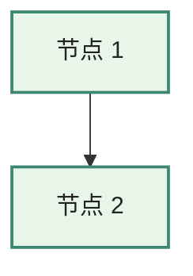

# 开发文档

## 1. 开发环境

| 工具 | 版本 | 检查命令 |
|---|---|---|
| Node.js | ≥ 18（推荐 20 LTS 或 24） | `node --version` |
| npm | ≥ 9 | `npm --version` |
| Python | ≥ 3.8（推荐 3.10+） | `python --version` |
| Git | 任意 2.x | `git --version` |

> Windows 用户：`python` 命令应能直接调用 Python 3。如装了 `py` launcher，请确认 `python` 在 PATH 里指向 3.x 版本。

## 2. 一次性准备

```bash
# 在仓库根目录
cd cad-api-docs

# 1. 装依赖（推荐用国内 npm 镜像）
npm install --registry=https://registry.npmmirror.com
# 或
npm install

# 2. 把 source/ 转为 docs/ 站点内容
npm run prepare-content
# 此命令会依次执行 import + rewrite

# 3. 启动开发服务器
npm run dev
# 浏览器打开 http://localhost:5173
```

## 3. 目录与职责

```
cad-api-docs/
├── docs/                          # VitePress 站点根目录（vitepress build docs）
│   ├── .vitepress/
│   │   ├── config.ts              # 主配置（导航 / 侧边栏 / 搜索 / Mermaid）
│   │   └── theme/
│   │       ├── index.ts           # 主题入口（默认主题 + custom.css）
│   │       └── custom.css         # 中文阅读体验微调
│   ├── index.md                   # ⚠️ 自动生成，不要手改（来自 source/文档0）
│   ├── theory.md                  # ⚠️ 自动生成（来自 source/文档1）
│   ├── comparison.md              # ⚠️ 自动生成（来自 source/文档2）
│   └── platforms/*.md             # ⚠️ 自动生成（来自 source/3.x）
├── source/                        # ✅ 真实可改的源
│   └── (11 份 V4 .md)
├── scripts/
│   ├── import_docs.py             # source/ → docs/，加 frontmatter
│   └── rewrite_links.py           # docs/ 中改写 [回链：…]
├── project-docs/                  # 工程元文档（你正在读的目录）
├── package.json
├── README.md
├── .github/workflows/pages.yml    # GitHub Pages CI（主推）
└── .gitlab-ci.yml                 # GitLab Pages CI（备选）
```

⚠️ **关键约定**：VitePress 的"项目根"是 `docs/`，不是仓库根。所以 `.vitepress/` 必须放在 `docs/` 内部。早期版本曾经把它放在仓库根，结果 VitePress 找不到 config，所有 markdown 用的都是默认配置。

## 4. 开发循环

### 4.1 修改源文档

```bash
# 1. 改 source/ 下任一 .md
vim "source/3.4-Onshape-REST-FeatureScript-API设计深度剖析-V4.md"

# 2. 重生成站点内容
npm run prepare-content

# 3. dev server 已自动热更新；如未启动则
npm run dev
```

### 4.2 调整站点结构（导航 / 侧边栏 / 主题）

只改 `.vitepress/config.ts`、`.vitepress/theme/`，不需要重跑 prepare-content。

### 4.3 加新源文档

1. 把新 `.md` 放进 `source/`
2. 在 `scripts/import_docs.py` 的 `FILE_MAP` 里加映射
3. 在 `scripts/rewrite_links.py` 的 `DOC_ROUTES` / `DOC_FILES` 里加映射（如果是 `3.x` 的厂商文档）
4. 在 `.vitepress/config.ts` 的 `nav` / `sidebar` 里加菜单项
5. `npm run prepare-content && npm run dev` 验证

### 4.4 改回链规则

如出现现有正则不支持的回链格式（例如 `[回链：附录 A 选型框架]`）：

1. 在 `scripts/rewrite_links.py` 的 `_RE_CROSS` / `_RE_INTERNAL` 等正则里加 case
2. 在 `find_*_heading` 系列函数里加对应查询逻辑
3. 跑 `npm run rewrite`，观察新匹配数

### 4.5 编辑 / 新增 Mermaid 图

源文档（V4 .md）里直接写：

````markdown

````

调试技巧：

- **本地预览**：`npm run dev` 改图后浏览器自动热更
- **离线试错**：把图源贴到 [mermaid.live](https://mermaid.live/)，所见即所得
- **配色规范**（与现有图保持一致）：
  - 主色 `#3c8772` + 浅绿底 `#e8f5e9`：核心 / 高优先级 / 内核层
  - 蓝 `#1976d2` + 浅蓝底 `#e3f2fd`：现代 / 云原生 / 前端
  - 橙 `#f57c00` + 米黄底 `#fff8e1`：传统 / 中等
  - 紫 `#7b1fa2` + 浅紫底 `#f3e5f5`：托管 / 包装层
  - 粉 `#c2185b` + 粉底 `#fce4ec`：旧 / 退化路径
- **支持的图类型**（已用到的）：`graph TB` / `timeline` / `subgraph`
- **不要用**节点 ID 含 `-` 后跟 `[` 的写法（Mermaid 会解析歧义），改用全字母 / 数字 ID
- **CJK 文本** 放 `["..."]` 引号内最稳，避免裸文字撞 mermaid 关键字

## 5. 常用命令

| 命令 | 作用 | 何时用 |
|---|---|---|
| `npm install` | 装依赖 | 首次 / 升级 VitePress |
| `npm run import` | 拷贝 source/ → docs/ | 修改了 source/ |
| `npm run rewrite` | 改写 docs/ 中的回链 | 修改了 source/ 后（已包在 prepare-content）|
| `npm run prepare-content` | import + rewrite | 任何源改动后 |
| `npm run dev` | 启动开发服务器（热更新） | 本地开发 |
| `npm run build` | 构建静态产物到 `docs/.vitepress/dist/` | 部署前 / CI |
| `npm run preview` | 预览构建产物 | 验证生产构建 |

## 6. 测试与验证

项目没有传统单元测试（脚本足够小）。但有几个**校准工具**保证关键不变量：

### 6.1 slugify 一致性校准

如果升级了 VitePress，跑这个验证 Python slugify 仍与 VitePress 一致：

```bash
# 临时建一个 Node 脚本用 VitePress 的真实 slugify 算 8 个真实标题
# （内容见 02-design.md §4.3，或参考首次实施时使用的 _verify_slugify.mjs）
node /tmp/_verify.mjs > /tmp/_vp.txt

# Python 端跑相同标题，对比
python -c "
import sys; sys.path.insert(0, 'scripts')
from rewrite_links import vitepress_slugify
for t in ['一、历史演进', '2.4 支柱 4：事件与协作', ...]:
    print(t, '->', vitepress_slugify(t))
"
```

如果 Python 输出与 Node 输出有差异，**先停手**，按 02-design.md §4.3 与 VitePress 内部 `chunk-*.js` 对照算法。

### 6.2 锚点 404 校验

构建后做一次「所有改写过的链接都能在产物 HTML 中找到 id」检查：

```python
# 一次性脚本（可放 scripts/check_anchors.py，按需写）
import os, re

DIST = 'docs/.vitepress/dist'
DOCS = 'docs'

# 收集所有页面的 id
page_ids = {}
for fn in os.listdir(os.path.join(DIST, 'platforms')):
    if fn.endswith('.html'):
        route = '/platforms/' + fn[:-5]
        html = open(os.path.join(DIST, 'platforms', fn), encoding='utf-8').read()
        page_ids[route] = set(re.findall(r'id="([^"]+)"', html))

# 检查 docs/*.md 中所有形如 [...](xx#yy) 的链接
broken = []
for fn in os.listdir(DOCS):
    if not fn.endswith('.md'):
        continue
    md = open(os.path.join(DOCS, fn), encoding='utf-8').read()
    for u in re.findall(r'\]\(([^)]+#[^)]+)\)', md):
        route, _, anchor = u.partition('#')
        if route in page_ids and anchor not in page_ids[route]:
            broken.append(u)

print('Broken anchors:', broken or '(none)')
```

期望输出 `Broken anchors: (none)`。

### 6.3 回链改写数

```bash
npm run rewrite
# 期望 "Done: rewrote 40 callback(s), skipped 3"
# 数字 40 / 3 是基线（V4 内容）。明显偏离意味着源文档有结构变化或正则失效
```

## 7. 调试技巧

### 7.1 锚点跳错位置

1. 浏览器右键标题 → 检查元素 → 看 `id="..."`
2. 对比 markdown 中链接的 anchor 部分
3. 二者不等就是 slugify 失配 → 查 `vitepress_slugify`
4. 修好后 `npm run rewrite && npm run build` 重测

### 7.2 搜索结果不对

`.vitepress/config.ts` 的 `chineseTokenize` 决定搜索分词。临时加：

```typescript
const chineseTokenize = (text: string) => {
  // ...
  console.log('[tokenize]', text, '→', tokens)  // 临时调试
  return tokens
}
```

`npm run dev`，在浏览器 Console 看分词结果。

### 7.3 build 报 dead link

VitePress 检测到死链会失败。`.vitepress/config.ts` 已设 `ignoreDeadLinks: true` 兜底；如想严格检查，临时改为 `false` 跑一次 build 找问题。

### 7.4 npm install 慢 / 失败

```bash
# 国内镜像
npm config set registry https://registry.npmmirror.com
npm install

# 个别包失败 → 清缓存
npm cache clean --force
rm -rf node_modules package-lock.json
npm install
```

## 8. CI / CD

### 8.1 GitHub Pages（主推）

`.github/workflows/pages.yml` 是当前主推。

启用步骤：

1. 仓库 Settings → Pages → Source 选 **"GitHub Actions"**
2. 推到 `main` / `master` 自动触发
3. Environment `github-pages` 自动创建，部署完成后 URL 显示在 Environments 标签下

工作流亮点：

- `actions/setup-node@v4` + `actions/setup-python@v5`，npm + pip 缓存自动启用
- `actions/cache@v4` 缓存 `docs/.vitepress/cache`，键带源文档 hash —— 源不变时增量构建
- `concurrency: { group: pages, cancel-in-progress: false }`：新提交不会插队、但旧的会跑完
- `timeout-minutes: 10`：超时硬上限，防止 CI 卡死
- `fetch-depth: 0`：lastUpdated 显示需要完整 git 历史

### 8.2 GitLab Pages（备选）

`.gitlab-ci.yml` 仅在团队基础设施基于 GitLab 时启用。两阶段流水线：

- `prepare-content`：装 Python + Node 依赖 → 跑 prepare-content → artifacts 传 docs/
- `pages`：拿到 docs/ → 构建 → mv 到 public/

镜像 `node:20-alpine` 默认无 Python，已加 `apk add --no-cache python3` 并软链 `python`。

### 8.3 子路径部署

如果 GitHub 仓库是 `myorg/cad-api-docs`，部署 URL 通常是 `https://myorg.github.io/cad-api-docs/`：

```typescript
// .vitepress/config.ts
base: '/cad-api-docs/',  // 前后都要有斜杠
```

GitLab 同理：仓库路径 `mygroup/cad-api-docs` → `base: '/cad-api-docs/'`。

## 9. 升级 VitePress / Mermaid

### 9.1 升级 VitePress

```bash
npm outdated         # 看 latest 版本
npm install vitepress@latest

# 重要：升级后必跑
node /tmp/_verify_slugify.mjs   # 如未保留，参考 02-design.md §4.3 重写
npm run prepare-content
npm run build
# 浏览器手测几个回链
```

如果 slugify 算法变了：

1. 在 VitePress 的 `node_modules/vitepress/dist/node/chunk-*.js` 里 grep `slugify` 找新算法
2. 同步更新 `scripts/rewrite_links.py` 的 `vitepress_slugify`
3. 跑 §6.1 校准

### 9.2 升级 Mermaid 或 vitepress-plugin-mermaid

```bash
npm install mermaid@latest vitepress-plugin-mermaid@latest
npm run build

# 必跑：扫一下 dist 中的 mermaid 节点数
python -c "
import os
DIST='docs/.vitepress/dist'
total = 0
for r, _, fs in os.walk(DIST):
    for f in fs:
        if f.endswith('.html'):
            total += open(os.path.join(r,f), encoding='utf-8').read().count('class=\"mermaid')
print('mermaid节点数:', total)
"
# 期望 >= 20（首批基线）；显著低于则有图渲染失败
```

如果某张图渲染失败（控制台报 syntax error）：

1. 在 `https://mermaid.live/` 上把图源贴进去看错误
2. 常见破坏性变化：`graph` 关键字默认 v10+ 改 `flowchart`、节点 ID 中 `-` 与 `[` 的混用
3. 修源 V4 .md 后 `npm run prepare-content && npm run build` 重跑

## 10. 贡献指南

### 提交规范

遵循 Conventional Commits：

```
feat(content): 加入 V5 第 9 篇厂商剖析
fix(rewrite): 处理带括号的回链格式
docs(project): 更新需求文档 §6
chore(deps): 升级 vitepress 到 1.7
ci(gitlab): 修复 alpine 镜像 Python 路径
```

### 分支策略

- `main` / `master`：稳定，CI 自动部署
- `feature/*`：功能分支，PR 后合入

### Code Review 检查项

- 是否动了 `source/`？（不允许）
- 是否动了 `docs/` 但没改 `source/`？（不允许，会被下次 prepare-content 覆盖）
- 改了 slugify 是否过 §6.1 校准？
- 改了 `import_docs.py` / `rewrite_links.py` 是否更新本开发文档？
- 改了路由是否更新 02-design.md §3？

## 11. 故障排除速查

| 症状 | 可能原因 | 处理 |
|---|---|---|
| `npm install` 报 EACCES | 权限问题 | 不要用 sudo；改 npm prefix 到用户目录 |
| `npm run dev` 报 Cannot find module | Node < 18 | 升 Node |
| 中文搜索无结果 | tokenize 函数报错 | 浏览器 Console 看错误 |
| 回链 404 | slugify 失配 | 走 §7.1 步骤 |
| 构建产物 > 50 MB | 误把图片 / 大文件放进 docs/ | 把媒体放 CDN 或 public/ |
| GitLab Pages 404 | base 配置错 | 改 `.vitepress/config.ts` 的 `base` |
| CI 报 python: command not found | 镜像缺 Python | 检查 `.gitlab-ci.yml` `before_script` |

## 12. 给后来者的话

这个项目刻意保持小：

- **三种语言**：TypeScript（配置）、Python（脚本）、Markdown（内容）
- **零自定义业务逻辑**：除了「回链改写」这一件事
- **零数据库 / 零后端**：纯静态

如果你正想加：

- 评论系统 → 不要，回到 01-requirements.md §5
- 浏览统计 → 用 Cloudflare Analytics 或 Umami 的 `<script>` 嵌入即可，不要写后端
- 用户系统 → 不要
- AI 摘要 → 先在 01-requirements.md 增订需求，再讨论方案

**保持克制是这个项目的核心质量。**
