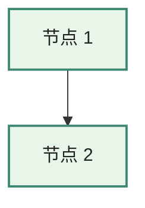

# 开发文档

## 0. 金规则：本地优先（Local-First）

**所有改动必须遵循"本地编辑 → git push → CI 自动部署"这一路径。** 这是不可协商的工作流硬规则。

```
✓ 推荐流程
  本地工作副本（D:\Work\LewisDocs\）
    ├─ 编辑 .md / config.ts / scripts/*.py / _headers …
    ├─ 本地 npm run build 验证
    ├─ git add  + git commit
    └─ git push origin main
        └─ GitHub Actions 触发 → 构建 → 部署到 Cloudflare Pages
            └─ 几十秒后 https://lewisdocs.pages.dev/ 可见

✗ 显式禁止
  ❌ 在 GitHub 网页 UI 上直接 Edit / Commit
  ❌ 在 Cloudflare Pages 面板 Settings 里改 Headers / Variables
  ❌ 在 Cloudflare Pages 面板 Files 视图里编辑 dist 内容
  ❌ 直接修改 docs/.vitepress/dist/ 的产物（每次 build 会被覆盖）
  ❌ 修改 docs/index.md / docs/theory.md 等"派生"文件（这些由 source/ 生成）
```

### 为什么这条规则不能破？

| 破坏路径 | 后果 |
|---|---|
| GitHub 网页 edit | 跳过本地构建验证；改完才知道断了 hydration / 锚点 / 搜索索引；和你本地工作副本立即分叉 |
| CF 面板改 Headers | 没进 git；下次 push CF 自动重新部署会覆盖你手改的，且没有变更历史可追溯 |
| 改 dist/ 产物 | 下次 build 全被覆盖；改了等于没改；浪费时间 |
| 改 docs/index.md 等 | `npm run prepare-content` 会从 source/ 重新生成，覆盖你的改动 |

### 哪些是"源文件"，哪些是"派生文件"

| 类型 | 路径 | 改这里 |
|---|---|---|
| **源文件**（手工编辑） | `source/*.md` | 改研究内容 |
| **源文件** | `docs/.vitepress/config.ts` | 改站点结构 / 主题 / meta |
| **源文件** | `docs/.vitepress/theme/` | 改主题 |
| **源文件** | `docs/public/` | robots.txt / ai.txt / _headers / 蜜罐页 |
| **源文件** | `scripts/*.py` | 改导入 / 改写 / 水印逻辑 |
| **源文件** | `project-docs/`、`README.md`、`LICENSE` | 元文档 |
| **源文件** | `.github/workflows/`、`package.json` | CI / 构建配置 |
| 派生文件 | `docs/index.md`、`docs/theory.md`、`docs/comparison.md`、`docs/platforms/*.md` | 由 `npm run prepare-content` 自动生成，**不要手改** |
| 派生文件 | `docs/.vitepress/dist/` | 由 `npm run build` 生成，**不要手改** |
| 派生文件 | `docs/.vitepress/cache/` | 同上 |

---

## 1. 开发环境

| 工具 | 版本 | 检查命令 |
|---|---|---|
| Node.js | ≥ 18（推荐 20 LTS 或 24） | `node --version` |
| npm | ≥ 9 | `npm --version` |
| Python | ≥ 3.8（推荐 3.10+） | `python --version` |
| Git | 任意 2.x | `git --version` |

> Windows 用户：`python` 命令应能直接调用 Python 3。如装了 `py` launcher，请确认 `python` 在 PATH 里指向 3.x 版本。

## 2. 一次性准备

```bash
# 1. 克隆 LewisDocs 到本地稳定路径（推荐 D:\Work\LewisDocs\）
git clone https://github.com/Lewis0x/LewisDocs.git "D:/Work/LewisDocs"
cd "D:/Work/LewisDocs"

# 2. 装依赖（推荐用国内 npm 镜像）
npm install --registry=https://registry.npmmirror.com
# 或
npm install

# 3. 把 source/ 转为 docs/ 站点内容
npm run prepare-content
# 此命令会依次执行 import + rewrite

# 4. 启动开发服务器
npm run dev
# 浏览器打开 http://localhost:5173
```

> **本地路径选择建议**：`D:\Work\LewisDocs\`（独立仓库，不在 Lewis0x/Work monorepo 内部）。
> 不要放进 `D:\Work\Code\…` 路径下——那里是另一个 git 仓库（Lewis0x/Work），嵌套 git 会让外层仓库把 `LewisDocs/` 视为 untracked 子目录，制造干扰。

## 3. 目录与职责

```
cad-api-docs/
├── docs/                          # VitePress 站点根目录（vitepress build docs）
│   ├── .vitepress/
│   │   ├── config.ts              # 主配置（导航 / 侧边栏 / 搜索 / Mermaid）
│   │   └── theme/
│   │       ├── index.ts           # 主题入口（默认主题 + custom.css）
│   │       └── custom.css         # 中文阅读体验微调
│   ├── index.md                   # ⚠️ 自动生成，不要手改（来自 source/文档0）
│   ├── theory.md                  # ⚠️ 自动生成（来自 source/文档1）
│   ├── comparison.md              # ⚠️ 自动生成（来自 source/文档2）
│   └── platforms/*.md             # ⚠️ 自动生成（来自 source/3.x）
├── source/                        # ✅ 真实可改的源
│   └── (11 份 V4 .md)
├── scripts/
│   ├── import_docs.py             # source/ → docs/，加 frontmatter
│   └── rewrite_links.py           # docs/ 中改写 [回链：…]
├── project-docs/                  # 工程元文档（你正在读的目录）
├── package.json
├── README.md
├── .github/workflows/pages.yml    # GitHub Pages CI（主推）
└── .gitlab-ci.yml                 # GitLab Pages CI（备选）
```

⚠️ **关键约定**：VitePress 的"项目根"是 `docs/`，不是仓库根。所以 `.vitepress/` 必须放在 `docs/` 内部。早期版本曾经把它放在仓库根，结果 VitePress 找不到 config，所有 markdown 用的都是默认配置。

## 4. 开发循环

### 4.1 修改源文档

```bash
# 1. 改 source/ 下任一 .md
vim "source/3.4-Onshape-REST-FeatureScript-API设计深度剖析-V4.md"

# 2. 重生成站点内容
npm run prepare-content

# 3. dev server 已自动热更新；如未启动则
npm run dev

# 4. 验证无误后提交并推送
git add source/
git commit -m "docs(content): 修订 Onshape §五"
git push origin main
# CI 自动接管，约 90s 后线上更新（详见 §0 工作流图）
```

### 4.2 调整站点结构（导航 / 侧边栏 / 主题）

只改 `.vitepress/config.ts`、`.vitepress/theme/`，不需要重跑 prepare-content。

### 4.3 加新源文档

1. 把新 `.md` 放进 `source/`
2. 在 `scripts/import_docs.py` 的 `FILE_MAP` 里加映射
3. 在 `scripts/rewrite_links.py` 的 `DOC_ROUTES` / `DOC_FILES` 里加映射（如果是 `3.x` 的厂商文档）
4. 在 `.vitepress/config.ts` 的 `nav` / `sidebar` 里加菜单项
5. `npm run prepare-content && npm run dev` 验证

### 4.4 改回链规则

如出现现有正则不支持的回链格式（例如 `[回链：附录 A 选型框架]`）：

1. 在 `scripts/rewrite_links.py` 的 `_RE_CROSS` / `_RE_INTERNAL` 等正则里加 case
2. 在 `find_*_heading` 系列函数里加对应查询逻辑
3. 跑 `npm run rewrite`，观察新匹配数

### 4.5 编辑 / 新增 Mermaid 图

源文档（V4 .md）里直接写：

````markdown

````

调试技巧：

- **本地预览**：`npm run dev` 改图后浏览器自动热更
- **离线试错**：把图源贴到 [mermaid.live](https://mermaid.live/)，所见即所得
- **配色规范**（与现有图保持一致）：
  - 主色 `#3c8772` + 浅绿底 `#e8f5e9`：核心 / 高优先级 / 内核层
  - 蓝 `#1976d2` + 浅蓝底 `#e3f2fd`：现代 / 云原生 / 前端
  - 橙 `#f57c00` + 米黄底 `#fff8e1`：传统 / 中等
  - 紫 `#7b1fa2` + 浅紫底 `#f3e5f5`：托管 / 包装层
  - 粉 `#c2185b` + 粉底 `#fce4ec`：旧 / 退化路径
- **支持的图类型**（已用到的）：`graph TB` / `timeline` / `subgraph`
- **不要用**节点 ID 含 `-` 后跟 `[` 的写法（Mermaid 会解析歧义），改用全字母 / 数字 ID
- **CJK 文本** 放 `["..."]` 引号内最稳，避免裸文字撞 mermaid 关键字

## 5. 常用命令

| 命令 | 作用 | 何时用 |
|---|---|---|
| `npm install` | 装依赖 | 首次 / 升级 VitePress |
| `npm run import` | 拷贝 source/ → docs/ | 修改了 source/ |
| `npm run rewrite` | 改写 docs/ 中的回链 | 修改了 source/ 后（已包在 prepare-content）|
| `npm run prepare-content` | import + rewrite | 任何源改动后 |
| `npm run dev` | 启动开发服务器（热更新） | 本地开发 |
| `npm run build` | 构建静态产物到 `docs/.vitepress/dist/` | 部署前 / CI |
| `npm run preview` | 预览构建产物 | 验证生产构建 |

## 6. 测试与验证

项目没有传统单元测试（脚本足够小）。但有几个**校准工具**保证关键不变量：

### 6.1 slugify 一致性校准

如果升级了 VitePress，跑这个验证 Python slugify 仍与 VitePress 一致：

```bash
# 临时建一个 Node 脚本用 VitePress 的真实 slugify 算 8 个真实标题
# （内容见 02-design.md §4.3，或参考首次实施时使用的 _verify_slugify.mjs）
node /tmp/_verify.mjs > /tmp/_vp.txt

# Python 端跑相同标题，对比
python -c "
import sys; sys.path.insert(0, 'scripts')
from rewrite_links import vitepress_slugify
for t in ['一、历史演进', '2.4 支柱 4：事件与协作', ...]:
    print(t, '->', vitepress_slugify(t))
"
```

如果 Python 输出与 Node 输出有差异，**先停手**，按 02-design.md §4.3 与 VitePress 内部 `chunk-*.js` 对照算法。

### 6.2 锚点 404 校验

构建后做一次「所有改写过的链接都能在产物 HTML 中找到 id」检查：

```python
# 一次性脚本（可放 scripts/check_anchors.py，按需写）
import os, re

DIST = 'docs/.vitepress/dist'
DOCS = 'docs'

# 收集所有页面的 id
page_ids = {}
for fn in os.listdir(os.path.join(DIST, 'platforms')):
    if fn.endswith('.html'):
        route = '/platforms/' + fn[:-5]
        html = open(os.path.join(DIST, 'platforms', fn), encoding='utf-8').read()
        page_ids[route] = set(re.findall(r'id="([^"]+)"', html))

# 检查 docs/*.md 中所有形如 [...](xx#yy) 的链接
broken = []
for fn in os.listdir(DOCS):
    if not fn.endswith('.md'):
        continue
    md = open(os.path.join(DOCS, fn), encoding='utf-8').read()
    for u in re.findall(r'\]\(([^)]+#[^)]+)\)', md):
        route, _, anchor = u.partition('#')
        if route in page_ids and anchor not in page_ids[route]:
            broken.append(u)

print('Broken anchors:', broken or '(none)')
```

期望输出 `Broken anchors: (none)`。

### 6.3 回链改写数

```bash
npm run rewrite
# 期望 "Done: rewrote 40 callback(s), skipped 3"
# 数字 40 / 3 是基线（V4 内容）。明显偏离意味着源文档有结构变化或正则失效
```

## 7. 调试技巧

### 7.1 锚点跳错位置

1. 浏览器右键标题 → 检查元素 → 看 `id="..."`
2. 对比 markdown 中链接的 anchor 部分
3. 二者不等就是 slugify 失配 → 查 `vitepress_slugify`
4. 修好后 `npm run rewrite && npm run build` 重测

### 7.2 搜索结果不对

`.vitepress/config.ts` 的 `chineseTokenize` 决定搜索分词。临时加：

```typescript
const chineseTokenize = (text: string) => {
  // ...
  console.log('[tokenize]', text, '→', tokens)  // 临时调试
  return tokens
}
```

`npm run dev`，在浏览器 Console 看分词结果。

### 7.3 build 报 dead link

VitePress 检测到死链会失败。`.vitepress/config.ts` 已设 `ignoreDeadLinks: true` 兜底；如想严格检查，临时改为 `false` 跑一次 build 找问题。

### 7.4 npm install 慢 / 失败

```bash
# 国内镜像
npm config set registry https://registry.npmmirror.com
npm install

# 个别包失败 → 清缓存
npm cache clean --force
rm -rf node_modules package-lock.json
npm install
```

## 8. CI / CD

### 8.1 GitHub Pages（主推）

`.github/workflows/pages.yml` 是当前主推。

启用步骤：

1. 仓库 Settings → Pages → Source 选 **"GitHub Actions"**
2. 推到 `main` / `master` 自动触发
3. Environment `github-pages` 自动创建，部署完成后 URL 显示在 Environments 标签下

工作流亮点：

- `actions/setup-node@v4` + `actions/setup-python@v5`，npm + pip 缓存自动启用
- `actions/cache@v4` 缓存 `docs/.vitepress/cache`，键带源文档 hash —— 源不变时增量构建
- `concurrency: { group: pages, cancel-in-progress: false }`：新提交不会插队、但旧的会跑完
- `timeout-minutes: 10`：超时硬上限，防止 CI 卡死
- `fetch-depth: 0`：lastUpdated 显示需要完整 git 历史

### 8.2 GitLab Pages（备选）

`.gitlab-ci.yml` 仅在团队基础设施基于 GitLab 时启用。两阶段流水线：

- `prepare-content`：装 Python + Node 依赖 → 跑 prepare-content → artifacts 传 docs/
- `pages`：拿到 docs/ → 构建 → mv 到 public/

镜像 `node:20-alpine` 默认无 Python，已加 `apk add --no-cache python3` 并软链 `python`。

### 8.3 子路径部署

如果 GitHub 仓库是 `myorg/cad-api-docs`，部署 URL 通常是 `https://myorg.github.io/cad-api-docs/`：

```typescript
// .vitepress/config.ts
base: '/cad-api-docs/',  // 前后都要有斜杠
```

GitLab 同理：仓库路径 `mygroup/cad-api-docs` → `base: '/cad-api-docs/'`。

## 9. 升级 VitePress / Mermaid

### 9.1 升级 VitePress

```bash
npm outdated         # 看 latest 版本
npm install vitepress@latest

# 重要：升级后必跑
node /tmp/_verify_slugify.mjs   # 如未保留，参考 02-design.md §4.3 重写
npm run prepare-content
npm run build
# 浏览器手测几个回链
```

如果 slugify 算法变了：

1. 在 VitePress 的 `node_modules/vitepress/dist/node/chunk-*.js` 里 grep `slugify` 找新算法
2. 同步更新 `scripts/rewrite_links.py` 的 `vitepress_slugify`
3. 跑 §6.1 校准

### 9.2 升级 Mermaid 或 vitepress-plugin-mermaid

```bash
npm install mermaid@latest vitepress-plugin-mermaid@latest
npm run build

# 必跑：扫一下 dist 中的 mermaid 节点数
python -c "
import os
DIST='docs/.vitepress/dist'
total = 0
for r, _, fs in os.walk(DIST):
    for f in fs:
        if f.endswith('.html'):
            total += open(os.path.join(r,f), encoding='utf-8').read().count('class=\"mermaid')
print('mermaid节点数:', total)
"
# 期望 >= 20（首批基线）；显著低于则有图渲染失败
```

如果某张图渲染失败（控制台报 syntax error）：

1. 在 `https://mermaid.live/` 上把图源贴进去看错误
2. 常见破坏性变化：`graph` 关键字默认 v10+ 改 `flowchart`、节点 ID 中 `-` 与 `[` 的混用
3. 修源 V4 .md 后 `npm run prepare-content && npm run build` 重跑

## 10. 贡献指南

### 提交规范

遵循 Conventional Commits：

```
feat(content): 加入 V5 第 9 篇厂商剖析
fix(rewrite): 处理带括号的回链格式
docs(project): 更新需求文档 §6
chore(deps): 升级 vitepress 到 1.7
ci(gitlab): 修复 alpine 镜像 Python 路径
```

### 分支策略

- `main` / `master`：稳定，CI 自动部署
- `feature/*`：功能分支，PR 后合入

### Code Review 检查项

- 是否动了 `source/`？（不允许）
- 是否动了 `docs/` 但没改 `source/`？（不允许，会被下次 prepare-content 覆盖）
- 改了 slugify 是否过 §6.1 校准？
- 改了 `import_docs.py` / `rewrite_links.py` 是否更新本开发文档？
- 改了路由是否更新 02-design.md §3？

## 11. 故障排除速查

| 症状 | 可能原因 | 处理 |
|---|---|---|
| `npm install` 报 EACCES | 权限问题 | 不要用 sudo；改 npm prefix 到用户目录 |
| `npm run dev` 报 Cannot find module | Node < 18 | 升 Node |
| 中文搜索无结果 | tokenize 函数报错 | 浏览器 Console 看错误 |
| 回链 404 | slugify 失配 | 走 §7.1 步骤 |
| 构建产物 > 50 MB | 误把图片 / 大文件放进 docs/ | 把媒体放 CDN 或 public/ |
| GitLab Pages 404 | base 配置错 | 改 `.vitepress/config.ts` 的 `base` |
| CI 报 python: command not found | 镜像缺 Python | 检查 `.gitlab-ci.yml` `before_script` |
| 搜索完全无结果 | heading 中无 `<a href="#…">` 锚点 | 不要在 `markdown.anchor` 设 `permalink: false`，VitePress 索引器靠它切 section |
| Cloudflare workflow `Wrangler error: 10000` | API token 缺权限 | 重新建 token，确保有 `Cloudflare Pages Edit` |
| Cloudflare workflow `project not found` | 项目名大小写不匹配 | wrangler 用 `--project-name=LewisDocs`；CF 自动小写为 `lewisdocs` 用作子域 |
| `_watermark-manifest.json` 不该在 dist 里 | CI 漏跑 strip 步骤 | 检查 `cloudflare-pages.yml` 中 `rm -f` 那行存在 |
| 水印重复注入 | sentinel 守卫失效 | 检查 `scripts/watermark.py` 中 `<!--lwm-->` 检测是否完整 |
| **某页面整页空白（其他页面正常）** | Vue scoped CSS 把 `body` 全局选择器误丢成 `display:none` | 见 §12.1 |
| 部署日志 `gh run watch` 长期飘 X 但 `success` | wrangler-action 在 `continue-on-error` step 内的 npx 报错被吞但污染了 step 状态 | 见 §12.2 |
| 表格挤进右侧大纲 | flex item 默认 `min-width: auto` = min-content，宽表撑爆 | 见 §12.3 |
| Lightbox 打开后 SVG 不显示（白底空 modal） | `v-html` 把 SVG 当 HTML 解析，丢命名空间 | 见 §12.4 |
| 全屏宽度浪费、左右各几百 px 留白 | VitePress ≥1440px 的居中 padding 公式以 `--vp-layout-max-width` 为基准 | 见 §12.5 |

## 12. 主题层踩坑录（事故沉淀，按踩坑日期倒序）

> 本节是用真金白银（实际事故）换来的具体坑，每条都包含**症状 / 根因 / 修复 / 通用教训**四块。改主题前先扫一眼。
>
> ⚠️ 写新组件 / 改 CSS 之前，**强烈建议**通读本节——大多数坑不是"是否会触发"的问题，而是"什么时候触发"。

### 12.1 整页 `body { display: none }`（2026-05-08）

**症状**：用户报告 `https://lewisdocs.pages.dev/platforms/nx` "显示为空"。但
`curl` 拉 SSR HTML 一切正常（114 KB，结构完整），其他页面也都正常。

**根因**（重大）：`OutlineResizer.vue` 的 scoped `<style>` 写了：

```css
:global(body.outline-collapsed) .lewisdocs-outline-resizer {
  display: none;
}
```

**Vue 3.5 的 scoped CSS 编译器对"`:global(parent)` + scoped child" 形态有 bug**——
本应编译成 `body.outline-collapsed .lewisdocs-outline-resizer[data-v-X]{...}`，
实际丢掉 scoped 子级，编译成：

```css
body.outline-collapsed { display: none; }   /* 整页消失 */
```

中招路径：用户曾点过"折叠大纲"按钮 → `localStorage` 存了状态 → 下次访问
`OutlineToggle` 在 `onMounted` 里给 body 加 `outline-collapsed` class →
被坏 CSS 命中 → 整页 `display:none`。**新访客**没碰过折叠按钮，body 不带 class，
看不出任何问题——所以发布前没暴露。

**修复**：把规则从 `.vue` 的 scoped style 移到 `custom.css`（unscoped 全局规则），
和其他 `body.outline-collapsed` descendant 规则放一起。Vue 编译器不参与 → 不会被改。

**通用教训**（同等优先级 3 条）：

1. **任何涉及 body / html 全局 class 的样式规则，一律放 `custom.css`，不要进 `.vue` scoped style**。Vue scoped 与 `:global()` 嵌套语义有歧义，编译器实现不稳定。
2. **localStorage 状态会"延迟引爆"无法在新会话首次访问发现的 bug**。任何用 localStorage 持久化 UI 状态的组件，发布后必须用一个**之前用过该状态的浏览器**实测一遍。
3. **SSR HTML 正常 ≠ 页面正常显示**。关键 bug 在 hydration 后才发生。`curl` 只能验证 SSR；CSS / JS bug 必须实际打开浏览器看。

**自检命令**（建议加 lint）：

```bash
# 找所有 .vue scoped style 中混用了 :global(body|html ...) 的写法
grep -rn ':global(body\|:global(html' docs/.vitepress/theme/components/
# 应输出 0 行
```

---

### 12.2 CI deploy 永久飘 X 但实际 success（2026-05-05 → 2026-05-06）

**症状**：每次 push 后 `gh run watch` 末尾打印 `X process npx failed exit code 1`，
但 `gh run list` 显示该 run 状态 `success`，site 也正常更新。

**根因**：`cloudflare/wrangler-action@v3` 启动时跑 `npx --no-install wrangler --version`
做版本检测。npm 11+ 行为变化：找不到包时不再静默失败，而是要求 `--yes` 确认。
该错误虽被 step 的 `continue-on-error: true` 吞掉，但 step 个体状态仍标失败，
让 `gh run watch` 把 X 报上来——尽管整 run 是 success。

更糟的是：`Ensure project exists` 步骤的实际命令（`pages project create`）每次 push
也会失败，因为项目早已存在 → CF API 返 409。也是 `continue-on-error` 吞掉。
两层叠加，X 永远飘。

**修复**（演进了 3 个 PR 才彻底解决）：
1. PR #4：在 wrangler-action 加 `wranglerVersion: '3.90.0'`（不够，pre-flight 早于 pin 应用）
2. PR #11：在 step 之前加 `npm install -g wrangler@3.90.0`，让 pre-flight 直接命中（消除 npx 噪声）
3. PR #12：把 `Ensure project exists` 加 `if: github.event_name == 'workflow_dispatch'`，平时不跑（消除 409 噪声）

**通用教训**：

- `continue-on-error: true` 只控制 **workflow 是否继续**，不抑制 step **个体的失败状态**。`gh run watch` / GitHub UI 仍会反映 step 失败。
- 想真正"step 失败但表面无声"，要么用 shell `|| true` 包，要么把 step 拆成两个（一个不会失败的检测 + 一个可能失败的实际操作）。
- 对于"项目已存在 → API 409"这种**幂等性失败**，正解是在 step 加 `if:` 条件让它不跑，而不是吞错。

---

### 12.3 表格挤进右侧大纲 / 整页内容溢出（2026-05-06）

**症状**：12 列横向对比矩阵的右几列被右侧"本页大纲"挡住。把内容容器
`max-width` 解除后情况更糟，宽表整体往右溢出。

**根因**：CSS Flexbox 子元素的默认 `min-width: auto`（= min-content）。当 `.content`
是 flex 子项、内部有宽表时，`min-content` 会强制 `.content` 至少撑到宽表的最窄
不换行宽度——即 flex item 不允许收缩到小于内容固有宽度。结果宽表把
`.content` 推到 aside 之下。

**修复**：

```css
.VPDoc.has-aside .content { min-width: 0 !important; }    /* 允许 flex 收缩 */
.vp-doc table { display: table; ... }                       /* 表格自然宽度 */
.vp-doc .table-scroll-wrapper.table-wide table {            /* 宽表才允许 max-content */
  min-width: max-content;
}
```

**通用教训**：

- **flex item 默认 `min-width: auto`**——任何 "flex 子项被宽内容撑爆" 的问题，第一反应就是 `min-width: 0`。
- **宽表的 horizontal scroll 必须由 wrapper 提供，不能由 table 本身**：`display: table` 时 `overflow-x: auto` 不生效（table 不创建 scroll container）；改 `display: block` 又会让 sticky thead 失效（table 变成 sticky 的 ancestor，thead 锚到 table 内部而非视口）。**正解是在 table 外包一层 div 做 overflow-x，table 保持 display:table**。

---

### 12.4 Lightbox 打开后 SVG 看不见（2026-05-06）

**症状**：点 Mermaid 图后，全屏遮罩层正常打开，但中间的图区域空白 / 看不到内容。

**根因**：原版 Lightbox 用 `<div v-html="srcSvg" />` 把 Mermaid SVG 的 `outerHTML`
字符串塞进 div。但 **SVG 通过 `innerHTML` 注入 HTML 元素时，浏览器按 HTML
命名空间解析子节点**——SVG 节点虽被创建，但属于 HTML 命名空间，浏览器不
渲染（生成"幽灵节点"）。

**修复**：改用 `cloneNode(true)` 复制原 SVG 节点 + `appendChild` 到 stage div。
克隆节点保留 SVG 命名空间，正常渲染。

**通用教训**：

- **HTML 容器内的 SVG 必须靠 `<svg>` 直接出现，或用 `cloneNode` / `DOMParser('image/svg+xml')` 创建**。
- `v-html` / `innerHTML` 不能跨命名空间。
- 类似 trap：MathML 元素也有同样问题（HTML 容器内 v-html MathML 字符串不渲染）。

---

### 12.5 大屏（≥1440 px）左右各留 100+ px 空白（2026-05-06）

**症状**：用户在 1920+ 屏幕上抱怨"网页左侧还有些空白没有利用上"。

**根因**：VitePress ≥1440px 时启动 centering padding 公式：

```css
.VPContent.has-sidebar {
  padding-right: calc((100vw - var(--vp-layout-max-width)) / 2);
  padding-left:  calc((100vw - var(--vp-layout-max-width)) / 2 + var(--vp-sidebar-width));
}
```

默认 `--vp-layout-max-width: 1440px`。在 1920px 屏上左右各留 240px。
我之前把它改成 1600px，仍剩 160px。

**修复**：

```css
@media (min-width: 1440px) {
  :root { --vp-layout-max-width: 100vw; }   /* 让 centering 公式归零 */
}
```

`(100vw - 100vw) / 2 = 0` → padding 归零 → sidebar 贴左、content 顶满。

**通用教训**：

- 改 VitePress 默认布局**不要去 override 多条具体的 padding/margin 规则**——抓 source-of-truth 的 CSS 变量改。
- VitePress 多个尺寸（layout、sidebar 宽度等）都通过 `--vp-*` 变量驱动；改变量即可批量生效，避开"覆盖式" override 的级联陷阱。
- `--vp-layout-max-width: 100vw` 是个好套路：让 centering 自动失效而不破坏其他依赖该变量的计算。

---

### 12.6 sticky thead 在 wrapper 内锚错位置 / 表格行序错乱（2026-05-08）

**症状**：用户两次报告 `https://lewisdocs.pages.dev/platforms/nx` 的表格"显示不对"。
浏览器实测看到 §1.1 / §1.2 表格的表头行（如"年份/事件"）渲染在第一行数据
（"1972 / United Computing..."）**之下**，整张表行序错乱。

**根因**（重大，PR #10 起的连环错）：

PR #10 给每张 `<table>` 包了 `.table-scroll-wrapper { overflow-x: auto }`（提供横向
滚动）+ 给 `thead th` 加了 `position: sticky; top: var(--vp-nav-height)`（吸顶效果）。
PR #10 commit message 自信地写"wrapper 让 sticky 能传播到页面视口"——**这个
推理是错的**。

CSS Overflow Module Level 3 明确：**任何 `overflow-x` 不为 `visible` 的元素都会
成为 scroll container（且对 X / Y 双轴都生效）**。所以 wrapper 是 sticky 的
"参照容器"，不是页面视口。

浏览器实测数据：
```
table 顶部           = 49.875 px
thead th sticky 位置 = 113.875 px  (= 49.875 + 64)  ← 锚到 wrapper-top + sticky.top
tbody 第一行         = 90.875 px   (= 49.875 + thead.height)  ← 自然流走
```

→ thead 比 tbody 第一行**低 23 px**，视觉上第一行从表头上方冒出来，整张表
看起来"错位"。

**修复**：删掉 sticky thead 规则。表格回归自然布局。wrapper 保留（不影响普通表，
对真正宽到爆的 12 列矩阵仍提供横向滚动）。

**为什么 PR #10 / #13 多次没发现**（最重要的反思）：

我每次 PR 后只做了：
1. ✅ `npm run build` clean
2. ✅ 检查 CSS bundle 是否包含新规则（sticky 规则确实在）
3. ✅ 检查 HTML 结构合法（table / thead / tbody / tr 都对）
4. ✅ 检查 0 broken anchors

**全部都是静态检查，没有一次真正用浏览器打开页面看 sticky 实际效果**。
Sticky 是"运行时 + 滚动相关"行为，bundle 里的规则文本对、HTML 结构对
都不能验证它的真实表现。**布局类 / 滚动相关的 CSS PR 必须人眼看 2 遍**：
顶部一遍、滚动后再一遍。

**通用教训**（同等优先级 4 条）：

1. **CSS sticky 在 scroll container 内只能锚到 scroll container 自己，不能"穿透"到外层视口**——`overflow-x: auto` 同样会成为锚（不只是 `overflow-y`）。想 sticky 锚到视口，sticky 元素的所有祖先到根都不能是 scroll container。
2. **跨命名空间 sticky 行为没有"propagate to outer scroll"语义**。如果 wrapper 必须 `overflow-x: auto`（横向滚需求），就别试图同时让 thead sticky 锚到视口——这两件事 CSS 互斥，必须二选一或上 JS。
3. **layout / sticky / 滚动行为不能用 bundle 检查代替肉眼**。修复 PR 必须打开浏览器、滚动、看效果。"Build clean + bundle 包含规则"是必要不是充分。
4. **commit message 中的因果推理不等于事实**——PR #10 的 commit 写"wrapper 让 sticky 锚到视口"是错的；这种"自圆其说"的推理一旦写下，会误导后续 PR（包括我自己读 git log 时）。理论假设要在浏览器实测后才能写进 commit。

**未来重新引入 sticky thead 的正确路径**：用 JS 监听 scroll，用 fixed-positioned
的 cloned thead 跟随。不要再尝试纯 CSS sticky + wrapper 组合。

---

### 12.7 段落 80ch cap 在大屏上浪费 35% 空间（2026-05-08）

**症状**：用户截图显示 2048px 屏幕上 content 区域中段大片空白——文字只占左半边，
右半边到 outline 之间空着。

**根因**：早期为"控制中文阅读行宽"加了

```css
.vp-doc > div > p,
.vp-doc > div > ul,
.vp-doc > div > ol,
.vp-doc > div > blockquote {
  max-width: 80ch;
}
```

但实际：sidebar (272px) + aside (224-560px 用户可调) 已经天然把 content 区限到
合理宽度。再叠 80ch cap 在大屏上就：

```
viewport         = 2048px
content-container = 1377px (扣除 sidebar + aside)
段落实际宽度      = 751px (被 80ch 卡住)
浪费               = 626px (45%)
```

**修复**：直接撤掉 80ch cap。让 sidebar/aside 作为唯一约束源，aside 宽度由
用户通过 OutlineResizer 拖拽控制——把行宽控制权交给用户，比固定 cap 灵活。

修复后实测：段落宽度从 751 涨到 1359（吃满容器减一点 padding），浪费 1.3%。

**通用教训**：

1. **CSS 约束要"一处足够"**——sidebar/aside flex layout 已经在约束 content 宽度时，正文段落不需要再叠 max-width。多重约束 = 取最小，而最小那一层往往不是你想要的。
2. **"为可读性设防御"的固定值在大屏上往往变成浪费**——80ch 在 1080p 屏幕上合理，在 2K/4K 屏上就显得局促。如果是 readability cap，应该用 `min(80ch, 100% - padding)` 之类相对值，或干脆把控制权交给用户（resizable aside）。
3. **再次印证 §12.6 教训**：layout 类 PR 必须用浏览器实测确认布局占用。我加 80ch cap 时只看了"代码逻辑对"，没在大屏上看实际效果——直到用户截图才发现。

---

### 12.x 模板（写新条目时复制此结构）

```markdown
### 12.N 一句话症状（YYYY-MM-DD）

**症状**：用户/测试看到的现象。

**根因**：技术性的根本原因（含错误链）。

**修复**：具体改了什么。

**通用教训**：抽象出来对未来类似问题有用的规则（1-3 条，每条独立可复用）。
```

---

## 13. 反爬运维 SOP

防御层布局见 [02-design.md ADR-009](./02-design.md)。本节是**操作手册**。

### 13.1 当前部署形态（`*.pages.dev` 子域）能用的边缘控制

⚠️ **关键事实**：Cloudflare WAF Custom Rules / Bot Fight Mode 自定义 / Rate Limiting 是 **Zone（域名）层级**功能。绑定**自定义域名**之前，`lewisdocs.pages.dev` 项目的 Settings 页里**只有** Variables / Bindings / Runtime / General 四块，没有 Security / WAF / Bots / Rate Limit 入口。

因此**当前架构**下的 L2 边缘控制只有两条：

#### 13.1.1 `docs/public/_headers`（受版本控制，Pages 自动生效）

每次 deploy 自动生效，无需面板操作。当前内容（[源文件](../docs/public/_headers)）：

| 路径 | Header | 作用 |
|---|---|---|
| `/*` | `X-Robots-Tag: noindex,nofollow,noarchive,nosnippet,noimageindex,nocache` | 比 `<meta>` 更早；只看 HTTP 头不解析 HTML 的爬虫也拦得住 |
| `/*` | `Referrer-Policy: no-referrer` | 减少点击外链时泄露站内 URL |
| `/*` | `X-Content-Type-Options: nosniff` | 防 MIME 嗅探攻击 |
| `/*` | `X-Frame-Options: DENY` | 防被 iframe 嵌套抓取 |
| `/*` | `Permissions-Policy: browsing-topics=(), interest-cohort=()` | 拒 FLoC / Topics API 等浏览器侧追踪 |
| `/*` | `Cross-Origin-Opener-Policy: same-origin` | 隔离弹窗拿不到 window.opener |
| `/_honeypot/*` | `Cache-Control: no-store, no-cache, must-revalidate` | 蜜罐永不缓存，每次命中都到边缘 |
| `/robots.txt`, `/ai.txt`, `/LICENSE` | `Cache-Control: public, max-age=300` | 政策类文件 5 分钟短缓存，改了就快速生效 |

**修改方法**：改 `docs/public/_headers` 文件 → 推 main → CI 自动部署。**禁止**通过 Cloudflare 面板的 Headers UI 改（会和 git 不同步）。

#### 13.1.2 Cloudflare 自动施加的"基线"防御（不可见、不可调）

`*.pages.dev` 自动享受：DDoS 抗压 / HTTPS 强制 / 通用 Bot 评分 / SNI 边缘缓存。这部分没有 UI，没有规则可写，只是底线兜底。

### 13.2 升级到完整 L2：绑定自定义域名（可选）

当下面的任一条件成立时建议升级：

- 单月看到的 bot 流量异常飙升
- 团队希望用更友好的 URL（如 `docs.your-company.cn`）
- 想拿 WAF Custom Rules / Rate Limiting / Turnstile Challenge

升级步骤：

1. **拥有一个域名**（任何 TLD，`.xyz` 注册价 ~$1/年起）
2. **Cloudflare 接管 DNS**：Dashboard → Add a site → 输域名 → 按提示改 NS 到 Cloudflare
3. **Pages 项目 → Custom domains → Set up a custom domain** → 输入子域如 `docs.your-domain.cn`
4. CF 自动给该子域签 SSL 证书
5. **回到 Dashboard → 选刚加的 domain（Zone）→ 左侧 Security 菜单**——这才出现 WAF / Bots / Rate Limit
6. 配置以下规则（只在 zone 层有效）：

   **Security › Bots › Bot Fight Mode** → ON

   **Security › WAF › Custom rules** → 新建两条：

   ```
   #1 屏蔽已知 AI bot UA（兜底）
   Field: User Agent  Operator: contains (any of)
   Value: GPTBot, OAI-SearchBot, ClaudeBot, anthropic-ai, CCBot,
          Bytespider, PerplexityBot, Google-Extended, Applebot-Extended,
          Amazonbot, Diffbot, cohere-ai, Meta-ExternalAgent, FacebookBot
   Action: Block
   ```

   ```
   #2 蜜罐路径拉黑
   Field: URI Path  Operator: contains
   Value: /_honeypot/
   Action: Block
   ```

   **Security › Settings › Rate Limiting** → 新建：
   ```
   When: same IP requests same URI > 50 times in 1 minute
   Then: Managed Challenge
   ```

   **Security › Settings › Browser Integrity Check** → ON

   **(Pro $20/月) Security › Bots › Super Bot Fight Mode** → AI Scrapers and Crawlers = Block

7. 同步把 Pages → Custom domains 中的 `*.pages.dev` 设置为 redirect 到 custom domain（`Redirect to custom domain` 选项），杜绝有人绕过 WAF 直接访问 pages.dev

### 13.3 日常巡检（每两周）

- **当前形态（无自定义域名）**：Cloudflare Dashboard → Analytics & Logs（账号级）查看 lewisdocs.pages.dev 的 24h request 量，确认无异常爬取
- **有自定义域名后**：Dashboard → 选 domain → Analytics & Logs → Security Events：看 Block 趋势 / Top Source IP / Top User Agent
- WAF 规则误伤：合法用户被 Challenge → Security › Tools › IP Access Rules → Action: Allow

### 13.4 水印取证流程

当怀疑某段我们的内容被采集进了某个语料 / AI 模型 / 抓取站时：

```bash
# 0) 备份 manifest（CI artifact 90 天就过期，重要构建归档到本地）
gh run download <run-id> -n watermark-manifest-<sha>

# 1) 抓嫌疑文本（任一种）：
#   (a) 直接 stdin 喂
echo "$SUSPECT_TEXT" | python scripts/scan_corpus.py manifest.json

#   (b) 远程 URL
python scripts/scan_corpus.py manifest.json --url https://suspicious.example.com/page

#   (c) 整目录批量
python scripts/scan_corpus.py manifest.json --dir ./downloaded_corpus/

# 2) 命中输出：
#   exact   page=platforms/onshape.html  payload=platforms/onshape.html|<build-sha>
#   ↑ 反查到具体页面 + 具体构建版本

# 3) 准备 DMCA：复制 project-docs/dmca-template.md，填入 manifest 反查的 URL
```

水印特征：每页 96 bit（48 个零宽字符），用 sentinel `<!--lwm-->...<!--/lwm-->` 包裹。
即使被 markdown normalizer 部分清理，前 24 字符 prefix match 仍能命中（partial）。

### 13.5 误报响应

合法读者被 Cloudflare 误挡（极少见）：
- 在 CF Dashboard → Security Events → 找到该 IP 的 Block 记录
- 临时白名单：Security › Tools › IP Access Rules → Action: Allow
- 长期方案：调整 WAF 规则的精度（缩小 UA 列表 / 提高 Rate Limit 阈值）

### 13.6 升级路径（按需启用）

| 触发条件 | 升级动作 |
|---|---|
| 单月 Block > 10k | 升 Cloudflare Pro（$20/月）开 Super Bot Fight Mode |
| 出现大规模分布式爬取 | 加 Cloudflare Turnstile widget 到所有 nav 链接（需改主题，非透明） |
| 内容被泄漏到公开数据集 | 走 DMCA 模板（`project-docs/dmca-template.md`） + Hugging Face removal request |
| 持续被同一 IP 段攻击 | 在 CF 面板加国家 / 网段级 Block |

### 13.7 不要做的事

- ❌ 不要禁用 watermark.py（CI 会失去取证能力）
- ❌ 不要把 `_watermark-manifest.json` 上传到任何公开仓库（manifest 一旦泄漏，水印就废）
- ❌ 不要把 robots.txt 改成 `Allow:` —— 反爬整套设计假设我们 deny by default
- ❌ 不要在 UI 加任何"this site is protected by …"提示（用户体验 + 反向暴露细节）

---

## 14. 给后来者的话

这个项目刻意保持小：

- **三种语言**：TypeScript（配置）、Python（脚本）、Markdown（内容）
- **零自定义业务逻辑**：除了「回链改写」这一件事
- **零数据库 / 零后端**：纯静态

如果你正想加：

- 评论系统 → 不要，回到 01-requirements.md §5
- 浏览统计 → 用 Cloudflare Analytics 或 Umami 的 `<script>` 嵌入即可，不要写后端
- 用户系统 → 不要
- AI 摘要 → 先在 01-requirements.md 增订需求，再讨论方案

**保持克制是这个项目的核心质量。**
