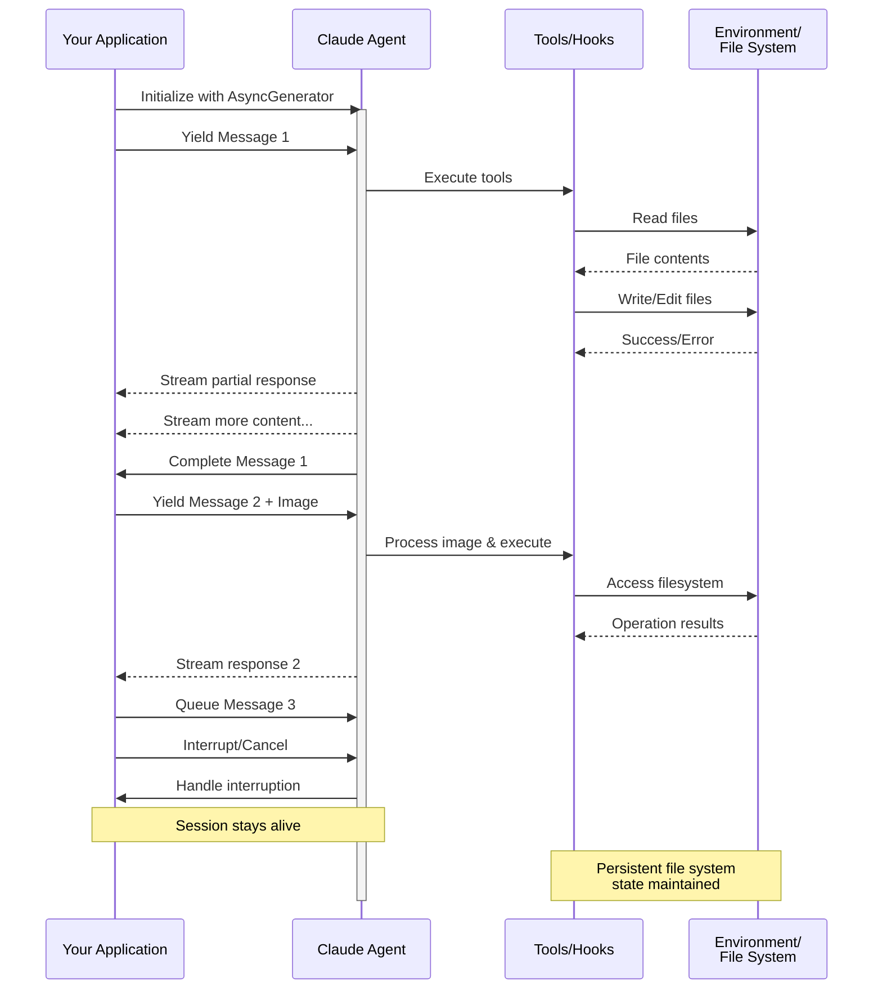

本页由 AI 翻译，可能存在误差；如有歧义，以英文原文为准。

[Official source](https://code.claude.com/docs/en/agent-sdk/streaming-vs-single-mode)

Content owner: Anthropic

> ## 文档索引
> 在以下地址获取完整的文档索引：https://code.claude.com/docs/llms.txt
> 使用此文件可在深入探索之前发现所有可用页面。

# 流式输入

> 了解 Claude Agent SDK 的两种输入模式，以及分别应在何时使用

## 概述

Claude Agent SDK 支持两种不同的输入模式来与代理交互：

* **流式输入模式**（默认且推荐）- 持久的交互式会话
* **单消息输入** - 使用会话状态与恢复功能的一次性查询

本指南说明两种模式的区别、优势和使用场景，帮助你为应用选择正确的方法。

## 流式输入模式（推荐）

流式输入模式是使用 Claude Agent SDK 的**首选**方式。它提供对代理能力的完整访问，并支持丰富的交互式体验。

它允许代理作为长期运行的进程工作，接收用户输入、处理中断、显示权限请求，并处理会话管理。

### 工作原理



### 优势

<CardGroup cols={2}>
  <Card title="图片上传" icon="image">
    将图片直接附加到消息中，以进行视觉分析和理解
  </Card>

  <Card title="排队消息" icon="stack">
    发送多条按顺序处理的消息，并能中断处理
  </Card>

  <Card title="工具集成" icon="wrench">
    在会话期间完整访问所有工具和自定义 MCP 服务器
  </Card>

  <Card title="实时反馈" icon="lightning">
    在响应生成时查看内容，而不只是等待最终结果
  </Card>

  <Card title="上下文持久化" icon="database">
    自然地在多个轮次之间保持对话上下文
  </Card>
</CardGroup>

### 实现示例

以下示例会从工作目录读取名为 `diagram.png` 的图片。请先在该目录中创建图片，或将文件名改为指向你自己的图片。

<CodeGroup>
  ```typescript TypeScript theme={null}
  import { query, type SDKUserMessage } from "@anthropic-ai/claude-agent-sdk";
  import { readFile } from "fs/promises";

  async function* generateMessages(): AsyncGenerator<SDKUserMessage> {
    // First message
    yield {
      type: "user",
      message: {
        role: "user",
        content: "Analyze this codebase for security issues"
      },
      parent_tool_use_id: null
    };

    // Wait for conditions or user input
    await new Promise((resolve) => setTimeout(resolve, 2000));

    // Follow-up with image
    yield {
      type: "user",
      message: {
        role: "user",
        content: [
          {
            type: "text",
            text: "Review this architecture diagram"
          },
          {
            type: "image",
            source: {
              type: "base64",
              media_type: "image/png",
              data: await readFile("diagram.png", "base64")
            }
          }
        ]
      },
      parent_tool_use_id: null
    };
  }

  // Process streaming responses
  for await (const message of query({
    prompt: generateMessages(),
    options: {
      maxTurns: 10,
      allowedTools: ["Read", "Grep"]
    }
  })) {
    if (message.type === "result" && message.subtype === "success") {
      console.log(message.result);
    }
  }
  ```

  ```python Python theme={null}
  from claude_agent_sdk import (
      ClaudeSDKClient,
      ClaudeAgentOptions,
      AssistantMessage,
      TextBlock,
  )
  import asyncio
  import base64


  async def streaming_analysis():
      async def message_generator():
          # First message
          yield {
              "type": "user",
              "message": {
                  "role": "user",
                  "content": "Analyze this codebase for security issues",
              },
          }

          # Wait for conditions
          await asyncio.sleep(2)

          # Follow-up with image
          with open("diagram.png", "rb") as f:
              image_data = base64.b64encode(f.read()).decode()

          yield {
              "type": "user",
              "message": {
                  "role": "user",
                  "content": [
                      {"type": "text", "text": "Review this architecture diagram"},
                      {
                          "type": "image",
                          "source": {
                              "type": "base64",
                              "media_type": "image/png",
                              "data": image_data,
                          },
                      },
                  ],
              },
          }

      # Use ClaudeSDKClient for streaming input
      options = ClaudeAgentOptions(max_turns=10, allowed_tools=["Read", "Grep"])

      async with ClaudeSDKClient(options) as client:
          # Send streaming input
          await client.query(message_generator())

          # Process responses
          async for message in client.receive_response():
              if isinstance(message, AssistantMessage):
                  for block in message.content:
                      if isinstance(block, TextBlock):
                          print(block.text)


  asyncio.run(streaming_analysis())
  ```
</CodeGroup>

运行示例时，TypeScript 版本会在每个响应完成时将其输出。Python 版本的 `receive_response()` 循环会在第一条结果消息处结束，因此它只输出安全分析；若要读取两个响应，请像 [Python 参考中的继续对话示例](/docs/en/agent-sdk/python#example-continuing-a-conversation)那样，为每条消息分别使用一对 `query()` 和 `receive_response()`。

<Note>
  在 TypeScript SDK 中，如果消息生成器抛出异常（例如它读取的文件不存在），流会以内容为 `Claude Code process aborted by user` 的错误结束，而不是原始错误；因此看到该消息时，请先检查生成器内的代码。该错误之前还可能出现一长行压缩后的捆绑 SDK 源代码，所以请读到输出末尾以查看错误文本。

  在 Python SDK 中，生成器异常会以 debug 级别记录，而会话会停滞且不抛出异常；因此，如果流式会话挂起且没有输出，请启用调试日志并检查生成器。
</Note>

## 单消息输入

单消息输入更简单，但限制也更多。

### 何时使用单消息输入

在以下情况下使用单消息输入：

* 你需要一次性响应
* 你不需要图片附件或会话中途控制方法
* 你需要在无状态环境（例如 Lambda 函数）中运行

### 限制

<Warning>
  单消息输入模式**不**支持：

  * 在消息中直接附加图片
  * 动态消息排队
  * 实时中断
  * 自然的多轮对话
</Warning>

如果查询以错误结果（例如 `error_max_turns`）结束，单消息 `query()` 调用会先生成最终结果消息，然后抛出一个包含失败文本的错误；如果代码需要继续运行，请将循环包装在 try 块中。有关结果子类型，请参阅[处理结果](/docs/en/agent-sdk/agent-loop#handle-the-result)。

### 实现示例

<CodeGroup>
  ```typescript TypeScript theme={null}
  import { query } from "@anthropic-ai/claude-agent-sdk";

  // Simple one-shot query
  // query() throws after an error result, such as error_max_turns
  try {
    for await (const message of query({
      prompt: "Explain the authentication flow",
      options: {
        maxTurns: 5,
        allowedTools: ["Read", "Grep"]
      }
    })) {
      if (message.type === "result" && message.subtype === "success") {
        console.log(message.result);
      }
    }
  } catch (error) {
    console.error(`Query failed: ${error}`);
  }

  // Continue conversation with session management
  try {
    for await (const message of query({
      prompt: "Now explain the authorization process",
      options: {
        continue: true,
        maxTurns: 5
      }
    })) {
      if (message.type === "result" && message.subtype === "success") {
        console.log(message.result);
      }
    }
  } catch (error) {
    console.error(`Query failed: ${error}`);
  }
  ```

  ```python Python theme={null}
  from claude_agent_sdk import query, ClaudeAgentOptions, ResultMessage
  import asyncio


  async def single_message_example():
      # Simple one-shot query using query() function
      # query() raises after an error result, such as error_max_turns
      try:
          async for message in query(
              prompt="Explain the authentication flow",
              options=ClaudeAgentOptions(max_turns=5, allowed_tools=["Read", "Grep"]),
          ):
              if isinstance(message, ResultMessage) and message.subtype == "success":
                  print(message.result)
      # The SDK raises a plain Exception for error results, so match Exception here
      except Exception as e:
          print(f"Query failed: {e}")

      # Continue conversation with session management
      try:
          async for message in query(
              prompt="Now explain the authorization process",
              options=ClaudeAgentOptions(continue_conversation=True, max_turns=5),
          ):
              if isinstance(message, ResultMessage) and message.subtype == "success":
                  print(message.result)
      except Exception as e:
          print(f"Query failed: {e}")


  asyncio.run(single_message_example())
  ```
</CodeGroup>

运行示例时，每个查询都会输出其最终结果文本：先输出身份验证说明，再输出授权说明。
