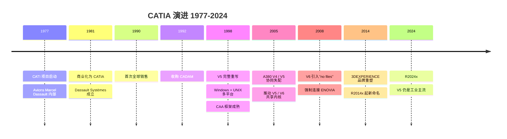
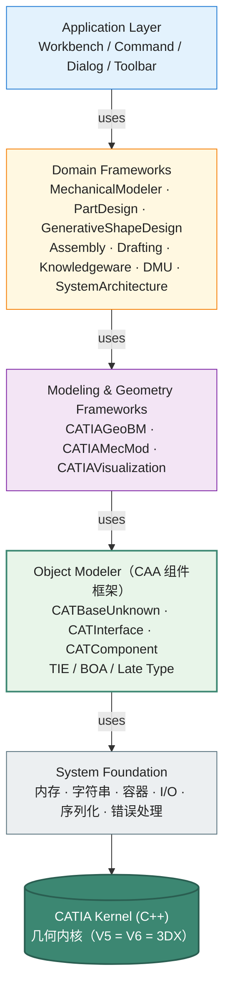

# CATIA CAA RADE API 设计深度剖析

> 文档 3.2｜厂商深度剖析系列｜通用 CAD 平台 API 设计哲学
>

---

## 阅读约定

- `<sup>[类别 N]</sup>`：段落或论断的来源标注，N 对应文末参考来源编号
- `> **[推论]**`：基于已知事实的合理推断，非来自厂商或权威资料的直接陈述
- `> **[评论]**`：本报告作者的主观归纳、判断或行业观察
- ⚠️ **勘误**：对常见社区资料中事实错误的修正

来源类别：`[官方]` `[新闻]` `[百科]` `[第三方]` `[书籍]`

---

## TL;DR

- **CAA = Component Application Architecture**<sup>[第三方 1][第三方 2][第三方 3]</sup>。⚠️ **重要事实澄清**：社区中有将 CAA 误传为 "Common Application Architecture" 的常见说法——但多个独立第三方资料（catia-caa.com、PLM Coach、IBM CAA RADE V5.16 公告）均确认正确名称为 **Component Application Architecture**<sup>[第三方 1][第三方 2][官方 4]</sup>。
- **RADE = Rapid Application Development Environment**<sup>[第三方 2][官方 4]</sup>：CATIA 自研的 IDE 集成层，与 Microsoft Visual Studio 紧密整合。`CAA + RADE` 合称表示 "API + 开发工具"，是 CATIA 二次开发的官方完整体系。
- **CAA 是 in-process 原生 C++ SDK + 严格组件模型**<sup>[第三方 1][第三方 2]</sup>：扩展模块编译为 Windows DLL，加载到 CATIA 进程内。但与 ObjectARX/MicroStationAPI 不同的是，CAA 强制使用其专属的 **CAA Object Modeler**——一种基于 COM 概念但不直接使用 Windows COM 的组件框架<sup>[第三方 5]</sup>。
- **Workspace / Framework / Module 三级源码组织**：CAA 项目的物理结构是固定的三层<sup>[第三方 6][第三方 7]</sup>。每个 Framework 必须有 `IdentityCard` 声明依赖关系，由 mkmk 工具在编译期检查 API 使用合法性。
- **Authorized API vs Internal API**：CAA API 划分为"授权"与"内部"两类<sup>[第三方 5]</sup>。授权 API 受 Dassault 长期兼容承诺保护，Internal API 可能在任何 SP 中变更。**mkmk 编译期校验**强制开发者只使用授权 API——这是 CAA 区别于其他 CAD SDK 的关键设计。
- **Late Type / TIE / BOA / Extension 多种扩展机制**<sup>[第三方 5][第三方 8]</sup>：CAA 提供丰富的"运行时类型扩展"机制，让第三方开发者在不修改原类的情况下增加接口实现。这些机制层次多、概念复杂，是 CAA 学习曲线陡峭的核心原因之一。
- **Spec / Result / Update 三段式**是 CATIA 特征建模的核心范式<sup>[第三方 9][第三方 10]</sup>：用户定义 Spec（参数），引擎计算 Result（几何），用户触发 Update。这种声明式建模是 CATIA 在航空航天领域成功的关键设计。
- **CATIA V5 → V6 → 3DEXPERIENCE 三代平台演进**：V5（1998 完整重写支持 Windows NT）<sup>[百科 11]</sup> → V6（2008 引入 ENOVIA 数据库强制集成、"no files" 概念）<sup>[第三方 12][百科 11]</sup> → 3DEXPERIENCE Platform R2014x（2014 替代 V6 品牌）<sup>[第三方 13][百科 11]</sup>。CATIA V5 至今仍在工业界主流使用<sup>[第三方 14]</sup>。
- **2005 年 Dassault 收购 MatrixOne**<sup>[第三方 12]</sup>，成为 ENOVIA V6 / 3DEXPERIENCE 数据库的基座。
- **Airbus A380 案例**：CATIA V4/V5 混用与跨版本数据迁移是 A380 项目中常被引用的工程协同问题之一<sup>[百科 11]</sup>。公开资料中提到约 61 亿美元量级的额外成本与多年延期，但这一数字属量级参考，不宜表述为"完全由 V4 → V5 转换单一因素直接造成"的精确归因结论。这一案例是 CAD 跨版本协同与数据互通风险中最常被引用的工业案例之一。

---

## Key Findings

1. **CATIA 全称**：Computer-Aided Three-dimensional Interactive Application<sup>[百科 11]</sup>，源自法语 "Conception Assistée Tridimensionnelle Interactive"，1981 年从 CATI 改名为 CATIA。
2. **CATIA 创立背景**：1977 年法国飞机制造商 Avions Marcel Dassault 内部开发，初衷是为 Mirage 战斗机的曲面建模与数控加工<sup>[百科 11]</sup>。1981 年成立子公司 Dassault Systèmes 商业化销售。
3. **CATIA 核心市场**：航空航天、汽车制造、造船、工业装备、建筑（Frank Gehry 等）<sup>[百科 11]</sup>。
4. **V5 完整重写**：1998 年支持 Windows NT，从 UNIX-only 转向多平台<sup>[百科 11]</sup>。
5. **V5 → V6 几何内核共享**：V5 与 V6 共享同一几何内核<sup>[百科 11]</sup>。**这是 V4 → V5 跨版本协同教训的回应**——A380 项目中跨版本数据迁移与协同问题的代价催化了 DS 在后续迭代中保留内核兼容的策略。
6. **V6 "no files" 概念**：V6 起 CATIA 不能从文件系统打开文件，必须连接 ENOVIA 数据库<sup>[第三方 12]</sup>。
7. **3DEXPERIENCE 命名变革（2014）**：DS 将 V6 平台重命名为 3DEXPERIENCE，将"应用套件"（ENOVIA 等）与"平台"明确区分<sup>[第三方 12][第三方 13]</sup>。
8. **CAA RADE 体系包含的工具**<sup>[官方 4]</sup>：
   - **CID**（C++ Interactive Dashboard）：Visual Studio 集成
   - **JID**（Java Interactive Dashboard）：ENOVIA Portal Solutions 用 Java
   - **CUT / JUT**（C++/Java Unit Test Manager）
   - **CSC**（C++ Source Checker）
   - **MWAB**（Multi-Workspace Application Builder）
   - **SCM**（Source Code Manager）
   - **Web Application Composer**（可视化 UI 设计）
9. **mkmk 系列编译工具**<sup>[第三方 7][第三方 16]</sup>：mkCreateRuntimeView、mkrun 等核心命令。mkmk 编译期校验 IdentityCard 中声明的依赖。
10. **CAA Object Modeler 的关键约束**<sup>[第三方 2]</sup>：禁用多重继承，使用 CAA 接口（CATInterface）+ 组件（CATComponent）而非 C++ 多继承。
11. **CAA 编程的 Code Extension vs Data Extension**<sup>[第三方 2]</sup>：Code Extension 单实例（无数据），Data Extension 每实例一份（有数据）。

---

## 一、历史演进：从 CATI（1977）到 3DEXPERIENCE（2014+）



### 1.1 史前：CATI 时代（1977–1981）

CATIA 起源于 1977 年法国飞机制造商 Avions Marcel Dassault 的内部项目<sup>[百科 11]</sup>，当时是 CADAM 软件的客户，希望为 Mirage 战斗机增加 3D 曲面建模与数控加工能力。

最初命名为 CATI（Conception Assistée Tridimensionnelle Interactive，法语"交互式三维辅助设计"）<sup>[百科 11]</sup>。

### 1.2 CATIA 商业化：1981–1998（V1 到 V4）

1981 年 Dassault 成立子公司 Dassault Systèmes（DS）商业化销售，更名为 CATIA<sup>[百科 11]</sup>，与 IBM 签订非独占分销协议。

1980s–1990s 早期：CATIA V1–V3 在 IBM 大型机/小型机上运行。

1990 年首次全球销售<sup>[第三方 14]</sup>。

1990s 中期：CATIA V4 时代，移植到多个 UNIX 平台（IBM AIX、SUN OS、HP-UX 等）<sup>[百科 11]</sup>。

**1992 年 Dassault 从 IBM 收购 CADAM**<sup>[百科 11]</sup>，次年发布 CATIA CADAM。

### 1.3 V5 革命：1998 年完整重写

1998 年 CATIA V5 完整重写以支持 Windows NT<sup>[百科 11]</sup>。这是 CATIA 历史上最具技术风险但最成功的革命之一：

- 全新的 C++ 架构
- 从 UNIX-only 转向 Windows + UNIX 多平台
- 引入参数化建模、特征树、规则建模
- **CAA 框架在此期间随 V5 同步成熟**

> **[评论]** V4 → V5 是工程界教科书级的技术转型案例。完整重写一个有 20 年代码积累、被全球航空航天公司依赖的核心 CAD 平台，是极高风险的决定。但事后看，这次重写让 CATIA 在 2000s 站稳脚跟——MicroStation 和 SolidWorks 在同期也面临 Windows 转型，但都没有像 CATIA 这样彻底重写底层架构。

### 1.4 A380 案例：V4 → V5 跨版本协同的工业代价

**Airbus A380 项目是 CAD 数据迁移与跨版本协同失配风险的代表性工业案例之一**<sup>[百科 11]</sup>。公开资料常把 V4/V5 混用、数据迁移与线束设计协同问题列为重要背景因素，并提到约 61 亿美元量级的额外成本与多年延期；但这一数字不宜被表述为"完全由 V4 → V5 转换单一因素直接造成"的精确归因结论。

> **[评论]** 这是 CAD 数据兼容、跨版本协同与工程流程失配问题中最常被引用的工业案例之一。它的意义不在于证明"单一技术原因导致全部损失"，而在于说明 CAD 平台在版本迁移、数据互通与组织协同时，错误代价会被放大到产业级规模。具体的协同失配场景：A380 的不同设计团队使用 V4 与 V5 的混合环境，电气线缆设计在转换过程中长度变短，导致大量线缆无法连接。这一事件深刻影响了 DS 后续的内核兼容策略——V5 → V6 共享内核是这次教训的回应之一<sup>[百科 11]</sup>。

> **[推论]** 这一事件也间接推动了 ODA、Open Design Alliance 等行业组织对"CAD 互操作"的重视，以及 STEP/IGES 等中性格式的演进。但本报告未找到 ODA 或 STEP 标准化组织对 A380 案例的直接公开评论，属基于行业讨论的推断。

### 1.5 V6 时代：2008 年引入"no files"概念

**2008 年 Dassault Systèmes 发布 CATIA V6**<sup>[第三方 12][百科 11]</sup>。V6 的核心变革：

- **"No files" 概念**：CATIA V6 不再从文件系统打开文件，**必须连接 ENOVIA V6 数据库**<sup>[第三方 12]</sup>
- **客户端只支持 Microsoft Windows**（V5 的多平台 UNIX 客户端在 V6 被移除）<sup>[第三方 14]</sup>
- 数据后端：MatrixOne（**2005 年 DS 收购**<sup>[第三方 12]</sup>）+ VPM V6 双层架构
- V5 与 V6 **共享几何内核**（A380 教训的回应）<sup>[百科 11]</sup>

> **[评论]** "No files" 是激进的产品决定——强制所有 V6 客户购买 ENOVIA 服务器，对中小企业是巨大门槛。这种"绑定 PLM 销售 CAD"策略对 DS 的财务利好，但客户接受度参差不齐<sup>[第三方 12]</sup>。许多企业（尤其汽车业）至今仍主要使用 V5。

### 1.6 3DEXPERIENCE Platform：2014 年品牌重塑

**2014 年 DS 发布 3DEXPERIENCE Platform R2014x**<sup>[百科 11][第三方 13]</sup>，将 V6 品牌重塑为 3DEXPERIENCE。

⚠️ **关键澄清**<sup>[第三方 18]</sup>：
- "CATIA V6" 严格指 R2013 及之前的版本
- "3DEXPERIENCE CATIA" 指 R2014 及之后的版本
- 两者本质是同一产品线的不同时期命名

```
CATIA V5（1998+）—— 文件式，桌面 + UNIX
   ↓ 2008
CATIA V6（2008–2013）—— "no files"，强制 ENOVIA，仅 Windows
   ↓ 2014 重命名
3DEXPERIENCE CATIA（2014+）—— 平台化，R2014x、R2015x、...、R2024x
```

> **[推论]** DS 选择 "3DEXPERIENCE" 重命名的可能动机包括：(1) "V6" 品牌容易被误解为"小升级"，(2) "ENOVIA V6" 既是产品又是平台，造成市场混淆<sup>[第三方 12]</sup>，(3) DS 试图把"PLM"概念升级为"Experience Economy"。本报告未找到 DS 官方对该改名动机的直接陈述。

### 1.7 V5 仍然是当前主流

⚠️ **重要事实**：截至 2026 年初，**CATIA V5 仍是工业界最广泛使用的版本**<sup>[第三方 14]</sup>。许多航空航天和汽车 OEM 仍以 V5 为主要工作平台，3DEXPERIENCE 主要被新公司或主动转型的客户采用。

> **[评论]** 这种"新版本失败、旧版本主导"的现象在企业软件中常见——SAP R/3 vs S/4HANA、Windows XP/7 长期挤占新版市场份额都是同类案例。CAD 领域的 V5/V6 分裂尤为突出，因为：(1) 客户已对 V5 + 第三方 CAA 扩展有巨额投资，(2) 切换 PLM 数据后端需要全公司 IT 配合，(3) "no files" 模式与离线工作冲突。

---

## 二、CAA 体系架构概览



> **[评论]** 这种五层架构在企业级 CAD SDK 中是相对完整的——比 ObjectARX 多了"显式的组件层"和"显式的领域 framework 层"。这反映了 CATIA 面向"超大型工程组织"的定位（一个航空主机厂可能有数百个 CAA 框架自研）。

---

## 三、Workspace / Framework / Module：源码物理组织

CAA 项目有强制的三级物理组织<sup>[第三方 6][第三方 7]</sup>：

```
Workspace (顶层目录)
├── Framework1
│   ├── IdentityCard.h          ← 声明依赖的其他 Framework
│   ├── PublicInterfaces/       ← 对外接口头文件
│   ├── ProtectedInterfaces/    ← 内部接口头文件
│   ├── Module1.m
│   │   ├── src/                ← 源代码 .cpp
│   │   ├── LocalInterfaces/    ← 模块内部头文件
│   │   └── Imakefile.mk        ← 构建配置
│   ├── Module2.m
│   └── CNext/                  ← 资源（图标、消息文件）
│       ├── code/
│       └── resources/
└── Framework2
    └── ...
```

### 3.1 IdentityCard：依赖声明

每个 Framework 必须有 IdentityCard 声明它依赖的其他 Framework<sup>[第三方 7]</sup>。这是 mkmk 编译时执行依赖检查的核心机制：

```cpp
// IdentityCard.h
ADD_FRAMEWORK(System);
ADD_FRAMEWORK(JS0GROUP);
ADD_FRAMEWORK(CATIAApplicationFrame);
ADD_FRAMEWORK(MechanicalModeler);
```

### 3.2 mkmk 工具链

CAA 自研构建系统<sup>[第三方 16]</sup>：

| 工具 | 功能 |
|---|---|
| `mkmk` | 主构建工具，执行 IdentityCard 验证 + 编译 |
| `mkCreateRuntimeView` | 生成运行时文件树（RunTimeView）|
| `mkrun` | 启动 CATIA 进程并设置环境变量（`PATH` / `LD_LIBRARY_PATH` / `LIBPATH` / `SHLIB_PATH`）|
| `mkUpgradeFW` | Framework 升级 |
| `mkgenheader` | 生成头文件 |
| `mkmkparam` | 编译参数管理 |

### 3.3 CID（C++ Interactive Dashboard）：Visual Studio 整合

⚠️ **关键事实**：CAA RADE 不是独立 IDE，而是 **Microsoft Visual Studio 的扩展** + 一组命令行工具<sup>[官方 4][第三方 16]</sup>：

- 完整集成到 Visual Studio C++（菜单"CAA V5 Workspace"、"CAA V5 Source Code Management"等）<sup>[官方 4]</sup>
- Visual Studio 必须单独购买（DS 不分发 VS）<sup>[官方 4]</sup>
- 注意：启动 VS 后，必须先 "New CAA V5 Workspace" 或 "Open CAA V5 Workspace" 才能看到 CAA 菜单<sup>[第三方 16]</sup>

> **[评论]** 与 ObjectARX（用 VS Wizard 直接创建项目）相比，CAA 的设置门槛更高——必须先创建 Workspace 概念，再进入 VS 操作。这反映了 CATIA 面向"大型团队"而非"个人开发者"的定位。

---

## 四、CAA Object Modeler：组件 + 接口 + 扩展

### 4.1 CATBaseUnknown：类似 IUnknown 但不是 COM

CAA 的所有组件继承自 `CATBaseUnknown`<sup>[第三方 5]</sup>，这是类似 Windows COM 的 `IUnknown` 但不直接使用 Windows COM 实现。提供：

- `QueryInterface`（接口转换）
- `AddRef` / `Release`（引用计数）
- `QueryComponent`（组件转换）

```cpp
class CATIPoint : public CATBaseUnknown
{
    CATDeclareInterface;  // 宏：自动生成接口注册代码
public:
    virtual HRESULT GetCoord(double& x, double& y, double& z) = 0;
    virtual HRESULT SetCoord(double x, double y, double z) = 0;
};
```

### 4.2 接口与组件的分离

CAA 严格区分"接口"和"实现组件"<sup>[第三方 5]</sup>：

- **接口（Interface）**：纯虚类，约定 contract，命名以 `CATI` 开头（如 `CATIPoint`）
- **实现组件（Component）**：实现接口的 C++ 类，命名以 `CATPoint` 等开头

调用时通过 `QueryInterface` 获取接口指针：

```cpp
CATBaseUnknown* pComponent = ...;  // 拿到组件
CATIPoint* pPoint = nullptr;
HRESULT rc = pComponent->QueryInterface(IID_CATIPoint, (void**)&pPoint);
if (SUCCEEDED(rc) && pPoint) {
    pPoint->SetCoord(1.0, 2.0, 3.0);
    pPoint->Release();
}
```

### 4.3 禁用多重继承

CAA 编码规范明确**禁止使用 C++ 多重继承**<sup>[第三方 2]</sup>：

> "Do not use Multiple Inheritance in CATIA CAA RADE. The main problem raised by multiple inheritance is the ambiguity of the multiple inherited members... Use instead the CAA V5 Object Modeler that offers other means, such as CAA interfaces and CAA components, to deal with inheritance while keeping C++ single inheritance."<sup>[第三方 2]</sup>

> **[评论]** 这种"接口组合替代多继承"的设计哲学与 Java 一致——单实现继承 + 多接口实现。在 1998 年（V5 设计期）这是较前卫的设计。结合 CAA 复杂的扩展机制（TIE/BOA/Late Type），CAA 实际提供了比 Java 接口更精细的"组合策略"。

### 4.4 TIE / BOA / Late Type / Extension 多种扩展机制

CAA 提供 4+ 种"在不修改原类的情况下增加接口实现"的机制<sup>[第三方 5][第三方 8]</sup>：

| 机制 | 用途 | 何时选择 |
|---|---|---|
| **TIE**（Type-safe Interface to Existing class）| 把已有 C++ 类适配为 CAA 组件 | 集成第三方 C++ 代码 |
| **BOA**（Build Object Architecture）| 复杂的多重接口聚合 | 一个组件需暴露多组接口 |
| **Code Extension** | 无状态扩展（单实例）| 给已有组件加方法实现 |
| **Data Extension** | 有状态扩展（每实例）| 给已有组件加方法实现 + 数据 |
| **Late Type** | 运行时类型动态扩展 | 用户自定义 feature 类型 |

### 4.5 Code Extension vs Data Extension

```cpp
// Code Extension：无数据，单实例
class MyCodeExtension : public CATBaseUnknown
{
    CATDeclareClass;
public:
    HRESULT DoSomething();  // 方法实现
    // 没有成员变量
};

CATImplementClass(MyCodeExtension, 
                  CodeExtension,         // ← 类型标识
                  CATBaseUnknown,        // ← 必须是 CATBaseUnknown
                  CATTargetClass);       // ← 扩展的目标类
```

```cpp
// Data Extension：有数据，每实例一份
class MyDataExtension : public CATBaseUnknown
{
    CATDeclareClass;
private:
    int m_value;             // 成员变量
    double m_factor;
public:
    HRESULT GetValue(int& v);
    HRESULT SetValue(int v);
};

CATImplementClass(MyDataExtension, 
                  DataExtension,
                  CATBaseUnknown,
                  CATTargetClass);
```

> **[评论]** 这种"Code/Data Extension 二分法"的精妙之处在于，**CAA 在概念上把"行为"和"状态"明确分离**：
> - 单纯的"行为补丁"用 Code Extension（节省内存）
> - 需要附加状态的扩展用 Data Extension（内存换灵活）
>
> 这是工程级 SDK 的细节关怀。SketchUp Ruby Observer / ObjectARX Reactor 都没有这种区分。

### 4.6 Late Type：用户自定义 feature 类型

Late Type 在 CAA 扩展机制中是能力最深的一种，复杂度也较高<sup>[第三方 5]</sup>。它让用户在不重新编译 CATIA 的前提下定义新的 feature 类型——这是 CATIA Knowledgeware（参数化规则建模）的核心基础设施。

> **[推论]** Late Type 与 NX 的 Knowledge Fusion、CATIA Knowledge Advisor 类似，都是"用户可定义工程对象"的元元模型。本报告未在 DS 公开文档中找到 Late Type 与其他平台机制的直接对比，属基于公开技术资料的归纳。

---

## 五、Authorized API vs Internal API：mkmk 的编译期校验

### 5.1 关键设计决定

CAA API 严格分为两类<sup>[第三方 5]</sup>：

| API 类别 | 兼容性承诺 | 使用建议 |
|---|---|---|
| **Authorized API**（授权 API）| Dassault 长期兼容承诺 | 第三方应用应只使用此类 |
| **Internal API**（内部 API）| 任何 SP 都可能变更 | 仅 DS 内部使用 |

mkmk 编译期会对头文件路径做检查——如果开发者引用了 Internal API 的头文件，编译失败。

### 5.2 与其他平台对比

| 平台 | 公开/内部 API 的区分 |
|---|---|
| **CATIA CAA** | 严格区分 Authorized vs Internal，**编译期强制**<sup>[第三方 5]</sup> |
| **AutoCAD ObjectARX** | 文档里区分"public/internal"，但无编译期校验 |
| **MicroStation API** | 区分"published/preview"，主要靠文档约束 |
| **NX Open** | "documented vs undocumented"，无强制 |
| **SolidWorks API** | 大致都是 published，无明显分层 |

> **[评论]** CAA 的"编译期强制 API 边界"在样本平台中是较严格的设计取向。这反映了 CATIA 面向"超大型 ISV 生态"的定位——Boeing、Airbus 等客户对 CAA 应用的兼容性要求极高，DS 用编译期机制保护这种承诺。是否在更广 CAD 业界中也是较少见的设计，需结合本系列未覆盖的平台进一步验证。

### 5.3 长期兼容承诺的代价

> **[推论]** Authorized API 的长期承诺意味着 DS 在 V5 → V6 → 3DEXPERIENCE 几代演进中，需要保持核心 API 不变。这限制了底层重构能力——CATIA 内部许多设计上的妥协（CAA Object Modeler 的复杂度、mkmk 工具链的非标性）部分是为了维护 API 稳定性。本报告未找到 DS 官方对该取舍的直接论述，属基于多代 API 共存现实的推断。

---

## 六、Spec / Result / Update 三段式：CATIA 特征建模哲学

### 6.1 概念

CATIA 的特征建模采用**声明式 Spec + 计算式 Result + 显式 Update** 三段式<sup>[第三方 9][第三方 10]</sup>：

```
用户操作:
  1. 创建 Spec（参数）→ 建立特征定义
  2. 引擎计算 Result（几何）→ 满足约束的结果
  3. 用户/系统触发 Update → 当 Spec 变化时重新计算

API 形式（伪代码）:
  // 创建 Pad（拉伸）特征的 Spec
  PadSpec spec(profile, length, direction);
  // Spec 是声明式的，不立即计算
  
  // 创建 Result 容器
  PadResult result;
  
  // 显式调用 Update
  spec.Update(result);
  
  // 现在 result 持有计算后的几何
```

### 6.2 与 ObjectARX 的命令式对比

ObjectARX 的几何创建是命令式的：

```cpp
// AutoCAD 风格：创建 = 立即生效
Line line(Point3d(0,0,0), Point3d(10,0,0));
btr->AppendEntity(line);  // 立即添加到 model
```

CAA 的 Spec/Result 是声明式的：

```cpp
// CAA 风格：声明 spec → 引擎计算 result
LineSpec spec(startPoint, endPoint);  // 声明
LineResult result;
spec.Update(result);                  // 引擎计算
// 改变 startPoint/endPoint 后重新 Update，result 自动更新
```

### 6.3 关联性的实现基础

> **[推论]** Spec/Result 三段式是 CATIA 强大关联性（associativity）的基础。当一个 Pad 的 Profile（草图）变化时，所有依赖 Pad 的下游特征（Pocket、Hole、Pattern 等）都会被自动重新 Update。这种"声明式 + 自动传播"是 CATIA 在曲面密集型设计（航空蒙皮、汽车造型）中超越其他 CAD 的根本原因。

> **[评论]** SolidWorks、Inventor、NX 都有类似的特征关联性，但实现细节不同。CATIA 的 Spec/Result 在 API 层面的显式性较高——开发者需要明确调用 Update，便于精细控制更新时机。这是航空航天工程师偏好 CATIA 的重要技术原因之一。

---

## 七、几何内核：V5 = V6 = 3DX 共享

### 7.1 内核简介

CATIA 的几何内核是 DS 自研的（不像 SolidWorks/NX 用 Parasolid，也不像 Inventor 用 ShapeManager 即 ACIS 派生）<sup>[百科 11]</sup>。社区俗称 "CGM"（Convergence Geometric Modeler）但本报告未在 DS 官方文档中找到此简称的直接确认。

> **[推论]** DS 自研内核的战略动机：(1) 不依赖第三方供应商，(2) 自主控制内核演进节奏，(3) 与 CATIA 上层 API 深度整合的能力。代价是研发投入巨大——内核开发是 CAD 公司较难的工程之一。

### 7.2 V5 = V6 = 3DX 内核共享

V5 与 V6/3DEXPERIENCE 共享相同的几何内核<sup>[百科 11]</sup>，这是从 A380 案例中跨版本协同问题中得到的教训：

> "transition from V5 to V6 is facilitated because they are sharing the same geometric kernel."<sup>[百科 11]</sup>

> **[评论]** 这种"内核稳定 + 上层重构"策略与 Microsoft Office 的"OOXML 文件格式不变 + Office 365 上层重构"高度相似。是企业软件演进的标准模式：底层稳，上层敢动。

### 7.3 与 Open CASCADE 的关系

⚠️ **澄清**：CATIA 的内核 **不是** Open CASCADE。两者源于不同的开发组织：

- CATIA 内核：DS 自研，1990s 起逐步成熟
- Open CASCADE：原 Matra Datavision 的 EUCLID-IS 内核，1999 年开源后由 OPEN CASCADE 公司维护

> **[推论]** 但两者有相近的概念血缘——Matra Datavision 与 Dassault Systèmes 在法国 CAD 行业曾是邻居。Open CASCADE 与 CATIA 内核都基于"B-Rep + 拓扑命名 + 关联性"框架，许多概念名称（TopoDS、Geom 等）有相似性。本报告未在公开资料中找到 DS 与 Matra Datavision 内核技术血缘的直接陈述，属基于行业历史的推断。

---

## 八、垂直产品矩阵与 CAA 在其中的角色

CATIA 的垂直产品矩阵：

| 产品 | 行业 | 与 CAA 的关系 |
|---|---|---|
| **CATIA Mechanical**（PartDesign / Assembly / Drafting）| 通用机械 | 核心 framework |
| **CATIA Generative Shape Design**（GSD）| 复杂曲面（汽车、航空）| 基于 CAA 几何 framework |
| **CATIA Knowledgeware**（Knowledge Advisor / Expert / Pattern）| 规则建模 | 基于 Late Type 机制 |
| **CATIA Composites Design** | 复合材料铺层 | 航空航天专用 framework |
| **CATIA System Engineering** | 系统工程（SysML 等）| 基于 ENOVIA 数据 |
| **CATIA Live Rendering / Stylish** | 渲染、造型 | 整合 visualization framework |
| **DELMIA** | 制造数字化（Digital Manufacturing）| 与 CATIA 共享 CAA 基础 |
| **SIMULIA** | 仿真（Abaqus 集成）| 部分基于 CAA |

> **[评论]** CATIA 的垂直产品矩阵在 CAD 业界最广——从设计到制造到仿真到 PLM 全栈覆盖。这是 DS 通过持续收购（MatrixOne 2005、SIMULIA 2005、IBM PLM 业务 2010、Quintiq 2014、Outscale 2017+ 等）建立的"工业云"愿景的体现。

---

## 九、独特设计哲学提炼

> **[评论]** 本章为本报告作者对 CATIA CAA 设计哲学的归纳，不是 DS 官方陈述。

### 9.1 "组件 + 接口"严格分离

CAA Object Modeler 把"接口契约"和"实现组件"严格区分。即使是单一实现也需要先定义接口。这种"过度设计"在简单场景下是负担，但在大规模工程组织（一个机型有数百个 ISV 协作开发）中是合理的——契约稳定性远比开发便利性重要。

### 9.2 "Authorized vs Internal" 编译期强制

CAA 在样本平台中较罕见地实现了编译期强制 API 边界。这种刚性是"长期兼容承诺"的物质保证——客户花数百万美元购买的 CAA 应用，可以在 V5 → V6 → 3DEXPERIENCE 几代演进中持续工作。是否在更广 CAD 业界中也少见，需结合本系列未覆盖的平台进一步验证。

### 9.3 "Spec / Result / Update" 声明式建模

CAA 的特征建模 API 是声明式的。开发者描述"想要什么"，引擎决定"如何计算"。这种设计哲学贴近函数式编程，是参数化设计与关联性传播的根基。

### 9.4 "RADE = IDE 整合" 而非自研 IDE

DS 选择把 CAA 工具集成到 Visual Studio 而不是自研 IDE，这是务实的选择——开发者已熟悉 VS，DS 只需补 CAA 特定的 wizards、构建工具、source checker 即可。但代价是需紧跟 VS 版本演进。

### 9.5 "no files" 数据库优先

V6 的 "no files" 强制 ENOVIA 集成是激进的产品决定——核心动机是把 PLM 数据治理与 CAD 设计绑定，避免文件版本失控。这种激进性引来了客户的强烈反弹（许多公司至今坚守 V5），但也是 DS "工业云" 战略的逻辑必然。

### 9.6 "几何内核稳定 + 上层重构"

V5 → V6 → 3DEXPERIENCE 三代演进中，上层平台重构（数据后端、UI、协作模型），但底层几何内核保持兼容。这呼应了 A380 案例的教训，也是企业软件演进的常见模式。

---

## 十、启示与争议

### 10.1 对架构师的启示

> **[评论]** 以下为本报告作者归纳的启示。

1. **API 边界的编译期强制是较高级形态**：多数 CAD/工程软件 SDK 通过文档约束 API 边界，CAA 通过 mkmk 编译时检查 IdentityCard。这种刚性对超大型 ISV 生态有明显价值，对小规模开发者是负担。新平台决策时建议早早决定"我们的 API 边界是文档约束还是编译期强制"。
2. **Spec/Result/Update 声明式建模值得借鉴**：在参数化、规则化、关联性场景下，声明式 API 比命令式 API 更有优势。新平台设计 feature API 时可考虑声明式。
3. **接口/组件严格分离 vs 直接类暴露**：CAA 的严格分离适合大型组织，SketchUp 的直接类暴露适合个人开发者。新平台建议明确目标受众，避免两头讨好。
4. **数据后端绑定是商业模式选择**：V6 的 "no files" 是商业策略（绑定 ENOVIA 销售），代价是用户接受度。新平台决策时建议权衡"数据治理收益"与"用户自由度"。
5. **多代平台共存的代价**：CATIA V5/V6/3DX 三代共存超过 15 年，DS 维护成本较大。新平台建议早早规划"何时强制弃用旧版"。

### 10.2 争议点

- **CAA 学习曲线极陡**：TIE/BOA/Late Type/Code/Data Extension 五种扩展机制的概念辨别足以让新开发者头痛数月。社区普遍评价"CAA 是工业级但不是开发者友好级"<sup>[第三方 1]</sup>。
- **Visual Studio 版本绑定**：CAA RADE 需要使用特定 VS 版本，每次 CATIA Service Pack 升级都可能涉及工具链更新。
- **3DEXPERIENCE 强制订阅 + 云的接受度**：DS 推动 3DEXPERIENCE 上云，但许多大型客户（尤其国防领域）对云上 PLM 数据有严格安全要求。
- **V5 长寿是 DS 的成功还是负担**：V5 销售贡献仍很大，但分流了 3DEXPERIENCE 的发展资源。

---

## 十一、行业观察：中国市场与国产化讨论

> ⚠️ **章节定位说明**：本章内容**主要基于公开行业报告与社区观察的归纳，不构成市场研究结论**。所有"主要使用""主流"等表述应理解为**作者基于公开信息的观察印象**，而非基于市场调研机构的硬数据。重要决策应核对当前的市场调研报告（Gartner、IDC、艾瑞、易观等）。

在中国市场语境下，CATIA 的相关观察集中在三点：

- **航空航天领域使用较深**：中国商飞 COMAC（C919、ARJ21、CR929 等机型）、航发集团等较广泛采用 CATIA<sup>[第三方 14]</sup>。汽车行业的合资品牌（一汽-大众、上汽-大众等）渗透较深。新能源车企（比亚迪、蔚来、理想、小鹏等）则更多使用 NX 或 SolidWorks。
- **二次开发生态偏向大型组织**：与 SolidWorks/AutoCAD 的"百花齐放"个体开发者生态不同，CATIA CAA 的国内二次开发主要是航空院所、主机厂工程方法部、PLM 集成商等大型组织内部项目，公开 ISV 较少。这与 CAA 学习成本高 + 授权费用昂贵的双重门槛相关。
- **替代难度较大**：CATIA 替代涉及自研闭源内核、CAA 框架体系庞大、航空航天客户的迁移阻力（A380 教训前车之鉴）等多重挑战。短期内国产替代难度较大；中长期可能路径需要长期产业耐心。

3DEXPERIENCE 在中国的渗透弱于 V5——云模式与中国数据本地化要求冲突，国防/航空航天客户对 PLM 数据上云敏感，V5 + ENOVIA on-premise 已能满足多数需求。

更广的中国市场讨论与国产化路径归纳，见文档 1 附录 A：行业观察附录。

---

## Caveats

- **CAA 全称已确认**：Component Application Architecture（多源核实）。社区中常见的"Common Application Architecture"说法是误传。
- **CGM "Convergence Geometric Modeler"**：是社区俗称，未在 DS 官方文档中找到此简称的直接确认。
- **Open CASCADE 与 CATIA 内核的技术血缘**：属基于行业历史的推断，未经 DS 官方确认。
- **A380 损失数据"61 亿美元"**：Wikipedia 引用自 Airbus 的公开声明，但具体数字的归因（多少直接归 V4-V5 转换）有不同说法，应视为量级参考。
- **Late Type 与 NX Knowledge Fusion 的设计同源性**：未找到学术或厂商公开陈述，属归纳。
- **CATIA V5 vs V6 vs 3DEXPERIENCE 市场份额**：来自社区观察，非严谨市场调研。
- **本报告未深入** 的相关主题：CAA 与 SIMULIA / DELMIA / GEOVIA 等品牌的细节集成；CATIA System Engineering（基于 SysML）API；ENOVIA V6 Web Services API；3DEXPERIENCE Cloud 的 API（DS 在 3DEXPERIENCE 平台开始提供部分 REST API，但远未达到 APS / iTwin Platform 的成熟度）；CATIA Magic（前 No Magic）系统建模 API；CATIA 的 Knowledgeware 元元模型细节。
- **关于"中国市场地位"的讨论** 基于公开行业报告与社区观察，并非来自 DS 官方披露。

---

## 参考来源

### [官方]
- [官方 4] IBM Software Announcement Letter, "CAA RADE V5.16 consolidates its building tools"（包含 CAA 全称官方表述）, https://www.ibm.com/common/ssi/cgi-bin/ssialias?infotype=an&subtype=ca&htmlfid=897/ENUS205-280

### [百科]
- [百科 11] Wikipedia, "CATIA", https://en.wikipedia.org/wiki/CATIA

### [第三方]
- [第三方 1] catia-caa.com, "Automation & Customization - CATIA CAA", https://catia-caa.com/
- [第三方 2] PLM Coach, "CATIA CAA RADE Coding Standards", https://plmcoach.com/catia-caa-rade-coding-standards/
- [第三方 3] PLM Coach, "Getting Started with CATIA CAA Customization", https://plmcoach.com/getting-started-with-catia-caa-customization/
- [第三方 5] PLM Coach, "How to learn CATIA CAA RADE Customization", https://plmcoach.com/learn-catia-caa-rade-customization/
- [第三方 6] ParaCAx (BYU), "Getting Started with CAA RADE", http://paracax.byu.edu/content/getting-started-caa-rade
- [第三方 7] PLM Coach Wiki on Workspace/Framework/Module structure
- [第三方 8] Dassault 3DEXPERIENCE Community, "CAA C++ Interactive Dashboard CID", https://3dswym.3dexperience.3ds.com/wiki/catia-user-community/caa-c-interactive-dashboard-cid_0vdAsCy5TV-jvFaYUj4cfA
- [第三方 9] CAA RADE 行业培训资料（PLM Coach 系列教程）
- [第三方 10] Dassault Community 的 Spec/Result/Update 概念讨论
- [第三方 12] Michael Finocchiaro, "Demystifying 3DEXPERIENCE", Medium, 2017, https://medium.com/@le_fino/demystifying-3dexperience-df3ae171324e
- [第三方 13] IndiaCADworks, "CATIA CAD Software Review", https://www.indiacadworks.com/blog/catia-a-cad-software-review/
- [第三方 14] CATIA 行业使用情况（多源行业资料）
- [第三方 16] PLM Coach, "CATIA CAA RADE Tools", https://plmcoach.com/catia-caa-rade-tools/
- [第三方 18] NSS Blog, "Does CATIA V6 and 3DEXPERIENCE CATIA mean the same?", https://www.nss.co.th/blog/en_does-catia-v6-and-3dexprience-catia-mean-the-same/
