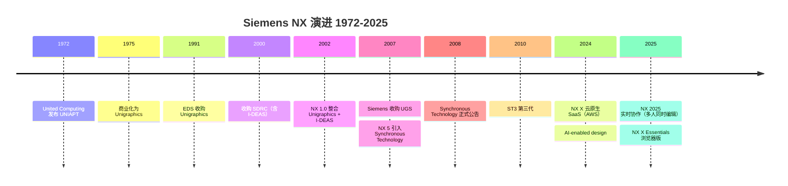
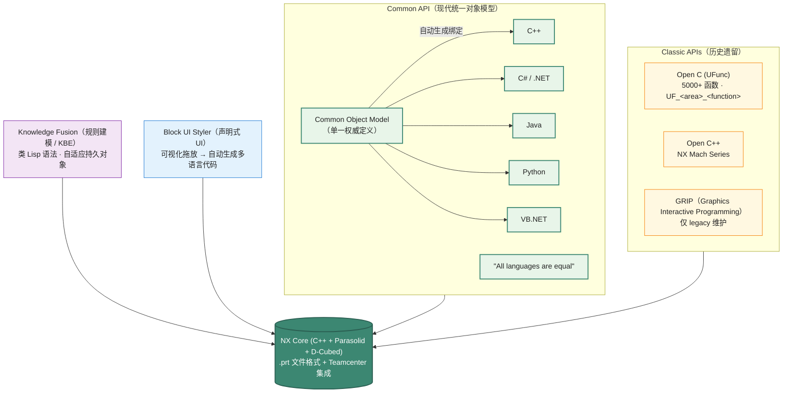

# Siemens NX (NX Open) API 设计深度剖析

> 文档 3.3｜厂商深度剖析系列｜通用 CAD 平台 API 设计哲学
>

---

## 阅读约定

- `<sup>[类别 N]</sup>`：段落或论断的来源标注，N 对应文末参考来源编号
- `> **[推论]**`：基于已知事实的合理推断，非来自厂商或权威资料的直接陈述
- `> **[评论]**`：本报告作者的主观归纳、判断或行业观察
- ⚠️ **勘误**：对常见社区资料中事实错误的修正

来源类别：`[官方]` `[新闻]` `[百科]` `[第三方]` `[书籍]`

---

## TL;DR

- **NX 是高端机械 CAD 三巨头之一**（与 CATIA、Creo 并列），2007 年起由 Siemens Digital Industries Software 持有<sup>[百科 1]</sup>。前身为 Unigraphics（1975 年商业化销售）<sup>[百科 1]</sup>，2002 年从 I-DEAS 合并为统一的"Next Generation"产品 NX<sup>[百科 1]</sup>，2007 年起被 Siemens 纳入并整合 PLM 产品线。
- **NX Open API 在样本平台中较罕见地实现"四语言完全对等"SDK**：C++、C#、VB.NET、Python、Java 五种语言通过自动生成的<Term def="按一个权威接口定义（IDL / 元模型）自动产出多种语言的 stub 代码。改一处接口，所有语言的 SDK 同步更新；避免人工维护多语言 wrapper 时滞后或漂移。">语言绑定</Term>共享同一对象模型<sup>[官方 2][第三方 3]</sup>。⚠️ Siemens 官方明确："All Common API languages are equal in terms of NX capabilities"——这是 NX Open 区别于 ObjectARX/CAA/SolidWorks 的设计取向。是否在更广 CAD 业界中也是少数派，需结合本系列未覆盖的平台进一步验证。
- **API 体系是双层并存**<sup>[官方 2]</sup>：
  - **Classic APIs**：早期遗留的 Open C（<Term def="User Function：NX 早年 C 语言 SDK 的命名空间前缀（UF_*），一个函数对应一个建模 / 查询操作。5000+ 函数堆砌成扁平 API。">UFunc</Term>，5000+ 函数）+ Open C++（NX <Term def="NX 早期面向对象 C++ SDK 系列的代号，对应 1990s 末 - 2000s 初的 Unigraphics 时代。后被 Common API 取代。">Mach Series</Term> 时代）+ NX Open for .NET 早期版本
  - **Common API**：现代统一对象模型，自动生成语言绑定
- **Synchronous Technology（同步技术）是 NX 的标志性创新**：⚠️ **官方时间线**：NX 5（2007）首次引入<sup>[百科 1]</sup>，2008 年 4 月正式公告并集成到 Solid Edge<sup>[第三方 4]</sup>，2010 年 ST3 第三代<sup>[第三方 4]</sup>。它在 history-based parametric 与 history-free direct editing 之间提供了"最佳折中"——这是 NX 在汽车与航空设计中独有的优势。
- **Knowledge Fusion 是 NX 的"参数化规则建模"语言**<sup>[第三方 5]</sup>：基于 <Term def="ICAD（Intelligent CAD）：1980s MIT 出身的早期 KBE 商业产品，开创了“用规则 + 知识库驱动 CAD”路线，影响了后来的 Knowledge Fusion / Knowledge Advisor。">ICAD</Term>（Knowledge-based Engineering）传统，用类 Lisp 语法实现<Term def="带参数关联性的对象，文件保存后再打开，对象的依赖关系仍保持有效。NX KF 用它实现“修改参数 → 自动重算下游”。">关联性持久对象</Term>。与 CATIA Knowledge Advisor、Inventor iLogic 同类。
- **<Term def="NX 自带的可视化 UI 设计器：拖放摆 Block（label / radio / list 等组件），自动生成 C++/C#/Python/Java 多语言绑定代码。是“四语言对等”在 UI 层的延伸。">Block UI Styler</Term> 是声明式 UI 设计工具**<sup>[官方 2][第三方 3]</sup>：开发者通过可视化工具拖放定义 dialog blocks，自动生成 C++ / C# / Python / Java 多语言代码——是"四语言对等"的 UI 层延伸。
- **Parasolid 是 NX 的几何内核**<sup>[百科 1]</sup>：Siemens 自家产品。⚠️ 这意味着 NX 与 SolidWorks（DS 旗下）使用同一底层内核——这是 CAD 业界"竞争对手共享内核"的独特状态。
- **<Term def="Siemens 自家约束求解器（2004 年收购 D-Cubed Ltd. 获得）。把“两条线垂直 / 同心 / 距离 = 10mm”等几何约束转化为方程组求解，是 sketcher 和装配体的底层。">D-Cubed</Term> 是 NX 的约束求解器**<sup>[百科 1]</sup>：Siemens 自家产品（2004 年从 D-Cubed Ltd. 收购），用于 sketcher 与 assembly constraints。
- **Teamcenter 是 NX 默认的 PLM 数据后端**<sup>[百科 1]</sup>：Siemens 旗下 PLM 旗舰，与 NX 深度集成。
- **NX X 是 SaaS 化的云原生 NX**：2024 年 5 月 Realize Live Americas 大会发布<sup>[新闻 6]</sup>，基于 AWS 云<sup>[新闻 7]</sup>。2025 年 9 月 NX X Essentials 发布——基于浏览器的轻量级版本<sup>[官方 8]</sup>，无需重型本地安装。
- **AI 整合方向**：NX 2024 引入 AI-enabled design 能力<sup>[新闻 6]</sup>，与 Synchronous Technology 配合提供"AI 辅助直接编辑"。

---

## Key Findings

1. **Unigraphics 起源**：1972 年 United Computing Inc. 发布 UNIAPT（早期 CAM）；1973 年从 MCS 收购 ADAM 软件代码；1975 年作为 "Unigraphics" 商业化销售<sup>[百科 1]</sup>。
2. **2002 年合并 I-DEAS**：Unigraphics 公司收购 SDRC（I-DEAS 母公司），2002 年发布 NX 1.0，开启"Next Generation"统一产品<sup>[百科 1]</sup>。
3. **2007 年 Siemens 收购 UGS**：Siemens 以约 35 亿美元收购 UGS Corp.（含 NX、Solid Edge、Teamcenter、Parasolid、Femap 等产品线）<sup>[百科 1]</sup>。
4. **Synchronous Technology 时间线**：⚠️ NX 5（2007）首次引入<sup>[百科 1]</sup>；2008 年 4 月 Siemens PLM 正式公告并扩展到 Solid Edge<sup>[第三方 4]</sup>；2010 年 ST3 第三代<sup>[第三方 4]</sup>。
5. **NX Open Common API 语言对等性**<sup>[官方 2]</sup>：

> "All Common API languages are equal in terms of NX capabilities. This means you have the freedom to choose an implementation language that suits your specific needs without having to worry about missing functionality."<sup>[官方 2]</sup>

6. **Open C API 规模**：5000+ 函数<sup>[官方 2]</sup>，命名约定 `UF_<application>_<function>`（如 `UF_MODL_create_plane()`）。
7. **NX 跨平台支持的演进**<sup>[百科 1]</sup>：
   - NX 12 之前：Linux + Windows + Mac OS
   - NX 12+：Mac OS 支持移除
   - NX 1847+：Linux 仅保留无 GUI 的服务器版（GUI 移除），完整 GUI 仅 Windows
8. **JT 文件格式**：Siemens 的轻量化可视化 + Multi-CAD 格式，由 NX 主导推动为 ISO 标准（ISO 14306）<sup>[百科 1]</sup>。
9. **Block UI Styler**<sup>[官方 2][第三方 3]</sup>：声明式 UI 设计工具，自动生成多语言代码。
10. **NX 2025 重大更新**：实时协作工具（同时编辑同一零件）<sup>[新闻 9]</sup>。
11. **NX X Essentials (2025)**：轻量级浏览器版，2025 年 9 月 17 日发布<sup>[官方 8]</sup>。

---

## 一、历史演进：从 UNIAPT（1972）到 NX X（2024+）



### 1.1 Unigraphics 起源（1972–1990s）

| 年份 | 事件 |
|---|---|
| 1972 | United Computing Inc. 发布 UNIAPT（早期 CAM 工具）<sup>[百科 1]</sup> |
| 1973 | 从 MCS 收购 ADAM (Automated Drafting and Machining) 软件代码<sup>[百科 1]</sup> |
| 1975 | 商业化销售为 "Unigraphics"<sup>[百科 1]</sup> |
| 1976 | 被 McDonnell Douglas Automation 收购 |
| 1980s–1990s | 在波音、洛克希德、麦道等航空企业广泛使用 |

> **[评论]** Unigraphics 起源于 CAM（数控加工）而非 CAD——这与 SolidWorks（起源于 PC CAD）、CATIA（起源于飞机外形曲面建模）的基因不同。Unigraphics/NX 至今在 CAM 领域保持领先地位（特别是高端五轴加工），与其 CAM 起源直接相关。

### 1.2 GRIP / UFunc / Open C++（早期 API 演进）

Unigraphics 的早期 API 演进：

| 时期 | API | 特征 |
|---|---|---|
| 1980s–1990s | **GRIP**（Graphics Interactive Programming）| Unigraphics 自研脚本语言，类 Fortran 风格 |
| 1990s–2000s | **UFunc / Open C**（User Functions）| C 语言 SDK，5000+ 函数，命名 `UF_*`<sup>[官方 2]</sup> |
| 1990s–2000s | **Open C++** | NX Mach Series 时代的 C++ API |

> **[推论]** GRIP 在中国船舶、汽车工程领域至今仍有大量遗留代码——许多 1990s 自研的工艺参数化系统、典型件生成器仍以 GRIP 编写。本报告未找到具体的 GRIP 用户量数据，属基于行业访谈的观察。

### 1.3 EDS Unigraphics 时代（1991–2007）

1991 年 General Motors 母公司 EDS（Electronic Data Systems）从 McDonnell Douglas 收购 Unigraphics，与 SDRC（I-DEAS 母公司）形成竞争关系。

**2000–2002 年关键事件**：
- 2000 年：Unigraphics 收购 SDRC（含 I-DEAS）<sup>[百科 1]</sup>
- 2002 年：发布 NX 1.0，开始整合 Unigraphics 与 I-DEAS 功能<sup>[百科 1]</sup>

> **[评论]** Unigraphics + I-DEAS 的合并是 CAD 业界少数成功的"产品融合"案例。两个产品的功能领域有差异（Unigraphics 强在 CAD/CAM，I-DEAS 强在 CAE 仿真），所以合并是互补而非冲突。最终 NX 继承了两者的优点：CAD/CAM 来自 Unigraphics、I-DEAS 的 CAE 演化为 Simcenter 系列。

### 1.4 Siemens 收购：2007 年

2007 年 Siemens AG 以约 35 亿美元收购 UGS Corp.<sup>[百科 1]</sup>，UGS 改名为 Siemens PLM Software（后改名 Siemens Digital Industries Software）。

> **[推论]** Siemens 收购 UGS 的战略意义远超单一产品：(1) UGS 的 PLM 矩阵（NX + Teamcenter + Parasolid + Solid Edge + Femap）成为 Siemens 工业数字化战略的基石；(2) Parasolid 内核作为"内核中立的工业级 B-Rep" 持续向其他 CAD 厂商授权，形成"内核 + CAD + PLM"的纵向战略；(3) Siemens 工业自动化与 NX/Teamcenter 整合，形成"Digital Twin from concept to factory"的全栈愿景。本报告未找到 Siemens 官方对该收购战略的更详细论述。

### 1.5 Synchronous Technology 引入（2007–2008）

⚠️ **官方时间线 / 多源调和**：

- Wikipedia "Siemens NX"：**"2007: Introduction of Synchronous Technology in NX 5"**<sup>[百科 1]</sup>
- Lifecycle Insights：**"April 2008, Siemens PLM 宣布开发完成 Synchronous Technology 并集成到 NX 与 Solid Edge"**<sup>[第三方 4]</sup>
- 部分第三方资料：**"NX 6 (2008) 引入"**

合理调和：**NX 5（2007 年发布）首次引入了 Synchronous Technology 的基础能力，2008 年 4 月正式公告并扩展到 Solid Edge，NX 6（2008）进一步推广**。

#### 核心创新：在 history-based 与 history-free 之间提供折中

Synchronous Technology 让用户可以**直接编辑几何**（移动、旋转、调整 face/edge），但同时**保留参数化关联性**（如同心、对称、共面等约束自动维持）<sup>[第三方 4][官方 11]</sup>：

```
传统 history-based modeling:
  ─ 优点: 参数化、可重生成
  ─ 缺点: 编辑必须按 history 顺序传播；导入第三方文件无 history
  
传统 direct editing:
  ─ 优点: 自由编辑、不受 history 顺序限制
  ─ 缺点: 不保留参数关系；无法精确 what-if

Synchronous Technology:
  ─ 直接编辑（push/pull/drag）
  ─ + 自动识别并维护几何关系（同心、共面、对称、相切）
  ─ + 与 history-based 模式可共存（混合建模）
  ─ + 完美适配多 CAD 互操作（编辑导入文件如同原生）
```

### 1.6 NX 2024 + NX X：云原生时代

**2024 年 5 月 Realize Live Americas 大会**，Siemens 公布<sup>[新闻 6][新闻 7]</sup>：
- **NX X**：SaaS 化的 NX，基于 AWS 云<sup>[新闻 7]</sup>
- **桌面安装 + 浏览器流式两种部署模式**
- **Teamcenter X 集成**：内置 PLM 数据管理
- **AI-enabled design**：AI 辅助设计能力

**2025 年 9 月 17 日**，NX X Essentials 发布<sup>[官方 8]</sup>：
- **完全浏览器版**，无重型本地安装
- 是 Designcenter X 套件的一部分
- 面向轻量级设计场景

**2025 年 6 月 NX 2025 发布**<sup>[新闻 9]</sup>：
- **实时协作工具**：多人同时编辑同一零件
- 利用 Xcelerator 云能力
- 进一步深化 Designcenter 套件

---

## 二、API 整体架构：Classic + Common 双层并存



### 2.1 Classic vs Common：两代 API 共存

⚠️ **关键事实**：NX 没有像 CATIA V5 → V6 那样强制 ISV 迁移到新 API——**Open C / UFunc / GRIP 仍在 NX 2026 中保持兼容**<sup>[官方 2]</sup>。这种"加法兼容"哲学与 ObjectARX、SolidWorks 一致。

> **[评论]** 双层并存是务实选择——许多航空主机厂的 NX 二次开发代码可追溯到 1990s 的 GRIP 时代，强制重写代价巨大。Siemens 选择保留旧 API 同时演进新 API，让客户按节奏迁移。

### 2.2 Common API 的"四语言对等"哲学

**核心机制**<sup>[官方 2]</sup>：
1. NX 内核暴露 **Common Object Model**（统一类层级、属性、方法定义）
2. 自动化工具从 Common Object Model **生成多语言绑定**
3. 所有语言看到的 **类名、属性、方法、继承关系完全相同**

```python
# Python
import NXOpen
import NXOpen.Features

session = NXOpen.Session.GetSession()
work_part = session.Parts.Work
cylinder = work_part.Features.CreateCylinderBuilder(NXOpen.Features.Feature.Null)
cylinder.Diameter.SetFormula("50")
cylinder.Height.SetFormula("100")
nx_object = cylinder.Commit()
```

```csharp
// C#
using NXOpen;
using NXOpen.Features;

Session session = Session.GetSession();
Part workPart = session.Parts.Work;
CylinderBuilder cylinder = workPart.Features.CreateCylinderBuilder(Feature.Null);
cylinder.Diameter.SetFormula("50");
cylinder.Height.SetFormula("100");
NXObject nxObject = cylinder.Commit();
```

```cpp
// C++
NXOpen::Session* session = NXOpen::Session::GetSession();
NXOpen::Part* workPart = session->Parts()->Work();
NXOpen::Features::CylinderBuilder* cylinder = 
    workPart->Features()->CreateCylinderBuilder(NULL);
cylinder->Diameter()->SetFormula("50");
cylinder->Height()->SetFormula("100");
NXOpen::NXObject* nxObject = cylinder->Commit();
```

> **[评论]** 这是 CAD API 设计的高级形态——**自动生成的多语言绑定保证一致性**。其他 CAD 平台的"多语言"通常是"主语言（如 C++）+ 手工写的 wrapper"，难免有覆盖度滞后。NX 的"自动生成"消除了这个滞后。

> **[推论]** Block UI Styler 也遵循同一原则——可视化设计后自动生成 C++/C#/Java/Python 多语言代码<sup>[官方 2]</sup>。这是"代码生成 + 多语言对等"哲学在 UI 层的延伸。

### 2.3 NX Open 与 Open C 的关系

NX Open 是更现代的 API（基于 Common Object Model），Open C（UFunc）是历史 API。**两者可在同一个程序中混用**<sup>[官方 2][第三方 3]</sup>——这降低了从旧代码迁移到新 API 的成本：

```cpp
// 一个 C++ 程序中同时使用 Open C 和 NX Open
#include <uf.h>          // Open C 头
#include <NXOpen/Session.hxx>  // NX Open 头

extern "C" DllExport void ufusr(char *param, int *retCod, int paramLen)
{
    UF_initialize();
    
    // Open C 风格
    UF_UI_open_listing_window();
    UF_UI_write_listing_window("Hello from Open C\n");
    
    // NX Open 风格
    NXOpen::Session* session = NXOpen::Session::GetSession();
    session->ListingWindow()->WriteFullline("Hello from NX Open");
    
    UF_terminate();
}
```

---

## 三、Common Object Model：Session / Part / Feature / Builder

### 3.1 核心对象层级

```
NXOpen::Session                    ← 单例，整个 NX 进程的入口
├── Parts                           ← PartCollection
│   ├── Work                         ← 当前工作部件
│   ├── Display                      ← 当前显示部件
│   └── [其他打开的零件]
├── ListingWindow                   ← 列表窗口（输出）
├── UndoMarkManager                 ← Undo 标记
├── DPI                             ← 显示 DPI
└── ApplicationSwitchImmediate(...)  ← 切换应用模块
       
NXOpen::Part : NXObject              ← 一个 .prt 文件的内存对象
├── Features                          ← FeatureCollection
│   ├── CreateCylinderBuilder(...)
│   ├── CreateExtrudeBuilder(...)
│   └── ...
├── Bodies                            ← BodyCollection
├── Sketches                          ← SketchCollection
├── Datums                            ← DatumCollection
├── Components                        ← ComponentCollection (装配)
└── Drafting                          ← DraftingManager (图纸)
```

### 3.2 Builder 模式

⚠️ **关键设计**：NX Open 的 feature 创建普遍使用 **Builder 模式**<sup>[官方 2][第三方 3]</sup>——而不是直接构造 feature 对象。这种设计的优势：

```python
# Builder 模式
cylinder = work_part.Features.CreateCylinderBuilder(NXOpen.Features.Feature.Null)
cylinder.Diameter.SetFormula("50")          # 参数化
cylinder.Height.SetFormula("100")           # 参数化
cylinder.Origin = some_point
cylinder.Direction = some_vector
nx_object = cylinder.Commit()                # 提交
cylinder.Destroy()                           # 释放 Builder
```

Builder 的设计意图：
1. **参数收集与提交分离**：Builder 阶段可任意调整参数，`Commit()` 触发实际计算
2. **支持编辑现有 feature**：`CreateCylinderBuilder(existingFeature)` 进入编辑模式
3. **清晰的资源管理**：需要显式 `Destroy()` 释放 Builder 引用
4. **Undo 友好**：Builder 操作可包装在 UndoMark 中

> **[评论]** Builder 模式是 NX Open API 的精髓——比 SolidWorks `SelectByID2 + mark + FeatureCut3` 的命令式风格更优雅。每个 Builder 是一个"参数化容器"，可在内存中调整后再提交。这与 CATIA Spec/Result/Update 三段式有相似哲学——都是"声明式参数 + 显式触发计算"。

### 3.3 Undo Mark 机制

NX Open 的事务边界通过 UndoMark 实现<sup>[官方 2]</sup>：

```python
session = NXOpen.Session.GetSession()
mark_id = session.SetUndoMark(NXOpen.Session.MarkVisibility.Visible, "Create Cylinder")

# ... 多个 feature 操作 ...

# 成功
session.UpdateManager.DoUpdate(mark_id)
# 或失败时
session.UndoToMark(mark_id, "Create Cylinder")
```

UndoMark 是 NX 的核心事务原语——Visible 标记会出现在 NX UI 的 Undo 栈中，让用户可手动 Undo。

---

## 四、Synchronous Technology：直接编辑 + 关联性

### 4.1 设计思路

Synchronous Technology 解决了 CAD 业界长期的"参数化 vs 直接编辑"对立<sup>[官方 11][第三方 4]</sup>：

| 传统范式 | 优势 | 劣势 |
|---|---|---|
| **History-based parametric** | 参数化、可重生成、设计意图保留 | 编辑必须按 history 顺序传播；导入第三方文件无 history |
| **Direct editing** | 自由编辑、不受 history 限制 | 不保留参数关系；无法精确 what-if |
| **Synchronous Technology** | 直接编辑 + 自动维护几何关系 | 学习曲线 |

### 4.2 关键技术

Siemens 2008 年白皮书<sup>[第三方 12]</sup>描述 Synchronous Technology 的核心：

> "Synchronous technology examines a product model's current geometric conditions in real-time and combines them with parametric and geometric constraints added by the designer to evaluate and perform new geometry construction and edit of the model"<sup>[第三方 12]</sup>

具体能力：
1. **实时几何识别**：自动识别面之间的关系（同心、共面、对称、相切等）
2. **局部依赖求解**：编辑只触发"相关的依赖"重算，不需要整个 history 树重生成
3. **混合建模**：可与 history-based 模式共存（NX 与 Solid Edge 都支持"history 区 + synchronous 区"）<sup>[第三方 4]</sup>
4. **Multi-CAD 友好**：导入第三方文件后可直接编辑，不需要"reverse engineer history"

### 4.3 性能数据

Siemens 白皮书声称<sup>[第三方 12]</sup>：

> "the edit operation takes only approximately 1.5 seconds to complete. Synchronous technology scans the model in real time, localizes the dependencies, and solves only those necessary dependencies for the correct solution."<sup>[第三方 12]</sup>

⚠️ **caveat**：1.5 秒是特定测试场景下的厂商数据，实际效果因模型复杂度而异。

### 4.4 与 NX Open 的集成

NX Open 提供 Synchronous Technology 的 Builder 接口，让脚本可调用直接编辑能力<sup>[官方 2]</sup>：

```python
# 简化伪代码
move_face_builder = work_part.Features.SynchronousBuilder.CreateMoveFaceBuilder(...)
move_face_builder.FacesToMove.Add(some_face)
move_face_builder.MoveDistance = 10.0
move_face_builder.Commit()
```

> **[评论]** 这种"直接编辑 + 关联性"的能力让 NX 在汽车造型变更场景中具有独特优势——A 级面调整后下游零件自动适配，不需要重做整个 history。这是 NX 在德系/日系汽车 OEM 中市场份额超过 CATIA 的关键技术原因之一。

---

## 五、Knowledge Fusion：参数化规则建模

### 5.1 KBE 传统

Knowledge Fusion (KF) 是 NX 的 KBE（Knowledge-Based Engineering）语言<sup>[第三方 5]</sup>，源于 Knowledge Technologies 公司的 ICAD 系统传统。

核心概念：
- **类 Lisp 语法**：函数式、声明式
- **关联性持久对象（Adaptive Persistent Object）**：定义后持久存储在 .prt 文件中
- **规则驱动建模**：参数变化时整个对象图自动重算

### 5.2 与 NX Open 的关系

KF 与 NX Open 是两种不同的扩展范式：

| 维度 | NX Open | Knowledge Fusion |
|---|---|---|
| 语言 | C++/C#/Java/Python/VB.NET | DFA (Definition File / Lisp-like) |
| 用途 | 命令式自动化、UI、集成 | 声明式参数化建模、规则 |
| 持久化 | 不持久化（脚本运行后释放）| 持久化在 .prt 中 |
| 触发方式 | 显式调用 | 参数变化自动触发 |

> **[推论]** Knowledge Fusion 与 CATIA Knowledge Advisor、Inventor iLogic、SolidWorks Equation Manager 同类——但 KF 的语法更接近函数式编程，能力上限更高。本报告未在 Siemens 官方文档中找到与其他平台的直接对比。

### 5.3 典型应用场景

KF 主要用于<sup>[第三方 5]</sup>：
- 复杂的零件族（参数变化生成系列产品）
- 工艺规则引擎（材料选择、加工方法约束）
- 自动化布线、布管（按规则连接组件）
- 重型装备的可配置产品（电梯、风电、起重机等）

> **[评论]** KF 在中国电梯、风电、轨道交通装备行业有较深的应用积累——但学习曲线陡峭、社区资源稀少，是 NX 高端能力中"有人懂的人很少"的部分。

---

## 六、Block UI Styler：声明式 UI

### 6.1 设计目的

Block UI Styler 是 NX 的可视化 dialog 设计工具<sup>[官方 2][第三方 3]</sup>——开发者在 UI 中拖放定义对话框元素（按钮、滑块、列表、3D 选择器等），保存为 `.dlx` 文件。NX Open 在运行时加载 `.dlx` 并自动生成 dialog UI。

### 6.2 多语言代码生成

Block UI Styler 自动生成 C++/C#/Java/Python 多语言的"骨架代码"<sup>[第三方 3]</sup>：
- 头文件 / 类定义
- 事件回调签名
- 控件访问代码

开发者只需填充业务逻辑，UI 部分完全声明式。

> **[评论]** 这种"GUI 设计器 + 代码生成"在 1990s–2000s 桌面开发流行（Visual Basic、Delphi 等），现代 SaaS 时代少见——但在企业级 CAD 中仍是高效模式。Block UI Styler 让 NX 二次开发的 UI 一致性高（所有 dialog 看起来都像 NX 原生），用户学习成本低。

---

## 七、Parasolid 内核：与 SolidWorks 的内核共享

### 7.1 Parasolid 历史

Parasolid 是 Siemens 自家的几何内核<sup>[百科 1]</sup>：
- 起源于 1980s Cambridge 大学的 ROMULUS 项目
- 1988 年商业化，1990s 在 Unigraphics 中作为内核
- 目前由 Siemens Digital Industries Software 开发，授权给多个 CAD 厂商

**关键授权关系**：
- **NX**（Siemens 自家产品）：使用 Parasolid
- **Solid Edge**（Siemens 自家产品）：使用 Parasolid
- **SolidWorks**（Dassault Systèmes 产品）：使用 Parasolid（授权）
- **ANSYS、Autodesk Inventor 早期、SolidEdge 等**：都用过 Parasolid

> **[评论]** "DS 旗下 SolidWorks 用 Siemens 旗下 Parasolid"是 CAD 业界的奇观——两个最大的 PLM 厂商在中端 CAD 上"内核共享"。这种状态延续多年的可能原因：(1) Parasolid 是工业级最成熟的 B-Rep 内核之一；(2) 切换内核风险极大（A380 教训）；(3) Siemens 通过授权获得稳定收入。

### 7.2 D-Cubed 约束求解器

D-Cubed 是 NX 的约束求解器<sup>[百科 1]</sup>，由 Siemens 在 2004 年从 D-Cubed Ltd. 收购后纳入产品线：
- 用于 sketcher 的 2D 约束求解
- 用于 assembly 的 3D 配合约束求解
- 也独立授权给其他 CAD 厂商

> **[推论]** D-Cubed + Parasolid 组成 Siemens "几何内核 + 约束求解" 的双套件，是 Siemens "内核业务作为独立 OEM 渠道"战略的关键资产。本报告未找到 Siemens 对该战略的详细公开论述。

### 7.3 JT 文件格式

JT 是 Siemens 主推的轻量化 + Multi-CAD 可视化格式<sup>[百科 1]</sup>：
- 由 NX 主导推动为 ISO 标准（ISO 14306）
- 用于装配可视化、digital mockup、工厂车间查看
- 与 Teamcenter 深度集成

> **[评论]** JT 是 Siemens 与 Autodesk DWG / Bentley DGN / Dassault 3DXML 在"轻量化中间格式"赛道的产品。JT 因 ISO 标准化而在汽车业（特别是 BMW、戴姆勒、大众）有较深普及。

---

## 八、Teamcenter 集成：默认 PLM 后端

NX 与 Teamcenter（Siemens PLM 旗舰）深度集成<sup>[百科 1][官方 2]</sup>：
- NX 文件可直接保存到 Teamcenter 而不是文件系统
- 装配引用自动转为 Teamcenter Item Revision 引用
- BOM 直接生成到 Teamcenter
- ECN（Engineering Change Notification）流程内嵌

NX Open 提供 Teamcenter API 与 NX API 的统一访问<sup>[官方 2]</sup>——一个二次开发可同时操作 CAD 模型与 PLM 数据。

> **[评论]** NX + Teamcenter 的集成深度可与 CATIA + ENOVIA 媲美，但 Siemens 没有像 DS 在 V6 那样强制"no files"——NX 可文件式工作也可 Teamcenter 化工作，灵活性更高。这是 NX 在大型客户中的优势。

---

## 九、NX X：云原生时代

### 9.1 NX X 的部署模式

⚠️ **关键事实**：NX X 提供两种部署模式<sup>[新闻 6][新闻 7]</sup>：

1. **桌面安装（local install）**：NX X 安装在本地，但许可与数据由云管理
2. **浏览器流式（browser streaming via AWS）**：通过 AWS 在浏览器中流式访问 NX

> **[推论]** "桌面安装 + 浏览器流式"双模式是 Siemens 务实的过渡策略。对比 Onshape 一开始就 100% 浏览器原生、CATIA 3DEXPERIENCE 强制云、AutoCAD 桌面 + Web 双栈，NX X 选择"同一软件、不同部署"路线，让客户按节奏迁移。

### 9.2 NX X Essentials（2025 年 9 月）

2025 年 9 月 17 日 Siemens 发布 NX X Essentials<sup>[官方 8]</sup>：
- **完全浏览器版**，无需重型本地安装
- 是 Designcenter X 套件的入门级
- 面向轻量级设计场景（学生、原型设计、入门工程师）

### 9.3 NX 2025 实时协作

NX 2025（2025 年 6 月发布）引入实时协作<sup>[新闻 9]</sup>：
- 多人同时编辑同一零件
- 利用 Xcelerator 云能力
- 实时同步设计变更

> **[评论]** 实时协作是 CAD 业界 2024-2025 的共同方向——AutoCAD Connected Support Files、SketchUp 2026 Collaboration Bar、SolidWorks 3DEXPERIENCE 协同、Onshape 原生协作。NX 2025 的实时协作是高端 CAD 跟上中端 SaaS CAD 的关键追赶。

### 9.4 AI 整合

NX 2024+ 引入 AI-enabled design<sup>[新闻 6]</sup>。具体功能涉及：
- AI 辅助直接编辑（基于 Synchronous Technology）
- 设计意图识别
- 自动化重复任务

> **[推论]** NX 的 AI 整合相对务实——与 SolidWorks 2026 Aura AI、AutoCAD 2026 Smart Blocks 同方向，瞄准"减少重复劳动"。NX 在生成式建模（AI generative design）上走得不如 Fusion 360 激进。本报告未找到 Siemens 对 NX AI 路线图的更详细论述。

---

## 十、独特设计哲学提炼

> **[评论]** 本章为本报告作者对 NX (NX Open) 设计哲学的归纳，不是 Siemens 官方陈述。

### 10.1 "Common API 四语言对等"是 SDK 设计的高级形态

NX Open 在样本平台中较罕见地明确承诺"所有语言能力对等"——通过自动生成绑定保证一致性。这种设计取向背后是"客户语言偏好不应限制功能"的务实精神。新平台 SDK 设计可借鉴。

### 10.2 "Builder 模式 + Commit"的声明式建模

NX Open 的 Builder 模式（参数收集 → Commit 提交）与 CATIA Spec/Result/Update 同类——都是声明式建模哲学的体现。新平台 feature API 设计应优先考虑这种声明式风格。

### 10.3 "Synchronous Technology" 是 CAD 技术演进的高水位线

直接编辑 + 关联性维持 + 多 CAD 互操作的三合一是 CAD 技术演进的标志性突破。这种"两全其美"的设计在 1995 年的 SolidWorks、2002 年的 NX 1.0、2008 年的 Synchronous Technology 是逐步实现的。

### 10.4 "Classic + Common 双层并存"的兼容哲学

GRIP（1980s）→ Open C（1990s）→ NX Open Common API（2000s+）三代 API 并存。Siemens 选择"加法兼容"而非强制迁移——这是高端工业客户极度看重的承诺。

### 10.5 "Knowledge Fusion 持久关联性"的 KBE 哲学

KF 把"工程规则"作为 .prt 文件中的一等公民——这种"规则即数据"的设计是 KBE（Knowledge-Based Engineering）的精髓，让 NX 在重型装备配置化设计中独有优势。

### 10.6 "Block UI Styler 声明式 UI + 多语言生成"

UI 设计声明化 + 代码自动生成是 NX 二次开发效率的关键。这与 Common API 的多语言生成哲学一致——"声明一次、多语言可用"。

### 10.7 "云原生 + 桌面共存"务实路线

NX X 的"桌面安装 + 浏览器流式"双模式 vs Onshape 100% 浏览器、CATIA 3DEXPERIENCE 强制云。Siemens 选择不破坏现有客户基础上的渐进上云，是大型工业客户的现实需求。

---

## 十一、启示与争议

### 11.1 对架构师的启示

> **[评论]** 以下为本报告作者归纳的启示。

1. **多语言对等通过自动生成实现**：NX Open 的"四语言对等"是通过 Common Object Model + 自动生成绑定实现的。新平台 SDK 设计应优先考虑这种"主对象模型 + codegen" 模式，而不是为每种语言手写 wrapper。
2. **Builder 模式是 feature API 的优雅形式**：NX Open Builder 与 CATIA Spec、Onshape FeatureScript 都体现"声明式参数 + 显式 commit"——这是参数化建模 API 的高级形态。
3. **Synchronous Technology 启示**："参数化 vs 直接编辑"长期对立可通过"实时几何识别 + 局部依赖求解"统一。新一代 CAD 设计应直接采用统一范式而不是二选一。
4. **多代 API 共存的代价与收益**：GRIP/UFunc/Common API 三代共存让 NX 维护成本高，但赢得了客户信任。新平台决策时应早早规划"我们承诺多少年的 API 兼容"。
5. **声明式 UI + 多语言代码生成**：Block UI Styler 是企业级 SDK 的高效模式。新平台可借鉴——把 UI 定义抽象为数据，多语言绑定自动生成。
6. **云原生不一定要 100% 浏览器**：NX X 的"桌面 + 浏览器双模式"证明渐进上云路径可行。新平台不必为了"云原生纯净度"放弃桌面客户。

### 11.2 争议点

- **NX Open 学习曲线高**：相比 SolidWorks API（VBA 易上手），NX Open 概念多、Builder 模式复杂、Block UI Styler 需要学习。
- **Knowledge Fusion 社区稀薄**：KF 强大但学习资源极少，新工程师入门困难。Siemens 对 KF 的投资有限。
- **Classic API 的负担**：5000+ 个 UFunc 函数 + GRIP 遗留代码是 NX 维护负担。客户希望 Siemens 强制迁移，但 Siemens 选择保留兼容。
- **NX X 与 Onshape 的差异**：NX X 仍是"NX 在云上"（同一软件），Onshape 是"为云重新设计的 CAD"。两者在长期演进上谁更优待观察。
- **AI 路线相对保守**：NX 在生成式 AI 建模上不如 Fusion 360 激进，是优势（稳定）还是劣势（落后）有争议。

---

## 十二、行业观察：中国市场与国产化讨论

> ⚠️ **章节定位说明**：本章内容**主要基于公开行业报告与社区观察的归纳，不构成市场研究结论**。所有"主要采用""市场份额"等表述应理解为**作者基于公开信息的观察印象**，而非基于市场调研机构的硬数据。重要决策应核对当前的市场调研报告（Gartner、IDC、艾瑞、易观等）。

在中国市场语境下，NX 的相关观察集中在三点：

- **汽车与重型装备使用面较广**：上汽、广汽、东风、长城、奇瑞等汽车整车厂多采用 NX；新能源车企（蔚来、小鹏、理想等）也较多采用 NX。中车、徐工、三一、中联重科等在大型主机类产品较广泛使用。航天科工、航天科技集团等军工与航天领域多采用 NX。据社区观察，NX 在中国汽车业的使用面似乎相对宽于 CATIA。
- **GRIP 遗留代码的中国负担**：中国船舶、汽车、航天行业有大量 1990s-2000s 自研的 GRIP 二次开发——典型件库、工艺参数化、自动报表等。这些 GRIP 代码至今仍在 NX 2025/2026 中运行，但维护人员日益稀少。重写为 NX Open Python 的迁移项目正在悄然进行。
- **Teamcenter 在大型企业渗透较深**：Teamcenter 在中国大型企业（特别是国企、军工、汽车 OEM）的渗透较深，"NX + Teamcenter"组合是大型工程组织较常见的选择。中小企业更多采用 SolidWorks + 国产 PDM。

NX 在高端制造业的国产替代涉及多重技术挑战（Parasolid 同级内核、D-Cubed 同级求解器、Knowledge Fusion 等价物、高端 CAM 能力等），任何路径都需要长期耐心。NX X 在中国的渗透目前弱于本地 NX——AWS 在华份额有限，国防、军工对云上 PLM 数据敏感。

更广的中国市场讨论与国产化路径归纳，见文档 1 附录 A：行业观察附录。

---

## Caveats

- **Synchronous Technology 时间线**：NX 5（2007）vs NX 6（2008）vs 2008-04 公告——多源资料不完全一致，本报告采用"NX 5（2007）首次引入 + 2008-04 正式公告 + NX 6（2008）推广"的合理调和。
- **Common API "四语言对等"**：来自 Siemens 官方 NX Open PDF<sup>[官方 2]</sup>，但具体的覆盖度（是否真的 100% 对等）需在实际使用中验证。
- **GRIP 在中国遗留代码量**：来自行业访谈与社区观察，无量化数据。
- **NX 在中国市场份额高于 CATIA**：来自社区观察，非严谨市场调研。
- **Parasolid 与 SolidWorks 共享内核**：是公开事实，但具体的授权细节（是否 SolidWorks 对 Parasolid 有定制版本）本报告未深入。
- **Knowledge Fusion 与 ICAD 的传承关系**：来自社区资料，未在 Siemens 官方文档中找到直接陈述。
- **NX X 浏览器流式技术细节**：基于 AWS 的具体实现（容器化、延迟、并发等）公开资料较少。
- **本报告未深入** 的相关主题：NX CAM 的工艺参数 API；NX Drafting 的图纸自动化；Simcenter（NX 仿真模块）的 API；NX 与 Mentor Graphics（Siemens 收购的 EDA 厂商）的电子-机械协同 API；NX Mach Series 的具体配置；NX Continuous Release 节奏；NX 的 EDS / Parametric Technology Corporation (PTC) / Computervision 复杂的并购历史细节。
- **关于"中国市场地位"的讨论** 基于公开行业报告与社区观察，并非来自 Siemens 官方披露。

---

## 参考来源

### [官方]
- [官方 2] Siemens, "NX Open" 官方介绍 PDF (OnePLM mirror), https://oneplm.com/wp-content/uploads/NX_Open.pdf
- [官方 8] Siemens NX Design Blog, "NX X Essentials launch event, 2025"（2025-09-17）, https://blogs.sw.siemens.com/nx-design/nx-x-essentials-2025-launch-event/
- [官方 11] Siemens, "Synchronous Technology"（官方介绍）, https://www.siemens.com/en-us/technology/synchronous-technology/

### [新闻]
- [新闻 6] DEVELOP3D, "Siemens NX 2024 updated with AI, NX X and XR launch date", 2024-07, https://develop3d.com/cad/siemens-nx-2024-ai-xr-cloud/
- [新闻 7] Siemens News, "Siemens' NX Summer 2024", 2024-07, https://news.siemens.com/en-us/siemens-nx-summer-2024/
- [新闻 9] ENGtechnica, "Siemens NX Gets Big Update in 2025", 2025-08, https://engtechnica.com/siemens-nx-gets-big-update-in-2025/

### [百科]
- [百科 1] Wikipedia, "Siemens NX", https://en.wikipedia.org/wiki/Siemens_NX

### [第三方]
- [第三方 3] nx-open.com 培训资料（关于 NX Open 多语言支持）, https://nx-open.com/
- [第三方 4] Lifecycle Insights, "Siemens PLM and Synchronous Technology in Solid Edge", https://www.lifecycleinsights.com/st-and-solid-edge/
- [第三方 5] PLM Coach, "NX Open API Programming, Automation & Customization Training", https://plmcoach.com/nxopen-api-programming/
- [第三方 12] Siemens PLM, "Synchronous Technology" white paper, April 2008, https://www.plm.automation.siemens.com/legacy/docs/Synchronous_Technology_CPDA_WhitePaper.pdf
- Foad S. Farimani, NXOpen_Python_tutorials GitHub Repository, https://github.com/Foadsf/NXOpen_Python_tutorials
- Engineer Your Sound, "What Is NX Open? (Explained with examples)", https://engineeryoursound.com/what-is-nx-open-explained-with-examples/
