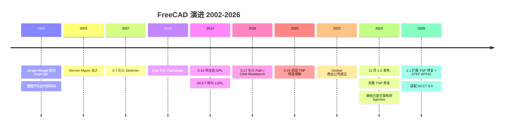
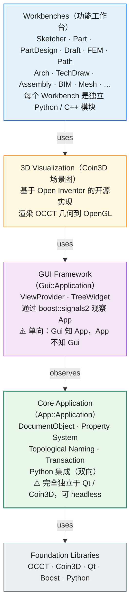

# FreeCAD API 设计深度剖析

> 文档 3.8｜厂商深度剖析系列｜通用 CAD 平台 API 设计哲学
>

---

## 阅读约定

- `<sup>[类别 N]</sup>`：段落或论断的来源标注，N 对应文末参考来源编号
- `> **[推论]**`：基于已知事实的合理推断，非来自厂商或权威资料的直接陈述
- `> **[评论]**`：本报告作者的主观归纳、判断或行业观察
- ⚠️ **特别说明**：FreeCAD 是开源项目而非商业产品，本报告中"厂商"对应 FreeCAD Project Association（非营利组织）

来源类别：`[官方]` `[新闻]` `[百科]` `[第三方]` `[书籍]`

---

## TL;DR

- **FreeCAD 是开源参数化 CAD 讨论中最常被引用的平台之一**：2002 年由 Jürgen Riegel 创立<sup>[百科 1]</sup>，**2024 年 11 月 18 日发布 1.0 版本**——经过 **22 年开发**才达到 1.0 稳定版<sup>[官方 2][新闻 3]</sup>。LGPL 2.1+ 授权，跨 Windows/Linux/macOS 三平台。
- **App/Gui 严格 <Term def="Model-View-Controller。把数据模型、视图渲染、控制器输入分到三层、各自独立可替换的经典架构模式。FreeCAD 的 App/Gui 分离是其变体：App = Model，Gui = View+Controller，两层之间靠信号通信而非直接调用">MVC</Term> 分离是 FreeCAD 架构的核心**<sup>[第三方 4][官方 5]</sup>：App 层（业务逻辑）完全不依赖 Gui 层（Qt/Coin3D），通过 <Term def="Boost C++ 库提供的型安全信号-槽实现，多线程友好。FreeCAD 用它在 App 层广播事件，Gui 层订阅；App 不知道 Gui 存在，使 headless 模式成为可能">boost::signals2</Term> 实现单向观察者模式。这意味着 FreeCAD 可在**无显示器、无 Qt 的服务器**上运行 <Term def="无图形界面运行模式。进程不创建窗口、不依赖 GPU/显示器，仅以 CLI 或库形式被调用。常用于服务器端批处理、CI 自动测试、批量文件转换">headless</Term> 模式——是开源 CAD 中少见的"工业级架构"。
- **基于 OCCT（Open CASCADE Technology）几何内核**<sup>[百科 1][官方 6]</sup>：OCCT 是少数开源工业级 B-Rep 内核之一，前身是 1990s Matra Datavision 的 EUCLID-IS 内核，1999 年开源。这是 FreeCAD 能够提供"真正参数化 CAD"（而非 polygonal）的根本原因。
- **Python 是 <Term def="语言学/编程文化术语：在某语言/平台中拥有“原生数据类型”般的待遇——可以被任何 API 接受、能与其他类型互操作、性能不显著低于原生路径。Python 在 FreeCAD 是一等公民,意味着 Python 类可以充当 DocumentObject,而非只是脚本调用的客串">一等公民</Term>**：FreeCAD 把 Python 集成到极致<sup>[官方 7]</sup>——所有 C++ 对象有 `getPyObject()` 暴露为 Python，所有 Python 对象可保存 C++ 指针，**FeaturePython 类**让纯 Python 对象作为 DocumentObject 参与文档生命周期。Python 不是脚本附加，而是平台基底。
- **<Term def="FreeCAD 的功能模块化单元，对应一个“工作场景”。每个 Workbench 是独立 Python/C++ 模块，激活时切换菜单/工具栏/快捷键集（如 Sketcher 工作台显示草图工具，Path 工作台显示 CAM 工具）。类似 AutoCAD Workspace，但耦合到代码模块而非纯 UI 配置">Workbench</Term> 体系**：FreeCAD 的功能按"工作台"组织——Sketcher、Part、PartDesign、Draft、Arch（建筑）、Path（CAM）、TechDraw（图纸）、FEM（有限元）、Assembly（装配，1.0 集成）等<sup>[官方 8]</sup>。每个 Workbench 是独立 Python/C++ 模块，可由 Addon Manager 动态安装。
- **Topological Naming Problem (TNP) 修复**是 1.0 的关键里程碑<sup>[官方 2][新闻 3][第三方 9]</sup>：TNP 是参数化 CAD 的根本性挑战——上游特征修改后下游引用面/边的"内部 ID"变化导致下游特征断裂。**FreeCAD 1.0 集成了 RealThunder（社区开发者）的 LinkStage 3 fork 修复方案**，由 Ondsel 公司协助合并到上游。这是开源 CAD 几年来最重要的工程突破。
- **Ondsel 故事**：商业公司 Ondsel 基于 FreeCAD 提供商业服务（Ondsel ES），是 TNP 修复的重要推动者。⚠️ **2024 年底 Ondsel 关闭**<sup>[新闻 10]</sup>，但开发者继续贡献到 FreeCAD <Term def="开源协作语境中的“上游”。指原始/官方的代码仓库或项目，与之相对的是 fork/downstream。“贡献到 upstream”意味着把改动提交回主项目而非只在自己的分支维护">upstream</Term>——这是开源治理弹性的标志性事件。
- **FreeCAD 1.1（2026 年 3 月报道）**<sup>[新闻 10]</sup>：进一步扩展 TNP 修复到 Sketcher 和 PartDesign，改进 Assembly Workbench，支持 STEP AP242。
- **下载量与社会化**：GitHub 累计下载约 **2000 万次**（2025-12）<sup>[百科 1]</sup>。Linus Torvalds 是 FreeCAD 用户，2025 年 9 月在 KiCon Europe 演示用 FreeCAD 设计吉他踏板外壳<sup>[百科 1]</sup>。

---

## Key Findings

1. **创立时间**：2002 年由德国程序员 Jürgen Riegel 启动<sup>[百科 1]</sup>，最初目标是 KEDA / DAIMLER 内部使用的开源 CAD。
2. **License**：LGPL 2.1+<sup>[百科 1]</sup>。⚠️ 之前曾因 OCCT 与 LibreDWG 的 GPL 兼容性问题受限，2014 年起 OCCT 改为 LGPL，FreeCAD 成为完全 GPL-free 的工具。
3. **核心库依赖**<sup>[百科 1][官方 6]</sup>：
   - **OCCT (Open CASCADE Technology)**：B-Rep 几何内核
   - **Coin3D**：3D 显示引擎（Open Inventor 的开源实现）
   - **Qt**：GUI 框架
   - **Python**：嵌入式脚本与扩展
   - **Boost**：底层 C++ 工具（含 boost::signals2 用于 App/Gui 解耦）
4. **FreeCAD 1.0 发布**：**2024-11-18**<sup>[官方 2][新闻 3]</sup>，22 年开发后首个稳定版。
5. **FreeCAD 1.1 发布**：2025-2026 年间，扩展 TNP 修复 + STEP AP242<sup>[新闻 10]</sup>。
6. **架构分层**<sup>[第三方 4]</sup>：5 层 - Foundation Libraries → Core App (App) → GUI Framework (Gui) → 3D Visualization (Coin3D) → Workbenches。
7. **App/Gui 单向依赖**：通过 boost::signals2 实现观察者模式，App 不知道 Gui 存在<sup>[第三方 4]</sup>。
8. **<Term def="FreeCAD 提供的 Python 扩展基类。让纯 Python 类伪装成 C++ DocumentObject 参与文档生命周期——可被序列化到 .FCStd、参与 Undo 栈、出现在 Tree 视图。Workbench 开发者无需写 C++ 即可定义新的参数化特征">FeaturePython</Term> 扩展类**：让纯 Python 类作为 <Term def="FreeCAD 文档树的最小节点。每个零件、特征、草图、装配关系都是 DocumentObject 子类，承担“参数容器 + 几何输出 + 依赖关系”三职责。所有 DocumentObject 在 .FCStd 中按拓扑顺序持久化">DocumentObject</Term> 参与<sup>[第三方 4]</sup>——这是 FreeCAD Workbench 开发的核心抽象。
9. **.FCStd 文件格式**<sup>[百科 1][第三方 4]</sup>：ZIP 包，内含：
   - `Document.xml`：所有 App 对象的几何/参数定义
   - `GuiDocument.xml`：Gui 视觉表现（颜色、可见性等）
   - `*.brep`：每个对象的 OCCT B-Rep 二进制
   - 缩略图
10. **TNP 修复方案**：基于 RealThunder（社区开发者）的 LinkStage 3 fork，**bgbsww**（社区贡献者）担任主架构师。⚠️ **bgbsww 在 1.0 发布前数周去世**，1.0 献给他<sup>[官方 2]</sup>。
11. **Workbench 数量**：核心约 15 个内置 + Addon Manager 中数百个第三方<sup>[官方 8]</sup>。
12. **OCCT 8 适配**：OCCT 8.0 计划 2026 年 2 月发布，FreeCAD 已开始适配<sup>[第三方 11]</sup>。

---

## 一、历史演进：22 年开源 CAD 之旅



### 1.1 起源：Jürgen Riegel 与 Werner Mayer（2002）

FreeCAD 由 Jürgen Riegel 在 2002 年启动<sup>[百科 1]</sup>，最初目标是为德国汽车制造业（DaimlerChrysler 内部）提供一个轻量级的开源 CAD/PLM 工具。次年 Werner Mayer 加入，至今仍是核心维护者之一。

> **[评论]** 与商业 CAD 起源不同（Unigraphics 起源于 CAM、CATIA 起源于飞机外形、SolidWorks 起源于 PC CAD），FreeCAD 起源于"开源 CAD 的可能性"——技术理想主义而非商业目标。这种基因塑造了 FreeCAD 的所有设计选择：模块化、Python 优先、跨平台、严格 MVC 分离。

### 1.2 早期发展：0.x 时代（2003–2024）

FreeCAD 在 2003–2024 年间一直处于 0.x 版本号——这反映了其务实的版本号哲学：

- **2003**：0.5 版本，初步可用
- **2007**：0.7 引入 Sketcher
- **2010**：0.11 引入 PartDesign
- **2014**：0.14 完全去 GPL（OCCT 转为 LGPL）<sup>[百科 1]</sup>
- **2018**：0.17 重大更新，引入 Path/CAM Workbench
- **2020**：0.19 开始 TNP 修复探索<sup>[第三方 12]</sup>
- **2022**：0.20 大量 UI 改进
- **2023**：0.21 进一步改进
- **2024-11-18**：**1.0** 发布<sup>[官方 2]</sup>

⚠️ **22 年才到 1.0 的含义**：FreeCAD 项目对"1.0 = 真正可用于生产"非常严格。许多功能在 0.x 时代就已经使用，但社区认为某些根本性问题（特别是 TNP）未解决就不能称为 1.0。

> **[评论]** 这种版本号哲学与商业软件相反——商业软件 1.0 通常是"市场可销售的最小功能集"，FreeCAD 的 1.0 是"开发者认为真正稳定可生产"。这种"工程师定义版本号"是开源项目独有的奢侈。

### 1.3 关键转折：Topological Naming Problem 修复

TNP 是参数化 CAD 的根本性挑战<sup>[官方 13]</sup>：

> "The topological naming issue is a complex problem in CAD modelling that stems from the way the internal FreeCAD routines handle updates of the geometrical shapes created with the OCCT kernel. This problem is not unique to FreeCAD. It is generally present in CAD software, but most other CAD software has heuristics to reduce the impact of the problem on users."<sup>[官方 13]</sup>

**问题的本质**：参数化模型由前后依赖的特征序列构成。当用户回到早期特征修改尺寸或几何后，重新计算时**面/边的内部 ID 可能改变**，导致下游特征引用错误对象，模型断裂。

**RealThunder 的解决方案**：
- 社区开发者 RealThunder 在自己的 fork（LinkStage 3）中开发了 TNP 修复算法<sup>[第三方 9]</sup>
- 该 fork 多年来由部分用户使用并验证
- 但代码与 upstream 不同步、不易维护

**Ondsel 的合并努力**：
- 商业公司 Ondsel（基于 FreeCAD 的商业服务）在 2023-2024 年间组织了 task force，把 RealThunder 的补丁合并到 upstream
- **bgbsww**（社区开发者）担任主架构师
- 2024 年 5 月 Ondsel 在 weekly builds 中默认启用 TNP 修复<sup>[第三方 9]</sup>
- 2024-11-18 FreeCAD 1.0 正式发布，含完整 TNP 修复<sup>[官方 2]</sup>

⚠️ **bgbsww 的纪念**：FreeCAD 1.0 发布前数周，主 TNP 架构师 bgbsww 去世<sup>[官方 2]</sup>。1.0 release notes 明确："This release is dedicated to him."<sup>[官方 2]</sup>

> **[评论]** TNP 修复的故事是开源 CAD 历史上最重要的工程叙事之一：(1) 业余开发者（RealThunder）解决了商业 CAD 多年解决不彻底的根本问题，(2) 商业公司（Ondsel）协助合并到上游，(3) 关键贡献者去世，1.0 献给他。这是开源治理、技术英雄主义、组织协作的标志性案例。

### 1.4 Ondsel 的故事

Ondsel 是 2022 年成立的初创公司，基于 FreeCAD 提供商业服务（Ondsel ES, Ondsel Lens 等）。Ondsel 在 2024 年底关闭<sup>[新闻 10]</sup>：

> "Ondsel, a startup that had been building commercial services around FreeCAD, shut down in late 2024, but several of its developers continued contributing to the core project. The community absorbed that talent rather than losing it — a sign of organizational resilience."<sup>[新闻 10]</sup>

> **[评论]** Ondsel 故事的关键启示：**开源项目的商业层失败不等于开源项目失败**。Ondsel 雇佣的开发者（包括 TNP 修复主力）在公司关闭后继续贡献到 FreeCAD upstream——这是 Apache 2.0 / LGPL 等许可证的核心价值。

### 1.5 FreeCAD 1.1 与未来

FreeCAD 1.1（2026 年 3 月已有报道）<sup>[新闻 10]</sup>的关键改进：
- 扩展 TNP 修复到 Sketcher 和 PartDesign 更多场景
- Assembly Workbench 显著改进（继承自 Ondsel 的 Assembly 求解器）
- IFC（Industry Foundation Classes）导入导出改进
- STEP AP242 兼容性提升
- FEM Workbench 改进（CalculiX、Elmer 求解器集成）

**OCCT 8 适配**：OCCT 8.0 计划 2026 年 2 月发布，FreeCAD 团队已开始适配工作<sup>[第三方 11]</sup>。

### 1.6 用户基础与社会化

GitHub 累计下载约 **2000 万次**（2025-12 数据）<sup>[百科 1]</sup>。Google Trends 显示 FreeCAD 搜索量在 2020-2025 年间增长 200%<sup>[百科 1]</sup>。

**有趣的高知名度用户**：Linus Torvalds（Linux 创始人）2025 年 9 月在 KiCon Europe 上展示了用 FreeCAD 设计的吉他踏板 PCB 外壳<sup>[百科 1]</sup>。

> **[评论]** Linus 的使用是符号性事件——开源 CAD 在开源软件作者社群中已经具备主流接受度。FreeCAD 的"makers + 工程师"用户群比商业 CAD 的"专业 ISV + 大企业"基础更草根、更技术化。

### 1.7 FreeCAD Project Association

FreeCAD Project Association (FPA) 是 2021 年成立的非营利组织<sup>[新闻 10]</sup>，负责<sup>[新闻 10]</sup>：
- 接收捐赠
- 协调开发优先级
- 雇佣全职贡献者
- 与企业赞助商对接

> **[评论]** FPA 的成立标志着 FreeCAD 从"纯志愿者项目"过渡到"志愿者 + 付费贡献者"的混合模式。这与 Linux Foundation、Apache Foundation 等开源治理模式同源——是开源项目走向"基础设施化"的必经之路。

---

## 二、API 整体架构：5 层 MVC

### 2.1 完整架构图



### 2.2 App/Gui 严格分离的实际意义

DeepWiki 对 FreeCAD 架构的精确描述<sup>[第三方 4]</sup>：

> "FreeCAD implements a strict Model-View-Controller (MVC) pattern through complete separation of application logic (App) and user interface (Gui). This design enables headless operation, automated testing, and clean API boundaries."<sup>[第三方 4]</sup>

> "The App layer is completely independent of GUI code and can run without Qt or graphics libraries. The Gui layer observes the App layer through boost::signals2 connections, ensuring unidirectional dependency flow."<sup>[第三方 4]</sup>

具体的实际意义：

1. **Headless 模式**：可在无显示器、无 Qt 的服务器上运行 FreeCAD
2. **自动化测试**：测试可以只加载 App 层，不需要启动 GUI
3. **批量处理**：服务端 STEP/IFC 转换、批量出图等不需要 GUI
4. **多 GUI 共存**：理论上可以为同一个 App 写多个 GUI（虽然实际只用 Qt）

```python
# Headless 模式示例
import FreeCAD  # 只加载 App，不加载 Gui

doc = FreeCAD.newDocument("MyDoc")
box = doc.addObject("Part::Box", "MyBox")
box.Length = 100.0
box.Width = 50.0
box.Height = 30.0
doc.recompute()

# 导出到 STEP（无需 GUI）
import Part
Part.export([box], "/tmp/my_box.step")
doc.saveAs("/tmp/my_doc.FCStd")
```

> **[评论]** 这种"App/Gui 严格分离"在 1990s-2000s 的桌面应用中被广泛追求（参考 Java Swing 的 MVC、Qt 的 Model/View），但很多 CAD 软件实际是混乱的——AutoCAD ObjectARX 中 `acedXxx`（编辑器）与 `acdbXxx`（数据库）虽然区分，但深度耦合。FreeCAD 是少数真正坚持 MVC 严格分离的 CAD 平台。

### 2.3 boost::signals2 观察者机制

App 层通过 boost::signals2 暴露事件信号，Gui 层在创建时连接这些信号<sup>[第三方 4][第三方 14]</sup>：

```cpp
// App 层（不知道 Gui 存在）
class App::Document {
    boost::signals2::signal<void(const App::DocumentObject&)> signalNewObject;
    boost::signals2::signal<void(const App::DocumentObject&)> signalDeletedObject;
    boost::signals2::signal<void(const App::DocumentObject&)> signalChangedObject;
    // ... 等等
};

// Gui 层（连接信号）
class Gui::Document {
    void slotNewObject(const App::DocumentObject& obj) {
        // 创建 ViewProvider，添加到场景图
    }
    
    void connectAppDocument(App::Document* appDoc) {
        appDoc->signalNewObject.connect(
            boost::bind(&Gui::Document::slotNewObject, this, _1));
    }
};
```

### 2.4 ViewProvider：App 与 Gui 的桥接

每个 App::DocumentObject 在 GUI 模式下有对应的 Gui::ViewProvider<sup>[第三方 4]</sup>：

- App::DocumentObject：拥有几何（OCCT TopoShape）、属性、依赖图
- Gui::ViewProvider：拥有 Coin3D 场景节点、可见性、显示模式（线框/着色等）
- 通过 boost::signals2 同步——但 App 不知道 ViewProvider 存在

> **[推论]** 这种架构让 FreeCAD 可以理论上支持"多 GUI 后端"——一个 App 文档可以同时被 Qt GUI 和（假想的）Web GUI 观察。本报告未找到 FreeCAD 团队对该可能性的具体探索，但架构上是支持的。

---

## 三、Python 嵌入式哲学：双向集成到极致

### 3.1 双向 C++/Python 集成

FreeCAD 把 Python 集成到 CAD 业界少见的深度<sup>[第三方 4][官方 7]</sup>：

```
C++ → Python：
  - 每个 C++ 类有 getPyObject() 返回 Python wrapper
  - PyTypeObject 自动生成（基于 .xml 元数据）
  - Python 可以无缝访问 C++ 类的属性与方法

Python → C++：
  - Python wrapper 内部持有 C++ 指针
  - Python 调用透明转发到 C++
  - 可在 Python 中创建并持久化 C++ 对象
```

### 3.2 FeaturePython：纯 Python 的 DocumentObject

⭐ **FeaturePython 是 FreeCAD 扩展机制的核心**<sup>[第三方 4][官方 7]</sup>。它让纯 Python 类作为 DocumentObject 参与文档生命周期：

```python
import FreeCAD
import Part

# 定义自己的参数化对象（纯 Python）
class Box:
    def __init__(self, obj):
        obj.addProperty("App::PropertyLength", "Length", "Box", "Length").Length = 1.0
        obj.addProperty("App::PropertyLength", "Width", "Box", "Width").Width = 1.0
        obj.addProperty("App::PropertyLength", "Height", "Box", "Height").Height = 1.0
        obj.Proxy = self  # ★ 关键：把 self 绑定到 FreeCAD 对象
    
    def execute(self, obj):
        """重新计算几何（在 obj.recompute() 时调用）"""
        # 用 OCCT 创建 box
        shape = Part.makeBox(obj.Length, obj.Width, obj.Height)
        obj.Shape = shape

# 在 FreeCAD 中使用
doc = FreeCAD.newDocument()
fp = doc.addObject("Part::FeaturePython", "MyBox")  # ★ FeaturePython
Box(fp)  # 把 Python 类绑定到 FreeCAD 对象
fp.Length = 100.0
doc.recompute()
```

> **[评论]** 这是 FreeCAD 区别于商业 CAD 的根本性能力——**用户用 Python 就能创建参数化的、可持久化的 DocumentObject**，不需要 C++ 也不需要重新编译 FreeCAD。商业 CAD 中类似能力（Custom Entity in ObjectARX、Late Type in CAA、SmartFeature in NX）都需要 C++ 与编译。

### 3.3 Property System 的强类型化

FreeCAD 的 Property System 是 strongly-typed 的<sup>[第三方 4]</sup>：

```python
# 各种 Property 类型
obj.addProperty("App::PropertyString", "Material")
obj.addProperty("App::PropertyInteger", "Count")
obj.addProperty("App::PropertyFloat", "Density")
obj.addProperty("App::PropertyLength", "Length")  # 带单位
obj.addProperty("App::PropertyAngle", "Angle")     # 带单位
obj.addProperty("App::PropertyVector", "Direction")
obj.addProperty("App::PropertyLink", "Reference")  # 引用其他对象
obj.addProperty("App::PropertyLinkSub", "Face")    # 引用其他对象的子元素（面/边）
obj.addProperty("App::PropertyEnumeration", "Type")
# ... 等等
```

每种 Property 类型有：
- 序列化逻辑（保存到 .FCStd 文件）
- UI 编辑器（在 Property 面板中显示）
- 单位转换（PropertyLength 等）
- 撤销/重做支持

### 3.4 与商业 CAD Python 集成的对比

| 平台 | Python 集成程度 | Python 创建参数化对象 |
|---|---|---|
| **FreeCAD** | ⭐⭐⭐⭐⭐ Python 是平台基底 | ✅ FeaturePython 直接支持 |
| **NX Open** | ⭐⭐⭐⭐ Python 是 Common API 一等公民 | ⚠️ 通过 Builder 间接，无 FeaturePython 等价物 |
| **CATIA** | ⭐⭐ 主要通过 macro，CAA 是 C++ | ❌ |
| **SolidWorks** | ⭐⭐⭐ 通过 COM 调用 | ❌ 不支持自定义 feature |
| **AutoCAD** | ⭐⭐ 通过 COM 调用 | ⚠️ 自定义 entity 需 C++ ObjectARX |
| **SketchUp** | ❌ 不支持 Python（用 Ruby）| - |
| **Onshape** | ❌ 不支持 Python（用 FeatureScript）| ⚠️ FeatureScript 等价物 |

> **[评论]** 在 9 个样本平台中，FreeCAD 显示出较深的 Python 集成度。这与开源项目的特点相关——可以把脚本语言集成到平台基底而非限制在"插件层"，没有商业利益要保护的考虑。

---

## 四、Workbench 体系：模块化的功能组织

### 4.1 核心 Workbenches

FreeCAD 内置 Workbenches<sup>[官方 8]</sup>：

| Workbench | 用途 | 状态 |
|---|---|---|
| **Sketcher** | 2D 草图绘制（带约束求解器） | 核心 |
| **Part** | 基础几何（CSG、布尔、扫掠等） | 核心 |
| **PartDesign** | 参数化建模（Pad/Pocket/Hole 等） | 核心 |
| **Draft** | 2D 制图（DraftSight/AutoCAD 风格） | 核心 |
| **Arch** / **BIM** | 建筑建模（IFC 支持） | 核心 |
| **Path** | CAM/CNC（G-code 生成） | 核心 |
| **TechDraw** | 工程图（投影、标注） | 核心 |
| **FEM** | 有限元分析（CalculiX、Elmer 集成） | 核心 |
| **Mesh** | 网格处理（STL 等） | 核心 |
| **Spreadsheet** | 内嵌电子表格（参数化驱动） | 核心 |
| **Surface** | 自由曲面 | 核心 |
| **Inspection** | 测量与检验 | 核心 |
| **Material** | 材料库 | 核心 |
| **Robot** | 机器人模拟（部分维护中） | 核心 |
| **Assembly** | 装配（**1.0 起整合**，使用 Ondsel solver） | 1.0 新增 |

### 4.2 Workbench 的实现结构

每个 Workbench 是一个 Python/C++ 模块<sup>[第三方 14]</sup>：

```
Mod/MyWorkbench/
├── App/                  ← C++ 业务逻辑（OCCT 调用、几何算法）
│   ├── MyFeature.cpp
│   ├── MyFeature.h
│   └── ...
├── Gui/                  ← C++ GUI 集成（ViewProvider、Command）
│   ├── ViewProviderMyFeature.cpp
│   └── Resources/
│       ├── icons/
│       └── translations/
├── InitGui.py            ← Python 初始化（注册 Workbench）
├── Commands.py           ← Python 命令实现
└── ...
```

`InitGui.py` 注册 Workbench：

```python
class MyWorkbench(Workbench):
    MenuText = "My Workbench"
    ToolTip = "Custom workbench"
    Icon = "path/to/icon.svg"
    
    def Initialize(self):
        # 注册命令
        from MyWorkbench import commands
        self.appendToolbar("My Tools", ["MyCmd1", "MyCmd2"])
        self.appendMenu("My Menu", ["MyCmd1", "MyCmd2"])
    
    def Activated(self):
        # Workbench 激活时调用
        pass
    
    def Deactivated(self):
        # Workbench 切换走时调用
        pass

Gui.addWorkbench(MyWorkbench())
```

### 4.3 Addon Manager：动态生态

FreeCAD 内置 Addon Manager<sup>[官方 8]</sup>，可从 GitHub 上的官方 addons 仓库或第三方仓库安装数百个 Workbenches：
- **A2plus**：装配（在 1.0 之前的非官方装配方案）
- **Sheet Metal**：钣金设计
- **Curves**：高级曲线/曲面工具
- **Render**：渲染引擎集成（POV-Ray、LuxCoreRender 等）
- **Reverse Engineering**：逆向工程
- **CADQuery**：基于 CADQuery 的脚本式建模
- **Fasteners**：紧固件库
- **Manipulator**：交互式操作

> **[评论]** Addon Manager 的繁荣体现了 FreeCAD 的开源生态优势——任何人可以发布自己的 Workbench，社区按受欢迎度自然筛选。这种"GitHub-based 生态"比 Autodesk Exchange Apps、SolidWorks 3D ContentCentral 等商业 marketplace 更草根、更快速迭代。

---

## 五、TopoShape 与 ElementMap：拓扑命名修复

### 5.1 问题的本质

参数化 CAD 的根本困境<sup>[官方 13][第三方 9]</sup>：

```
特征 1：创建 Box（6 面，12 边，8 顶点）
   ↓ FreeCAD 给每个面分配内部 ID：Face1, Face2, ..., Face6
特征 2：在 Face2 上创建 Sketch
特征 3：基于 Sketch 创建 Pad（拉伸）
   
此时引用关系：Pad.Sketch → Sketch.Support = Box.Face2

【用户回到特征 1，把 Box 长度从 10 改为 20】
   ↓ FreeCAD 重新计算 Box，OCCT 重新生成几何
   ↓ 新的 6 个面在 OCCT 中可能被重命名为 Face3, Face1, Face2, ...

特征 2 的引用 "Face2" 现在指向了原来的 Face4（错误的面）
   ↓ 特征 3 计算错误，模型断裂
```

⚠️ **这是参数化 CAD 业界的普遍问题**，不是 FreeCAD 独有<sup>[官方 13]</sup>：

> "This problem is not unique to FreeCAD. It is generally present in CAD software, but most other CAD software has heuristics to reduce the impact of the problem on users."<sup>[官方 13]</sup>

商业 CAD 通过启发式 + 人工选择维护机制（如 SolidWorks 的"red dashed line"提示用户重新选择）减轻问题，但**截至本文档样本，未观察到完全消除 TNP 的 CAD 平台**。

### 5.2 RealThunder 的 ElementMap 方案

RealThunder 的解决方案核心思想<sup>[第三方 9][官方 13]</sup>：

1. **每个 TopoShape 维护一个 ElementMap**：记录每个面/边/顶点的"诞生历史"
2. **诞生历史不是数字 ID，而是描述性字符串**：如 "由 Sketch001 拉伸生成的右侧面"
3. **特征引用通过描述性字符串而非数字 ID**：上游修改后，新生成的几何可以通过历史描述找到对应元素

```
传统命名：
  Box.Face2  ← 数字 ID，重新计算后可能改变

ElementMap 命名：
  Box.;F1;:H,1:8(Box);K-1,F  ← 描述性 hash，记录诞生历史
  ↑ 即使重算，"由 Box 第一次创建的第 1 个面"仍可定位
```

### 5.3 集成到 upstream 的工程挑战

RealThunder 的 LinkStage 3 fork 已经多年验证可行，但合并到 upstream 面临挑战<sup>[第三方 9]</sup>：

1. **代码量巨大**：跨多个 Workbench 的修改
2. **代码风格不一致**：RealThunder 个人风格 vs upstream 风格
3. **测试覆盖不足**：fork 的测试是手动验证的
4. **维护人不足**：仅 RealThunder 一人深度理解

Ondsel 在 2023-2024 年组织 task force，bgbsww 担任主架构师，把 LinkStage 3 的核心算法逐步重写、规范化、加测试，合并到 upstream<sup>[第三方 9]</sup>。

### 5.4 1.0 的成果与 1.1 的扩展

⚠️ **1.0 的 TNP 修复不是 100% 完美**<sup>[第三方 15]</sup>：
- 1.0 RC2 仍发现部分 TNP 边角案例（GitHub Issue #17041）
- 修复主要覆盖 PartDesign，其他 Workbench（如 Sketcher）覆盖度较低

**1.1 的扩展**<sup>[新闻 10]</sup>：
- 进一步覆盖 Sketcher
- 更广泛的 PartDesign 场景
- 自动修复机制（用户编辑时智能猜测并提示）

> **[评论]** TNP 修复是 FreeCAD 走向"专业级 CAD"的关键里程碑。在 0.x 时代，TNP 是许多专业用户放弃 FreeCAD 改用商业 CAD 的主要原因。1.0 的修复让 FreeCAD 第一次具备"工业级参数化 CAD"的资格。

---

## 六、依赖图与重计算（Recompute）

### 6.1 依赖图

FreeCAD 文档中的对象通过 Property（特别是 PropertyLink、PropertyLinkSub）形成依赖图<sup>[第三方 4]</sup>：

```
Sketch001 (PropertyLink: Support = Plane001)
   ↓ depends on
Plane001 (independent)

Pad001 (PropertyLink: Profile = Sketch001)
   ↓ depends on
Sketch001
```

### 6.2 拓扑排序与重计算

当某个对象的 Property 变化时，FreeCAD：
1. 标记该对象为"touched"（脏数据）
2. 拓扑排序所有依赖该对象的下游对象
3. 按依赖顺序调用每个对象的 `execute()` 方法
4. 重新计算结果几何

```python
# 触发重计算
doc.recompute()  # 或仅触发部分对象
doc.recompute([obj1, obj2])
```

### 6.3 与商业 CAD 的对比

| 平台 | 依赖图机制 | 触发方式 |
|---|---|---|
| **FreeCAD** | 显式 Property-based DAG | 用户调用 `recompute()` 或 Property 变化触发 |
| **CATIA** | Spec/Result/Update 三段式 | 引擎自动管理，用户可显式 Update |
| **NX Open** | Builder + Commit | Builder.Commit() 触发计算 |
| **SolidWorks** | Feature tree（线性 history）| 用户编辑 feature 自动触发 rebuild |
| **AutoCAD** | 无（命令式）| 不适用 |

> **[推论]** FreeCAD 的"显式 DAG + 显式 recompute"设计借鉴了多种商业 CAD 的精华，但实现路径偏向"程序员友好"而非"用户友好"。例如用户在脚本中需要显式调用 `recompute()`——商业 CAD 用户通常不需要这种意识。本报告未找到 FreeCAD 创始人对该设计动机的直接陈述。

---

## 七、.FCStd 文件格式

### 7.1 ZIP 容器结构

`.FCStd` 是 ZIP 文件，内含<sup>[百科 1][第三方 4]</sup>：

```
my_part.FCStd (ZIP)
├── Document.xml          ← App 对象的几何/参数定义
├── GuiDocument.xml       ← Gui 视觉表现（颜色、可见性、显示模式）
├── PartShape001.brep     ← OCCT B-Rep 二进制（Part 对象的几何）
├── PartShape002.brep
├── ...
├── thumbnails/
│   └── Thumbnail.png
└── DocumentSettings.xml  ← 文档设置
```

### 7.2 Document.xml 结构

`Document.xml` 是声明式 XML，包含所有 App 对象的 Property 序列化<sup>[第三方 4]</sup>：

```xml
<?xml version='1.0' encoding='utf-8'?>
<Document SchemaVersion="4">
  <Objects Count="3">
    <Object type="Part::Box" name="Box" id="100">
      <Properties Count="3">
        <Property name="Length" type="App::PropertyLength">
          <Float value="100.0"/>
        </Property>
        <!-- ... -->
      </Properties>
    </Object>
    <Object type="Part::FeaturePython" name="MyCustom" id="101">
      <!-- FeaturePython 对象的 Python 类引用 -->
    </Object>
  </Objects>
</Document>
```

### 7.3 与商业 CAD 文件格式对比

| 平台 | 文件格式 | 容器 | 开放性 |
|---|---|---|---|
| **FreeCAD** | .FCStd | ZIP | 完全开放，XML + BREP |
| **AutoCAD** | .DWG | 专有二进制 | 部分开放（ODA） |
| **CATIA** | .CATPart, .CATProduct | 专有二进制 | 不开放 |
| **NX** | .prt | 专有二进制 | 不开放 |
| **SolidWorks** | .SLDPRT | 专有二进制 | 不开放 |
| **MicroStation** | .DGN V8 | OLE Compound File | 部分开放（2005 年规范公开）|

> **[评论]** FreeCAD 的"ZIP + XML + BREP"容器是开源软件的特色——任何工具可以解压、检查、修改 .FCStd 文件。这种透明性让 FreeCAD 在工程数据治理（差异比较、版本控制）中具备独特优势。

---

## 八、与 OCCT 的关系：开源 CAD 的几何基石

### 8.1 OCCT 简介

OCCT（Open CASCADE Technology）是少数开源工业级 B-Rep 几何内核之一<sup>[官方 6]</sup>：
- **起源**：1990s Matra Datavision 的 EUCLID-IS 内核
- **开源**：1999 年 Matra Datavision 把内核开源，后由 OPEN CASCADE 公司维护
- **License**：LGPL 2.1（2014 年起）+ 商业 license 双轨
- **能力**：B-Rep、NURBS 曲面、布尔运算、Constructive Solid Geometry、网格转换、STEP/IGES 读写、可视化

### 8.2 FreeCAD 与 OCCT 的耦合

FreeCAD 几乎所有几何能力都基于 OCCT<sup>[百科 1][官方 6]</sup>：
- `Part` Workbench 是 OCCT 的薄包装
- 所有 PartDesign feature 最终调用 OCCT API
- TopoShape 是 OCCT TopoDS_Shape 的 FreeCAD 封装

```cpp
// Part 模块中典型代码
#include <BRepPrimAPI_MakeBox.hxx>

TopoDS_Shape box = BRepPrimAPI_MakeBox(length, width, height).Shape();
// 包装为 FreeCAD TopoShape
Part::TopoShape topoShape(box);
```

### 8.3 OCCT 的版本兼容挑战

⚠️ FreeCAD 需要紧跟 OCCT 版本演进<sup>[第三方 11]</sup>：
- OCCT 7.x（2017+）：FreeCAD 长期使用
- **OCCT 8.0**：计划 2026 年 2 月发布，FreeCAD 已开始适配工作

OCCT 升级常涉及 API 破坏性变更，需要 FreeCAD 团队投入显著精力。

### 8.4 与商业 CAD 内核的对比

| 内核 | 类型 | License | 主要 CAD 用户 |
|---|---|---|---|
| **OCCT** | 开源 + 商业双轨 | LGPL 2.1 + 商业 | FreeCAD, BRL-CAD（部分）|
| **Parasolid** | 商业 | Siemens 授权 | NX, Solid Edge, SolidWorks, ANSYS |
| **ACIS** | 商业 | Spatial 授权 | Inventor 早期, BricsCAD, AutoCAD |
| **CGM**（CATIA 内核）| 自家 | 不外授权 | CATIA, SolidWorks（部分）|

> **[评论]** OCCT 是开源工业级 B-Rep 内核中较广泛使用的选择。本系列样本中，FreeCAD 基于 OCCT；KiCad（电路板设计的 3D 视图）、BRL-CAD 等开源工程软件也使用 OCCT。从这个意义上 OCCT 是开源工程软件的重要基础设施之一。

### 8.5 OCCT 也是中国自主 CAD 的重要选择

> **[推论]** 中国本土 CAD 项目（特别是中端开源项目）多数基于 OCCT。OCCT 的 LGPL + 商业双 license 让中国厂商既可开源使用又可商用授权。这是中国自主 CAD 路径中"借开源生态弯道超车"的现实选择。本报告未找到具体的中国 CAD 项目使用 OCCT 的统计数据。

---

## 九、独特设计哲学提炼

> **[评论]** 本章为本报告作者对 FreeCAD 设计哲学的归纳，不是 FPA 官方陈述。

### 9.1 "App/Gui 严格分离 + boost::signals2 单向依赖"

FreeCAD 在样本平台中是 MVC 实践较彻底的代表。这种设计让 <Term def="无 GUI 的批处理 / 服务器执行模式。MVC 严格分离的 CAD（FreeCAD 的 App / Gui 拆分）天然支持；多数商业 CAD 的命令行子集是事后追加的。">headless</Term> 模式、自动化测试、批处理成为天然能力——而样本中部分商业 CAD 这些能力多数是"事后追加"。

### 9.2 "Python 是平台基底而非附加层"

FreeCAD 的 FeaturePython 让纯 Python 类作为 DocumentObject——在样本平台中，这是 Python 集成较深的实现之一。这种设计取向的代价是性能（Python execute 比 C++ 慢），但收益是开发者门槛较低。

### 9.3 "Workbench 模块化 + Addon Manager"

FreeCAD 的功能不是单一 monolithic 应用，而是 Workbench 集合。Addon Manager 让生态有机增长——任何人可以发布 Workbench，社区按受欢迎度筛选。

### 9.4 "22 年才到 1.0 的工程师良知"

FreeCAD 项目对"1.0 = 真正稳定可生产"的严格定义。TNP 不解决就不能 1.0——这种"不愿意妥协的工程师良知"是商业软件难以复制的。

### 9.5 "RealThunder + Ondsel + bgbsww 的协作叙事"

TNP 修复故事展示了开源治理的弹性：业余开发者解决根本问题、商业公司协助合并、关键贡献者去世后社区延续工作。这种"个人 + 公司 + 社区"的协作模式是开源项目独有的。

### 9.6 "依赖 OCCT 的命运共同体"

FreeCAD 几乎所有几何能力依赖 OCCT。OCCT 升级带来的 API 破坏 FreeCAD 需要跟进。这种"开源生态相互依赖"是开源项目的常见模式——既享受免费基础设施，也需要配合演进。

### 9.7 "ZIP + XML + BREP 的透明文件格式"

.FCStd 让任何工具可以解压检查 FreeCAD 文件。这种透明性是开源软件的标志，与商业 CAD 的封闭二进制格式形成对比。

---

## 十、启示与争议

### 10.1 对架构师的启示

> **[评论]** 以下为本报告作者归纳的启示。

1. **MVC 严格分离的长期价值**：FreeCAD 22 年来坚持 App/Gui 分离，让 headless 模式、自动化测试、批处理天然支持。新平台决策时建议早早决定"是否值得 MVC 严格分离的设计成本"。
2. **嵌入式脚本作为平台基底**：FreeCAD 的 FeaturePython 显示"Python 不是附加而是基底"是可行的。新平台 SDK 设计可考虑让脚本语言深度集成而非限制在插件层。
3. **拓扑命名是参数化 CAD 的根本难题**：商业 CAD 多年未完全解决，FreeCAD 1.0 的解决方案值得任何参数化 CAD 学习。新平台从第一天起建议规划 ElementMap 等"诞生历史描述"机制。
4. **开源治理的弹性**：Ondsel 关闭但开发者继续贡献——这种弹性是开源项目的特点之一。商业软件的关键工程师离职可能导致项目无法延续。
5. **版本号哲学的工程师良知**：FreeCAD 22 年才到 1.0 的耐心，是软件工程的高水位线之一。**不要轻易宣称 1.0**。
6. **依赖第三方开源内核的代价**：FreeCAD 与 OCCT 的命运绑定提醒：构建 CAD 需要明确内核策略——自研、外购商业、依赖开源（OCCT）三选一。每条路都有代价。
7. **透明文件格式的工程价值**：ZIP + XML + BREP 的 .FCStd 让 FreeCAD 在工程数据治理（差异比较、版本控制）中具备一定优势。新平台可优先考虑透明文件格式。

### 10.2 争议点

- **TNP 修复的覆盖度**：1.0 主要在 PartDesign 修复，其他 Workbench 覆盖不全。社区对何时"完全解决"有期待但暂无时间表。
- **性能 vs 灵活性**：Python execute 比 C++ 慢——大型装配（数千零件）下 FreeCAD 性能落后于商业 CAD。
- **UI 一致性问题**：不同 Workbench 的 UI 风格不统一，是 FreeCAD 用户体验的长期痛点。1.0 改进了部分一致性但未根本解决。
- **Assembly Workbench 的成熟度**：1.0 集成了 Assembly Workbench（基于 Ondsel solver），但比 SolidWorks/NX 的装配能力还有差距。
- **DWG 支持依赖 ODA File Converter**：FreeCAD 自身不能读写 DWG，需要外部 ODA File Converter 转换<sup>[百科 1]</sup>。**对照样本中的另一种 ODA 路径**：BricsCAD 直接集成 [ODA Drawings SDK](/glossary#oda-drawings-sdk-前-teigha) 作为内置 DWG 读写引擎 [回链：3.9 §七 与 AutoCAD 的兼容承诺]——同样依赖 ODA 但集成度更深，是"领域生态合作"的另一个样本。
- **商业模式的可持续性**：FreeCAD 依赖捐赠 + 企业赞助。FPA 的可持续运营是开源项目的长期挑战。

---

## 十一、行业观察：中国市场与国产化讨论

> ⚠️ **章节定位说明**：本章内容**主要基于公开行业报告与社区观察的归纳，不构成市场研究结论**。所有"渗透""主流""有限"等表述应理解为**作者基于公开信息的观察印象**，而非基于市场调研机构的硬数据。重要决策应核对当前的市场调研报告（Gartner、IDC、艾瑞、易观等）。

在中国市场语境下，FreeCAD 的相关观察集中在两点：

- **教育、Maker 与开源工具链中较活跃**：部分高校把 FreeCAD 作为开源 CAD 教学工具（特别是计算机系、工程教育课程）；3D 打印爱好者、DIY 工坊、Maker 社群较广泛使用；与 KiCad（电路板设计开源工具）形成开源工具链；学术研究中受益于 FreeCAD 的 Python 集成。
- **作为国产 CAD 国产化的开源参考**：FreeCAD + OCCT 是值得关注的开源生态参考——一些国产中端 CAD 项目基于 OCCT 内核（与 FreeCAD 共享技术基础）；国产 CAD 厂商可以从 FreeCAD 学习架构模式（特别是 App/Gui 分离）。"基于 OCCT + FreeCAD 派生 + 自主增强"是政府研发项目的可能路径之一。

FreeCAD 在中国中小企业的实际生产应用相对有限——主流仍是 SolidWorks、AutoCAD、UG、CATIA 等商业 CAD。基于 FreeCAD 的商业化尝试在中国相对少（与 Ondsel 在国际市场的尝试相比），LGPL 协议要求 + 付费意愿低 + 功能完整度对专业用户仍不足是常见原因。

更广的中国市场讨论与国产化路径归纳，见文档 1 附录 A：行业观察附录。

---

## Caveats

- **22 年开发到 1.0**：从 2002 启动到 2024-11-18 发布 1.0，这是粗略时间。FreeCAD 在 0.x 时代已被许多用户用于生产，1.0 的标志意义大于实际功能跨越。
- **TNP 修复完整性**：1.0 的 TNP 修复主要在 PartDesign，其他 Workbench 覆盖不全。社区与 1.1 还在扩展。
- **Ondsel 关闭时间**："2024 年底"是粗略表述，具体日期与公告内容需查看 Ondsel 官方公告。
- **FreeCAD 1.1 发布时间**：本报告引用的 webpronews 报道是 2026 年 3 月，但具体的 1.1 发布版本号与日期需以 FreeCAD 官方为准。
- **GitHub 下载量"2000 万"**：来自 Wikipedia 引用 2025-12 数据，应视为量级参考。
- **Linus Torvalds KiCon 演讲**：2025-09-12 演讲，由 Aleksander Sadowski 与 Linus 在 Linus Tech Tips YouTube 频道展示<sup>[百科 1]</sup>。
- **OCCT 8.0 发布时间**：来自 GitHub Issue #25496 中"OCCT 8 计划 2026 年 2 月发布"的开发者讨论，可能调整。
- **关于"中国市场地位"的讨论** 基于公开行业报告与社区观察，并非来自 FPA 官方披露。
- **本报告未深入** 的相关主题：FreeCAD CAM/Path Workbench 的具体 G-code 生成算法；FEM Workbench 与 CalculiX/Elmer 的具体集成细节；Sketcher 约束求解器的实现（基于 Eigen3）；Arch Workbench 的 IFC 实现细节；FreeCAD Python Console 与 Macro 系统；Render Workbench 与各种渲染器的集成；FreeCAD CADQuery 集成；FreeCAD 与 Blender 的导入导出协作。

---

## 参考来源

### [官方]
- [官方 2] FreeCAD Documentation, "Release notes 1.0", https://wiki.freecad.org/Release_notes_1.0
- [官方 5] FreeCAD Documentation, "The FreeCAD source code"
- [官方 6] Open CASCADE, "FreeCAD project page", https://dev.opencascade.org/project/freecad
- [官方 7] FreeCAD Documentation, "Embedding FreeCAD" / "FeaturePython customization"
- [官方 8] FreeCAD Documentation, "Workbench" 与 "Addon Manager" 相关页面
- [官方 13] FreeCAD-documentation, "Topological_naming_problem.md", https://github.com/FreeCAD/FreeCAD-documentation/blob/main/wiki/Topological_naming_problem.md

### [新闻]
- [新闻 3] Hackaday, "FreeCAD Version 1.0 Released", 2024-11-20, https://hackaday.com/2024/11/20/freecad-version-1-0-released/
- [新闻 10] WebProNews, "FreeCAD 1.1 Arrives: The Open-Source CAD Challenger That Commercial Software Vendors Can No Longer Ignore", 2026-03, https://www.webpronews.com/freecad-1-1-arrives-the-open-source-cad-challenger-that-commercial-software-vendors-can-no-longer-ignore/

### [百科]
- [百科 1] Wikipedia, "FreeCAD", https://en.wikipedia.org/wiki/FreeCAD

### [第三方]
- [第三方 4] DeepWiki, "FreeCAD/FreeCAD" 架构分析, https://deepwiki.com/FreeCAD/FreeCAD
- [第三方 9] Ondsel Blog, "FreeCAD's topological naming problem is (officially) history", 2024-05, https://www.ondsel.com/blog/toponaming-problem-is-history/
- [第三方 11] FreeCAD GitHub Issue #25496, "Core: Adapt to OCCT 8", https://github.com/FreeCAD/FreeCAD/issues/25496
- [第三方 12] FreeCAD wiki and historical release notes
- [第三方 14] DeepWiki, "GUI Framework and Tree View System", https://deepwiki.com/FreeCAD/FreeCAD/1.2-gui-framework-and-tree-view-system
- [第三方 15] FreeCAD GitHub Issue #17041, "Toponaming: face/edge IDs change after recompute (Regression)", https://github.com/FreeCAD/FreeCAD/issues/17041
